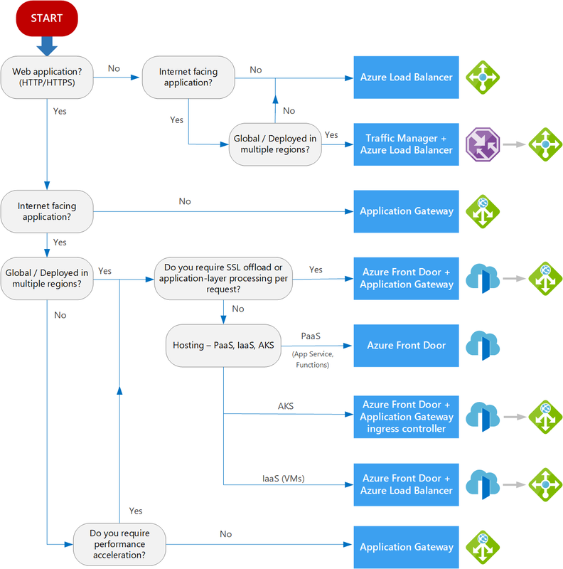

# 2022-01-25 아키텍처 구성을 위한 기본

3-tier 구성의 웹 전환을 대상으로 할 때 Azure 구독 획득 후 해야 할 일에 대한 설명
구독, RBAC, 자원그룹, Vnet, subnet, VM, disk, Storage Account, PaaS, SaaS 구성 및 배포 방법

- Naming Rule 및 필수 Label 포함
아키텍처 작성, Azure 계산기 를 사용하여 비용 산출하기
- Network 설계서 및 Infra Hybrid Cloud 자료 참조

## 용어와 개념
### 지리(Geography)
- 2개 이상의 지역음 포함
- 데이터와 애플리케이션을 동일한 지리적 위치에 유지해야 하는 데이터 유지 및 규정 준수의 경계

### 지역(Region)
- 최상의 성능과 보안을 제공하기 위해 고속 네트워크로 연결된 데이터센터의 집합을 뜻함
- 일정한 대기시간(< 2ms) 을 정의한 경계 
- 중부, 남부

### 지역 쌍(Region Pair)
- 일반적으로 동일한 지리적 위치 내에 있는 2개의 지역
- 비즈니스의 연속성 데이터의 손실 방지를 통한 서비스 중단 가능성 최소화

### 영역(Zone)
- 하나 이상의 데이터센터를 가진 지역 내의 물리적인 별도 위치를 말함
- 데이터센터의 오류나 손상을 대비해 서비스의 논리적 결리와 중복성, 내결함성을 보장
- 각 영역의 대기시간은 2ms 이하를 보장

### 데이터센터
- 독립적인 전원 및 냉각 장치, 네트워크를 갖춘 별도의 시설을 말함
- 한국 남부와 중부의 LG U+와 KT 의 데이터센터를 임차해 사용 중

---
### 구독(Subscription)  
- Azure Resource 의 논리적인 서비스 단위
- 리소스 사용에 대한 리포트, 과금, 청구에 대한 제어

### Account
- Subscription 을 관리하고 사용하는 단위
- Tenant, Directory 라고도 함

### 리소스(Resource)
- 가상 머신, 데이터베이스, 가상 네트워크, 스토리지 계정 등의 구성요소를 리소스라고 함

### 리소스 그룹
- 동일한 수명, 동일한 프로젝트에 속하는 리소를 함께 그룹으로 묶은 논리적인 그룹
- 리소스는 하나의 리소스 그룹에 속해야 하면 이동할 수 있음

### 리소스 공급자(Resoruce Provider)
- 리소스를 제공하는 서비스
- MicroSoft.Compute, Microsoft.Network, Microsoft.Storage ...

---
## 가상 네트워크(Virtual Network, VNet)
### 구현 목적
- 리소스간 안전한 통신
- 온프레미스 인프라 리소스와의 안전한 통신
- 인터넷 아웃바운드 통신

### 주소공간
- CIDR(Classless Inter-Domain Routing) 표기 방법을 사용

#### CIDR
- IPv4 주소를 할당할 때 유연성과 주소 사용의 효율성을 높이기 위해 네트워크 클래스를 사용하지 않고 할당하는 방식  
> [Subnet Cheat Sheet – 24 Subnet Mask, 30, 26, 27, 29, and other IP Address CIDR Network References](https://www.freecodecamp.org/news/subnet-cheat-sheet-24-subnet-mask-30-26-27-29-and-other-ip-address-cidr-network-references/)
> [What computer networks are and how to actually understand them](https://www.freecodecamp.org/news/computer-networks-and-how-to-actually-understand-them-c1401908172d/)

| CIDR | SUBNET MASK | WILDCARD MASK | # OF IP ADDRESSES | # OF USABLE IP ADDRESSES |   
|:---|:---|:---|:---|:---|   
| /32	| 255.255.255.255 | 0.0.0.0 | 1 | 1 |  
| /31 | 255.255.255.254 | 0.0.0.1 | 2 | 2* |   
| /30 | 255.255.255.252 | 0.0.0.3 | 4 | 2 |  
| /29 | 255.255.255.248	| 0.0.0.7	| 8	| 6 |  
| /28 | 255.255.255.240 | 0.0.0.15 | 16 | 14 |   
| /27	| 255.255.255.224	| 0.0.0.31 | 32 | 30 |   
| /26	| 255.255.255.192	| 0.0.0.63 | 64 | 62 |  
| /25	| 255.255.255.128	| 0.0.0.127 | 128 | 126 |  
| /24	| 255.255.255.0 | 0.0.0.255 |	256 |	254 |   
| /23	| 255.255.254.0 | 0.0.1.255 |	512 |	510 |   
| /22	| 255.255.252.0 | 0.0.3.255 |	1,024 | 1,022 |    
| /21	| 255.255.248.0 | 0.0.7.255 |	2,048 | 2,046 |    
| /20	| 255.255.240.0 | 0.0.15.255 |	4,096	| 4,094 |  
| /19	| 255.255.224.0 | 0.0.31.255 |	8,192	| 8,190 |  
| /18	| 255.255.192.0 | 0.0.63.255 | 16,384 |	16,382 |    
| /17	| 255.255.128.0 | 0.0.127.255 | 32,768 | 32,766 |    
| /16	| 255.255.0.0 | 0.0.255.255 | 65,536 | 65,534 |    
| /15	| 255.254.0.0 | 0.1.255.255 | 131,072 | 131,070 |    
| /14	| 255.252.0.0 | 0.3.255.255 | 262,144 | 262,142 |  
| /13	| 255.248.0.0 | 0.7.255.255 | 524,288 | 524,286 |  
| /12	| 255.240.0.0 | 0.15.255.255  | 1,048,576 | 1,048,574 |  
| /11	| 255.224.0.0 | 0.31.255.255	| 2,097,152 | 2,097,150 |  
| /10	| 255.192.0.0 | 0.63.255.255	| 4,194,304 | 4,194,302 |  
| /9	| 255.128.0.0 | 0.127.255.255	| 8,388,608 | 8,388,606 |  
| /8	| 255.0.0.0	| 0.255.255.255	| 16,777,216 | 16,777,214 |
| /7	| 254.0.0.0	| 1.255.255.255	| 33,554,432 | 33,554,430 |
| /6	| 252.0.0.0	| 3.255.255.255	| 67,108,864 | 67,108,862 |
| /5 | 248.0.0.0	| 7.255.255.255	| 134,217,728 | 134,217,726 |
| /4 | 240.0.0.0	| 15.255.255.255 |	268,435,456 | 268,435,454 |
| /3 | 224.0.0.0	| 31.255.255.255 |	536,870,912 | 536,870,910 |
| /2 | 192.0.0.0	| 63.255.255.255 |	1,073,741,824 | 1,073,741,822| 
| /1 | 128.0.0.0	| 127.255.255.255 |	2,147,483,648 | 2,147,483,646 |  
| /0 | 0.0.0.0 | 255.255.255.255 | 4,294,967,296 | 4,294,967,294 |  

#### 주소 할당 방식
- 기본 주소 할당 방식은 동적 할당으로, 리소스의 상태 변경(VM 재시작 등)에 따라 바뀔수 있음
- 정적(고정) 할당한 경우 리소슬르 삭제하기 전까지 유지  

| IPv4 주소 유형 | 공인 IP | 사설 IP |  
|:---|:---|:---|  
| 용도 | Azure 리소스의 인터넷 인바운드 통신 | VNet 내부 리소스간, VNet 과 VNet 간, 클라우드 서비스와 VNet 리소스간 통신 |
| 자원 주소 범위 | 리소스 위치에서 사용 가능한 IP 주소 풀 | 10.0.0.0 ~ 10.255.255.255   172.16.0.0 ~ 172.31.255.255   192.168.0.0 ~ 192.168.255.255 |  
| 기본할당방식 | 기본 SKU: 동적   표준 SKU: 정적(지정불가/) | 동적 |  

### public ip 를 static 으로 사용하는 경우
- DNS 이름 확인을 위해 A 레코드를 등록하는 경우
- Azure 리소스가 IP 기반 보안 모델을 사용하는 앱이나 서비스와 통신하는 경우
- IP 주소를 SSL 인증서에 연결하는 경우
- 방화벽 규칙에서 IP 범위를 사용해 트랙픽을 제어하는 경우
- 가상 머신이 도메인 컨트롤러나 DNS  서버 등의 역활을 하는 경우

### 설계원칙
1. VNet 주소공간(CIDR 블록) 이 다른 네트워크 범위와 켭치치 않아야 합니다.
2. 관리 노력을 줄이기 위해 다수의 작은 VNet 을 사용하기 보다 큰 VNet 을 사용하는 것이 좋습니다.

## 서브넷(subnet)  

### 이점
1. 네크워크 성능과 속도가 향상됨
   - subnet 을 통해 네트워크에 연결된 모든 장치에 브로드캐스트 패킷이 도달하지 않도록 제한해 Network 전체의 성능과 네트워크 간 스위칭 장치 성능을 향상 시킬 수 있음
2. 네트워크 정체를 줄임
   - 트래픽을 subnet 안으로 격리할 수 있음
3. 네트워크 보안을 향상 시킴
   - ACL 이나 QoS, 경로 테이블을 사용해 트래픽을 제어할 수 있어 위협을 확인하고 트래픽 대상을 쉽게 지정할 수 있음
4. 네트워크가 비대해지지 않게 함
   - 향 후 늘어나는 호스트 수를 고려해 네트워크의 수를 적절히 계산하여 사용
5. 관리가 용이함
   - 관리할 수 있는 호스트 수를 논리적으로 제한할 수 있음

## VM(가상머신)
### 가상 머신 이름과 호스트 이름
- 가상 머신 이름을 호스트 이름으로 사용
- Windows VM : 15 자
- Linux VM : 64 자
- 호스트 이름은 변경가능하나 가상 머신 이름은 변경 불가

### 배포 위치와 비용
- 실제 사용자 위치 : 사용자 위치가 가까와야 뛰어난 서비스 제공
- 법적 제한 사항이나 규정 준수, 세금 관련 요구사항을 만족하는 위치를 고려
- 동일한 가상 머신이라도 배포하는 위치에 따라 가격이 다를 수 있음
- 위치에 따라 사용 가능한 VM 크기 시리즈가 다를 수 있음

### 네트워킹 요소
1. 공용 IP 주소
   - 가상 머신과 Inbound 통신을 할 때 필요
2. 네트워크 보안 그룹(NSG)
   - 네트워크 트래픽을 필터링하는데 사용
   - 보안규칙에서 프로토콜과 포트 등을 지정해 Inbound/Outbound 트랙픽을 허용하거나 거부 할 있음
   - 가상 머신의 NIC 에 연결하거나 가상 네트워크의 subnet 에 연결할 수 있음
3. 네트워크 인터페이스 카드(NIC)
   - 가상 머신을 네트워크와 연결 할 때 사용
4. 가상 네트워크와 서브넷
   - VNet 은 한번 구성하면 변경하기 쉽지 않고 변경할 때 영향도가 크므로 시간을 들여 연결 토폴로지(Topology) 를 고민해야 함

### 가상 머신 크기
| 제품군(유형) | VM 크기 시리즈 | 설명 |
|:---|:---|:---|
|범용| B, Dsv3, Dv3, Dasv4, Dav4, DSv2, Dv2, Av2, DC, DCv2, Dv4, Dsv4, Ddv4, Ddsv4 | CPU와 메모리 비율이 적절한 균형을 갖음   테스트와 개발이나 중소형 데이터베이스, 소규모 트래픽용 웹 서버에 적합,  CPU 와 메모리 비율이 1:4 |  
| 컴퓨터 최적화 | F, Fs, Fsv2 | 높은 CPU 와 메모리 비율을 갖음   중규모 트래픽용 웹 서버와 네트워크 어플라이언스, 배치 프로세스, 애프리케이션 서버에 적합 | 
| 메모리 최적화 | Esv3, Ev3, Easv4, Eav4, Ev4, Esv4, Edv4, Edsv4, Mv2, M, DSv2, Dv2 | 높은 메모리와 CPU 비율을 갖음   관계형 데이터베이스 서버, 중대형 캐시 서버, 인메모리 분석에 적합, CPU 메모리 비율이 1:8 | 
| 스토리지 최적화 | Lsv | 디스크 처리량과 IO 가 높음   빅데이터, SQL, NoSQL 데이터베이스, 데이터 웨어하우징, 대형 트랜잭션 데이터베이스에 적합 | 
| GPU | NC, NCv2, NCv3, NCasT4_v3(미리보기), ND, NDv2(미리보기), NV, NVv3, NVv4 | 하나 이상의 GPU를 갖음   그래픽 렌더링과 비디오 편집, ㅣ딥러닝에서 모델 학습과 추론(ND)에 효율적인 옵션 | 
| 고성능 컴퓨팅 | HB, HBv2, HC, H | 가장 빠르고 강력한 CPU 를 제공   선택적으로 처리량이 높은 네트워크 인터페이스(RDMA) 를 제공하는 가상 머신 | 
| 기밀 컴퓨팅 | C1s_v2, DC2s_v2, DC4s_V2 및 DC8_v2 | 계산을 TEE(신뢰할 수 있는 실행 환경) 으로 격리해 처리(사용) 중인 데이터를 보호해야 할 때 사용함   TEE 는 보호된 환경에서 소프트웨어를 실행할 수 있도록 하드웨어의 프로세스와 메모리 일부에 대해 보호된 컨테이너를 제공해 TEE 외부에서 코드와 데이터를 보거나 수정하지 못하게 함 | 

## 가상 DISK
### 디스크 유형과 캐싱옵션
| 구분 | 읽기/쓰기 | 읽기 전용 | 없음 |
|:---|:---|:---|:---|
| 사용 예 | 운영체계 | 캐시 | 로그 파일|  
| 운영체제 디스크 | O(기본값) | X | O |    
| 임시 디스크 | O | O(기본값) | O |
| 데이터 디스크 | X | X | X |  

### 디스크 성능 유형
| 구분 | 표준 HDD | 표준 SSD | 프리미엄 SSD | 울트라 디스크 |  
|:---|:---|:---|:---|:---|  
| 디스크 종류 | OS/데이터 | OS/데이터 | 데이터 |  
| 성능 유형 | HDD | SSD | SSD | SSD |  
| 시나리오 | 대기시간이 민감하지 않은 워크로드   개발/테스트/백업 | HDD 보다 나은 가용성/일관성/안정성/짧은 대기 시간이 피룡한 워크로드   웹 서버와 IOPS 요구가 높지 않은 애플리케이션 서버 | IO 집약적 워크로드, 중요 업무용 프로덕션 애플리케이션 | 처리량 및 IOPS 가 높고 대기 시간이 짧아야 하는 데이터 집약적 워크로드   SAP HANA, 고성능 데이터 베이스, 트랜잭션 집약적 워크로드 |  
| 최대 용량 | 32.767 GiB | 32,767 GiB | 32,767 GiB | 65,536 GiB |  
| 최대 처리량 | 500MB/s | 750MB/s | 900MB/s | 200,000MB/s |  
| 최대 IOPS | 2,000 | 6,000 | 20,000 | 160,000 |  

## Azure Storage
### Storage Account
- Azure Storage 서비스를 관리
- 스토리지 서비스의 최상의 네임스페이스

### [Storage 탐색기](https://azure.microsoft.com/ko-kr/features/storage-explorer/#overview)  

### Azure VM Scale Set(VMSS)
- MS 에서 제공하는 기본이미지, 혹은 커스텀 이미지를 기반으로 동일한 환경의 가상머신을 쉽게 배포할 수 있음
- 트래픽에 따라 자동 크기 조정 및 스케줄에 따른 확장 축소를 지원하며 부하분산 장치를 이용하여 트랙픽을 분산시킬 수 있음
- 대규무로 안정적인 배포 및 업데이트
  - 수백 대의 동일한 가상 머신을 짧은 시간에 배포
  - 업데이트 시 동일한 이미지로 배포
- 자동 크기 조정(Scale-Out)
  - 가상 머신을 미리 만들어 놓을 필요 없이 트래픽에 따라 자동으로 크기 조정
- 네트워킹 

### App Service
- 이미 배포되어 있는 서버들 중에서 어떤 OS 를 사용하여 어떤 언어로 배포할지 정하면 손쉽게 배포할 수 있음
- ASP.NET, ASP.NET Core, Java, Runy, Node.js, PHP, Python 등 다양한 언어를 사용
- 별도의 툴 없이 CI/CD 등 향상된 생산성을 제공
- 트랙픽에 따른 자동 확장도 가능
- Application Insights 와 연동하면 상세한 모니터링이 가능

### Azure Kubernetes Service(AKS)
- Master 서버 생성 없이 Node Pool 만 생성하여 사용
- 비용도 Node(VM) 수량만큼 지불하면 됨
- Azre DevOps 와 연동 CI/CD

### Azure Functions
- 부분함수 형태로 만들어 사용
- 서버리스 애플리케이션
- 사용량 단위 비용 지불

## 부하 분산

| 항목 | 모든 프로토콜 지원 | 웹프로토콜 지원   (인증서 연결 가능) |
|:---|:---:|:---:|
|지리적 분산 |    Traffic Manager |    Front Door |
| 지역 내 분산 |    Load Balancer |    Application Gateway |

### Azure Traffic Manager

### Application Manager
- 경로 기반 웹서비스 분산을 위해 사용

## [Tag](./tag.md)

## [가격 계산기](https://azure.microsoft.com/ko-kr/pricing/calculator/?&ef_id=Cj0KCQiA_c-OBhDFARIsAIFg3ex9uVTd9I0CK5W9UdEcXpgWYrF0yk8dorig7Q11egVjZf4C0nFc3doaArGCEALw_wcB:G:s&OCID=AID2200210_SEM_Cj0KCQiA_c-OBhDFARIsAIFg3ex9uVTd9I0CK5W9UdEcXpgWYrF0yk8dorig7Q11egVjZf4C0nFc3doaArGCEALw_wcB:G:s&gclid=Cj0KCQiA_c-OBhDFARIsAIFg3ex9uVTd9I0CK5W9UdEcXpgWYrF0yk8dorig7Q11egVjZf4C0nFc3doaArGCEALw_wcB)  

## Network 설계서 및 Infra Hybrid Cloud 자료 참조