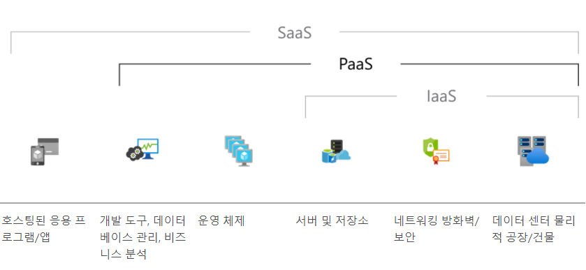
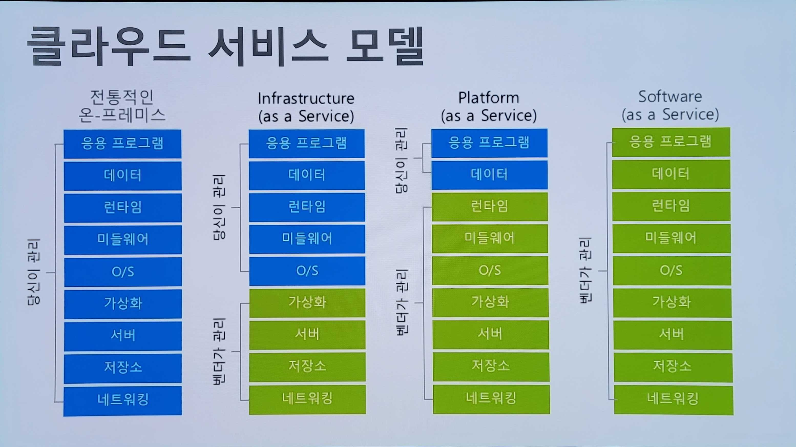

# Azure01 아키텍처 구성을 위한 기본

3-tier 구성의 웹 전환을 대상으로 할 때 Azure 구독 획득 후 해야 할 일에 대한 설명
구독, RBAC, 자원그룹, VNet, subnet, VM, disk, Storage Account, PaaS, SaaS 구성 및 배포 방법

- Naming Rule 및 필수 Label 포함
아키텍처 작성, Azure 계산기 를 사용하여 비용 산출하기
- Network 설계서 및 Infra Hybrid Cloud 자료 참조

## [용어와 개념](./term.md)

---

## [가상 네트워크(Virtual Network, VNet)](./VirtualNetwork.md)  
Private한 네트워크 제공 방식

## [VM(가상머신) 과 Disk](./VirtaulMachine.md)

## Azure Storage
### Storage Account
- Azure Storage 서비스를 관리
- 스토리지 서비스의 최상의 네임스페이스

### [Storage 탐색기](https://azure.microsoft.com/ko-kr/features/storage-explorer/#overview)  

## [Resource](./Resource.md)

## [부하 분산](./loadbalancer.md)

| 항목 | 모든 프로토콜 지원 | 웹프로토콜 지원   (인증서 연결 가능) |
|:---|:---|:---|
|지리적 분산 | Traffic Manager | Front Door |
| 지역 내 분산 | Load Balancer | Application Gateway |

### Application Manager
- 경로 기반 웹서비스 분산을 위해 사용

## SaaS vs PaaS vs IaaS

## [Naming Rule](./NamingRule.md)  

## [Tag](./tag.md) 
키/값 문자열 쌍이며, 범위는 Azure 구독임
- 작성자 : 리소스 작성자에 따라
- 부서/서비스 : 부서별 청구
- 환경 : 개발/운영

## [가격 계산기](https://azure.microsoft.com/ko-kr/pricing/calculator/)  

## [TCO(총 소유 비용) 계산기](https://azure.microsoft.com/ko-kr/pricing/tco/calculator/)  

## Network 설계서 및 Infra Hybrid Cloud 자료 참조