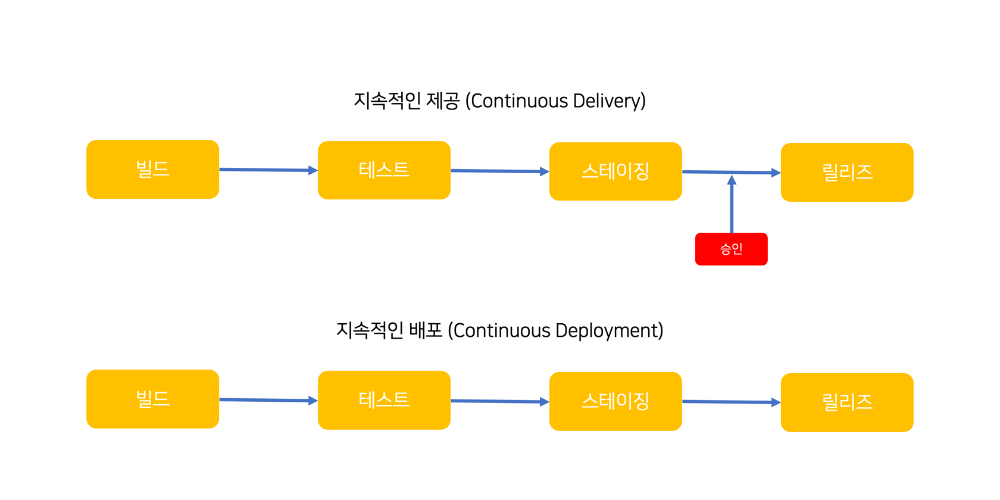
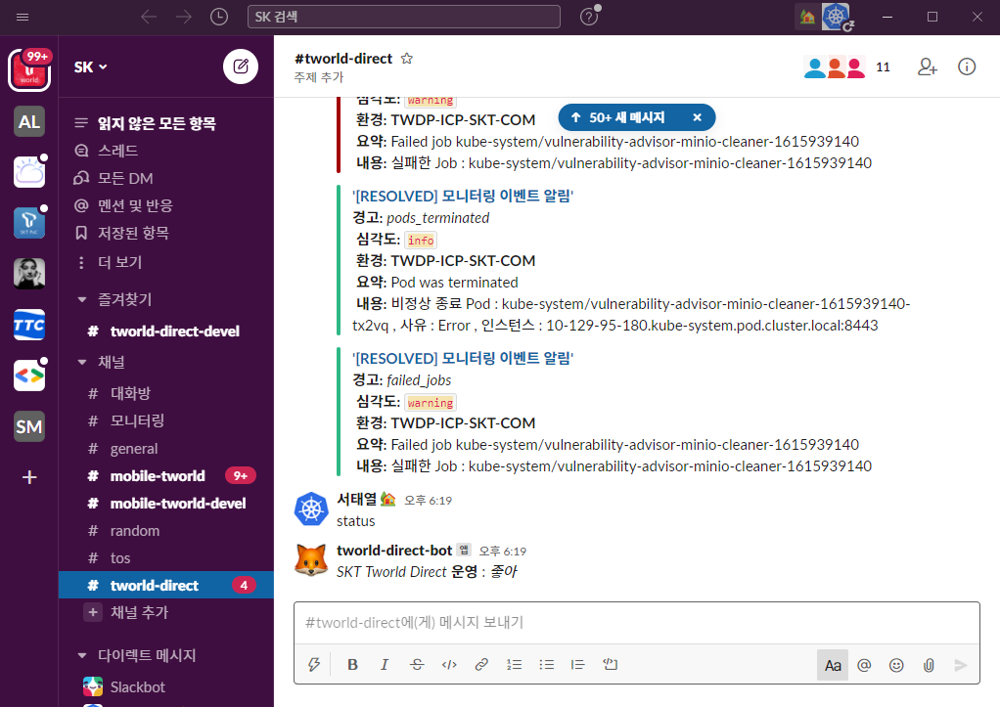
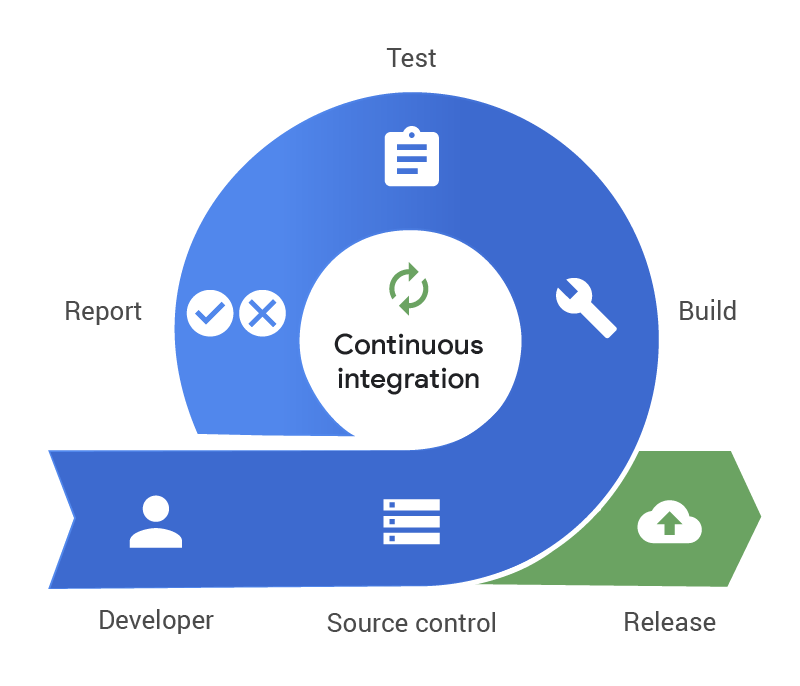
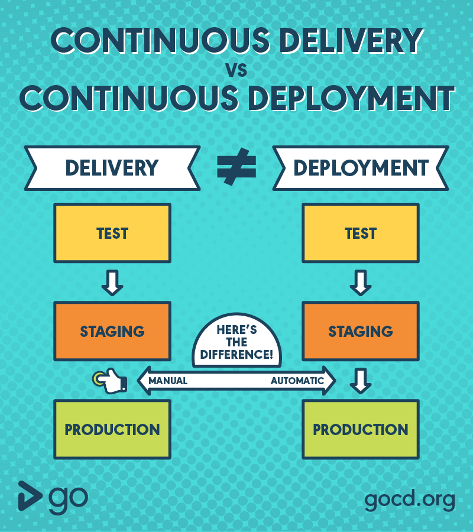
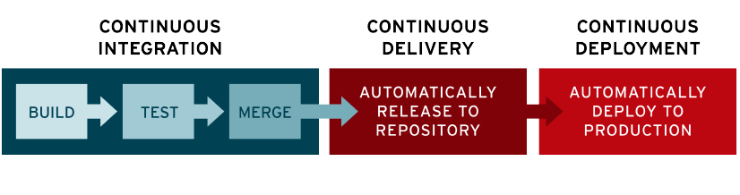

# Azure DevOps
코드 구축을 위한 통합 솔루션
> DevOps is the union of people, process, and products to enable continuous delivery of value to your end users. - Donovan Brown
> 지속적으로 가치를 제공하는 것이 중요  
> 지속적인 제공(Continuos Delivery)  
> 지속적인 배포(Continuos Deployment)  
> DevOps = 소프트웨어 개발 사이클 속도를 높이는 것  
> 미래의 DevOps
  - ChatOps  
  - VoiceOps  
> [깃헙 액션으로 ChatOps 구현하기](https://blog.aliencube.org/ko/2020/03/05/implementing-chatops-on-github-actions/)  
> [데브옵스(DevOps)의 현재와 미래 - ChatOps & VoiceOps (윤석찬)](https://www.slideshare.net/awskorea/devops-on-aws-cloud-and-chatops-voice-ops)  
> [How Is Netflix SO GOOD at DevOps?](https://www.bunnyshell.com/blog/how-netflix-does-devops)  

> 일반적으로 GitHub Action 은 지속적인 배포 프로세스를 따르고 있어서 중간에 승인 절차를 구현하혀면 별도의 방법론이 필요

## 서비스 지향 아키텍처(SOA)
### Primitives
- [Netflix Open Source Software Center](https://netflix.github.io/)  
- DevTeam 
  - "두 판의 라지 사이즈 피자" 로 먹일 수 있는 팀  
  - 민첩하고, 독립적인, 신뢰하고, 오너쉽을 가진 서비스팀
- DevOps 도구의 특징
  - 셀프 서비스 지향
  - 기술 독립적
  - 베스트 프랙티스 장려
  - 단일 목적의 서비스  
### Single-purpose
### API Interfaced
### Highly decoupled
### "Microservices"  

## ChatOps
Slack 이나 Microsoft Teams 등과 같은 채팅 플랫폼이 필요
- Chatbot 통합
  

## The Three Stage Conversation
1. People
2. Process  (Development Production)
   1. Plan  
   2. Develop  
   3. Deliver  
   4. Operate  
3. Products

## 지속적인 통합(Continuos Integration, CI) 

- 소프트웨어 개발 품질과 속도를 향상
- Azure Pipelines 또는 Jenkins 를 사용하여 클라우드에서 앱을 빌드하고 Azure 에 배포하면 코드를 커밋할 때마낟 자동으로 빌드 및 테스트되며 버그가 더 빠르게 감지됨

  

## 지속적인 제공(Continuos Delivery, CD) 
- 공유 레포지토리로 자동으로 Release 하는 것
## 지속적인 배포 (Continuos Deployment, CD)
- 코드를 빌드, 테스트하고 하나 이상의 테스트와 운영환경에 배포하는 프로세스
- 지속적인 통합(CI)과 IaC(Infrastructure as Code) 를 결합하여 언제든지 동일하게 배포하고, 안정하게 운영 환경에 배포할 수 있음
- 지속적 배포(CD) 를 사용하면 CI/CD 테스트가 성공한 경우 코드 커밋에서 프로덕션까지 전체 프로세스를 자동화 할 수 있음

## DevOps 엔지니어의 역할
CI/CD를 위한 파이프라인을 구성하고, 이를 자동화 단계까지 끌어 올림
  

## VM 배포
### Packer 빌더를 사용한 Application 이미지 생성
|단계| azure-arm 빌드 | azure-chroot 빌더 |
|:---|:---|:---|
||어플리케이션 VM 이미지 | 어플리케이션 VM 이미지 |
|| Packer | Packer |
|| 표준 OS VM | 표준 OS 이미지 |

| azure-arm 빌드 | azure-chroot 빌더 |
|:---|:---|
| 표준 OS VM 를 시작하여 어플리케이션 VM 이미지 생성 | Packer 빌드시 표준 OS 이미지에 어플리케이션 패키지를 더해서 배포 |
- 

### 블루/그린 배포 전략
- 격리된 Blue 와 Green 2개의 환경에 애플리케이션을 배포해서, Blue 와 Green 리소스 간에 서로 영향을 주지 않도록 하여  배포 위험을 줄이고 가용성을 높일 수 있음  
- VMSS 단위 배포
  - Blue VMSS
  - Green VMSS