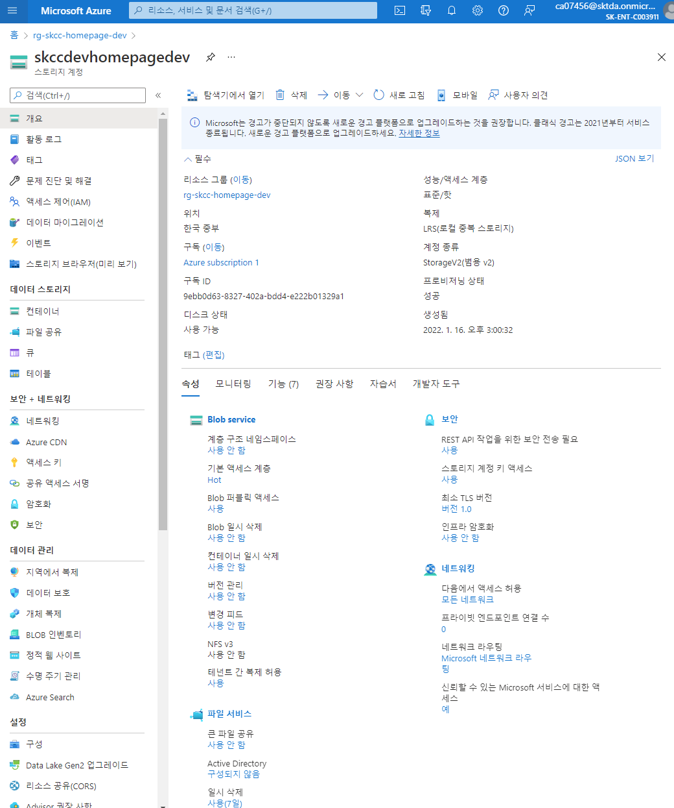

# [PowerShell](https://docs.microsoft.com/ko-kr/powershell/scripting/overview?view=powershell-7.2) 

- ​PowerShell은 여러분이 여러분의 Microsoft 기반 장비와 애플리케이션들을 일관된 관리 프로세스로 관리하는데 사용될 수 있는 툴이다. 
- 이 툴은 관리자와 개발자 모두에게 매력적이어서 명령줄과 간단하지만 고급진 스크립트를 실제 프로그램으로 확장시킬 수 있다.

> [Windows에 PowerShell 설치](https://docs.microsoft.com/ko-kr/powershell/scripting/install/installing-powershell-on-windows?view=powershell-7.2)  
> [CentOS에 PowerShell 설치](https://docs.microsoft.com/ko-kr/powershell/scripting/install/install-centos?view=powershell-7.2)
> [Ubuntu에 PowerShell 설치](https://docs.microsoft.com/ko-kr/powershell/scripting/install/install-ubuntu?view=powershell-7.2)
> [Back to Basics: The PowerShell Foreach Loop](https://adamtheautomator.com/powershell-foreach/)  
> [Managing CSV Files in PowerShell with Import-Csv](https://adamtheautomator.com/import-csv/)  
> [Understanding Import-Csv and the ForEach Loop](https://adamtheautomator.com/import-csv-foreach/)  
> [PowerShell을 사용하여 가상 네트워크 만들기](https://docs.microsoft.com/ko-kr/azure/virtual-network/quick-create-powershell)


## PowerShell 설치
### Windows
```powershell
msiexec.exe /package PowerShell-7.2.1-win-x64.msi /quiet ADD_EXPLORER_CONTEXT_MENU_OPENPOWERSHELL=1 ENABLE_PSREMOTING=1 REGISTER_MANIFEST=1 USE_MU=1 ENABLE_MU=1
```
[PowerShell-7.2.1-win-x64.msi](https://github.com/PowerShell/PowerShell/releases/download/v7.2.1/PowerShell-7.2.1-win-x64.msi)

### Ubuntu
- Repository 
  - Ubuntu 20.04 - https://packages.microsoft.com/config/ubuntu/20.04/packages-microsoft-prod.deb
  - Ubuntu 18.04 - https://packages.microsoft.com/config/ubuntu/18.04/packages-microsoft-prod.deb
```bash
# Update the list of packages
sudo apt-get update
# Install pre-requisite packages.
sudo apt-get install -y wget apt-transport-https software-properties-common
# Download the Microsoft repository GPG keys
wget -q https://packages.microsoft.com/config/ubuntu/20.04/packages-microsoft-prod.deb
# Register the Microsoft repository GPG keys
sudo dpkg -i packages-microsoft-prod.deb
# Update the list of packages after we added packages.microsoft.com
sudo apt-get update
# Install PowerShell
sudo apt-get install -y powershell
# Start PowerShell
pwsh
```
### Version 보기
```powershell
$PSVersionTable.PSVersion

Get-Host | Select-Object Version
```

---

## PowerShell 명령(cmdlet)
- cmdlet은 독립 실행 파일이 아닌 네이티브 PowerShell 명령

## PowerShell 명령어 구조
- command -parameter1 -parameter2  argument1 argument2

    

## PowerShell 언어 구문분석
-
    


## 모듈
- Get-InstalledModule -Name "Az.*"
- Install-Module -Name Az.Accounts -AllowClobber 
- Install-Module -Name Az.Compute
- Install-Module -Name Az.Network
- Install-Module -Name Az.MySql -AllowClobber

## 서비스
- Register-AzResourceProvider -ProviderNamespace Microsoft.DBforMySQL
- Register-AzResourceProvider -ProviderNamespace "Microsoft.RecoveryServices"
- Register-AzResourceProvider -ProviderNamespace Microsoft.Network
- 등록된 서비스 보기
  - Get-AzResourceProvider | Select ProviderNamespace

## 예약어
| 예약어 | 의미 |
|:---|:---|  
| $_ | 파이프라인으로 넘어온 배열 또는 컬렉션의 각각요소들을 의미 |  
| $$ | 실행 명령명 |
| $? | 이전 명령줄의 마지막 토큰 |  
| $^ | 마지막 명령의 부울 상태 | 

## 비교 연산자
| 연산자 | 의미 | 부등호 |
|:---:|:---|:---| 
| -eq | Equals(같다) | = |
| -ne | Does not equal(같지않다) | != |
| -gt | Greather than(크다) | > |  
| -lt | Less than(작다) | < |  
| -ge | Greater than or equal to(크거나 같다) | >= |
| -le | Less than or equal to(작거나 같다) | <= |  


## Sample
### 도움말
- update 하기
  ```
  Update-Help -UICulture ko-KR,en-US
  ```
- 저장하기
  ```
  Save-Help -DestinationPath "C:\PowerShell_Lab\SavePSHelp" -UICulture en-US,ko-KR
  Update-Help -Module Net* -UICulture en-US,ko-KR -SourcePath "C:\PowerShell_Lab\SavePSHelp"
  ```

- 도움말 예시
```pwershell
Get-Help

Get-Help Get-Service
Get-Help Get-Service -Online

Get-Help Get-Service -Examples
Get-Help Get-Service -Detailed

Get-Help Get-NetAdater -full
```


### 파일 Path 및 내용 가져오기
```powershell
Get-ChildItem -Path ./somefile.txt
Get-Content -Path ./somefile.txt
```

### 재지정 연산자(>)
```powershell
(2+2)*3/7 > foo.txt
Get-Content foo.txt
```

### 변수
```powershell
$files = Get-ChildItem
$files
$files[1]
```

### 데이터 처리
- 객체 정렬하기
  ```powershell
  Get-ChildItem | sort -Descending
  ```

- 객체로부터 속성값을 선택하기
  ```powershell
  Get-Process | Select-Object -Property Name,ID,PM,VM -Last 7
  Get-Volume | Select-Object -Property DriveLetter,Size,SizeRemaining
  Get-Process | Sort-Object -Property workingset
  Get-Process | Measure-Object -Property PM -Sum -Average
  "Hello PowerShell" | Measure-Object -Character


  Get-ChildItem | Measure-Object -Property length -Minimum -Maximum -Sum -Average

  Test-Connection -Count 5 -Comp www.microsoft.com | Measure-Object -Property Address,Latency,BufferSize,Status
  Test-Connection -Count 5 -Comp www.microsoft.com | Measure-Object -Property Latency -Average -Minimum -Maximum

  $services = Get-Service
  $processes = Get-Process
  $services + $processes | Measure-Object
  $services + $processes | Measure-Object -Property DisplayName

  Get-Service | Where-Object -Property Status -eq Running
  Get-Service | Where-Object -Property Name.Length -gt 7

  Get-Service M* | Where-Object {$_.Status -eq "Running"}
  Get-Service M* | Where-Object {$_.Status -eq "Running" -or $_.Status -eq "Stopped"}
  Get-Service M* | Where-Object {$_.Status -eq "Running" -or $_.Status -eq "Stopped"} | Sort-Object -Property Status,Name -Descending

  $a = Get-ChildItem | sort -Property length -Descending | Select-Object -First 1 -Property Directory
  $a 
  ```

### 흐름 제어 문장
- if 문
- switch 문
- while 문
- foreatch 문
```powershell
$i=0
while($i++ -lt 10) { if ($i % 2) { "$i is odd" } else {"$i is even"}}

foreach ($i in 1..10) { if ($i % 2) {"$i is odd"}}

$Services=Get-Service
ForEach ($Service in $Services) {
  Write-Host "현재 서비스는 $($Service.name) 입니다."
}

# 컬렉션(배열) 만들기
$fruits = @("사과", "오렌지", "수박", "배", "포도", "딸기", "바나나")
# 컬렉션 처리
for ($i=0; $i -lt $fruits.Length; $i++) {
  $fruits[$i]
}

$i=0
while ($i -lt $fruits.Length) {
  $fruits[$i]
  $i++
}

$drive = Get-CimInstance -ClassName Win32_LogicalDisk `
  -Filter "DeviceID='C:'"

switch ($drive.DriveType) {
  3 { Write "로컬 고정 디스크" }
  5 { Write "광학 디스크 장치" } 
  Default { Write "기타 장치" }
}

switch (Get-Service) {
  {$_.status -eq "Running"}{"실행 중인 서비스 : "+$_.name}
  {$_.status -eq "Stopped"}{"중단된    서비스 : "+$_.name}
}
```
### 스크립트와 함수
- 명령들을 .ps1 확장자를 가지는 텍스트 파일로 넣어서 스크립트로 패키징할 수 있게 해줌
- 코드 안에 서브루틴을 가지기를 원할 수도 있으며, 이런 요구를 함수를 통해 해결
- 모듈 : psm1
```powershell
function hello {
  param($name = "bub")
  "Hello $name, how are you"
}
hello

hello Bruce
```
```powershell
Get-Content Env:PSMoudlePath

Get-Module -ListAvailable
```

### 원격 관리
- 클라우드 기반 IT 세계에서는 각 서버에 물리적으로 접근하지 않고 컴퓨터 그룹을 관리할 수 있는 능력은 매우 중요
- 이를 충족하기 위한 것이 PowerShell 의 원격 실행 능력
- Invoke-Command
```powershell
$computers = 'W16DSC01','W16DSC02'
Invoke-Command -ScriptBlock{Get-HotFix -Id KB3213986} `
  -ComputerName $computers | Format-Table HotFixId, InstalledOn, PSComputerName -AutoSize 
```

### 별칭(alias)
```powershell
Get-Alias
Get-Alias -Nmae ls
Get-Alias -definition Get-ChildItem

New-Alias -Name wo -Value Write-Output
wo "lllll"

Set-Alias -Name wop -Value Write-Output
wop "11111"

Export-Alias -Path "C:\PowerShell_Lab\MyAlias.csv"

Import-Alias -Path "C:\PowerShell_Lab\MyAlias.csv" -Force
```
#### 파워셸에 들어간 cmdlet과 잘 알려진 명령 줄 인터프리터의 비슷한 명령어 비교  
| 윈도우 파워셸(Cmdlet)	| 윈도우 파워셸(다른 이름) | cmd.exe / COMMAND.COM(MS-DOS, 윈도우, OS/2, 등)	| Bash(유닉스, BSD, 리눅스, 맥 오에스 텐 등) | 설명 |
|:---|:---|:---|:---|:---|
|Get-Location | gl, pwd	| cd | pwd	현재 디렉터리/작업 디렉터리를 보여 준다. |  
| Set-Location | sl, cd, chdir | cd, chdir | cd	| 현재 디렉터리를 바꾼다 |
| Clear-Host | cls, clear | cls | clear | 화면을 지운다 |
| Copy-Item | cpi, copy, cp | copy | cp | 하나 이상의 파일 / 완전한 디렉터리 트리를 복사한다 |
| Get-Help | help, man | help | man | 명령에 대한 도움말을 보여 준다 |  
| Remove-Item | ri, del, erase, rmdir, rd, rm | del, erase, rmdir, rd | rm, rmdir | 파일 / 디렉터리를 지운다 |
| Rename-Item | rni, ren | ren, rename | mv | 파일 / 디렉터리의 이름을 바꾼다 |  
| Move-Item | mi, move, mv | move | mv | 파일 / 디렉터리를 새로운 위치로 옮긴다 |  
| Get-ChildItem | gci, dir, ls | dir | ls | 현재 디렉터리의 모든 파일 / 디렉터리를 나열한다 |  
| Write-Output | echo, write | echo | echo | 문자열, 변수 등을 표준 출력(stdout)으로 출력한다 | 
| Pop-Location | popd | popd | popd | 현재 디렉터리를 맨 마지막에 스택으로 푸시(push)한 디렉터리로 바꾼다 |  
| Push-Location | pushd | pushd | pushd | 현재 디렉터리를 스택으로 푸시(push)한다 |  
| Set-Variable | sv, set | set | set | 변수 값을 설정하거나 새로 만든다 |  
| Get-Content | gc, type, cat | type | cat | 파일의 내용을 보여 준다 |  
| Select-String	| | find, findstr | grep | 패턴에 맞추어 줄들을 출력한다 |  
| Get-Process | gps, ps | tlist, tasklist | ps | 현재 실행 중인 모든 프로세스를 나열한다 | 
| Stop-Process | spps, kill | kill, taskkill | kill | 실행 중인 프로세스를 끝낸다 |  
| Tee-Object | tee | 없음 | tee | 입력을 파일이나 변수로 파이프(pipe) 처리한 뒤 파이프라인에 따라 입력을 넘긴다 |  


#### Windows 사용자용
- dir
- type
- copy
- del
- echo
- ren
- rmdir
- set
- sort
- start

#### Unix 사용자용
- ls
- cat
- cp
- md
- move
- rm


## Resource Group 만들기
```powershell
New-AzResourceGroup `
   -ResourceGroupName "rg-skcc-homepage-dev" `
   -Location "koreacentral"
```
```powershell
$rg = @{
    Name = 'rg-skcc-homepage-dev'
    Location = 'koreacentral'
}
New-AzResourceGroup @rg
```
### 리소스 그룹 잠금
```powershell
New-AzResourceLock -LockName LockGroup -LockLevel CanNotDelete -ResourceGroupName rg-skcc-homepage-dev
```
- 확인
```
Get-AzResourceLock -ResourceGroupName rg-skcc-homepage-prd
```

## VNet 만들기
- vnet : vnet-skcc-dev
```powershell
$vnet = @{
    Name = 'vnet-skcc-dev'
    ResourceGroupName = 'rg-skcc-homepage-dev'
    Location = 'koreacentral'
    AddressPrefix = '10.0.0.0/16'    
}
$virtualNetwork = New-AzVirtualNetwork @vnet
```

## NSG 만들기
```powershell
```

## subnet 만들기
- frontend subnet : snet-skcc-dev-10.234.4.128-159-frontend
- backend subnet : snet-skcc-dev-10.234.5.0-255-backend
```powershell
$subnet_frontend = @{
    Name = 'snet-skcc-dev-frontend'
    VirtualNetwork = $virtualNetwork
    AddressPrefix = '10.0.0.0/28'
}
$subnetConfig_frontend = Add-AzVirtualNetworkSubnetConfig @subnet_frontend
$subnet_backend = @{
    Name = 'snet-skcc-dev-backend'
    VirtualNetwork = $virtualNetwork
    AddressPrefix = '10.0.1.0/28'
}
$subnetConfig_backend = Add-AzVirtualNetworkSubnetConfig @subnet_backend
```

## 가상 네트워크에 subnet 연결
```powershell
$virtualNetwork | Set-AzVirtualNetwork
```


## Storage Account
- SKU : "Standard_LRS" (가장 저렴한 중복성 옵션)
- 생성시 시간이 1 ~ 2 분 걸림
### Stroage Account 만들기
```powershell
New-AzStorageAccount `
  -ResourceGroupName rg-skcc-homepage-dev `
  -Name skccdevhomepagedev `
  -Location koreacentral `
  -SkuName "Standard_LRS" `
  -Kind StorageV2
```

```powershell
$storage_account = @{
    Name = 'skccdevhomepagedev'
    ResourceGroupName = 'rg-skcc-homepage-dev'
    Location = 'koreacentral'
    SkuName = 'Standard_LRS'
    Kind = 'StorageV2'
}
New-AzStorageAccount @storage_account
```

### 컨테이너 만들기
```
# Create variables
$containerName  = "individual-container"
$prefixName     = "loop"

# Approach 1: Create a container
New-AzStorageContainer -Name $containerName -Context $ctx

# Approach 2: Create containers with a PowerShell loop
for ($i = 1; $i -le 3; $i++) { 
    New-AzStorageContainer -Name (-join($prefixName, $i)) -Context $ctx
   } 

# Approach 3: Create containers using the PowerShell Split method
"$($prefixName)4 $($prefixName)5 $($prefixName)6".split() | New-AzStorageContainer -Context $ctx
```
- boot diagnostics 컨테이너  

### 제거
```
Remove-AzStorageAccount `
  -Name 'skccdevhomepagedev' `
  -ResourceGroupName 'rg-skcc-homepage-dev'
```

## NSG Rule 만들기
### Create an inbound network security group rule for port 22
```powershell
$nsgRuleSSH = New-AzNetworkSecurityRuleConfig `
  -Name "nsg-rule-ssh"  `
  -Protocol "Tcp" `
  -Direction "Inbound" `
  -Priority 1000 `
  -SourceAddressPrefix * `
  -SourcePortRange * `
  -DestinationAddressPrefix * `
  -DestinationPortRange 22 `
  -Access "Allow"
```

### Create an inbound network security group rule for port 80
```powershell
$nsgRuleWeb = New-AzNetworkSecurityRuleConfig `
  -Name "nsg-rule-www"  `
  -Protocol "Tcp" `
  -Direction "Inbound" `
  -Priority 1001 `
  -SourceAddressPrefix * `
  -SourcePortRange * `
  -DestinationAddressPrefix * `
  -DestinationPortRange 10080 `
  -Access "Allow"
```

### Create a network security group
```powershell
$nsg = New-AzNetworkSecurityGroup `
  -ResourceGroupName "rg-skcc-homepage-dev" `
  -Location "koreacentral" `
  -Name "nsg-skcc-homepage" `
  -SecurityRules $nsgRuleSSH,$nsgRuleWeb
```

## public-ip 만들기
```powershell
$vnet = $virtualNetwork = Get-AzVirtualNetwork |?{$_.Name -eq 'vnet-skcc-dev'}
$pip = New-AzPublicIpAddress `
  -Name "pip-skcc-comdpt1" `
  -ResourceGroupName "rg-skcc-homepage-dev" `
  -Location "koreacentral" `
  -AllocationMethod Static `
  -IdleTimeoutInMinutes 4
```


## VM 만들기
* [빠른 시작: PowerShell을 사용하여 Azure에서 Windows 가상 머신 만들기](https://docs.microsoft.com/ko-kr/azure/virtual-machines/windows/quick-create-powershell)  
* [빠른 시작: PowerShell을 사용하여 Azure에서 Linux 가상 머신 만들기](https://docs.microsoft.com/ko-kr/azure/virtual-machines/linux/quick-create-powershell)
* [여러 NIC가 있는 Windows 가상 컴퓨터 만들기 및 관리](https://docs.microsoft.com/ko-kr/azure/virtual-machines/windows/multiple-nics?toc=/azure/virtual-network/toc.json)  
* [랩: 가상 머신 배포 및 관리.](https://github.com/MicrosoftLearning/AZ-103KO-MicrosoftAzureAdministrator/blob/master/Instructions/Labs/02a%20-%20Deploy%20and%20Manage%20Virtual%20Machines%20(az-100-03).md)

### nic 만들기
[가상 머신에 네트워크 인터페이스 추가 또는 제거](https://docs.microsoft.com/ko-kr/azure/virtual-network/virtual-network-network-interface-vm)
| 도구 | 명령 |  
|:---|:---|
| CLI | az network nic create |  
| PowerShell | New-AzNetworkInterface |  

#### vnet 정보 가져오기
```powershell
$virtualNetwork = Get-AzVirtualNetwork |?{$_.Name -eq 'vnet-skcc-dev'}
```

#### 
```powershell
$frontEnd = $virtualNetwork.Subnets|?{$_.Name -eq 'snet-skcc-dev-frontend'}
$nic = New-AzNetworkInterface `
  -ResourceGroupName "rg-skcc-homepage-dev" `
  -Name "nic-skcc-comdpt1" `
  -Location "koreacentral" `
  -SubnetId $frontEnd.Id `
  -PublicIpAddressId $pip.Id `
  -NetworkSecurityGroupId $nsg.Id
```


### credential object 정의
```powershell
$securePassword = ConvertTo-SecureString 'dlatl!00' -AsPlainText -Force
$cred = New-Object System.Management.Automation.PSCredential ("azureuser", $securePassword)
```

### VM 크기 설정
```
$vmConfig = New-AzVMConfig `
  -VMName "vm-skcc-comdpt1" `
  -VMSize "Standard_B2s"
```

### VM 크기 예시
- Standard_B2s : [B-시리즈 버스터블 가상 머신](https://docs.microsoft.com/ko-kr/azure/virtual-machines/sizes-b-series-burstable)
  - CPU : 2 vCPU
  - 메모리 : 4 GiB
  - 임시 스토리지(SSD) : 8 GiB

- Standard_D1_v2 : [Dv2 시리즈](https://docs.microsoft.com/ko-kr/azure/virtual-machines/dv2-dsv2-series)
  - CPU : 1 vCPU
  - 메모리 : 3.5 GiB
  - 임시 스토리지(SSD) : 50 GiB

- Standard_DS3_v2 : DSv2 시리즈
  - CPU : 4 vCPU
  - 메모리 : 14 GiB
  - 임시 스토리지(SSD) : 28 GiB


### 소스 이미지 구성
#### Windows
```powershell
$vmConfig = Set-AzVMOperatingSystem `
  -VM $vmConfig `
  -Windows `
  -ComputerName "vm-skcc-comdpt1" `
  -Credential $cred `
  -ProvisionVMAgent `
  -EnableAutoUpdate
$vmConfig = Set-AzVMSourceImage -VM $vmConfig `
  -PublisherName "MicrosoftWindowsServer" `
  -Offer "WindowsServer" `
  -Skus "2016-Datacenter" `
  -Version "latest"
```

#### Linux (Ubuntu)
- APACHE : vm-skcc-comdpt1
- TOMCAT : vm-skcc-comdap1
```powershell
$vmConfig = Set-AzVMOperatingSystem `
  -VM $vmConfig `
  -Linux `
  -ComputerName "vm-skcc-comdpt1" `
  -Credential $cred `
  -DisablePasswordAuthentication
$vmConfig = Set-AzVMSourceImage `
  -VM $vmConfig `
  -PublisherName "Canonical" `
  -Offer "UbuntuServer" `
  -Skus "18.04-LTS" `
  -Version "latest"
```

### 인터페이스 추가
```
$vmConfig = Add-AzVMNetworkInterface `
  -VM $vmConfig `
  -Id $nic.Id
```

### SSH key 구성
#### SSH 키 쌍 만들기
- [ssh-keygen](https://www.ssh.com/academy/ssh/keygen) 사용
- 옵션 -t rsa : 모든 SSH 클라이언트는 이 알고리즘을 지원
```
PS C:\workspace\AzureBasic\0.ENV> ssh-keygen -t rsa -b 4096

Generating public/private rsa key pair.
Enter file in which to save the key (C:\Users\taeey/.ssh/id_rsa): ./.ssh/id_rsa
./.ssh/id_rsa already exists.
Overwrite (y/n)? y
Enter passphrase (empty for no passphrase): 
Enter same passphrase again: 
Your identification has been saved in ./.ssh/id_rsa
Your public key has been saved in ./.ssh/id_rsa.pub
The key fingerprint is:
SHA256:gEfKu1joY11R+waG51xWMs2roEHi/qgirTDdcn5j4OU taeey@DESKTOP-QR555PR
The key's randomart image is:
+---[RSA 4096]----+
|      . . oo.    |
|   ..+.o . +o    |
|   .+o= = o  .   |
|   ..o.B.=  .    |
|  ..o .oS.o.     |
| o =ooo  ..      |
|o.B.=*           |
|+o.=o E          |
|oo...o .         |
+----[SHA256]-----+
PS C:\workspace\AzureBasic\0.ENV>
```
```powershell
$sshPublicKey = cat ./.ssh/id_rsa.pub
Add-AzVMSshPublicKey `
  -VM $vmConfig `
  -KeyData $sshPublicKey `
  -Path "/home/azureuser/.ssh/authorized_keys"
```

### OS Disk 설정
```powershell
$vmName="vm-skcc-comdpt1"
$resourceGroup = Get-AzResourceGroup -Name 'rg-skcc-homepage-dev'
$location = $resourceGroup.Location
$osDiskType = (Get-AzDisk -ResourceGroupName $resourceGroup.ResourceGroupName)[0].Sku.Name
$osDiskType = "StandardSSD_LRS"
$osDiskSizeInGB = 64
$vmConfig = Set-AzVMOSDisk `
  -VM $vmConfig `
  -Name "$($vmName)-OsDisk01" `
  -DiskSizeinGB $osDiskSizeInGB `
  -StorageAccountType $osDiskType `
  -CreateOption FromImage `
  -Caching ReadWrite `
  -Linux
```


### boot diagnotics
```
$vmConfig = Set-AzVMBootDiagnostic `
  -VM $vmConfig `
  -Enable `
  -resourceGroup "rg-skcc-homepage-dev" `
  -StorageAccountName "skccdevhomepagedev"
```

### VM 만들기
```
New-AzVM -VM $vmConfig `
  -ResourceGroupName "rg-skcc-homepage-dev" `
  -Location "koreacentral"
```
  
  

### Backup 적용
- 기본 정책을 설정
  ```powershell
  $policy = Get-AzRecoveryServicesBackupProtectionPolicy `
    -Name "DefaultPolicy"
  ```

- VM 백업을 사용하도록 설정
  ```powershell
  $vm='vm-skcc-comdpt1';
  Enable-AzRecoveryServicesBackupProtection `
      -ResourceGroupName "rg-skcc-homepage-dev" `
      -Name "$vm" `
      -Policy $policy
  ```
  
  

### apache vm 만들기
- VM 자격 증명을 설정 : Get-Credential
- -AsJob : 백그라운드 옵션
```powershell
$cred = Get-Credential
$apache-vm1 = @{
    ResourceGroupName = 'rg-skcc-homepage-dev'
    Location = 'koreacentral'
    Name = 'vm-skcc-homept1'
    VMSize = 'Standard_DS3_v2'
    SecurityGroupName = ''
    PublicIpAddressName = ''
    VirtualNetworkName = 'vnet-skcc-dev'
    SubnetName = 'vnet-skcc-dev-frontend'
    OpenPorts = '10080,7500'
    Credential = $cred
}
New-AzVM @apache-vm -AsJob
```

### tomcat vm 만들기
```powershell
$cred = Get-Credential
New-AzVm `
    -ResourceGroupName "myResourceGroupVM" `
    -Name "myVM" `
    -Location "koreacentral" `
    -VirtualNetworkName "myVnet" `
    -SubnetName "mySubnet" `
    -SecurityGroupName "myNetworkSecurityGroup" `
    -PublicIpAddressName "myPublicIpAddress" `
    -OpenPorts 80,3389 `
    -Credential $cred
```

## 리소스 정리
```
Remove-AzResourceGroup -Name 'rg-skcc-homepage-dev' -Force
```

---

| 명령어(cmdlet) | 설명 | 예시 | 
|:---|:---|:---|  
| Import-CSV | CSV 파일 읽기 | Import-CSV -Path ./vm_parameter_template.csv |
| ForEach-Object | 파이프라인에서 항목을 반복 | | 
| ConvertTo-SecureString | SecureString 타입으로 만듬 | | 
| New-Object | 개체를 만듬 | |  
| New-AzResourceGroup | 리소스 그룹 만들기 | -Name myResourceGroup -Location EastUS | 
| Get-AzLocation | 지역 목록 검색 | Get-AzLocation | select Location |  
| New-AzStorageAccount | 스토리지 계정 생성 | |  
| New-AzStorageContainer | 컨테이너 만들기 | |  
| Set-AzVMOperatingSystem | VM OS 지정 | -Windows, -Linux |  
| Set-AzVMSourceImage | VM 이미지 지정 | Standard_D1_v2 |
| Select-AzSubscription | 현재 및 기본 Azure 구독을 변경 | | 
| Get-AzVirtualNetwork | 가상 네트워크에 대한 정보 가져오기 | -Name "myVNet" -ResourceGroupName $myResourceGroup |  
| Get-AzVirtualNetworkSubnetConfig | 서브넷에 대한 정보 가져오기 |  -Name "mySubnet1" -VirtualNetwork $vnet |  
| Get-AzNetworkSecurityGroup | 네트워크 보안 그룹을 가져옴| |  
| Get-AzNetworkInterface | 네트워크 인터페이스 구하기 | |  
| New-AzNetworkInterface | 네트워크 인터페이스를 생성 | |  
| New-AzVMConfig | 구성 가능한 가상 머신 개체 | |  
| Set-AzVMOperatingSystem | 가상 머신의 운영 체제 속성을 설정 | -Windows, -Linux |  
| Set-AzVMSourceImage | 가상 머신의 이미지를 지정 | |  
| New-AzVMConfig | 구성 가능한 가상 머신 개체를 만듬 | |  
| Set-AzVMOperatingSystem | 가상 머신의 운영 체제 속성을 설정 | |  
| Set-AzVMSourceImage | 가상 머신의 이미지를 지정 | |  
| Set-AzVMNetworkInterface | 가상 머신에 네트워크 인터페이스를 추가 | |  
| Add-AzVMNetworkInterface | 네트워크 인터페이스 추가  | |  
| Set-AzVMOSDisk | 가상 머신의 운영 체제 디스크 속성을 설정 | |  
| Add-AzVMDataDisk | 가상 머신에 데이터 디스크를 추가 | |  
| Add-AzVMBootDiagnostic | 가상 머신의 부팅 진단 속성을 수정 </br> 진단 데이터는 지정된 계정에 저장 |  -VM $VM -Enable -ResourceGroupName "ResourceGroup11" -StorageAccountName "DiagnosticStorage" |  
| New-AzVM | 가상 머신을 생성 | |  
| Get-AzRecoveryServiceVault | Recovery Services 자격 증명 모음 목록을 가져옴 | |  
| Set-AzRecoveryServicesVaultContext | 볼트 컨텍스트를 설정 | | 
| Get-AzRecoveryServiceBackupProtectionPolicy | 볼트에 대한 백업 보호 정책을 가져옴 | |  
| Enable-AzRecoveryServiceBackupProtection | 지정된 백업 보호 정책이 있는 항목에 대한 백업을 활성화 | | 

[PowerShell-Script-Sample.md](./PowerShell-Script-Sample.md)

## [Azure Storage 방화벽 및 가상 네트워크 구성](https://github.com/MicrosoftDocs/azure-docs.ko-kr/blob/master/articles/storage/common/storage-network-security.md)