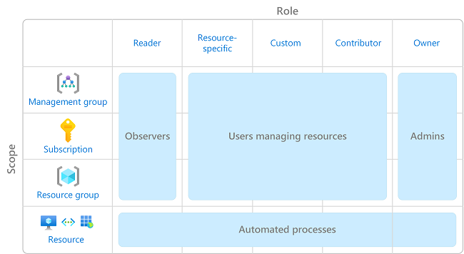
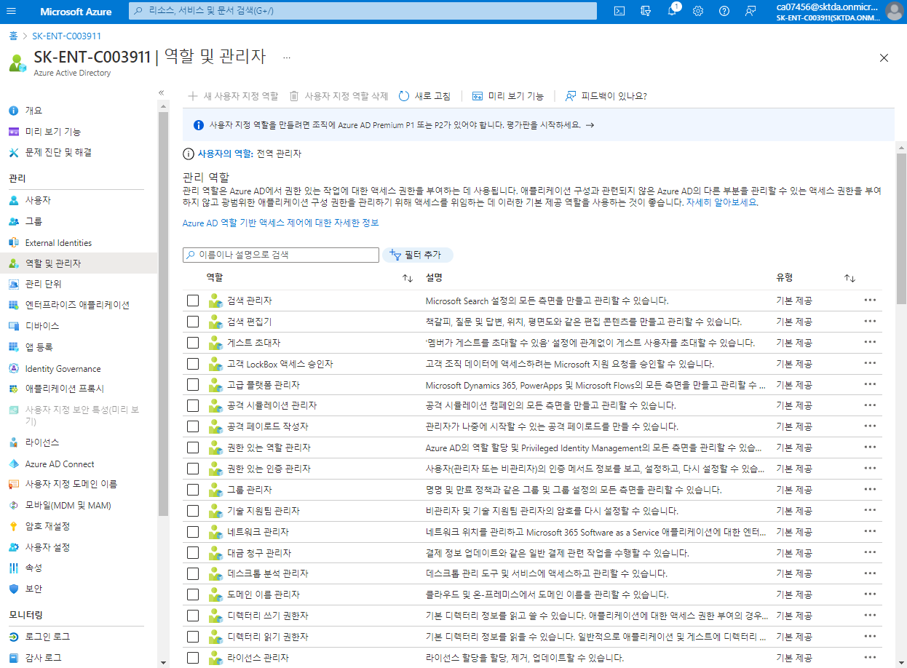

# RBAC(Role Based Access Control)
> [Azure RBAC(Azure 역할 기반 액세스 제어)란?](https://docs.microsoft.com/ko-kr/azure/role-based-access-control/overview)

### EA(기업계약) 계약 관련(확인 필요)
0. EA 구독 계약을 할 때 "Account"로 하며 "Tenent" 가 생성됨
1. Account 소유자가 구독을 만들수 있음
2. Tenent 는 Account 밑에 있음
3. Tenent 는 Active Directory 임  

## AD 권한 
- tenent 권한 부여
- AD > 역활 및 관리자  

| 기본 제공 역활 | 설명 | 한글명 |
|:---|:---|:---|
| Global Admin  | Azure 리소스에 대한 사용자 액세스를 관리할 수 있습니다. | AD 권한 |  

## 자원 권한
- 자원 권한 부여
- 구독 > 역세스 제어(IAM)
- RBAC

| 기본 제공 역활 | 설명 | 한글명 |
|:---|:---|:---|
| Contributors  | 모든 리소스를 관리할 수 있는 모든 권한을 부여하지만, Azure RBAC에서 역할 할당, Azure Blueprints에서 할당 관리 또는 이미지 갤러리 공유를 허용하지 않습니다. | 기여자 |
| Owner  | Azure RBAC에서 역할을 할당하는 기능을 포함하여 모든 리소스를 관리할 수 있는 모든 권한을 부여합니다. | 소유자 |
| Readers  | 모든 리소스를 볼 수 있지만 변경할 수는 없습니다. | 독자 |  

.png)
-역할할당제어.png)