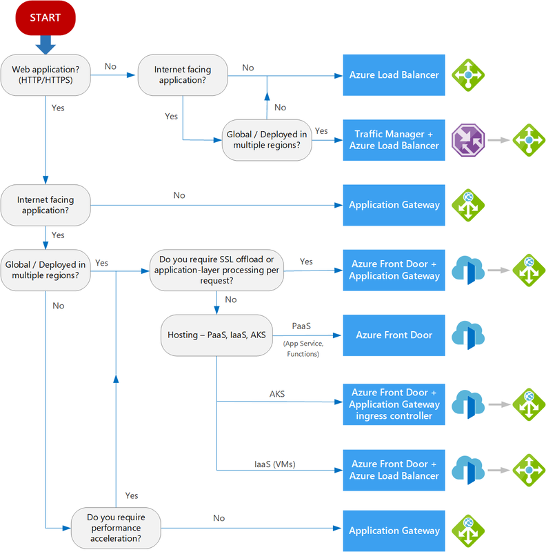

# 부하 분산

| 항목 | 모든 프로토콜 지원 | 웹프로토콜 지원   (인증서 연결 가능) |
|:---|:---:|:---:|
|지리적 분산 |    Traffic Manager |    Front Door |
| 지역 내 분산 |    Load Balancer |    Application Gateway |  

### Azure Load Balancer
- 기존 로드 밸런서를 온프레미스 서버와 함께 사용하여 VM의 로드 밸런싱을 조정
- Layer 4(TCP & UDP) 에서 동작
- 외부 - Public load balancing
- 내부 - Internal load balancing
### Azure Traffic Manager
지리적으로 분산된 데이터 센터에 사용되는 로드 밸런서

### Application Manager
- 경로 기반 웹서비스 분산을 위해 사용
- 계층 7(HTTP) 로드 밸런싱을 지원

### Azure Front Door
- 웹 앱, API, 콘텐츠, 클라우드 서비스에 접근하는 고객을 위해 단일 글로벌 진입점을 제공하는 서비스
- 지능형 위협 방지를 사용 하는 빠르고 안정적 이며 안전한 최신 클라우드 CDN