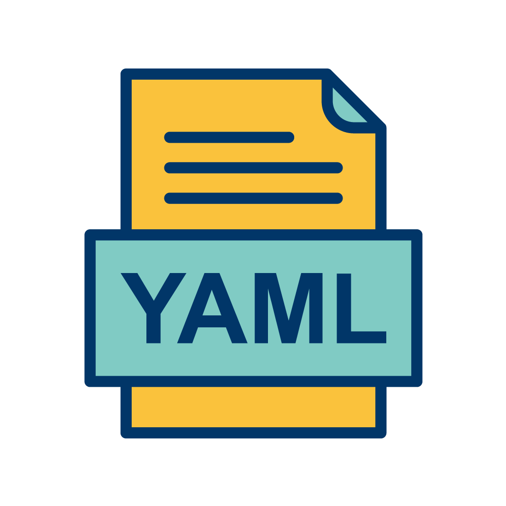
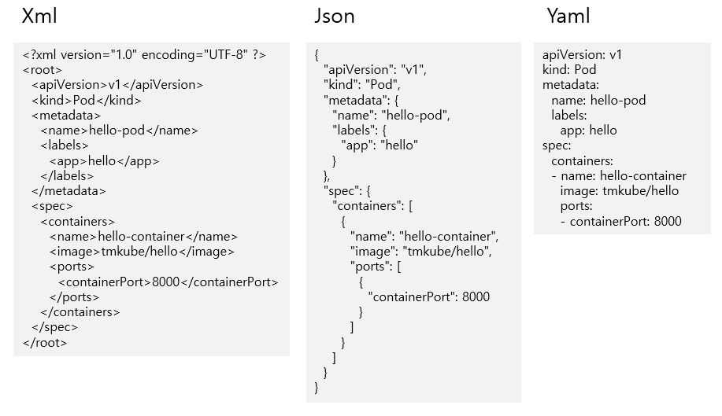

# YAML(Yet Another Markup Language) 
사람이 읽을 수 있는 데이터 직렬화 언어




## 작성법
- 들여쓰기(indent)
  - 들여쓰기는 기본적으로 2칸 또는 4칸을 지원
  - 2 칸 추천
- 데이타 정의(map) : key-Value 구성 
  ```
  apiVersion: v1
  kind: Pod
  metadata:
    name: echo
    labels:
      type: app
  ```
- 배열 정의(array) : '-' 로 표기
  ```yaml
  person:
    name: Chungsub Kim
    job: Developer
    skills: 
      - docker
      - kubernetes
  ```
- 주석 (comment) : '#' 으로 표기
  ```yaml
  ---
  hr: # 1998 hr ranking
    - Mark McGwire
    - Sammy Sosa
  rbi:
    # 1998 rbi ranking
    - Sammy Sosa
    - Ken Griffey
  ...
  ```
  ```yaml
  person:
    name: Chungsub Kim # subicura
    job: Developer
    skills:
      - docker
      - kubernetes
  ```
- 줄바꿈(newline) : 
  - "|" 지시어는 마지막 줄바꿈이 포함
    ```yaml
    newlines_sample: |
      number one line
      second line
      last line
    ```
  - "|-" 지시어는 마지막 줄바꿈을 제외
    ```yaml
    newlines_sample: |-
      number one line
      second line
      last line
    ```
  - ">" 지시어는 중간에 들어간 빈줄을 제외
    ```yaml
    newlines_sample: >
      number one line

      second line

      last line
    ```

- yaml/yml 파일은 json 파일과 상위 호환되기 때문에, json 시퀀스와 맵을 사용할 수 있음

## YAML 기본 자료형
- 스칼라(Scalar) : String 혹은 숫자
- 시퀀스(Sequence): 배열 혹은 리스트
- 매핑(Mapping): 해시 혹은 딕셔너리, key-value 쌍

## Collections
- block Sequence는 각각의 entry 마다 dash + space bar(공백)으로 구성
- Key-Value의 매핑은 :으로 구분
- 문서의 시작('...' 삽입)과 끝('' 삽입)을 지정 할 수 있음 (선택 사항)
- tab 키가 아닌 space bar 하나로 들여쓰기를 함
  - 2 칸 들여쓰기를 많이 함(추천)

## 주의
- key와 value 사이에 공백이 존재해야 함
  ```yaml
  # error (not key-value, string)
  key:value

  # ok
  key: value
  ```

- 문자열 따옴표
  ```yaml
  # error
  windows_drive: c:

  # ok
  windows_drive: "c:"
  windows_drive: 'c:'
  ```
