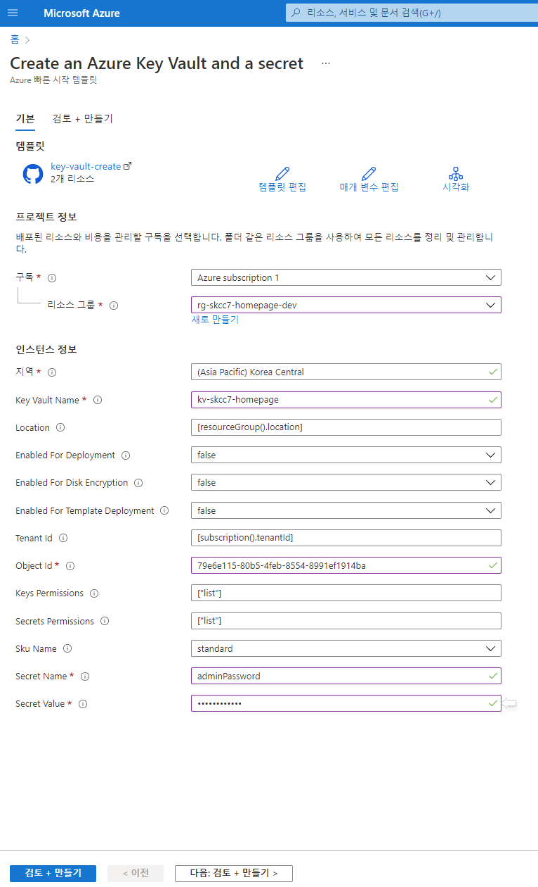

# ARM(Azure Resource Management) Template

## 리소스 그룹에 배포하기

### 리소스 그룹 배포
#### 기본 스키마
```json
{
  "$schema": "https://schema.management.azure.com/schemas/2019-04-01/deploymentTemplate.json#",
  "contentVersion": "1.0.0.0",
  "parameters": {},
  "functions": [],
  "variables": {},
  "resources": [],
  "outputs": {}
}
```

#### 배포하기
```bash
groupName='rg-skcc7-homepage-dev'
templateName='rg-skcc7-homepage-dev.json'
az deployment group create \
  --resource-group $groupName \
  --template-file $templateName
```

#### PowerShell
```powershell
$groupName='rg-skcc7-homepage-dev'
$templateName='rg-skcc7-homepage-dev.json'
New-AzResourceGroupDeployment `
  -ResourceGroupName $groupName `
  -TemplateFile $templateName
```

### VS Code 사용시 확장팩 설치 및 사용

#### 확장팩 [Azure Resource Manager (ARM) Tools](https://marketplace.visualstudio.com/items?itemName=msazurermtools.azurerm-vscode-tools)  

#### .json 파일을 만들고 'arm' 글자 입력시 기본 코드 생성
#### 자원 추가 파라미터 단축키(Ctrl + Space)
"resources" 에서 자원명을 보여주고 기본 코드를 만들어줌

#### 파라미터 기본코드 생성

#### 스키마 체크

#### 파라미터 파일 생성 및 항목 추가


## ARM Template 작성 순서
> [ARM 템플릿 모범 사례](https://docs.microsoft.com/ko-kr/azure/azure-resource-manager/templates/best-practices)  

#### 1. 배포할 자원 정의
"resources" 절에 기술함
```json
  "resources": [{
    "name": "storageaccount1",
    "type": "Microsoft.Storage/storageAccounts",
    "apiVersion": "2021-04-01",
    "tags": {
      "displayName": "storageaccount1"
    },
    "location": "[resourceGroup().location]",
    "kind": "StorageV2",
    "sku": {
      "name": "Premium_LRS",
      "tier": "Premium"
    }
  }],
```
#### 2. Parameter 정의
"parameters" 절에 그룹명, 위치명, 자원명 등을 기술함
```json
  "parameters": {
    "storageAccountType": {
      "type": "string",
      "defaultValue": "Standard_LRS",
      "metadata": {
        "description": "The type of the new storage account created to store the VM disks."
      }
    },
    "storageAccountName": {
      "type": "string",
      "defaultValue": "[concat('storage', uniqueString(resourceGroup().id))]",
      "metadata": {
        "description": "Name of the storage account"
      }
    },
    "locationName": {
      "type": "string",
      "defaultValue": "[resourceGroup().location]",
      "metadata": {
        "description": "The location in which the resources should be deployed."
      }
    }
  },
```
#### 3. Variable 정의

#### 4. 리소스에 파라미터 or Variable 적용

## 참고자료  및 Key Vault(비밀번호) 통합 예시

> [ARM 템플릿의 구조 및 구문 이해](https://docs.microsoft.com/ko-kr/azure/azure-resource-manager/templates/syntax)  
> [ARM 템플릿에서 리소스를 배포하는 순서 정의](https://docs.microsoft.com/ko-kr/azure/azure-resource-manager/templates/resource-dependency)  
> [ARM 템플릿의 리소스 함수](https://docs.microsoft.com/ko-kr/azure/azure-resource-manager/templates/template-functions-resource#extensionresourceid)  
> [ARM 템플릿 함수](https://docs.microsoft.com/ko-kr/azure/azure-resource-manager/templates/template-functions)  
> [ARM 템플릿 모범 사례](https://docs.microsoft.com/ko-kr/azure/azure-resource-manager/templates/best-practices)  
> [Resource Manager 템플릿을 사용하여 Windows 가상 머신 만들기](https://docs.microsoft.com/ko-kr/azure/virtual-machines/windows/ps-template)  

## ARM Template 에 비밀번호(securestring) 사용 예시
### [빠른 시작: ARM 템플릿을 사용하여 Azure Key Vault에서 비밀 설정 및 검색](https://docs.microsoft.com/ko-kr/azure/key-vault/secrets/quick-create-template?tabs=PowerShell)  
#### [Create an Azure Key Vault and a secret](https://portal.azure.com/#create/Microsoft.Template/uri/https%3A%2F%2Fraw.githubusercontent.com%2FAzure%2Fazure-quickstart-templates%2Fmaster%2Fquickstarts%2Fmicrosoft.keyvault%2Fkey-vault-create%2Fazuredeploy.json)  
  
#### 배포된 리소스 검토
```
PS C:\workspace\AzureBasic> $KeyVaultName='kv-skcc7-homepage'
PS C:\workspace\AzureBasic> Get-AzKeyVaultSecret -vaultName $keyVaultName

Vault Name   : kv-skcc7-homepage
Name         : adminPassword
Version      : 
Id           : https://kv-skcc7-homepage.vault.azure.net:443/secrets/adminPassword
Enabled      : True
Expires      : 
Not Before   : 
Created      : 2022-02-15 오후 6:06:10
Updated      : 2022-02-15 오후 6:06:10
Content Type : 
Tags         : 


PS C:\workspace\AzureBasic> 
```
#### [자습서: ARM 템플릿 배포에 Azure Key Vault 통합](https://docs.microsoft.com/ko-kr/azure/azure-resource-manager/templates/template-tutorial-use-key-vault)

#### 참고 : Azure Resources 
- Microsoft.Network/ipGroups
- Microsoft.Storage/storageAccounts
- Microsoft.Network/routeTables
- Microsoft.Network/networkSecurityGroups
- Microsoft.Network/virtualNetworks
- Microsoft.Network/publicIPPrefix
- Microsoft.Network/publicIPAddresses
- Microsoft.Network/networkInterfaces
- Microsoft.Compute/virtualMachines
- Microsoft.Network/azureFirewalls
- Microsoft.KeyVault/vaults
- Microsoft.KeyVault/vaults/secrets
- Microsoft.Network/dnsZones
- Microsoft.Sql/servers
