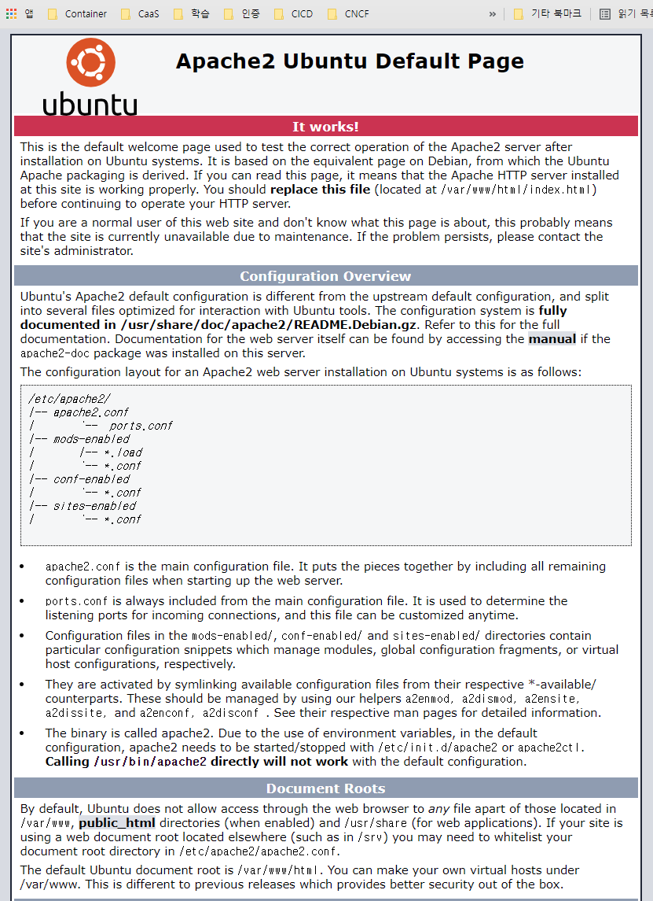
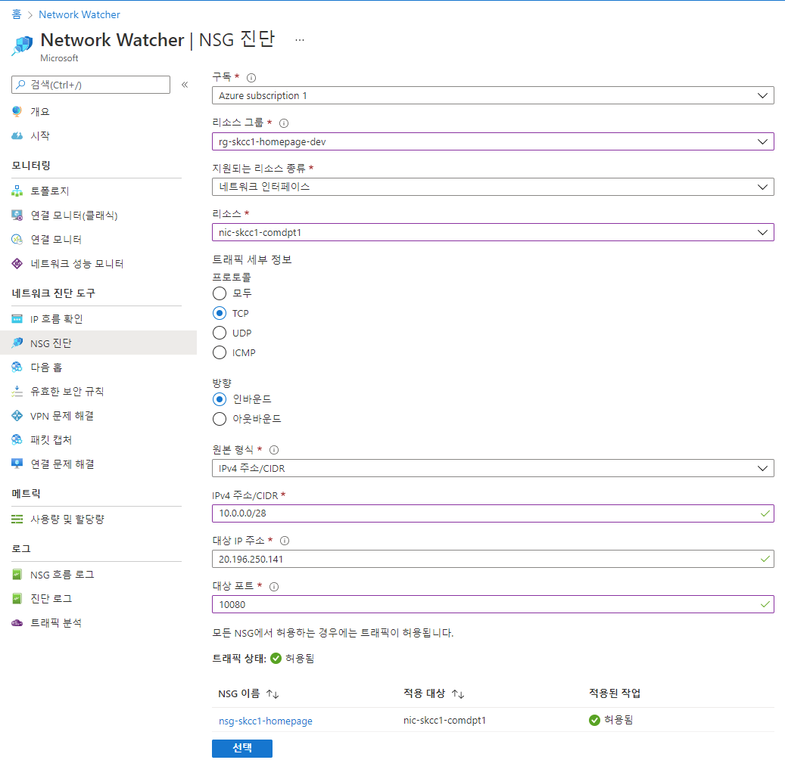
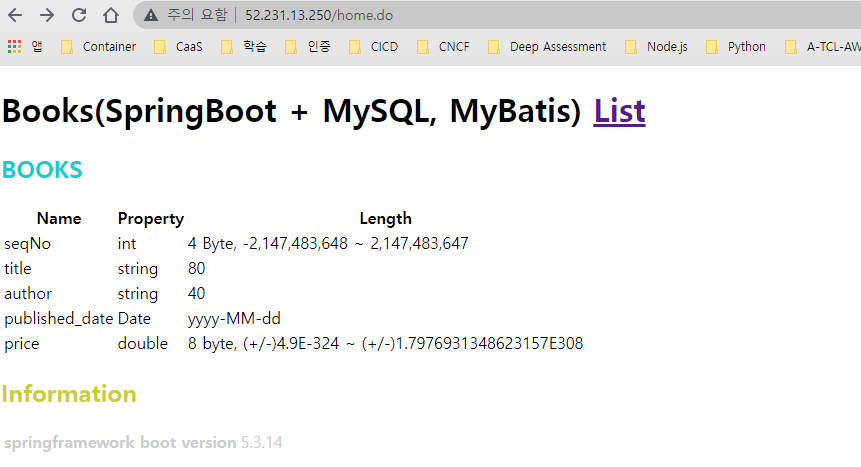

# [Apache http](https://httpd.apache.org/) [2.4.29](https://www.apachelounge.com/download/) 
- 정적인 데이터를 처리하는 웹서버

* [우분투 Apache+Tomcat 연동](https://goyunji.tistory.com/93)


## Ubuntu 서버 방화벽 끄기
```bash
azureuser@vm-skcc-comdpt1:/etc/apache2$ sudo ufw disable
Firewall stopped and disabled on system startup
azureuser@vm-skcc-comdpt1:/etc/apache2$ sudo ufw status
Status: inactive
azureuser@vm-skcc-comdpt1:/etc/apache2$
```


## Ubuntu 에서 아파치 웹서버 설치하기

## 도구 설치
```bash
sudo apt install net-tools -y
```
## Apache 설치
1. sudo apt install apache2
```powershell
azureuser@vm-skcc-comdpt1:~$ sudo apt install apache2
Reading package lists... Done
Building dependency tree
Reading state information... Done
The following additional packages will be installed:
  apache2-bin apache2-data apache2-utils libapr1 libaprutil1 libaprutil1-dbd-sqlite3 libaprutil1-ldap liblua5.2-0
  ssl-cert
Suggested packages:
  www-browser apache2-doc apache2-suexec-pristine | apache2-suexec-custom openssl-blacklist
The following NEW packages will be installed:
  apache2 apache2-bin apache2-data apache2-utils libapr1 libaprutil1 libaprutil1-dbd-sqlite3 libaprutil1-ldap
  liblua5.2-0 ssl-cert
0 upgraded, 10 newly installed, 0 to remove and 4 not upgraded.
Need to get 1729 kB of archives.
After this operation, 6997 kB of additional disk space will be used.
Do you want to continue? [Y/n] Y
Get:1 http://azure.archive.ubuntu.com/ubuntu bionic/main amd64 libapr1 amd64 1.6.3-2 [90.9 kB]
Get:2 http://azure.archive.ubuntu.com/ubuntu bionic/main amd64 libaprutil1 amd64 1.6.1-2 [84.4 kB]
Get:3 http://azure.archive.ubuntu.com/ubuntu bionic/main amd64 libaprutil1-dbd-sqlite3 amd64 1.6.1-2 [10.6 kB]
Get:4 http://azure.archive.ubuntu.com/ubuntu bionic/main amd64 libaprutil1-ldap amd64 1.6.1-2 [8764 B]
Get:5 http://azure.archive.ubuntu.com/ubuntu bionic/main amd64 liblua5.2-0 amd64 5.2.4-1.1build1 [108 kB]
Get:6 http://azure.archive.ubuntu.com/ubuntu bionic-updates/main amd64 apache2-bin amd64 2.4.29-1ubuntu4.21 [1070 kB]
Get:7 http://azure.archive.ubuntu.com/ubuntu bionic-updates/main amd64 apache2-utils amd64 2.4.29-1ubuntu4.21 [83.8 kB]
Get:8 http://azure.archive.ubuntu.com/ubuntu bionic-updates/main amd64 apache2-data all 2.4.29-1ubuntu4.21 [160 kB]
Get:9 http://azure.archive.ubuntu.com/ubuntu bionic-updates/main amd64 apache2 amd64 2.4.29-1ubuntu4.21 [95.1 kB]
Get:10 http://azure.archive.ubuntu.com/ubuntu bionic/main amd64 ssl-cert all 1.0.39 [17.0 kB]
Fetched 1729 kB in 2s (879 kB/s)
Preconfiguring packages ...
Selecting previously unselected package libapr1:amd64.
(Reading database ... 85977 files and directories currently installed.)
Preparing to unpack .../0-libapr1_1.6.3-2_amd64.deb ...
Unpacking libapr1:amd64 (1.6.3-2) ...
Selecting previously unselected package libaprutil1:amd64.
Preparing to unpack .../1-libaprutil1_1.6.1-2_amd64.deb ...
Unpacking libaprutil1:amd64 (1.6.1-2) ...
Selecting previously unselected package libaprutil1-dbd-sqlite3:amd64.
Preparing to unpack .../2-libaprutil1-dbd-sqlite3_1.6.1-2_amd64.deb ...
Unpacking libaprutil1-dbd-sqlite3:amd64 (1.6.1-2) ...
Selecting previously unselected package libaprutil1-ldap:amd64.
Preparing to unpack .../3-libaprutil1-ldap_1.6.1-2_amd64.deb ...
Unpacking libaprutil1-ldap:amd64 (1.6.1-2) ...
Selecting previously unselected package liblua5.2-0:amd64.
Preparing to unpack .../4-liblua5.2-0_5.2.4-1.1build1_amd64.deb ...
Unpacking liblua5.2-0:amd64 (5.2.4-1.1build1) ...
Selecting previously unselected package apache2-bin.
Preparing to unpack .../5-apache2-bin_2.4.29-1ubuntu4.21_amd64.deb ...
Unpacking apache2-bin (2.4.29-1ubuntu4.21) ...
Selecting previously unselected package apache2-utils.
Preparing to unpack .../6-apache2-utils_2.4.29-1ubuntu4.21_amd64.deb ...
Unpacking apache2-utils (2.4.29-1ubuntu4.21) ...
Selecting previously unselected package apache2-data.
Preparing to unpack .../7-apache2-data_2.4.29-1ubuntu4.21_all.deb ...
Unpacking apache2-data (2.4.29-1ubuntu4.21) ...
Selecting previously unselected package apache2.
Preparing to unpack .../8-apache2_2.4.29-1ubuntu4.21_amd64.deb ...
Unpacking apache2 (2.4.29-1ubuntu4.21) ...
Selecting previously unselected package ssl-cert.
Preparing to unpack .../9-ssl-cert_1.0.39_all.deb ...
Unpacking ssl-cert (1.0.39) ...
Setting up libapr1:amd64 (1.6.3-2) ...
Setting up apache2-data (2.4.29-1ubuntu4.21) ...
Setting up ssl-cert (1.0.39) ...
Setting up libaprutil1:amd64 (1.6.1-2) ...
Setting up liblua5.2-0:amd64 (5.2.4-1.1build1) ...
Setting up libaprutil1-ldap:amd64 (1.6.1-2) ...
Setting up libaprutil1-dbd-sqlite3:amd64 (1.6.1-2) ...
Setting up apache2-utils (2.4.29-1ubuntu4.21) ...
Setting up apache2-bin (2.4.29-1ubuntu4.21) ...
Setting up apache2 (2.4.29-1ubuntu4.21) ...
Enabling module mpm_event.
Enabling module authz_core.
Enabling module authz_host.
Enabling module authn_core.
Enabling module auth_basic.
Enabling module access_compat.
Enabling module authn_file.
Enabling module authz_user.
Enabling module alias.
Enabling module dir.
Enabling module autoindex.
Enabling module env.
Enabling module mime.
Enabling module negotiation.
Enabling module setenvif.
Enabling module filter.
Enabling module deflate.
Enabling module status.
Enabling module reqtimeout.
Enabling conf charset.
Enabling conf localized-error-pages.
Enabling conf other-vhosts-access-log.
Enabling conf security.
Enabling conf serve-cgi-bin.
Enabling site 000-default.
Created symlink /etc/systemd/system/multi-user.target.wants/apache2.service → /lib/systemd/system/apache2.service.
Created symlink /etc/systemd/system/multi-user.target.wants/apache-htcacheclean.service → /lib/systemd/system/apache-htcacheclean.service.
Processing triggers for libc-bin (2.27-3ubuntu1.4) ...
Processing triggers for systemd (237-3ubuntu10.53) ...
Processing triggers for man-db (2.8.3-2ubuntu0.1) ...
Processing triggers for ufw (0.36-0ubuntu0.18.04.2) ...
Processing triggers for ureadahead (0.100.0-21) ...
```

### Apache 서버 시작하기  
sudo service apache2 start
1. cd /etc/init.d
```powershell
azureuser@vm-skcc-comdpt1:~$ cd /etc/init.d
azureuser@vm-skcc-comdpt1:/etc/init.d$ dir
acpid                cron              irqbalance         lxcfs           plymouth-log    ufw
apache-htcacheclean  cryptdisks        iscsid             lxd             procps          unattended-upgrades
apache2              cryptdisks-early  keyboard-setup.sh  mdadm           rsync           uuidd
apparmor             dbus              kmod               mdadm-waitidle  rsyslog
apport               ebtables          lvm2               open-iscsi      screen-cleanup
atd                  grub-common       lvm2-lvmetad       open-vm-tools   ssh
console-setup.sh     hwclock.sh        lvm2-lvmpolld      plymouth        udev
```

2. Apache 서버 기동 및 확인
- 기동 : sudo service apache2 start
- 데몬 상태 확인 : sudo service apache2 status
- Listen Port 확인 : netstat -an | grep LISTEN
```powershell
azureuser@vm-skcc-comdpt1:~$ sudo service apache2 start
azureuser@vm-skcc-comdpt1:~$ sudo service apache2 status
● apache2.service - The Apache HTTP Server
   Loaded: loaded (/lib/systemd/system/apache2.service; enabled; vendor preset: enabled)
  Drop-In: /lib/systemd/system/apache2.service.d
           └─apache2-systemd.conf
   Active: active (running) since Fri 2022-01-28 06:58:09 UTC; 4min 35s ago
 Main PID: 20117 (apache2)
    Tasks: 55 (limit: 4674)
   CGroup: /system.slice/apache2.service
           ├─20117 /usr/sbin/apache2 -k start
           ├─20123 /usr/sbin/apache2 -k start
           └─20124 /usr/sbin/apache2 -k start

Jan 28 06:58:09 vm-skcc-comdpt1 systemd[1]: Starting The Apache HTTP Server...
Jan 28 06:58:09 vm-skcc-comdpt1 systemd[1]: Started The Apache HTTP Server.
azureuser@vm-skcc-comdpt1:~$ netstat -an | grep LISTEN
tcp        0      0 0.0.0.0:22              0.0.0.0:*               LISTEN
tcp        0      0 127.0.0.53:53           0.0.0.0:*               LISTEN
tcp6       0      0 :::22                   :::*                    LISTEN
tcp6       0      0 :::80                   :::*                    LISTEN
unix  2      [ ACC ]     SEQPACKET  LISTENING     14174    /run/udev/control
unix  2      [ ACC ]     STREAM     LISTENING     762324   /run/user/1000/systemd/private
unix  2      [ ACC ]     STREAM     LISTENING     762328   /run/user/1000/gnupg/S.gpg-agent.ssh
unix  2      [ ACC ]     STREAM     LISTENING     762329   /run/user/1000/gnupg/S.gpg-agent
unix  2      [ ACC ]     STREAM     LISTENING     762330   /run/user/1000/gnupg/S.dirmngr
unix  2      [ ACC ]     STREAM     LISTENING     762331   /run/user/1000/gnupg/S.gpg-agent.browser
unix  2      [ ACC ]     STREAM     LISTENING     762332   /run/user/1000/gnupg/S.gpg-agent.extra
unix  2      [ ACC ]     STREAM     LISTENING     762333   /run/user/1000/snapd-session-agent.socket
unix  2      [ ACC ]     STREAM     LISTENING     19336    /var/lib/lxd/unix.socket
unix  2      [ ACC ]     STREAM     LISTENING     20512    @irqbalance1168.sock
unix  2      [ ACC ]     STREAM     LISTENING     19338    /run/snapd.socket
unix  2      [ ACC ]     STREAM     LISTENING     19324    /run/uuidd/request
unix  2      [ ACC ]     STREAM     LISTENING     19331    /var/run/dbus/system_bus_socket
unix  2      [ ACC ]     STREAM     LISTENING     19340    /run/snapd-snap.socket
unix  2      [ ACC ]     STREAM     LISTENING     19345    /run/acpid.socket
unix  2      [ ACC ]     STREAM     LISTENING     14167    /run/systemd/private
unix  2      [ ACC ]     STREAM     LISTENING     14172    /run/systemd/fsck.progress
unix  2      [ ACC ]     STREAM     LISTENING     14176    /run/lvm/lvmpolld.socket
unix  2      [ ACC ]     STREAM     LISTENING     14182    /run/systemd/journal/stdout
unix  2      [ ACC ]     STREAM     LISTENING     14191    /run/lvm/lvmetad.socket
unix  2      [ ACC ]     STREAM     LISTENING     19335    @ISCSIADM_ABSTRACT_NAMESPACE
azureuser@vm-skcc-comdpt1:~$
```

3. Apache 서버 버전 확인
```bash
azureuser@vm-skcc-comdpt1:~$ apache2 -v
Server version: Apache/2.4.29 (Ubuntu)
Server built:   2022-01-05T14:50:41
```

  


4. Listen Port 변경
- /etc/apache2/ports.conf
## apache2 설정
```
#   /etc/apache2/
#   |-- apache2.conf
#   |   `--  ports.conf
#   |-- mods-enabled
#   |   |-- *.load
#   |   `-- *.conf
#   |-- conf-enabled
#   |   `-- *.conf
#   `-- sites-enabled
#       `-- *.conf
```
- Apache 설치된 Directory 위치: /etc/apache2
- httpd conf 위치 : /etc/apache2
  - apache2.conf
  - port.conf
- 홈페이지 : /var/www/html
- Listen Port 설정
  - port.conf 에서 조정
- mod_jk 사용 설정
  - 확장자 *.do 일 경우 jvm1(Tomcat) 에서 처리하도록 설정
  - workers.properties 설정
  - uri.properties 설정

5. Azure Portal 홈 > Network Watcher | NSG 진단
   - 원하는 포트가 열려 있는지 확인
   - "10080" 과 포트의 경우 브라우저에서 막음으로 아래의 테스트로 열려 있어도 브라우저에서 별도의 조치를 해야 사용할 수 있음으로 피하는 것이 좋음
   
### Document Root 지정
#### /etc/apache2/ports.conf
  ```conf
  # If you just change the port or add more ports here, you will likely also
  # have to change the VirtualHost statement in
  # /etc/apache2/sites-enabled/000-default.conf

  Listen 80

  <IfModule ssl_module>
          Listen 443
  </IfModule>

  <IfModule mod_gnutls.c>
          Listen 443
  </IfModule>

  # vim: syntax=apache ts=4 sw=4 sts=4 sr noet
  ```

### Tomcat 연동 설정(AJP 1.3)

#### mod-jk 설치
```
sudo apt install libapache2-mod-jk
```

#### worker.properties 설정
```
//mod-jk 설정파일 열기
sudo vi /etc/libapache2-mod-jk/workers.properties
```
##### /etc/libapache2-mod-jk/workers.properties
```conf
# workers.properties -
#
# This file is a simplified version of the workers.properties supplied
# with the upstream sources. The jni inprocess worker (not build in the
# debian package) section and the ajp12 (deprecated) section are removed.
#
# As a general note, the characters $( and ) are used internally to define
# macros. Do not use them in your own configuration!!!
#
# Whenever you see a set of lines such as:
# x=value
# y=$(x)\something
#
# the final value for y will be value\something
#
# Normaly all you will need to do is un-comment and modify the first three
# properties, i.e. workers.tomcat_home, workers.java_home and ps.
# Most of the configuration is derived from these.
#
# When you are done updating workers.tomcat_home, workers.java_home and ps
# you should have 3 workers configured:
#
# - An ajp13 worker that connects to localhost:8009
# - A load balancer worker
#
#

# OPTIONS ( very important for jni mode )

#
# workers.tomcat_home should point to the location where you
# installed tomcat. This is where you have your conf, webapps and lib
# directories.
# tomcat 설치 경로
workers.tomcat_home=/usr/share/tomcat9

#
# workers.java_home should point to your Java installation. Normally
# you should have a bin and lib directories beneath it.
# java 설치 경로
workers.java_home=/usr/lib/jvm/default-java

#
# You should configure your environment slash... ps=\ on NT and / on UNIX
# and maybe something different elsewhere.
#
ps=/

#
#------ ADVANCED MODE ------------------------------------------------
#---------------------------------------------------------------------
#

#
#------ worker list ------------------------------------------
#---------------------------------------------------------------------
#
#
# The workers that your plugins should create and work with
# 연동할 tomcat 이름 설정
worker.list=ajp13_worker

#
#------ ajp13_worker WORKER DEFINITION ------------------------------
#---------------------------------------------------------------------
#

#
# Defining a worker named ajp13_worker and of type ajp13
# Note that the name and the type do not have to match.
# 기본 ajp통신 포트 설정
# 기본 ajp 통신 포트는 8009이다. 여러개 톰캣을 연동하는 경우 이 포트는 각각 다르게 설정해줘야한다.
worker.ajp13_worker.port=8009

# 같은 서버내에서 구성할 때는 localhost 로도 가능
# 각 다른 서버에서 연동할 때는 tomcat server ip를 입력
worker.ajp13_worker.host=10.0.1.4

# apache + tomcat 연동프로토콜로 고정
worker.ajp13_worker.type=ajp13
#
# Specifies the load balance factor when used with
# a load balancing worker.
# Note:
#  ----> lbfactor must be > 0
#  ----> Low lbfactor means less work done by the worker.
worker.ajp13_worker.lbfactor=1

#
# Specify the size of the open connection cache.
#worker.ajp13_worker.cachesize

#
#------ DEFAULT LOAD BALANCER WORKER DEFINITION ----------------------
#---------------------------------------------------------------------
#

#
# The loadbalancer (type lb) workers perform wighted round-robin
# load balancing with sticky sessions.
# Note:
#  ----> If a worker dies, the load balancer will check its state
#        once in a while. Until then all work is redirected to peer
#        workers.
worker.loadbalancer.type=lb
worker.loadbalancer.balance_workers=ajp13_worker
```

#### 000-default.conf 설정
```
sudo vi /etc/apache2/sites-available/000-default.conf
```

##### /etc/apache2/sites-available/000-default.conf
- JkMount : *.do 를 Tomcat에 분기
```conf
<VirtualHost *:80>
    # The ServerName directive sets the request scheme, hostname and port that
    # the server uses to identify itself. This is used when creating
    # redirection URLs. In the context of virtual hosts, the ServerName
    # specifies what hostname must appear in the request's Host: header to
    # match this virtual host. For the default virtual host (this file) this
    # value is not decisive as it is used as a last resort host regardless.
    # However, you must set it for any further virtual host explicitly.
    #ServerName www.example.com

    ServerAdmin webmaster@localhost
    DocumentRoot /var/www/html

    JkMount /*.do ajp13_worker

    # Available loglevels: trace8, ..., trace1, debug, info, notice, warn,
    # error, crit, alert, emerg.
    # It is also possible to configure the loglevel for particular
    # modules, e.g.
    #LogLevel info ssl:warn

    ErrorLog ${APACHE_LOG_DIR}/error.log
    CustomLog ${APACHE_LOG_DIR}/access.log combined

    # For most configuration files from conf-available/, which are
    # enabled or disabled at a global level, it is possible to
    # include a line for only one particular virtual host. For example the
    # following line enables the CGI configuration for this host only
    # after it has been globally disabled with "a2disconf".
    #Include conf-available/serve-cgi-bin.conf
</VirtualHost>

# vim: syntax=apache ts=4 sw=4 sts=4 sr noet
```

#### service 재시작
```bash
sudo service apache2 restart
```

## .do 실행
### /var/www/html/index.html 내용
- "location.href" 를 사용 home.do 로 바로 연계(홈에 접속시 tomat 의 /home.do 호출)
- index.html
  ```html
  <%@ page language="java" contentType="text/html; charset=UTF-8" pageEncoding="UTF-8"%>
  <!DOCTYPE html>
  <html xmlns="http://www.w3org/1999/xhtml" xml:lang="ko" lang="ko">
  <head>
  <meta http-equiv="Context-=Type" content="text/html; charset=utf-8" />
  <title>MAIN PAGE</title>
  <script type="text/javascript">
    location.href="/home.do";
  </script>
  </head>
  </html>
  ```

### Trouble Shooting
위의 순서대로 설치시 접속 문제 발생
> [Could not find worker with name 'ajp13_worker'](https://stackoverflow.com/questions/59035732/could-not-find-worker-with-name-ajp13-worker)
#### 오류 발생
```
[Mon Feb 07 12:20:28.145 2022] [7830:140100789249792] [error] jk_handler::mod_jk.c (2999): Could not find a worker for worker name=ajp13_worker
```
#### 조치 사항
```
sudo a2dismod jk
sudo mv /etc/apache2/mods-available/httpd-jk.conf /etc/apache2/mods-available/jk.conf
cd /etc/libapache2-mod-jk/
sudo ln -f -s ../apache2/mods-available/jk.conf httpd-jk.conf
sudo a2enmod jk
sudo apache2ctl configtest
sudo systemctl restart apache2
```
### 처리결과
#### http://vm-skcc1-comdpt1/
#### http://vm-skcc1-comdpt1/home.do
  
#### http://vm-skcc1-comdpt1/books.do
