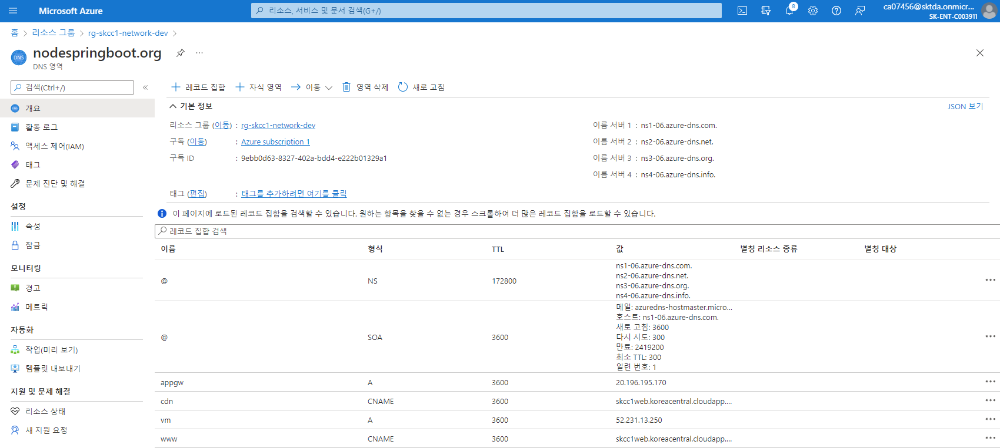

# CDN 적용을 통한 고도화
3-tier 기본 환경에 CDN 적용, Azure DNS 설정, AppGateway 구성 변경
Upload
- Azure CDN 배포 및 구성
- 정상 동작 테스트
- apache 서버 삭제  

## 1. [Azure CDN 구성](./AzureCDN.md)  
- CDN 프로필 : skcc1-homepage-prd-cdn
- endpoint 생성
  - 호스트 이름 : skcc1-homepage-dev-cdn.azureedge.net
    - 프로토콜 : HTTP,HTTPS
    - 원본형식 : 사용자 지정 원본
    - www.nodespringboot.org

## 2. Tomcat 에 Apache 의 Static 문서 Copy
## 3. Application Gateway 백 엔드 풀 변경
#### 이름 : appgw-homepage-ap1-network-bepool
#### 백 엔드 대상 IP : Apache 에서 Tomcat 으로 변경
예) 10.0.0.7 (Apache Server IP) -> 10.1.0.4 (Tomcat Server IP)

## 4. [DNS 영역 변경](./AzureDNS.md)
### DNS 에 cdn 에 CDN endpoint 등록
#### 홈 > DNS 영역 > nodespringboot.org > " + 레코드 집합"
- 이름 : www  
- 유형 : CNAME - 하위 도메인을 다른 레코드에 연결  
- 별칭 : skcc1web.koreacentral.cloudapp.azure.com  

  
## Browser 를 통한 정상 동작 확인  
- Cache 적용됨을 확인 : X-Cache: TCP_HIT 
  > [Microsoft의 Azure CDN에 대한 HTTP 헤더 디버그](https://docs.microsoft.com/ko-kr/azure/cdn/cdn-msft-http-debug-headers)