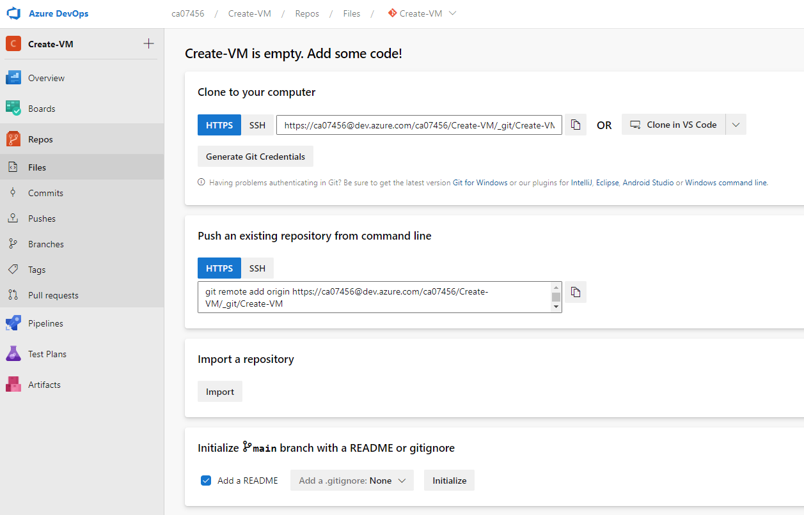

# Azure DevOps 를 통한 자원 배포(IaC - 2)
azure devops 에 저장소 설정 및 Pipeline 을 만들어 배포 하기 

> [Azure Pipelines 사용](https://docs.microsoft.com/ko-kr/azure/devops/pipelines/get-started/pipelines-get-started?view=azure-devops#define-pipelines-using-the-classic-interface)  
> [여유 시간이 있는 Azure DevOps에 대 한 서비스 후크 만들기](https://docs.microsoft.com/ko-kr/azure/devops/service-hooks/services/slack?view=azure-devops) 

### [Azure DevOps](https://devops.azure.com)

### Project 만들기
"Start Free" > _"+ New project"
  

### Repos 만들기
자원 생성 코드를 담아둘 저장소를 만듦(Git)  
- 프로젝트명 : Create-VM
#### Files
  

"Clond in VS Code" 선택
1. 작업 디렉토리를 선택 :  \workspace
2. 새 VS Code 로 프로젝트 를 열음 : \workspace\Create-VM
3. README.md 를 만든 후 git 명령을 이용해 저장소에 올림
  
```powershell
PS C:\workspace\Create-VM> git add *
PS C:\workspace\Create-VM> git commit -m "first commit"
[master (root-commit) ff2b901] first commit
 1 file changed, 3 insertions(+)
 create mode 100644 README.md
PS C:\workspace\Create-VM> git push
Enumerating objects: 3, done.
Counting objects: 100% (3/3), done.
Delta compression using up to 16 threads
Compressing objects: 100% (2/2), done.
Writing objects: 100% (3/3), 291 bytes | 291.00 KiB/s, done.
Total 3 (delta 0), reused 0 (delta 0), pack-reused 0
remote: Analyzing objects... (3/3) (5 ms)
remote: Storing packfile... done (120 ms)
remote: Storing index... done (61 ms)
To https://dev.azure.com/ca07456/Create-VM/_git/Create-VM
 * [new branch]      master -> master
PS C:\workspace\Create-VM> 
```
  

### Pipeline 만들기
1. "Create Pipeline" 선택
2. "Azure Repos Git" 선택
3. "Create-VM" 선택
4. Configure your pipeline | "Starter pipeline" 선택
5. "Review your pipeline YAML" | "Show assitant" 클릭 | "Azure PowerShell" 선택
  - 구독 : 
  - Script Type : Inline Script
    ```powershell
    New-AzResourceGroup -Name myResourceGroup -Location 'KoreaCentral'

    New-AzVm `
        -ResourceGroupName 'myResourceGroup' `
        -Name 'myVM' `
        -Location 'KoreaCentral' `
        -VirtualNetworkName 'myVnet' `
        -SubnetName 'mySubnet' `
        -SecurityGroupName 'myNetworkSecurityGroup' `
        -PublicIpAddressName 'myPublicIpAddress' `
        -OpenPorts 80,3389

    Get-AzPublicIpAddress -ResourceGroupName 'myResourceGroup' | Select-Object -Property  'IpAddress'

    Install-WindowsFeature -Name Web-Server -IncludeManagementTools  
    ```

  - Script Arguments : 

6. azure-pipelines.yaml 에서 "Settings" 를 눌려 설정함  
   - Azure Subscription (pipeline 에서 자원 배포에 사용할 구독)  
   - **Autorize** : 권한 주기 버튼으로 반듯이 눌려야 함
   - Script Type : Inline Script (pipeline 안에 PowerShell or CLI 명령을 넣음)
   - Inline Script : 실행하고자 하는 명령 설정 
   - ErrorActionPreference : Stop
   - **Azure PowerShell version options**
     - Lastest installed version
   - **Advanced** (설정하지 않아도 됨)  
   - Add
     

7. Job 에서 Permssion 주기
     
8. 실행결과
   8.1 Pipelines
     
   8.2 Pipelines > Create-VM  
     
   8.3 Pipelines > Recent > Create-VM  > runs
     
   8.4 Pipelines > Recent > Create-VM > Runs  
     

9. azure-pipelines.yml
```yaml
# Starter pipeline
# Start with a minimal pipeline that you can customize to build and deploy your code.
# Add steps that build, run tests, deploy, and more:
# https://aka.ms/yaml

# commit 할 때 빌드 triggering
trigger:
- master

# commit 시 빌드하지 않기
# trigger: none

pool:
  vmImage: ubuntu-latest

steps:
- script: echo Hello, world!
  displayName: 'Run a one-line script'

- bash: az --version
  displayName: 'Show Azure CLI version'

- bash: az devops configure --defaults organization=$(System.TeamFoundationCollectionUri) project=$(System.TeamProject) --use-git-aliases true
  displayName: 'Set default Azure DevOps organization and project'

- bash: |
    az pipelines build list
    git pr list
  displayName: 'Show build list and PRs'
  env:
    AZURE_DEVOPS_EXT_PAT: $(System.AccessToken)

- script: |
    echo Add other tasks to build, test, and deploy your project.
    echo See https://aka.ms/yaml
  displayName: 'Run a multi-line script'

- task: AzureCLI@2
  displayName: Azure CLI Account 보기
  inputs:
    azureSubscription: 'Azure subscription 1(9ebb0d63-8327-402a-bdd4-e222b01329a1)'
    scriptType: 'bash'
    scriptLocation: 'inlineScript'
    inlineScript: |
      az --version
      az account show

- task: AzurePowerShell@5
  displayName: VM 만들기
  inputs:
    azureSubscription: 'Azure subscription 1(9ebb0d63-8327-402a-bdd4-e222b01329a1)'
    ScriptType: 'InlineScript'
    azurePowerShellVersion: 'LatestVersion'
    Inline: |
      # You can write your azure powershell scripts inline here. 
      # You can also pass predefined and custom variables to this script using arguments
      $groupName = 'rg-skcc7-homepage-dev'
      $locationName = 'koreacentral'

      $jsonName = "vm-deploy"
      
      New-AzResourceGroupDeployment `
          -ResourceGroupName $groupName `
          -TemplateFile "${jsonName}.json" `
          -TemplateParameterFile "${jsonName}.parameters.json"

- task: AzurePowerShell@5
  displayName: MySQL 만들기
  inputs:
    azureSubscription: 'Azure subscription 1(9ebb0d63-8327-402a-bdd4-e222b01329a1)'
    ScriptType: 'InlineScript'
    azurePowerShellVersion: 'LatestVersion'
    Inline: |
      # You can write your azure powershell scripts inline here. 
      # You can also pass predefined and custom variables to this script using arguments
      $groupName = 'rg-skcc7-homepage-dev'
      $locationName = 'koreacentral'

      $jsonName = "mysql-deploy"
      
      New-AzResourceGroupDeployment `
          -ResourceGroupName $groupName `
          -TemplateFile "${jsonName}.json" `
          -TemplateParameterFile "${jsonName}.parameters.json"
```   

  