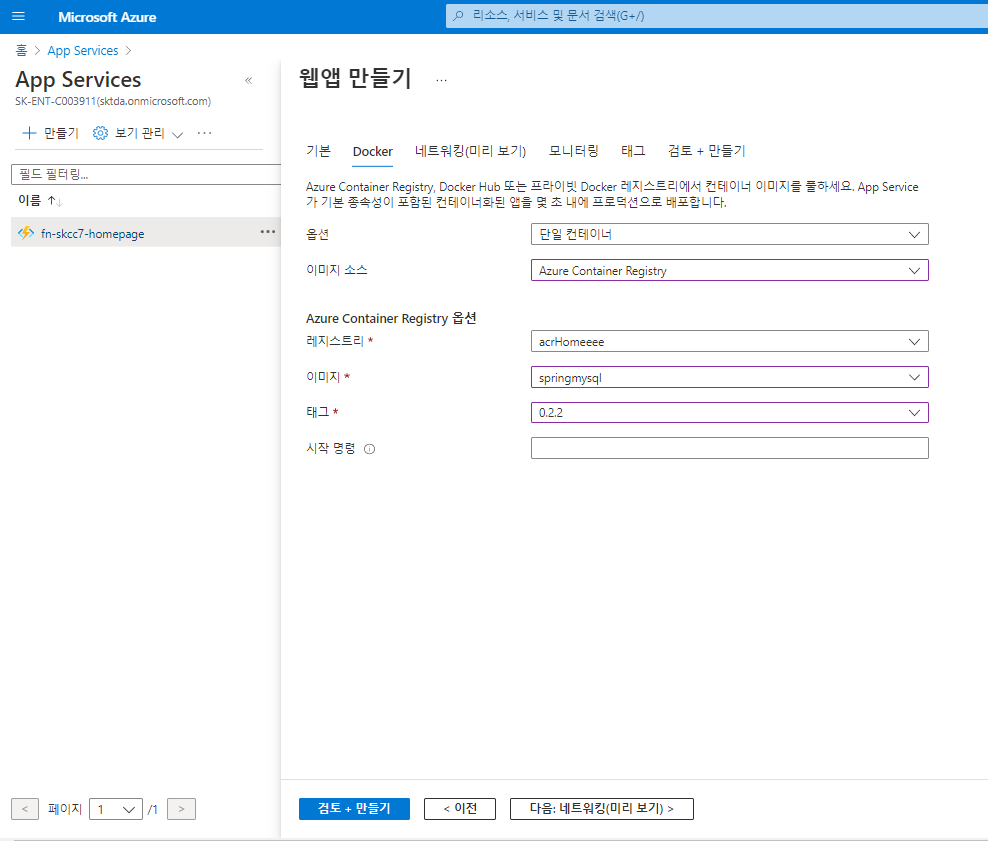

# Azuer App Service
웹앱을 빌드, 배포 및 스케일링할 수 있는 완전 관리형 플랫폼  
- 웹 사이트 및 웹 API를 비롯한 웹 애플리케이션에 대한 완전 관리형 호스팅을 제공  
- 웹 애플리케이션은 코드 또는 컨테이너, .war,.jar 를 사용하여 배포할 수 있음
- 웹 애플리케이션에 최적화, 웹앱을 빌드할 때 이상적인 옵션    
- Azure App Service는 Azure Container Apps 또는 Azure Functions를 비롯한 다른 Azure 서비스와 통합

> [빠른 시작: Azure App Service에서 Java 앱 만들기](https://docs.microsoft.com/ko-kr/azure/app-service/quickstart-java?pivots=platform-linux&tabs=javase)  
> [Azure App Service에서 Linux에 Spring Boot 애플리케이션 배포](https://docs.microsoft.com/ko-kr/azure/developer/java/spring-framework/deploy-spring-boot-java-app-on-linux)  
<<<<<<< HEAD
> [Azure 웹앱용 프라이빗 엔드포인트 사용](https://docs.microsoft.com/ko-kr/azure/app-service/networking/private-endpoint)  
=======
> [Azure 가상 네트워크에 앱 통합](https://docs.microsoft.com/ko-kr/azure/app-service/overview-vnet-integration)  
>>>>>>> 3335d71424e39140817182a9b75077edb744cfe7


## App Service 를 docker 로 배포하기
| 구분 | 값 | 비고 |
|:---|:---|:---| 
| resource group | rg-skcc7-homepage-dev | |   
| name | appsvc-homepage-springmysql-dev | |   
| runtime stack | java 8 | |  
| URL | https://appsvc-homepage-springmysql-dev.azurewebsites.net | | 
| App Service Plan | appplan-homepage-springmysql-dev (P1v3: 1)
 | |  
| Apps type | Docker Container,linux | |  
| File system storage | 500GiB | | 
| WEBSITE_PORT | 8080 | App Services 생성 후 설정 > 구성 에서 "+ 새 애플리케이션 설정" 에서 추가하여 설정함  |


  
  
  
**App Service 배포 후 Listen Port No 변경하기(80 이 아닐경우)**
  
**브라우저에서 보기**
  


### AppService 를 jar 로 배포하기  
> [Azure App Service의 배포 자격 증명 구성](https://docs.microsoft.com/ko-kr/azure/app-service/deploy-configure-credentials?tabs=cli)  
> [App Service에 파일 배포](https://docs.microsoft.com/ko-kr/azure/app-service/deploy-zip?tabs=cli#deploy-zip-file-with-rest-apis)  

```
$groupName = 'rg-skcc7-homepage-dev'
$appName = 'appsvc-homepage-springmysql1-dev'
$packageName = 'SpringBootSample-0.0.1-SNAPSHOT'

$acrId = 'acrHomeeee'
$arcPw = 'Ax2BMk0y828RhmnGQyxOhH=H2Ggun1bt'


az webapp deployment `
  user set `
  --user-name $acrId `
  --password $arcPw 

az webapp deployment `
  list-publishing-profiles `
  --resource-group $groupName `
  --name $appName


az webapp deploy `
  --resource-group $groupName `
  --name $appName `
  --src-path ./$packageName.war `
  --type=war
```

### PowerShell
```powershell
Connect-AzAccount

Publish-AzWebapp `
  -ResourceGroupName $groupName `
  -Name $appName `
  -ArchivePath ./$packageName.war

```

```
PS D:\workspace\AzureBasic\1.IaaS\자료> Connect-AzAccount

Account                       SubscriptionName     TenantId                             Environment
-------                       ----------------     --------                             -----------
ca07456@sktda.onmicrosoft.com Azure subscription 1 160bacea-7761-4c83-bfa0-354f9b047f5a AzureCloud

PS D:\workspace\AzureBasic\1.IaaS\자료> 
PS D:\workspace\AzureBasic\1.IaaS\자료> Publish-AzWebapp `
>>   -ResourceGroupName $groupName `
>>   -Name $appName `
>>   -ArchivePath D:\workspace\AzureBasic\1.IaaS/자료/$packageName.war

Confirm
Contents of D:\workspace\AzureBasic\1.IaaS/자료/SpringBootSample-0.0.1-SNAPSHOT.war will be deployed to the web app appsvc-homepage-springmysql1-dev.
[Y] Yes  [N] No  [S] Suspend  [?] Help (default is "Y"):

AzureStoragePath            : {}
GitRemoteName               : 
GitRemoteUri                : 
GitRemoteUsername           : 
GitRemotePassword           : 
AzureStorageAccounts        : 
State                       : Running
HostNames                   : {appsvc-homepage-springmysql1-dev.azurewebsites.net}
RepositorySiteName          : appsvc-homepage-springmysql1-dev
UsageState                  : Normal
Enabled                     : True
EnabledHostNames            : {appsvc-homepage-springmysql1-dev.azurewebsites.net, appsvc-homepage-springmysql1-dev.scm.azurewebsites.net}
AvailabilityState           : Normal
HostNameSslStates           : {appsvc-homepage-springmysql1-dev.azurewebsites.net, appsvc-homepage-springmysql1-dev.scm.azurewebsites.net}
ServerFarmId                : /subscriptions/9ebb0d63-8327-402a-bdd4-e222b01329a1/resourceGroups/rg-skcc7-homepage-dev/providers/Microsoft.Web/serverfarms/ASP-rgskcc7homepagedev-b72 
                              b
Reserved                    : True
IsXenon                     : False
HyperV                      : 
LastModifiedTimeUtc         : 2022-04-26 오전 9:38:12
SiteConfig                  : Microsoft.Azure.Management.WebSites.Models.SiteConfig
TrafficManagerHostNames     : 
ScmSiteAlsoStopped          : False
TargetSwapSlot              : 
HostingEnvironmentProfile   : 
ClientAffinityEnabled       : False
ClientCertEnabled           : False
ClientCertMode              : 
ClientCertExclusionPaths    : 
HostNamesDisabled           : False
CustomDomainVerificationId  : AC06DC825B62FDFFFDE1D252FB58E6298CCEC8B770FB42F4D86041E58E57E1EC
OutboundIpAddresses         : 52.231.38.95,52.231.37.184,52.231.38.172,52.231.33.182,52.231.34.9
PossibleOutboundIpAddresses : 52.231.38.95,52.231.37.184,52.231.38.172,52.231.33.182,52.231.34.9,52.231.69.201,52.231.66.155
ContainerSize               : 0
DailyMemoryTimeQuota        : 0
SuspendedTill               : 
MaxNumberOfWorkers          : 
CloningInfo                 : 
ResourceGroup               : rg-skcc7-homepage-dev
IsDefaultContainer          : 
DefaultHostName             : appsvc-homepage-springmysql1-dev.azurewebsites.net
SlotSwapStatus              : 
HttpsOnly                   : False
RedundancyMode              : 
InProgressOperationId       : 
Identity                    : 
Id                          : /subscriptions/9ebb0d63-8327-402a-bdd4-e222b01329a1/resourceGroups/rg-skcc7-homepage-dev/providers/Microsoft.Web/sites/appsvc-homepage-springmysql1-dev 
Name                        : appsvc-homepage-springmysql1-dev
Kind                        : app,linux
Location                    : Korea Central
Type                        : Microsoft.Web/sites
Tags                        : {}


PS D:\workspace\AzureBasic\1.IaaS\자료> 
```

#### 실행결과
```powershell
PS D:\workspace\AzureBasic> $groupName = 'rg-skcc7-homepage-dev'
PS D:\workspace\AzureBasic> $appName = 'appsvc-homepage-springmysql1-dev'
PS D:\workspace\AzureBasic> $packageName = 'springmysql'
PS D:\workspace\AzureBasic> $acrId = 'acrHomeeee'
PS D:\workspace\AzureBasic> $arcPw = 'Ax2BMk0y828RhmnGQyxOhH=H2Ggun1bt'
PS D:\workspace\AzureBasic> az webapp deployment `
>>   user set `
>>   --user-name $acrId `
>>   --password $arcPw 
{
  "id": null,
  "kind": null,
  "name": "web",
  "publishingPassword": null,
  "publishingPasswordHash": null,
  "publishingPasswordHashSalt": null,
  "publishingUserName": "acrHomeeee",
  "scmUri": null,
  "systemData": null,
  "type": "Microsoft.Web/publishingUsers/web"
}
PS D:\workspace\AzureBasic> 
```