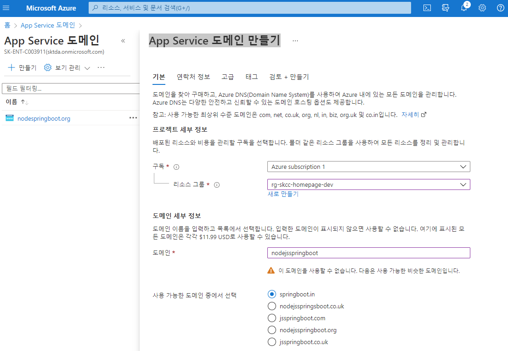
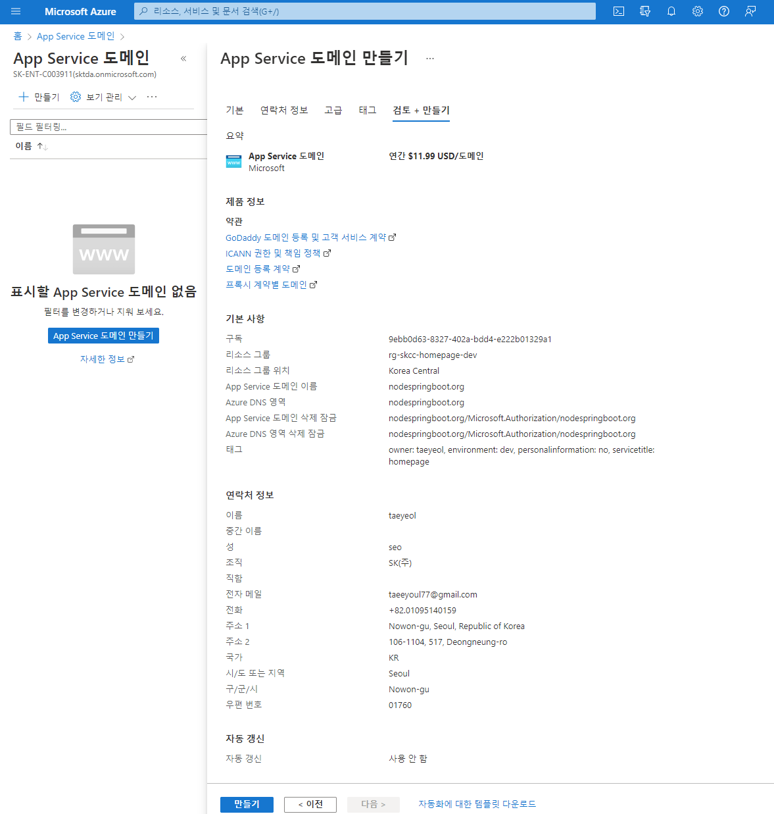
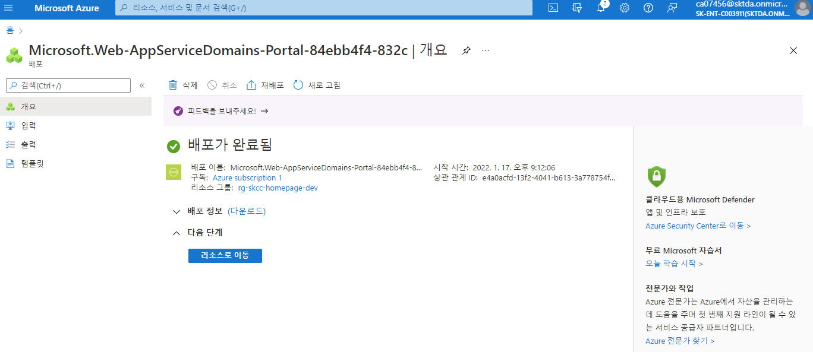
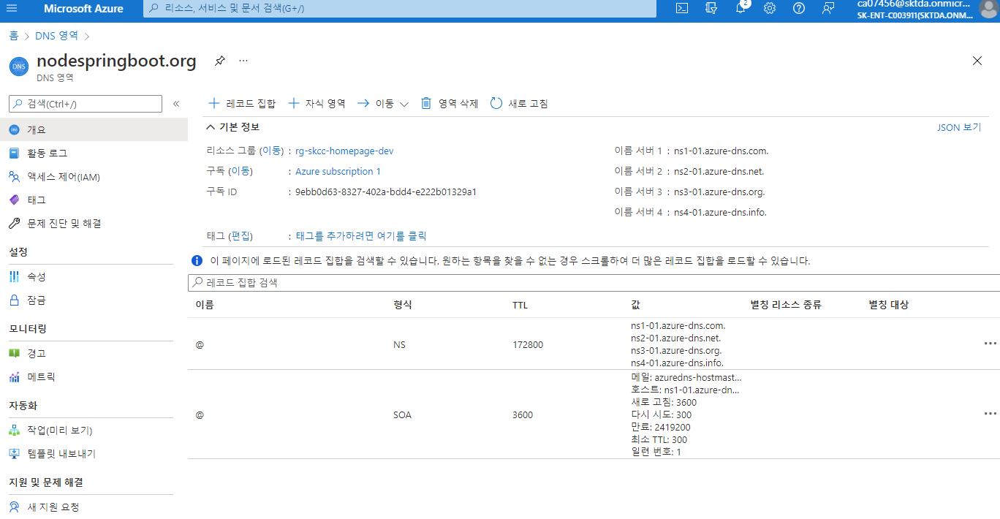

# Azure App Service 도메인
DNS 을 만들고 "DNS" 영역를 생성하여 줌 

- [Azure App Service의 사용자 지정 도메인 이름 구입](https://docs.microsoft.com/ko-kr/azure/app-service/manage-custom-dns-buy-domain)  

## 가격 확인하기
[App Service 가격](https://azure.microsoft.com/ko-kr/pricing/details/app-service/linux/#pricing)

## [App Service 도메인 만들기](https://portal.azure.com/#create/Microsoft.Domain)
- Domain 명 : nodespringboot.org 
  
  
  
