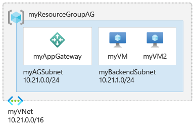
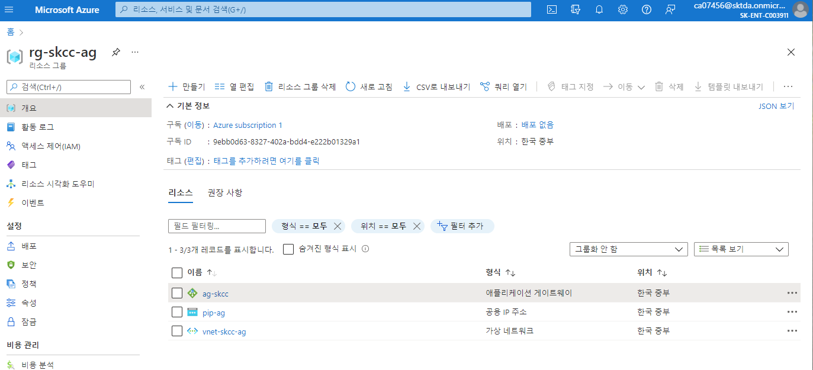
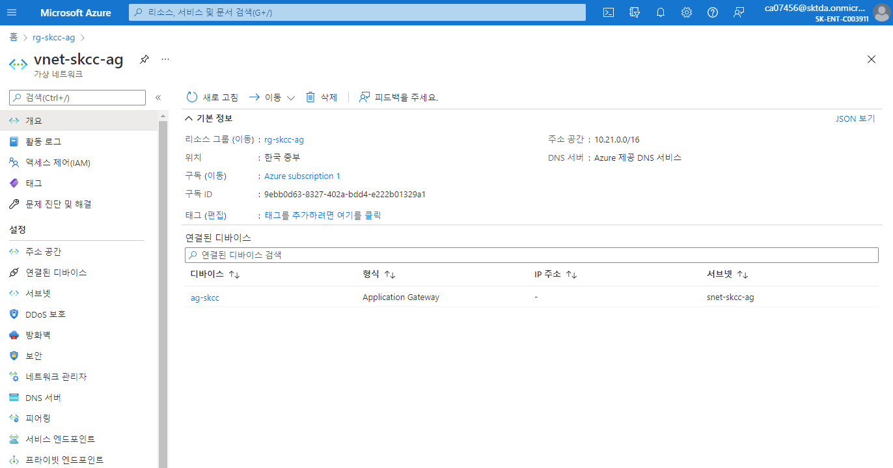
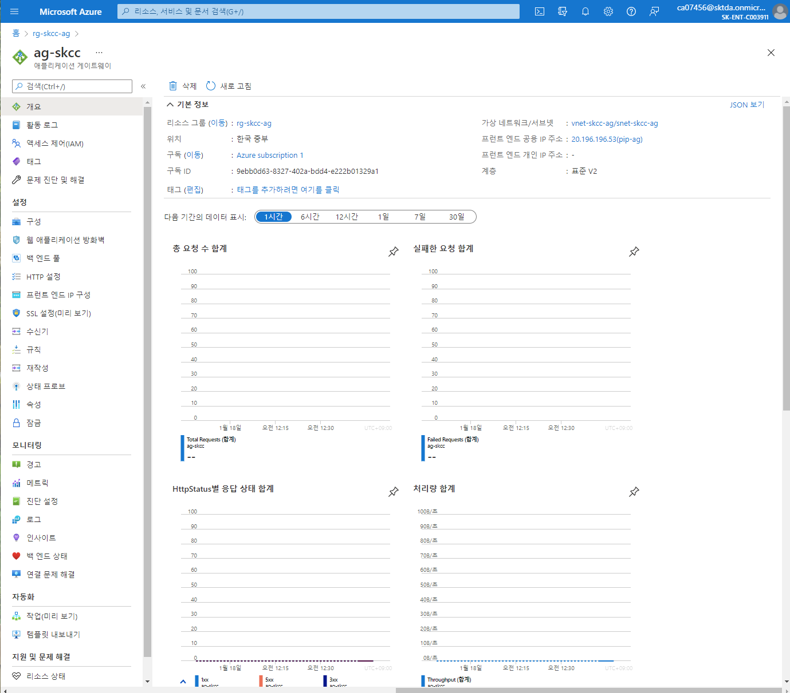

# [Azure Application Gateway란?](https://docs.microsoft.com/ko-kr/azure/application-gateway/overview)
- [빠른 시작: Azure PowerShell을 사용하여 Azure Application Gateway를 통해 웹 트래픽 보내기](https://docs.microsoft.com/ko-kr/azure/application-gateway/quick-create-powershell)
- [Azure Application Gateway 및 Web Application Firewall의 가격 책정 이해](https://docs.microsoft.com/ko-kr/azure/application-gateway/understanding-pricing)




## 변수 설정
```powershell
$resourceGroup = "rg-skcc-ag"
$location = "koreacentral"

$agName = "Standard_v2"
$agTier = "Standard_v2"
$agCapacity = 2

$agSubnetName = "snet-skcc-ag"
$agSubnetPrefix = "10.21.0.0/24"
$bacendSubnetName = "snet-skcc-backend"
$bacendSubnetPrefix = "10.21.1.0/24"

$agVnetName = "vnet-skcc-ag"
$agVnetPrefix = "10.21.0.0/16"

$agPulicIPName = "pip-ag"

$agIPConfigName = "ag-ip-cfg"
$agFrontendIPConfigName = "ag-fe-cfg"
$agFrontendPortName = "ag-fe-port"

$agBackendPoolName = "ag-be-pool"
$agBackendPoolSettingsName = "ag-be-http-setting" 

$agListenerName = "ag-listener"
$agFrontendRule1Name = "ag-fe-rule1"

$appGatewayName = "ag-skcc"
```

## 리소스 그룹 만들기
```
New-AzResourceGroup -Name $resourceGroup -Location $location
```

## 네트워크 리소스 만들기

### 1. subnet 만들기
```powershell
$agSubnetConfig = New-AzVirtualNetworkSubnetConfig `
  -Name $agSubnetName `
  -AddressPrefix $agSubnetPrefix
$backendSubnetConfig = New-AzVirtualNetworkSubnetConfig `
  -Name $bacendSubnetName `
  -AddressPrefix $bacendSubnetPrefix
```

### 2. subnet 구성이 포함된 가상 네트워크 만들기
```powershell
New-AzVirtualNetwork `
  -ResourceGroupName $resourceGroup `
  -Location $location `
  -Name $agVnetName `
  -AddressPrefix $agVnetPrefix `
  -Subnet $agSubnetConfig, $backendSubnetConfig
```

### 3. 공용 IP 주소 만들기
```
New-AzPublicIpAddress `
  -ResourceGroupName $resourceGroup `
  -Location $location `
  -Name $agPulicIPName `
  -AllocationMethod Static `
  -Sku Standard
```

---

## 애플리케이션 게이트웨이 만들기
### 1. IP 구성 및 frontend port 만들기

| No | 명령 | 설명 |
|:---|:---|:---|
| 1 | New-AzApplicationGatewayIPConfiguration | 이전에 만든 서브넷과 애플리케이션 게이트웨이를 연결하는 구성을 만듬 |
| 2 | New-AzApplicationGatewayFrontendIPConfig | 애플리케이션 게이트웨이에 대해 이전에 만든 공용 IP 주소를 할당하는 구성 |
| 3 | New-AzApplicationGatewayFrontendPort | 애플리케이션 게이트웨이에 액세스할 포트 80을 할당 |

```powershell
$vnet = Get-AzVirtualNetwork `
  -ResourceGroupName $resourceGroup `
  -Name $agVnetName
$subnet = Get-AzVirtualNetworkSubnetConfig `
  -VirtualNetwork $vnet `
  -Name $agSubnetName
$pip  = Get-AzPublicIPAddress `
  -ResourceGroupName $resourceGroup `
  -Name $agPulicIPName
 
$gipconfig = New-AzApplicationGatewayIPConfiguration `
  -Name $agIPConfigName  `
  -Subnet $subnet
$fipconfig = New-AzApplicationGatewayFrontendIPConfig `
  -Name $agFrontendIPConfigName `
  -PublicIPAddress $pip
$frontendport = New-AzApplicationGatewayFrontendPort `
  -Name $agFrontendPortName `
  -Port 80
```

### 2. 백 엔드 풀 만들기
| No | 명령 | 설명 |
|:---|:---|:---|
| 1 | New-AzApplicationGatewayBackendAddressPool | 애플리케이션 게이트웨이에 대한 백 엔드 풀을 만듬 |
| 2 | New-AzApplicationGatewayBackendHttpSetting | 백 엔드 풀에 대한 설정을 구성 |

```powershell
$backendPool = New-AzApplicationGatewayBackendAddressPool `
  -Name $agBackendPoolName
$poolSettings = New-AzApplicationGatewayBackendHttpSetting `
  -Name $agBackendPoolSettingsName `
  -Port 80 `
  -Protocol Http `
  -CookieBasedAffinity Enabled `
  -RequestTimeout 30
```

### 3. 수신기를 만들고 규칙을 추가

| No | 명령 | 설명 |
|:---|:---|:---|
| 1 | New-AzApplicationGatewayHttpListener |  수신기를 만듬 |
| 2 | New-AzApplicationGatewayRequestRoutingRule | 규칙 생성 | 

```powershell
$defaultlistener = New-AzApplicationGatewayHttpListener `
  -Name $agListenerName `
  -Protocol Http `
  -FrontendIPConfiguration $fipconfig `
  -FrontendPort $frontendport
$frontendRule = New-AzApplicationGatewayRequestRoutingRule `
  -Name $agFrontendRule1Name `
  -RuleType Basic `
  -HttpListener $defaultlistener `
  -BackendAddressPool $backendPool `
  -BackendHttpSettings $poolSettings
```

## Application Gateway 만들기
| No | 명령 | 설명 |
|:---|:---|:---|
| 1 | [New-AzApplicationGatewaySku](https://docs.microsoft.com/en-us/powershell/module/az.network/new-azapplicationgatewaysku?view=azps-7.1.0) | 애플리케이션 게이트웨이에 대한 매개 변수를 지정 </b> Capacity : Instance 수 |
| 2 | New-AzApplicationGateway | 애플리케이션 게이트웨이 생성 | 
- v1: 
  - "Standard_Small" : Standard
- v2 : 자동 크기 조정, 고가용성 보장
  - Standard_v2

```powershell
$sku = New-AzApplicationGatewaySku `
  -Name Standard_v2 `
  -Tier Standard_v2 `
  -Capacity 2
New-AzApplicationGateway `
  -Name $appGatewayName `
  -ResourceGroupName $resourceGroup `
  -Location $location `
  -BackendAddressPools $backendPool `
  -BackendHttpSettingsCollection $poolSettings `
  -FrontendIpConfigurations $fipconfig `
  -GatewayIpConfigurations $gipconfig `
  -FrontendPorts $frontendport `
  -HttpListeners $defaultlistener `
  -RequestRoutingRules $frontendRule `
  -Sku $sku
```

## [수행결과](./application-gateway-수행결과.md)  
* 소스 [abnormal-dns-record.ps1](./abnormal-dns-record.ps1)

  
