# [Azure Application Gateway란?](https://docs.microsoft.com/ko-kr/azure/application-gateway/overview)  
웹 애플리케이션에 대한 트래픽을 관리할 수 있도록 하는 웹 트래픽 부하 분산 장치  


> [빠른 시작: Azure Application Gateway를 통해 웹 트래픽 보내기 - Azure Portal](https://docs.microsoft.com/ko-kr/azure/application-gateway/quick-create-portal)
> [빠른 시작: Azure PowerShell을 사용하여 Azure Application Gateway를 통해 웹 트래픽 보내기](https://docs.microsoft.com/ko-kr/azure/application-gateway/quick-create-powershell)  
> [Azure Application Gateway 및 Web Application Firewall의 가격 책정 이해](https://docs.microsoft.com/ko-kr/azure/application-gateway/understanding-pricing)  


## Portal | 홈 > 애플리케이션 게이트웨이 만들기
### 1. 기본 사항
#### 프로젝트 정보
- 리소스 그룹: rg-skcc1-network-dev

#### 인스턴스 정보
- 게이트웨이 이름 : skcc1-homepage-dev-appgw
- 지역 : Korea Central
- 자동 크기 조정 : 예
- 최소 인스턴스 수 : 0
- 최대 인스턴스 수 : 10
- 가용성 영역 : 없음
- HTTP2 : 사용 않 함
#### 가상 네트워크 구성
- 가상 네트워크 : vnet-network-dev
- 서브넷 : snet-skcc1-network-frontend(10.21.0.0./27)
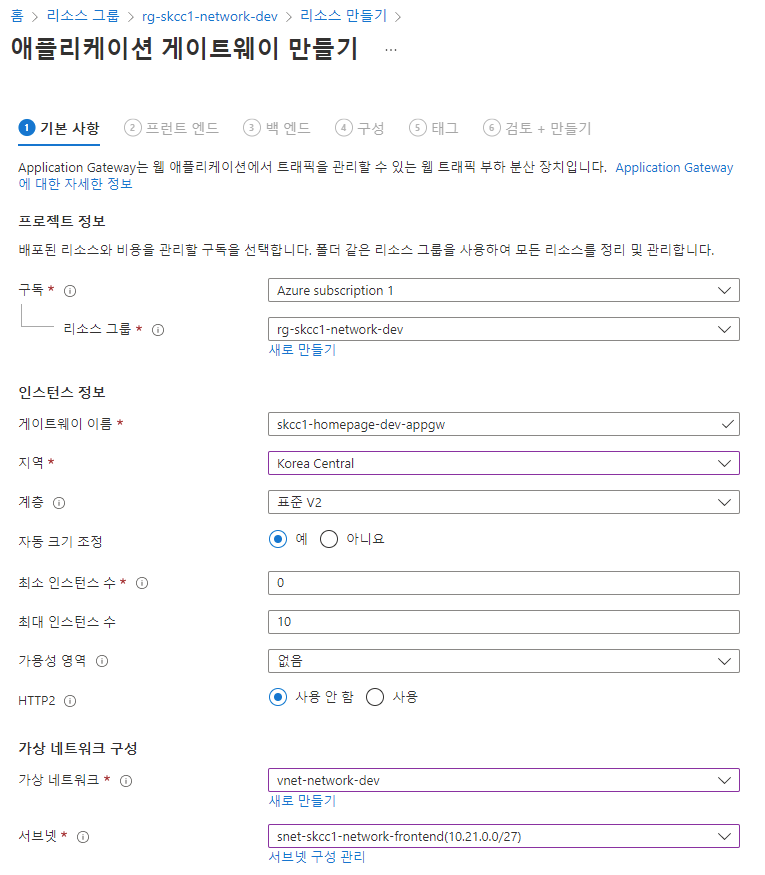  

### 2. 프런트 엔드
#### 프런트 엔드 IP 형식 : 공용
#### 공용 IP 주소 : (신규)skcc1-homepage-appgw-pip

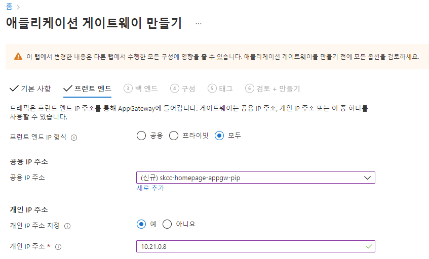

### 3. 백 엔드
#### 백엔드 풀 추가
- 이름 : appgw-homepage-ap1-network-bepool
- 대상 없이 백 엔드 풀 추가 : 아니오
- 백 엔드 대상
  - 대상 유형 : IP 주소 또는 FQDN
  - 대상 : 10.0.1.6
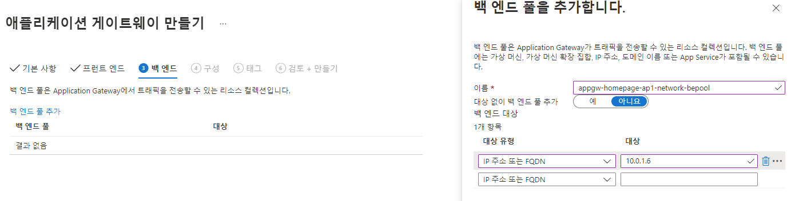  
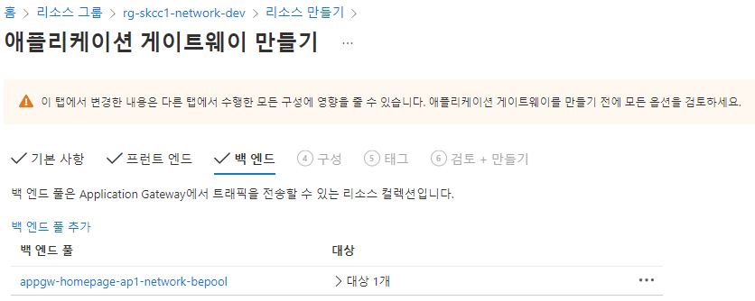  


### 4. 구성  
프런트 엔드 및 백 엔드 풀을 연결  
#### 회람 규칙 추가
- 규칙 이름 : appgw-homepage-pt-lz-prd-rule1-http  
- 수신기
  - 수신기 이름 : www.nodespringboot.org
  - 프런트 엔드 IP : 공용
  - 프로토콜 : HTTP
  - 포트 : 80
- 추가 설정
  - 수신기 유형 : 기본
  - 오류 페이지 URL : 아니오
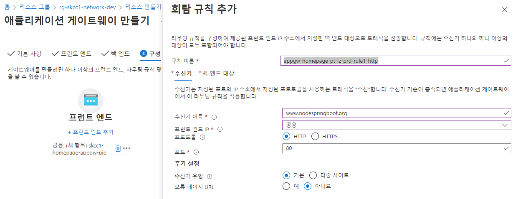

#### 백 엔드 대상 
- 대상 유형 : 백 엔드 풀
- 백 엔드 대상 : 
- HTTP 설정 > 새로 추가 : 
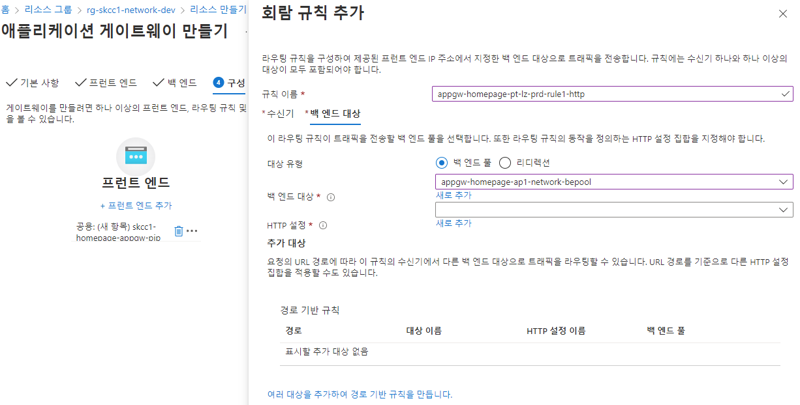  
##### HTTP 설정 추가
- HTTP 설정 이름 : www.nodespringboot.org
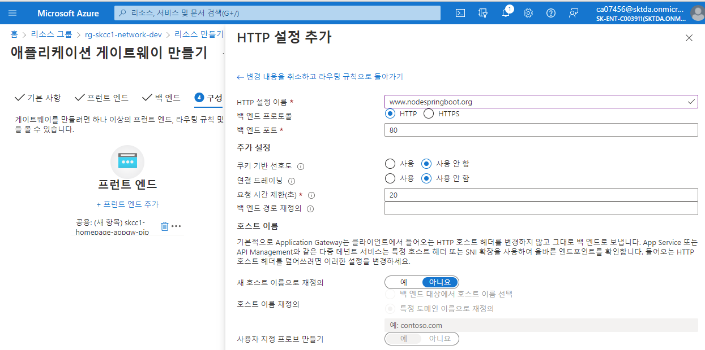
#### 회람 규칙 추가 결과
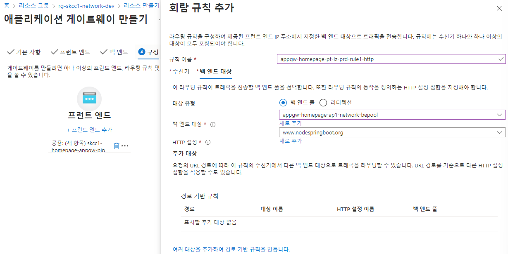 

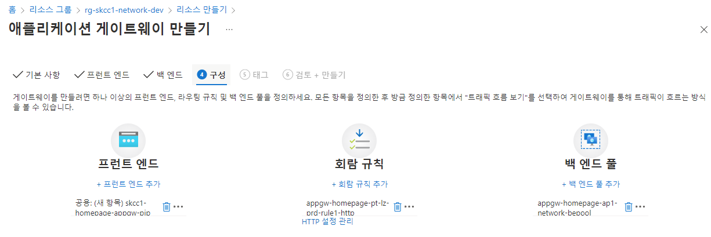


### 태그
### 검토 + 만들기
만드는데 수 분이 소요됨
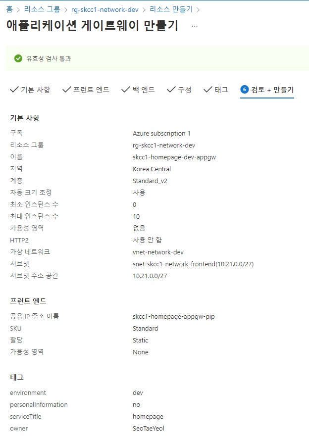  

### 배포된 Application Gateway 확인 및 접속
#### 배포 결과 조회
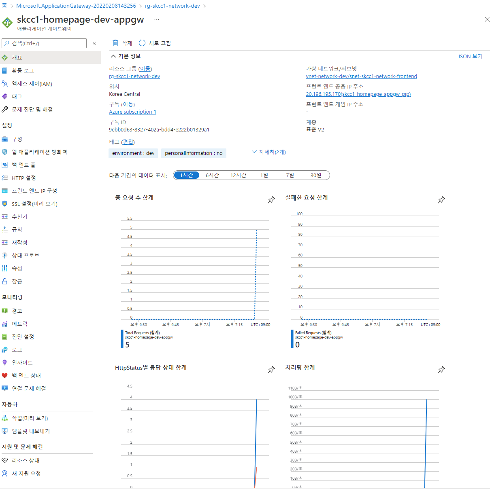  

#### 백엔드 서비스 연결 확인
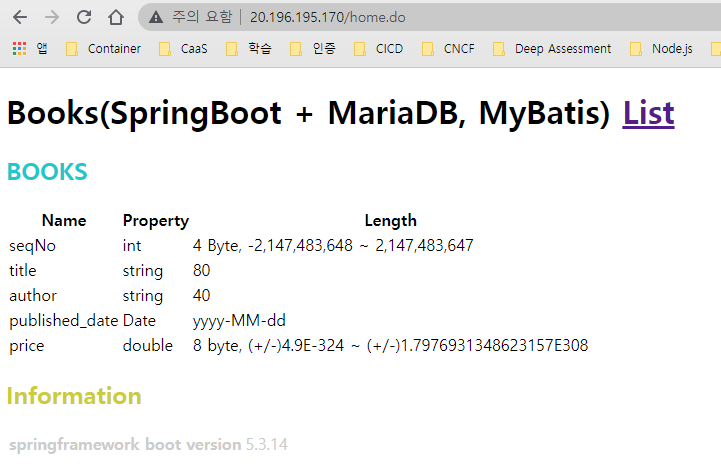


## [PowerShell](https://shell.azure.com)
<a href="https://shell.azure.com">
  
</a>

### 변수 설정
```powershell
$groupName = "rg-skcc1-network-dev"
$locationName = "koreacentral"

# $agName = "Standard_v2" 
# $agTier = "Standard_v2"
# $agCapacity = 2 
$agName = "Standard" 
$agTier = "Standard"
$agCapacity = 1 

$agSubnetName = "snet-skcc1-network-frontend"
$agSubnetPrefix = "10.21.0.0/24"
$bacendSubnetName = "snet-skcc-backend"
$bacendSubnetPrefix = "10.21.1.0/24"

$agVnetName = "vnet-network-dev"
$agVnetPrefix = "10.21.0.0/16"

$agPulicIPName = "skcc1-homepage-appgw-pip"

$agIPConfigName = "ag-ip-cfg"
$agFrontendIPConfigName = "ag-fe-cfg"
$agFrontendPortName = "ag-fe-port"

$agBackendPoolName = "appgw-homepage-ap1-network-bepool"
$agBackendHttpPoolSettingsName = "www.nodespringboot.org" 

$agListenerName = "www.nodespringboot.org"
$agFrontendRule1Name = "appgw-homepage-pt-lz-prd-rule1-http"

$appGatewayName = "skcc1-homepage-dev-appgw"
```

### 리소스 그룹 만들기
```
New-AzResourceGroup -Name $resourceGroup -Location $location
```

### 네트워크 리소스 만들기

#### 1. subnet 만들기
```powershell
$agSubnetConfig = New-AzVirtualNetworkSubnetConfig `
  -Name $agSubnetName `
  -AddressPrefix $agSubnetPrefix
$backendSubnetConfig = New-AzVirtualNetworkSubnetConfig `
  -Name $bacendSubnetName `
  -AddressPrefix $bacendSubnetPrefix
```

#### 2. subnet 구성이 포함된 가상 네트워크 만들기
```powershell
New-AzVirtualNetwork `
  -ResourceGroupName $resourceGroup `
  -Location $location `
  -Name $agVnetName `
  -AddressPrefix $agVnetPrefix `
  -Subnet $agSubnetConfig, $backendSubnetConfig
```

#### 3. 공용 IP 주소 만들기
```
New-AzPublicIpAddress `
  -ResourceGroupName $resourceGroup `
  -Location $location `
  -Name $agPulicIPName `
  -AllocationMethod Static `
  -Sku Standard
```

---

### 애플리케이션 게이트웨이 만들기
#### 1. IP 구성 및 frontend port 만들기

| No | 명령 | 설명 |
|:---|:---|:---|
| 1 | New-AzApplicationGatewayIPConfiguration | 이전에 만든 서브넷과 애플리케이션 게이트웨이를 연결하는 구성을 만듬 |
| 2 | New-AzApplicationGatewayFrontendIPConfig | 애플리케이션 게이트웨이에 대해 이전에 만든 공용 IP 주소를 할당하는 구성 |
| 3 | New-AzApplicationGatewayFrontendPort | 애플리케이션 게이트웨이에 액세스할 포트 80을 할당 |

```powershell
$vnet = Get-AzVirtualNetwork `
  -ResourceGroupName $resourceGroup `
  -Name $agVnetName
$subnet = Get-AzVirtualNetworkSubnetConfig `
  -VirtualNetwork $vnet `
  -Name $agSubnetName
$pip  = Get-AzPublicIPAddress `
  -ResourceGroupName $resourceGroup `
  -Name $agPulicIPName
 
$gipconfig = New-AzApplicationGatewayIPConfiguration `
  -Name $agIPConfigName  `
  -Subnet $subnet
$fipconfig = New-AzApplicationGatewayFrontendIPConfig `
  -Name $agFrontendIPConfigName `
  -PublicIPAddress $pip
$frontendport = New-AzApplicationGatewayFrontendPort `
  -Name $agFrontendPortName `
  -Port 80
```

#### 2. 백 엔드 풀 만들기
| No | 명령 | 설명 |
|:---|:---|:---|
| 1 | New-AzApplicationGatewayBackendAddressPool | 애플리케이션 게이트웨이에 대한 백 엔드 풀을 만듬 |
| 2 | New-AzApplicationGatewayBackendHttpSetting | 백 엔드 풀에 대한 설정을 구성 |

```powershell
$backendPool = New-AzApplicationGatewayBackendAddressPool `
  -Name $agBackendPoolName
$poolSettings = New-AzApplicationGatewayBackendHttpSetting `
  -Name $agBackendHttpPoolSettingsName `
  -Port 80 `
  -Protocol Http `
  -CookieBasedAffinity Enabled `
  -RequestTimeout 30
```

#### 3. 수신기를 만들고 규칙을 추가

| No | 명령 | 설명 |
|:---|:---|:---|
| 1 | New-AzApplicationGatewayHttpListener |  수신기를 만듬 |
| 2 | New-AzApplicationGatewayRequestRoutingRule | 규칙 생성 | 

```powershell
$defaultlistener = New-AzApplicationGatewayHttpListener `
  -Name $agListenerName `
  -Protocol Http `
  -FrontendIPConfiguration $fipconfig `
  -FrontendPort $frontendport
$frontendRule = New-AzApplicationGatewayRequestRoutingRule `
  -Name $agFrontendRule1Name `
  -RuleType Basic `
  -HttpListener $defaultlistener `
  -BackendAddressPool $backendPool `
  -BackendHttpSettings $poolSettings
```

### Application Gateway 만들기
| No | 명령 | 설명 |
|:---|:---|:---|
| 1 | [New-AzApplicationGatewaySku](https://docs.microsoft.com/en-us/powershell/module/az.network/new-azapplicationgatewaysku?view=azps-7.1.0) | 애플리케이션 게이트웨이에 대한 매개 변수를 지정 </b> Capacity : Instance 수 |
| 2 | New-AzApplicationGateway | 애플리케이션 게이트웨이 생성 | 
- v1: 
  - "Standard_Small" : Standard
- v2 : 자동 크기 조정, 고가용성 보장
  - Standard_v2

```powershell
$sku = New-AzApplicationGatewaySku `
  -Name Standard_v2 `
  -Tier Standard_v2 `
  -Capacity 2
New-AzApplicationGateway `
  -Name $appGatewayName `
  -ResourceGroupName $resourceGroup `
  -Location $location `
  -BackendAddressPools $backendPool `
  -BackendHttpSettingsCollection $poolSettings `
  -FrontendIpConfigurations $fipconfig `
  -GatewayIpConfigurations $gipconfig `
  -FrontendPorts $frontendport `
  -HttpListeners $defaultlistener `
  -RequestRoutingRules $frontendRule `
  -Sku $sku
```

### [수행결과](./application-gateway-수행결과.md)  
* 소스 [abnormal-dns-record.ps1](./abnormal-dns-record.ps1)

  
