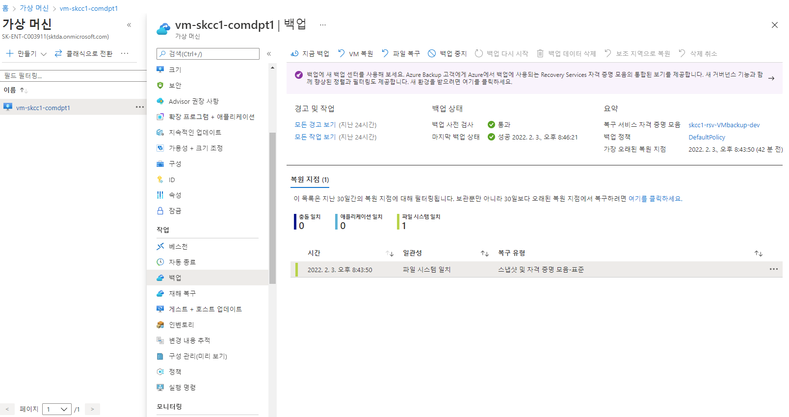

# Azure Backup   
데이터를 백업하고 Microsoft Azure 클라우드에서 복구할 수 있는 간단하고, 안전하며, 비용 효율적인 솔루션을 제공


## Recovery Services 자격 증명 모음
-  Azure VM과 같은 각 보호된 리소스에 대한 백업 데이터를 저장하는 논리 컨테이너
-  보호된 리소스에 대한 백업 작업이 실행될 때 Recovery Services 자격 증명 모음 내에 복구 지점을 만듦
-  이러한 복구 지점 중 하나를 사용하여 지정된 특정 시점으로 데이터를 복원할 수 있음

## 참조
> [Azure에서 가상 머신 백업](https://docs.microsoft.com/ko-kr/azure/backup/quick-backup-vm-portal)  
> [PowerShell을 사용하여 Azure에서 가상 머신 백업](https://docs.microsoft.com/ko-kr/azure/backup/quick-backup-vm-powershell)  
> [Azure CLI를 사용하여 Azure에서 가상 머신 백업](https://docs.microsoft.com/ko-kr/azure/backup/quick-backup-vm-cli)  
> [Azure VM에서 SQL Server 데이터베이스 백업](https://docs.microsoft.com/ko-kr/azure/backup/tutorial-sql-backup)  
> [자습서: Azure VM에서 SAP HANA 데이터베이스 백업](https://docs.microsoft.com/ko-kr/azure/backup/tutorial-backup-sap-hana-db)  
> [PowerShell을 사용하여 Azure Database for MySQL 서버를 백업 및 복원하는 방법](https://docs.microsoft.com/ko-kr/azure/mysql/howto-restore-server-powershell)  


  

## Backup 정책
| 구분 | 주기 | 방법 |
|:---|:---|:---|  
| VM | 일 Backup | Incremental | 
| DB | 일 Backup | Full | 


## Portal
### 홈 > 가상 머신 > vm-skcc1-comdpt1 > 백업
#### Recovery Services 자격 증명 모음 : skcc1-rsv-VMbackup-dev
#### 리소스 그룹 : rg-skcc1-homepage-dev  
#### 백업정책선택 : (신규)DailyPolicy

#### 백업 빈도 : 매일 오후 2:00 UTC
#### 즉시 복원 : 2일 동안 빠른 복구 스냅샷 보존
#### 보존 범위
#### 일일 백업 지점 보존  

  


## [PowerShell](https://shell.azure.com)
<a href="https://shell.azure.com">
  
</a>


### 0. 로그인 및 등록
```powershell
Connect-AzAccount

Register-AzResourceProvider -ProviderNamespace "Microsoft.RecoveryServices"
```

### 1. Recovery Services 자격 증명 모음 생성

```powershell
$groupName = "rg-skcc1-homepage-dev"
$locationName = "koreacentral"
$rsvName = "skcc1-rsv-VMbackup-dev"

New-AzRecoveryServicesVault `
  -ResourceGroupName $groupName `
  -Name $rsvName `
  -Location $locationName
```

### 2. 자격증명모음 컨텍스트 만들기
```powershell
$vault = Get-AzRecoveryServicesVault `
  -ResourceGroupName $groupName `
  -Name $rsvName
Set-AzRecoveryServicesVaultContext `
  -Vault $vault
```
```powershell
Get-AzRecoveryServicesVault `
  -Name $rsvName | Set-AzRecoveryServicesVaultContext
```

### 3. 자격 증명 모음의 스토리지 중복 구성(LRS/GRS)을 변경
```powershell
Get-AzRecoveryServicesVault `
  -Name $rsvName |  `
    Set-AzRecoveryServicesBackupProperty `
      -BackupStorageRedundancy LocallyRedundant
```

---

## Azure VM에 백업 사용(VM 생성 시 혹은 생성 후 작업)
### 기본 정책을 설정
```powershell
$policy = Get-AzRecoveryServicesBackupProtectionPolicy `
  -Name "DefaultPolicy"
```
  

### VM 백업을 사용하도록 설정
```powershell
$vmName='vm-skcc1-comdpt1';
Enable-AzRecoveryServicesBackupProtection `
    -ResourceGroupName $groupName `
    -Name $vmName `
    -Policy $policy
```

---

## 백업 작업 시작
백업은 백업 정책에 지정된 일정에 따라 실행
- 첫 번째 초기 백업 작업에서는 전체 복구 지점이 만들어집니다.
- 초기 백업 후에는 각 백업 작업에서 증분 복구 지점이 만들어집니다.
- 증분 복구 지점은 마지막 백업 이후 변경된 내용만을 전송하기 때문에 스토리지 및 시간 효율적입니다.

### 주문형 백업 작업
- 컨테이너를 지정하고, VM 정보를 가져오고, 백업을 실행
- ContainerType
| 유형 | 값 |
|:--|:--|
| AzureVM | |  
| Windows | |  
| AzureStorage | |  
| AzureVMAppContainer | |  

```powershell
$backupcontainer = Get-AzRecoveryServicesBackupContainer `
    -ContainerType "AzureVM" `
    -FriendlyName "$vmName"

$item = Get-AzRecoveryServicesBackupItem `
    -Container $backupcontainer `
    -WorkloadType "AzureVM"

Backup-AzRecoveryServicesBackupItem -Item $item
```

### 백업 작업 모니터링
```powershell
Get-AzRecoveryservicesBackupJob
```

## [VM 백업 관리](https://docs.microsoft.com/ko-kr/azure/backup/backup-azure-vms-automation#manage-azure-vm-backups)

### 배포 정리
```powershell
Disable-AzRecoveryServicesBackupProtection `
  -Item $item `
  -RemoveRecoveryPoints
$vault = Get-AzRecoveryServicesVault `
  -Name $rsvName
Remove-AzRecoveryServicesVault -Vault $vault
Remove-AzResourceGroup -Name $groupName
```

## Azure CLI
### 1. Recovery Services 자격 증명 모음 생성
```bash
groupName="rg-skcc1-homepage-dev"
locationName="koreacentral"
rsvName="skcc1-rsv-VMbackup-dev"

vmName='vm-skcc1-comdpt1'

az backup vault create \
  --resource-group $groupName \
  --name $rsvName \
  --location $locationName
```

### 2. 스토리지 중복 설정 수정
- default : 지역 중복 스토리지("LocallyRedundant/GeoRedundant")
  - 주 지역에서 수백 마일 떨어져 있는 보조 Azure 지역에 백업 데이터가 복제 보장
- 변경값 : LocallyRedundant
```bash
# 로컬 중복으로 설정
az backup vault backup-properties set \
  --name $rsvName  \
  --resource-group $groupName \
  --backup-storage-redundancy "LocallyRedundant"
```

---

## Azure VM에 백업 사용(VM 생성 시 혹은 생성 후 작업)
### 3. Azure VM 에 백업 사용 
```bash
# VM에 대한 백업 보호 사용을 설정
az backup protection enable-for-vm \
  --resource-group $groupName \
  --vault-name $rsvName \
  --vm $vmName \
  --policy-name DefaultPolicy
```
```bash
az backup protection enable-for-vm \
  --resource-group myResourceGroup \
  --vault-name myRecoveryServicesVault \
  --vm $(az vm show -g $groupName -n $vmName --query id | tr -d '"') \
  --policy-name DefaultPolicy
```

### 4. 바로 백업
- --container-name : "백업할 container 명" 으로 여기서는 vm 명으로 사용함
- --
```bash
az backup protection backup-now \
  --resource-group $groupName \
  --vault-name $rsvName \
  --container-name $vmName \
  --item-name $vmName \
  --backup-management-type AzureIaaSVM \
  --retain-until 15-02-2022

### 5. 백업 작업 모니터링
```bash
az backup job list \
  --resource-group $groupName \
  --vault-name $rsvName \
  --output table
```
```bash
ca07456@Azure:~$ az backup job list \
>   --resource-group $groupName \
>   --vault-name $rsvName \
>   --output table
Name                                  Operation        Status      Item Name         Backup Management Type    Start Time UTC                    Duration
------------------------------------  ---------------  ----------  ----------------  ------------------------  --------------------------------  --------------
0203123e-b97a-4a92-ad2c-684f909609fd  Backup           Failed      vm-skcc1-comdpt1  AzureIaasVM               2022-02-03T11:46:21.279651+00:00  0:00:01.102560
62232e96-dac8-497e-b16c-167625dbf11d  Backup           InProgress  vm-skcc1-comdpt1  AzureIaasVM               2022-02-03T11:43:45.547202+00:00  0:06:41.131802
1913230b-e0a4-4bfe-be26-f5587154259e  ConfigureBackup  Completed   vm-skcc1-comdpt1  AzureIaasVM               2022-02-03T11:19:11.094520+00:00  0:00:30.750201
ca07456@Azure:~$
```