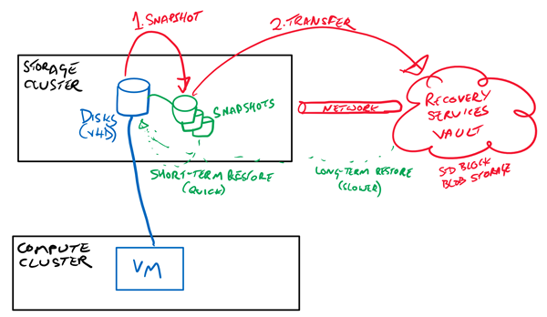
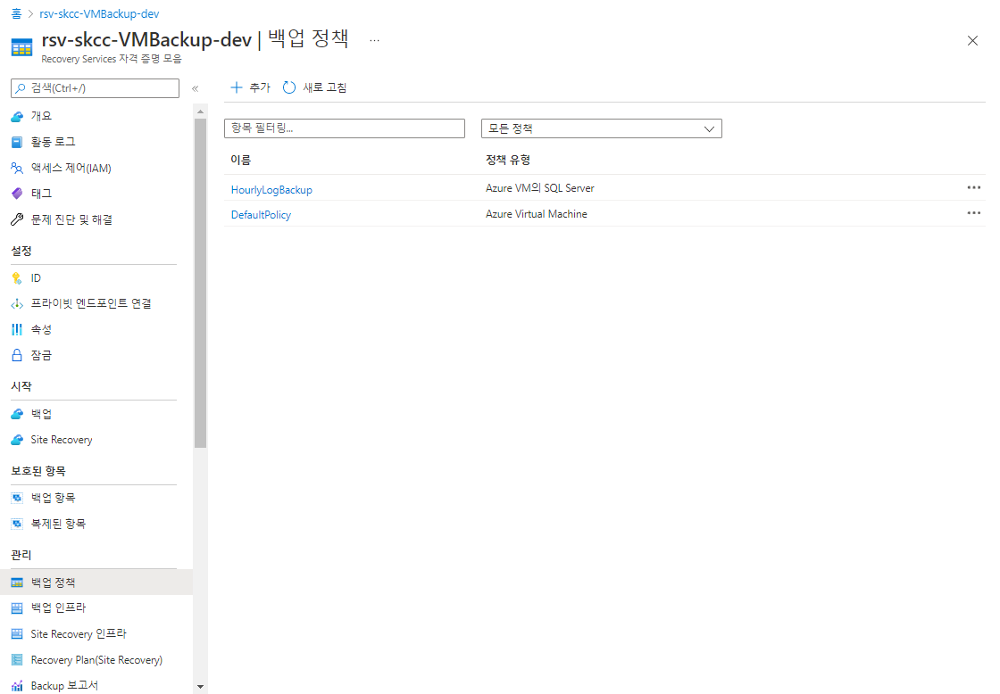

# Azure Backup
데이터를 백업하고 Microsoft Azure 클라우드에서 복구할 수 있는 간단하고, 안전하며, 비용 효율적인 솔루션을 제공

> [PowerShell을 사용하여 Azure에서 가상 머신 백업](https://docs.microsoft.com/ko-kr/azure/backup/quick-backup-vm-powershell)
  
  
> [Azure VM에서 SQL Server 데이터베이스 백업](https://docs.microsoft.com/ko-kr/azure/backup/tutorial-sql-backup)  
> [자습서: Azure VM에서 SAP HANA 데이터베이스 백업](https://docs.microsoft.com/ko-kr/azure/backup/tutorial-backup-sap-hana-db)  
> [PowerShell을 사용하여 Azure Database for MySQL 서버를 백업 및 복원하는 방법](https://docs.microsoft.com/ko-kr/azure/mysql/howto-restore-server-powershell)

## Backup 정책
| 구분 | 주기 | 방법 |
|:---|:---|:---|  
| VM | 일 Backup | Incremental | 
| DB | 일 Backup | Full | 

## Login
- az login 과 Connect-AzAccount 는 각각의 영영을 가지는 것으로 보임
```powershell
Connect-AzAccount
Get-AzSubscription
```

## [PowerShell](https://shell.azure.com)
<a href="https://shell.azure.com">
  
</a>

### Recovery Services 자격 증명 모음 생성

```powershell
New-AzRecoveryServicesVault `
  -ResourceGroupName "rg-skcc-homepage-dev" `
  -Name "rsv-skcc-VMBackup-dev" `
  -Location "koreacentral"
```

### 자격증명모음 컨텍스트 만들기
```powershell
Get-AzRecoveryServicesVault `
  -Name "rsv-skcc-VMBackup-dev" | Set-AzRecoveryServicesVaultContext
```

### 자격 증명 모음의 스토리지 중복 구성(LRS/GRS)을 변경
```powershell
Get-AzRecoveryServicesVault `
  -Name "rsv-skcc-VMBackup-dev" |  `
  Set-AzRecoveryServicesBackupProperty `
    -BackupStorageRedundancy LocallyRedundant
```

## Azure VM에 백업 사용
### 기본 정책을 설정
```powershell
$policy = Get-AzRecoveryServicesBackupProtectionPolicy `
  -Name "DefaultPolicy"
```
  

### VM 백업을 사용하도록 설정
```powershell
$vm='vm-skcc-comdpt1';
Enable-AzRecoveryServicesBackupProtection `
    -ResourceGroupName "rg-skcc-homepage-dev" `
    -Name "$vm" `
    -Policy $policy
```

## 백업 작업 시작
백업은 백업 정책에 지정된 일정에 따라 실행
- 첫 번째 초기 백업 작업에서는 전체 복구 지점이 만들어집니다.
- 초기 백업 후에는 각 백업 작업에서 증분 복구 지점이 만들어집니다.
- 증분 복구 지점은 마지막 백업 이후 변경된 내용만을 전송하기 때문에 스토리지 및 시간 효율적입니다.

### 주문형 백업 작업
- 컨테이너를 지정하고, VM 정보를 가져오고, 백업을 실행
```powershell
$backupcontainer = Get-AzRecoveryServicesBackupContainer `
    -ContainerType "AzureVM" `
    -FriendlyName "myVM"

$item = Get-AzRecoveryServicesBackupItem `
    -Container $backupcontainer `
    -WorkloadType "AzureVM"

Backup-AzRecoveryServicesBackupItem -Item $item
```

## 백업 작업 모니터링
```powershell
Get-AzRecoveryservicesBackupJob
```

## [VM 백업 관리](https://docs.microsoft.com/ko-kr/azure/backup/backup-azure-vms-automation#manage-azure-vm-backups)

## 배포 정리
```powershell
Disable-AzRecoveryServicesBackupProtection -Item $item -RemoveRecoveryPoints
$vault = Get-AzRecoveryServicesVault -Name "myRecoveryServicesVault"
Remove-AzRecoveryServicesVault -Vault $vault
Remove-AzResourceGroup -Name "myResourceGroup"
```