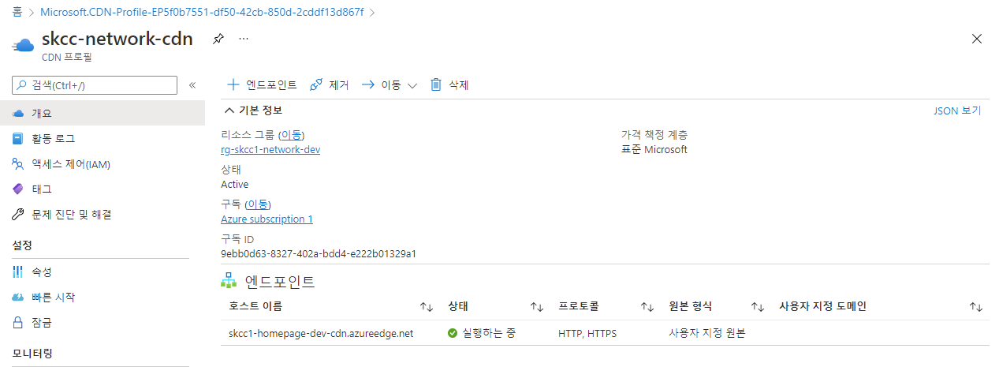
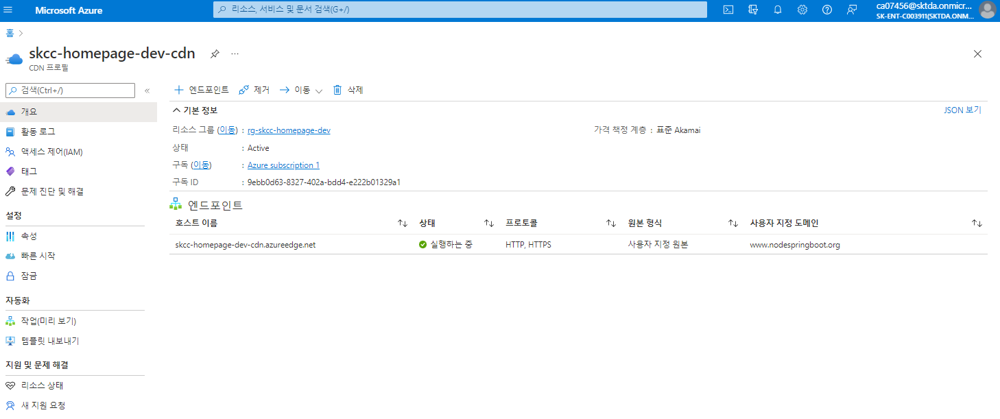

# Azure CDN(Content Delivery Network)  
사용자에게 웹 콘텐츠를 효율적으로 제공할 수 있는 서버의 분산 네트워크

## [Azure CDN 제품 기능 간의 비교는 무엇인가요?](https://docs.microsoft.com/ko-kr/azure/cdn/cdn-features)  

* [New-AzResourceGroupDeployment](https://docs.microsoft.com/en-us/powershell/module/az.resources/new-azresourcegroupdeployment?view=azps-7.1.0)

## 생성절차
1. CDN Profile 생성(New-AzCdnProfile)
2. Endpoint 생성(New-AzCdnEndpoint)
3. DNS 에 www 에 CDN endpoint 등록
4. Custom Domain 생성(New-AzCdnCustomDomain)
   - 기존 엔드포인트에 사용자 지정 도메인 이름을 추가
5. Rule 작성

## Portal
### 홈 > CDN 프로필 > "+만들기"
#### 기본사항
- 리소스그룹 : rg-skcc1-network-dev
##### 프로필 세부 정보
  - 이름: skcc-network-cdn
  - 지역: 전역
  - 가격 책정 정책: 표준 Microsoft
##### 엔드포인트 설정
  - 새 CDN 엔드포이트 만들기
  - CDN 엔트포인트 이름 : skcc1-homepage-dev-cdn
  - 원본 형식: 사용자 지정 원본
  - 원본 호스트 이름 : skcc1web.koreacentral.cloudapp.azure.com

#### 태그
#### 검토+만들기
- Azure CDN 생성시 10 분 걸림
  

## [PowerShell](https://shell.azure.com)
<a href="https://shell.azure.com">
  
</a>

### cmdlet 목록
```powershell
Get-Command -Module Az.Cdn
```

### 도움말 보기
```powershell
Get-Help Get-AzCdnProfile
```

### AzureCDN 환경 설정
- 원본
  - 이름 : origin-homepage-01
  - 원본형식 : "사용자 지정 원본"
  - 원본 호스트 이름 : "skccweb.koreacentral.cloudapp.azure.com"
    - 여기서는 application gateway 이름 
    - 목록에서 원본 호스트 이름을 선택하거나, 사용자 지정 이름을 입력하거나, IP 주소를 입력하세요. CDN은 이 원본에서 콘텐츠를 가져옵니다.
  - 원본 호스트 헤더 : "www.springnode.net"
    - 각 요청과 함께 원본에 보낸 호스트 헤더 값입니다. 이 값을 비워 두면 요청 호스트 이름에 따라 이 값이 결정됩니다. 웹앱, Blob 스토리지 및 클라우드 서비스와 같은 Azure CDN 원본을 사용하려면 이 호스트 헤더 값이 기본적으로 원본 호스트 이름과 일치해야 합니다.
  - HTTP 포트 : 80
  - HTTPS 포트 : 443
  - 우선 순위 : 1
  - 가중치 1000
- 캐시 규칙 : "각 공유난 URL 캐시"
- 지역 필터링 : 설정되지 않음
- 최적화 : "일반 웹 배달"
- 규칙 엔진
  - originHomepageGrp01Rule1
    - if URL 경로
      - 연산자 : "포함" : 
        - "/kor", 
        - "/eng", 
        - "/download"
      - 케이스 변환 : "변환 안 함"
    - 캐시 동작 : "캐시 무시"
  - originHomepageGrp01Rule2
    - if URL 경로
      - 연산자 : "포함" : 
        - ".do" 
      - 케이스 변환 : "변환 안 함"
    - 캐시 동작 : "캐시 무시" 

```powershell
$resourceGroupName="rg-skcc-homepage-dev"
$locationName="Global" # "Central US"
$cdnProfileName="skcc-homepage-dev-cdn"
$cdnSku="Standard_Microsoft" # Standard_Akamai
$originName="origin-homepage-01"
$originHostHeader="www.nodespringboot.org"
$applicationEndPoint="skcchomepage.koreacentral.cloudapp.azure.com" # applicationGateway EndPoint
$originHostName=$applicationEndPoint

$cdnEndPointName="skcc-homepage-dev-cdn" # "www"

$cdnCustomDomainHostName="www.nodespringboot.org"
$cdnCustomDomainName="nodespringboot" # Custom Domain 자원의 이름(자원명)
```

### Azure CDN 프로필 보기
```powershell
Get-AzCdnProfile

# Output the name of all profiles on this subscription.
Get-AzCdnProfile | ForEach-Object { Write-Host $_.Name }

# Return only **Azure CDN from Verizon** profiles.
Get-AzCdnProfile | Where-Object { $_.Sku.Name -eq "Standard_Verizon" }

Get-AzCdnProfile `
  -ProfileName $cdnProfileName `
  -ResourceGroupName $resourceGroupName

# Get a single endpoint.
Get-AzCdnEndpoint `
  -ProfileName $cdnProfileName `
  -ResourceGroupName $resourceGroupName `
  -EndpointName $cdnEndPointName

# Get all of the endpoints on a given profile. 
Get-AzCdnEndpoint `
  -ProfileName $cdnProfileName `
  -ResourceGroupName $resourceGroupName

# Return all of the endpoints on all of the profiles.
Get-AzCdnProfile | Get-AzCdnEndpoint

# Return all of the endpoints in this subscription that are currently running.
Get-AzCdnProfile | Get-AzCdnEndpoint | Where-Object { $_.ResourceState -eq "Running" }
```

### CDN Profile
```powershell
# Create a new profile
New-AzCdnProfile `
  -ProfileName $cdnProfileName `
  -ResourceGroupName $resourceGroupName `
  -Sku $cdnSku `
  -Location $locationName
```

### CDN Endpoint 만들기
CDN 설정 메뉴의 "원본" 에 대한 설정
```powershell
# Create a new endpoint
New-AzCdnEndpoint `
  -ProfileName $cdnProfileName `
  -ResourceGroupName $resourceGroupName `
  -Location $locationName `
  -EndpointName $cdnEndPointName `
  -OriginName $originName `
  -OriginHostHeader $originHostHeader `
  -OriginHostName $originHostName

# Create a new profile and endpoint (same as above) in one line
New-AzCdnProfile `
  -ProfileName $cdnProfileName `
  -ResourceGroupName $resourceGroupName `
  -Sku $cdnSku `
  -Location $locationName | `
    New-AzCdnEndpoint `
      -EndpointName $cdnEndPointName `
      -OriginName $originName `
      -OriginHostName $originHostName
```

### 엔드 포인트 이름 사용 여부 확인
endpoint 작성 전 확인하기
```powershell
# Retrieve availability
$availability = `
  Get-AzCdnEndpointNameAvailability `
    -EndpointName $cdnEndPointName

# If available, write a message to the console.
If ($availability.NameAvailable) { `
  Write-Host "Yes, that endpoint name is available." `
} `
Else { `
  Write-Host "No, that endpoint name is not available." `
}
```

### 사용자 지정 도메인 추가
DNS 에 CNAME 추가해야 함
- 기존 Application Gateway endpoint 에서 CDN endpoint 로 변경
#### Set
```powershell
$Zone = Get-AzDnsZone `
  -ResourceGroupName $resourceGroupName
$RecordSet = `
  Get-AzDnsRecordSet `
    -Name "www" `
    -RecordType CNAME -Zone $Zone
$RecordSet.Records[0].Cname="$cdnEndPointName.azureedge.net"
# $RecordSet.Records[0].Email = "admin.myzone.com"
Set-AzDnsRecordSet -RecordSet $RecordSet
```

- 사용자 지정 도메인 추가
```powershell
# Get an existing endpoint
$endpoint = `
  Get-AzCdnEndpoint `
    -ProfileName $cdnProfileName `
    -ResourceGroupName $resourceGroupName `
    -EndpointName $cdnEndPointName

# Check the mapping
$result = `
  Test-AzCdnCustomDomain `
    -CdnEndpoint $endpoint `
    -CustomDomainHostName $cdnCustomDomainHostName

# Create the custom domain on the endpoint
# -CustomDomainName :자원명 (nodespringboot )
If ($result.CustomDomainValidated) { `
  New-AzCdnCustomDomain `
    -CustomDomainName $cdnCustomDomainName `
    -HostName $cdnCustomDomainHostName `
    -CdnEndpoint $endpoint
}
```

## Endpoint 수정
CDN 설정 메뉴의 "압축" 에 대한 설정
```powershell
# Get an existing endpoint
$endpoint = `
  Get-AzCdnEndpoint `
    -ProfileName $cdnProfileName `
    -ResourceGroupName $resourceGroupName `
    -EndpointName $cdnEndPointName

# Set up content compression
$endpoint.IsCompressionEnabled = $true
$endpoint.ContentTypesToCompress = "text/javascript","text/css","application/json"

# Save the changed endpoint and apply the changes
Set-AzCdnEndpoint -CdnEndpoint $endpoint
```

## CDN 자산 제거/사전 로드
CDN 설정 메뉴의 "캐시 규칙" 에 대한 설정
- Unpublish-AzCdnEndpointContent : 캐시된 자산을 제거
- Publish-AzCdnEndpointContent : 자산을 지원되는 엔드포인트에 사전 로드
```powershell
# Purge some assets.
Unpublish-AzCdnEndpointContent `
  -ProfileName $cdnProfileName `
  -ResourceGroupName $resourceGroupName `
  -EndpointName $cdnEndPointName `
  -PurgeContent "/images/kitten.png","/video/rickroll.mp4"

# Pre-load some assets.
Publish-AzCdnEndpointContent `
  -ProfileName $cdnProfileName `
  -ResourceGroupName $resourceGroupName `
  -EndpointName $cdnEndPointName `
  -LoadContent "/images/kitten.png","/video/rickroll.mp4"

# Purge everything in /images/ on all endpoints.
Get-AzCdnProfile | `
  Get-AzCdnEndpoint | `
    Unpublish-AzCdnEndpointContent `
      -PurgeContent "/images/*"
```

### Rule
- 실제 작동하지는 않음
- 예시 설명 부족으로 추측하여 설정한 코드
```powershell
$cond1 = `
  New-AzCdnDeliveryRuleCondition `
    -MatchVariable UrlPath `
<<<<<<< HEAD
    -Operator Equal -MatchValue ".do"
=======
    -Operator Equal `
    -MatchValue ".do"
>>>>>>> 428a5a4b051e56c857947c26b3b3f2694d5e5ff2

$action1 = New-AzCdnDeliveryRuleAction `
  -CacheBehavior "Ignore"

New-AzCdnDeliveryRule `
  -Name "rule1" `
  -Order 1 `
  -Condition $cond1 `
  -Action $action1
```

### CDN 엔드포인트 시작/중지
- Start-AzCdnEndpoint : 개별 엔드포인트 또는 엔드포인트 그룹 시작
- Stop-AzCdnEndpoint : 개별 엔드포인트 또는 엔드포인트 그룹 중지
```powershell
# Stop the cdndocdemo endpoint
Stop-AzCdnEndpoint -ProfileName CdnDemo -ResourceGroupName CdnDemoRG -EndpointName cdndocdemo

# Stop all endpoints
Get-AzCdnProfile | Get-AzCdnEndpoint | Stop-AzCdnEndpoint

# Start all endpoints
Get-AzCdnProfile | Get-AzCdnEndpoint | Start-AzCdnEndpoint
```

### CDN 리소스 삭제
- DNS 에서 cdn endpoint 가 등록(A or CNAME) 되어 있으면 삭제 or 변경 후 리소스 삭제 가능
#### - 기존 Application Gateway endpoint 로 변경
```powershell
$Zone = Get-AzDnsZone `
  -ResourceGroupName $resourceGroupName
$RecordSet = `
  Get-AzDnsRecordSet `
    -Name "www" `
    -RecordType CNAME -Zone $Zone
$RecordSet.Records[0].Cname="$applicationEndPoint"
# $RecordSet.Records[0].Email = "admin.myzone.com"
Set-AzDnsRecordSet -RecordSet $RecordSet
```

#### CDN Endpoint && Profile 삭제
```powershell
# Remove a single endpoint
Remove-AzCdnEndpoint `
  -ProfileName $cdnProfileName `
  -ResourceGroupName $resourceGroupName `
  -EndpointName $cdnEndPointName

# Remove all the endpoints on a profile and skip confirmation (-Force)
Get-AzCdnProfile `
  -ProfileName $cdnProfileName `
  -ResourceGroupName $resourceGroupName | `
    Get-AzCdnEndpoint | `
      Remove-AzCdnEndpoint -Force

# Remove a single profile
Remove-AzCdnProfile `
  -ProfileName $cdnProfileName `
  -ResourceGroupName $resourceGroupName
```

## ARMTemplate
```json
{
  "$schema": "https://schema.management.azure.com/schemas/2019-04-01/deploymentTemplate.json#",
  "contentVersion": "1.0.0.0",
  "metadata": {
    "_generator": {
      "name": "bicep",
      "version": "0.4.1008.15138",
      "templateHash": "5054081787892083176"
    }
  },
  "parameters": {
    "profileName": {
      "type": "string",
      "metadata": {
        "description": "Name of the CDN Profile"
      }
    },
    "endpointName": {
      "type": "string",
      "metadata": {
        "description": "Name of the CDN Endpoint, must be unique"
      }
    },
    "originUrl": {
      "type": "string",
      "metadata": {
        "description": "Url of the origin"
      }
    },
    "CDNSku": {
      "type": "string",
      "defaultValue": "Standard_Microsoft",
      "allowedValues": [
        "Standard_Akamai",
        "Standard_Microsoft",
        "Standard_Verizon",
        "Premium_Verizon"
      ],
      "metadata": {
        "description": "CDN SKU names"
      }
    },
    "location": {
      "type": "string",
      "defaultValue": "[resourceGroup().location]",
      "metadata": {
        "description": "Location for all resources."
      }
    }
  },
  "functions": [],
  "resources": [
    {
      "type": "Microsoft.Cdn/profiles",
      "apiVersion": "2020-04-15",
      "name": "[parameters('profileName')]",
      "location": "[parameters('location')]",
      "sku": {
        "name": "[parameters('CDNSku')]"
      }
    },
    {
      "type": "Microsoft.Cdn/profiles/endpoints",
      "apiVersion": "2020-04-15",
      "name": "[format('{0}/{1}', parameters('profileName'), parameters('endpointName'))]",
      "location": "[parameters('location')]",
      "properties": {
        "originHostHeader": "[parameters('originUrl')]",
        "isHttpAllowed": true,
        "isHttpsAllowed": true,
        "queryStringCachingBehavior": "IgnoreQueryString",
        "contentTypesToCompress": [
          "application/eot",
          "application/font",
          "application/font-sfnt",
          "application/javascript",
          "application/json",
          "application/opentype",
          "application/otf",
          "application/pkcs7-mime",
          "application/truetype",
          "application/ttf",
          "application/vnd.ms-fontobject",
          "application/xhtml+xml",
          "application/xml",
          "application/xml+rss",
          "application/x-font-opentype",
          "application/x-font-truetype",
          "application/x-font-ttf",
          "application/x-httpd-cgi",
          "application/x-javascript",
          "application/x-mpegurl",
          "application/x-opentype",
          "application/x-otf",
          "application/x-perl",
          "application/x-ttf",
          "font/eot",
          "font/ttf",
          "font/otf",
          "font/opentype",
          "image/svg+xml",
          "text/css",
          "text/csv",
          "text/html",
          "text/javascript",
          "text/js",
          "text/plain",
          "text/richtext",
          "text/tab-separated-values",
          "text/xml",
          "text/x-script",
          "text/x-component",
          "text/x-java-source"
        ],
        "isCompressionEnabled": true,
        "origins": [
          {
            "name": "origin1",
            "properties": {
              "hostName": "[parameters('originUrl')]"
            }
          }
        ]
      },
      "dependsOn": [
        "[resourceId('Microsoft.Cdn/profiles', parameters('profileName'))]"
      ]
    }
  ]
}
```

```powershell
# $location = Read-Host -Prompt "Enter the location (i.e. eastus)"
$locationName = "global"
$resourceGroupName = "rg-skcc-homepage-dev"

$templateUri = "https://raw.githubusercontent.com/Azure/azure-quickstart-templates/master/quickstarts/microsoft.cdn/cdn-with-custom-origin/azuredeploy.json"


# New-AzResourceGroup`
#  -Name $resourceGroupName `
#  -Location $locationName
New-AzResourceGroupDeployment `
  -ResourceGroupName $resourceGroupName `
  -TemplateFile azure-cdn-deploy.json
#  -TemplateUri $templateUri
```
```
$tags = @{
  owner='SeoTaeYeol'
  environment='dev'
  serviceTitle='homepage'
  personalInformation='no'
}
New-AzResourceGroupDeployment `
  -ResourceGroupName $resourceGroupName `
  -TemplateFile azure-cdn-deploy.json `
  -TemplateParameterFile azure-cdn-param.json ` 
  -Tag $tags
```
