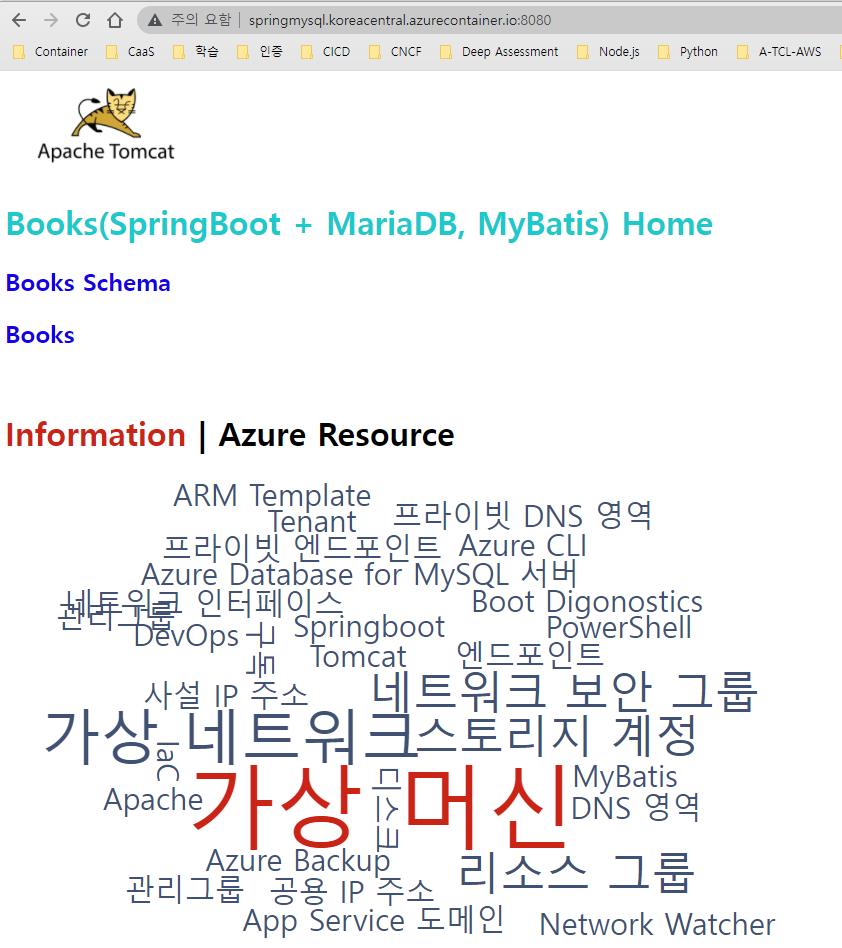

# Azure Container Instance

## Group 생성
```powershell
$groupName = "rg-aci"
$location = "koreacentral"
$containerName = "aci-springmysql"
$acrName = "acrHomeeee"
$loginServer = "acrhomeeee.azurecr.io"
$user = "00000000-0000-0000-0000-000000000000"
$repositoryName="springmysql"
$tag='0.2.1'
$accessToken=az acr login --name $acrName --expose-token | jq .accessToken | %{$_ -replace('"', '')}

az group create `
  --name $groupName `
  --location $location

az acr login -n $acrName

docker login $loginServer -u $login -p "$accessToken" 

az acr repository show-tags -o table -n $acrName --repository ${repositoryName}
```

## 컨테이너 만들기
```powershell
az container create `
  --resource-group $groupName `
  --name $containerName `
  --image acrhomeeee.azurecr.io/springmysql:0.3.1  `
  --dns-name-label $containerName --ports 8080

az container create \
  --name $containerName \
  --resource-group $groupName \
  --image $ACR_LOGIN_SERVER/aci-helloworld:v1 \
  --registry-login-server $ACR_LOGIN_SERVER \
  --registry-username $(az keyvault secret show --vault-name $AKV_NAME -n $ACR_NAME-pull-usr --query value -o tsv) \
  --registry-password $(az keyvault secret show --vault-name $AKV_NAME -n $ACR_NAME-pull-pwd --query value -o tsv) \
  --dns-name-label aci-demo-$RANDOM \
  --query ipAddress.fqdn

# --image mcr.microsoft.com/azuredocs/aci-helloworld `
# --image acrhomeeee.azurecr.io/springmysql:0.3.1 `

```

### 컨테이너 보기
```powershell
az container show `
  --resource-group $groupName `
  --name $containerName `
  --query "{FQDN:ipAddress.fqdn,ProvisioningState:provisioningState}" `
  --out table
```

## 컨테이너 로그 보기
```powershell
az container logs `
  --resource-group $groupName `
  --name $containerName
```

## 출력 스트림 연결
```powershell
az container attach `
  --resource-group $groupName `
  --name $containerName
```

## 리소스 정리
```powershell
az container list `
  --resource-group $groupName `
  --output table

az group delete `
  --name $groupName
```

## 실행 결과
```
PS C:\workspace\AzureBasic> $groupName = "rg-aci"
PS C:\workspace\AzureBasic> $location = "koreacentral"
PS C:\workspace\AzureBasic> $containerName = "aci-springmysql"
PS C:\workspace\AzureBasic> $acrName = "acrHomeeee"
PS C:\workspace\AzureBasic> az group create `
>>   --name $groupName `
>>   --location $location
{
  "id": "/subscriptions/9ebb0d63-8327-402a-bdd4-e222b01329a1/resourceGroups/rg-aci",
  "location": "koreacentral",
  "managedBy": null,
  "name": "rg-aci",
  "properties": {
    "provisioningState": "Succeeded"
  },
  "tags": null,
  "type": "Microsoft.Resources/resourceGroups"
}
PS C:\workspace\AzureBasic> 
PS C:\workspace\AzureBasic> az acr login -n $acrName --expose-token
You can perform manual login using the provided access token below, for example: 'docker login loginServer -u 00000000-0000-0000-0000-000000000000 -p accessToken'
{
  "accessToken": "eyJhbGciOiJSUzI1NiIsInR5cCI6IkpXVCIsImtpZCI6Ikk3QjY6NlQ0QTpUWlYzOllJT046Rk9ESjpOWlRDOjVVUFk6M0JWMzpGRlhPOlE1NEs6M0JCSzpHVFgzIn0.eyJqdGkiOiJjOTAxOGU5My0yNDc4LTQwMDAtOWEzZS0zMjU2ODkzMjQ3MDEiLCJzdWIiOiJjYTA3NDU2QHNrdGRhLm9ubWljcm9zb2Z0LmNvbSIsIm5iZiI6MTY0Nzg0NDE4MywiZXhwIjoxNjQ3ODU1ODgzLCJpYXQiOjE2NDc4NDQxODMsImlzcyI6IkF6dXJlIENvbnRhaW5lciBSZWdpc3RyeSIsImF1ZCI6ImFjcmhvbWVlZWUuYXp1cmVjci5pbyIsInZlcnNpb24iOiIxLjAiLCJyaWQiOiJmYmQ3MmViZGNiNGE0YWI4YjM2N2ZlNjljNGMwZTRlZiIsImdyYW50X3R5cGUiOiJyZWZyZXNoX3Rva2VuIiwiYXBwaWQiOiIwNGIwNzc5NS04ZGRiLTQ2MWEtYmJlZS0wMmY5ZTFiZjdiNDYiLCJ0ZW5hbnQiOiIxNjBiYWNlYS03NzYxLTRjODMtYmZhMC0zNTRmOWIwNDdmNWEiLCJwZXJtaXNzaW9ucyI6eyJBY3Rpb25zIjpbInJlYWQiLCJ3cml0ZSIsImRlbGV0ZSJdLCJOb3RBY3Rpb25zIjpudWxsfSwicm9sZXMiOltdfQ.biPkMwnhXPVxBdzaNGxNgIZv1HDnETRLTdeSw0TnBFNW3BCCDo7BDIlO1-DG2-JovY5wwWOdxDQCubM7JQ0b0V9AKsbkm_l_kkC1NDUBQOUOsFGOrlhey7r2EAwSM92xewWql2fexTi-LiYI73BILB_rHeyYRKbJIH0dfJijglaGjnIQsJuLsE-j_7x2wxWKYq7CukOYXwVttLljPwPmcjQB9DGhFeg5WwybIDU_wRbrz8DS7vI0Az0FU-UsHGPtqs4h99B0VDNdh9TFbt5noqhiCb8WAWcgD2FVgsloYmOq44ayUzqWceaCGCl9D0ZOmfnGS2iYW539cqt6URSAjw",
  "loginServer": "acrhomeeee.azurecr.io"
}
PS C:\workspace\AzureBasic> 


PS C:\workspace\AzureBasic> az container logs `
>>   --resource-group $groupName `
>>   --name $containerName
listening on port 80
::ffff:10.92.0.10 - - [21/Mar/2022:07:17:45 +0000] "GET / HTTP/1.1" 200 1663 "-" "Mozilla/5.0 (Windows NT 10.0; Win64; x64) AppleWebKit/537.36 (KHTML, like Gecko) Chrome/99.0.4844.82 Safari/537.36"
::ffff:10.92.0.11 - - [21/Mar/2022:07:17:46 +0000] "GET /favicon.ico HTTP/1.1" 404 150 "http://aci-springmysql.koreacentral.azurecontainer.io/" "Mozilla/5.0 (Windows NT 10.0; Win64; x64) AppleWebKit/537.36 (KHTML, like Gecko) Chrome/99.0.4844.82 Safari/537.36"
::ffff:10.92.0.11 - - [21/Mar/2022:07:17:46 +0000] "GET / HTTP/1.1" 200 1663 "http://221.145.1.102/" "Mozilla/5.0 (Windows NT 10.0; Win64; x64) AppleWebKit/537.36 (KHTML, like Gecko) Chrome/99.0.4844.82 Safari/537.36"

PS C:\workspace\AzureBasic> az container attach `
>>   --resource-group $groupName `
>>   --name $containerName
Container 'aci-springmysql' is in state 'Running'...

Start streaming logs:
listening on port 80
::ffff:10.92.0.10 - - [21/Mar/2022:07:17:45 +0000] "GET / HTTP/1.1" 200 1663 "-" "Mozilla/5.0 (Windows NT 10.0; Win64; x64) AppleWebKit/537.36 (KHTML, like Gecko) Chrome/99.0.4844.82 Safari/537.36"
::ffff:10.92.0.11 - - [21/Mar/2022:07:17:46 +0000] "GET /favicon.ico HTTP/1.1" 404 150 "http://aci-springmysql.koreacentral.azurecontainer.io/" "Mozilla/5.0 (Windows NT 10.0; Win64; x64) AppleWebKit/537.36 (KHTML, like Gecko) Chrome/99.0.4844.82 Safari/537.36"
::ffff:10.92.0.11 - - [21/Mar/2022:07:17:46 +0000] "GET / HTTP/1.1" 200 1663 "http://221.145.1.102/" "Mozilla/5.0 (Windows NT 10.0; Win64; x64) AppleWebKit/537.36 (KHTML, like Gecko) Chrome/99.0.4844.82 Safari/537.36"

일괄 작업을 끝내시겠습니까 (Y/N)? y
PS C:\workspace\AzureBasic>
PS C:\workspace\AzureBasic> az container list `
>>   --resource-group $groupName `
>>   --output table
Name             ResourceGroup    Status     Image                                       IP:ports           Network    CPU/Memory       OsType    Location
---------------  ---------------  ---------  ------------------------------------------  -----------------  ---------  ---------------  --------  ------------
aci-springmysql  rg-aci           Succeeded  mcr.microsoft.com/azuredocs/aci-helloworld  20.196.238.248:80  Public     1.0 core/1.5 gb  Linux     koreacentral
PS C:\workspace\AzureBasic> 
```

  