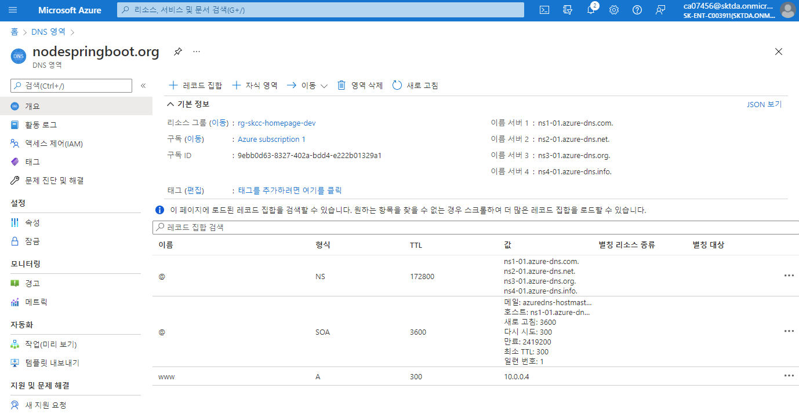
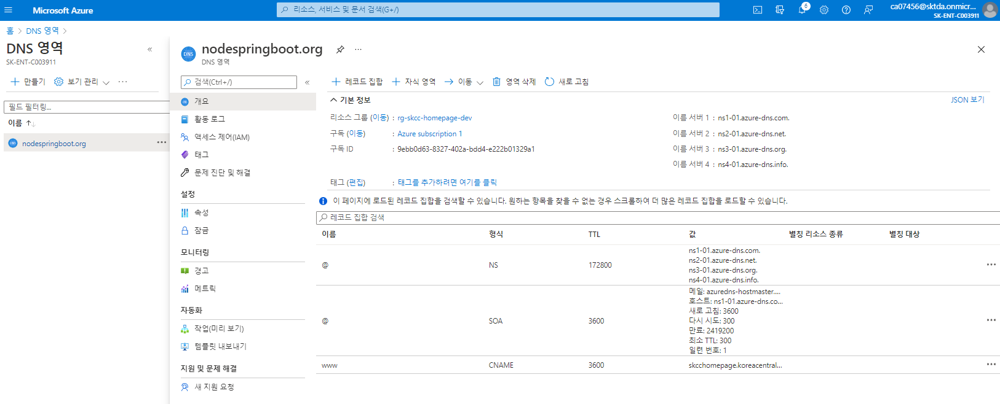

# [Azure DNS](https://docs.microsoft.com/ko-kr/azure/dns/dns-overview)  
Microsoft Azure 인프라를 사용하여 이름 확인을 제공하는 DNS 도메인에 대한 호스팅 서비스


## DNS 영역 만들기
```powershell
New-AzDnsZone -Name nodespringboot.org `
  -ResourceGroupName rg-skcc-homepage-dev
```
```bash
az network dns zone create `
  -g rg-skcc-homepage-dev `
  -n nodespringboot.org
```

## DNS 레코드 만들기
- 레코드 : www
- domain : nodespringboot.org
- TTL : 300
- ipaddress : 20.196.196.53
```powershell
New-AzDnsRecordSet -Name www `
  -RecordType A `
  -ZoneName nodespringboot.org `
  -ResourceGroupName rg-skcc-homepage-dev `
  -Ttl 300 `
  -DnsRecords (New-AzDnsRecordConfig -IPv4Address "20.196.196.53")
```
### CNAME
#### New
```powershell
$Records = @()
$Records += New-AzDnsRecordConfig -Cname www.nodespringboot.org
$RecordSet = New-AzDnsRecordSet -Name "www" -RecordType CNAME -ResourceGroupName "rg-skcc-homepage-dev" -TTL 3600 -ZoneName "nodespringboot.org" -DnsRecords $Records
```
#### Set
```powershell
$Zone = Get-AzDnsZone `
  -ResourceGroupName "rg-skcc-homepage-dev"
$RecordSet = `
  Get-AzDnsRecordSet `
    -Name "www" `
    -RecordType CNAME -Zone $Zone
$RecordSet.Records[0].Cname="skcc-homepage-dev-cdn.azureedge.net"
# $RecordSet.Records[0].Email = "admin.myzone.com"
Set-AzDnsRecordSet -RecordSet $RecordSet
```


### 수행 결과
```powershell
PS C:\workspace\AzureBasic\1.IaaS> New-AzDnsRecordSet -Name www `
>>   -RecordType A `
>>   -ZoneName nodespringboot.org `
>>   -ResourceGroupName rg-skcc-homepage-dev `
>>   -Ttl 300 `
>>   -DnsRecords (New-AzDnsRecordConfig -IPv4Address "20.196.196.53")


Id                : /subscriptions/9ebb0d63-8327-402a-bdd4-e222b01329a1/resourceGroups/rg-skcc-homepage-dev/providers/Microsoft.Network/dnszones/nodespringboot.org/A/www
Name              : www
ZoneName          : nodespringboot.org
ResourceGroupName : rg-skcc-homepage-dev
Ttl               : 300
Etag              : 82cea57a-23c9-4065-abe5-ac753a9eb77a
RecordType        : A
TargetResourceId  : 
Records           : {20.196.196.53}
Metadata          : 
ProvisioningState : Succeeded
```
```powershell
az network dns record-set a add-record `
  -g rg-skcc-homepage-dev `
  -z nodespringboot.org `
  -n www -a 20.196.196.53 # skcc-homepage-dev-cdn.azureedge.net
```
```powershell
az network dns record-set cname create `
  -g MyResourceGroup -z nodespringboot.org -n MyRecordSet `
  --ttl 30 --zone-name nodespringboot.org
  # az network dns record-set cname create --name MyRecordSet --resource-group MyResourceGroup --ttl 30 --zone-name www.mysite.com
```
```
az network dns record-set cname list --resource-group rg-skcc-homepage-dev --zone-name nodespringboot.org -o table       

Name    ResourceGroup         Ttl    Type    Metadata
------  --------------------  -----  ------  ----------
www     rg-skcc-homepage-dev  3600   CNAME
```






## 레코드 보기
```powershell
Get-AzDnsRecordSet -ZoneName nodespringboot.org `
  -ResourceGroupName rg-skcc-homepage-dev `
  -RecordType ns
```
```bash
az network dns record-set list `
  -g rg-skcc-homepage-dev `
  -z nodespringboot.org
```
```powershell
PS C:\workspace\AzureBasic\1.IaaS> nslookup www.nodespringboot.org

Server:  dns.google
Address:  8.8.8.8

Non-authoritative answer:
Name:    www.nodespringboot.org
Address:  20.196.196.53

PS D:\workspace\AzureBasic\1.IaaS> nslookup www.nodespringboot.org

Server:  dns.google
Address:  8.8.8.8

DNS request timed out.
    timeout was 2 seconds.
DNS request timed out.
    timeout was 2 seconds.
Non-authoritative answer:
Name:    skcchomepage.koreacentral.cloudapp.azure.com
Address:  20.196.196.53
Aliases:  www.nodespringboot.org

PS C:\workspace\AzureBasic\1.IaaS> az network dns record-set list -g rg-skcc-homepage-dev -z nodespringboot.org -o table

Fqdn                     Name    ProvisioningState    ResourceGroup         Ttl
-----------------------  ------  -------------------  --------------------  ------
nodespringboot.org.      @       Succeeded            rg-skcc-homepage-dev  172800
nodespringboot.org.      @       Succeeded            rg-skcc-homepage-dev  3600
www.nodespringboot.org.  www     Succeeded            rg-skcc-homepage-dev  3600

PS C:\workspace\AzureBasic\1.IaaS>
```
## 샘플
- [비정상 DNS 레코드 찾기](abnormal-dns-record.ps1)
