# Azure LoadBalancer for springmysql(ACI)  

- ACI 용 LoadBalaner 의 경우 ACI(Azure Container Instance) 를 사설 IP 로 만들어야 함(Public Load Balancer 의 경우 IP 를 사용할 수 없음)


## 부하 분산 장치 정보
| Setting | 세부 정보 | 비고 |    
|:---|:---|:---|  
| Subscription | | |   
| Resorce Group | rg-aci | |  
| 이름 |  plb-std-springmysql-internal-dev1 | public load balancer |  
| Frontend IP conguration | plb-springmysql-dev | IPv4, public IP address |  
| Frontend public ip address | |  
| Backend Pools | plb-std-springmysql-deb-bepool | |  
| inbound rules | plb-springmysql-dev-lb-rule1 | |
| Health probes | health-probe-8080 | HTTP, 8080 |
| outbound rules | plb-springmysql-dev-lb-rule1 | IPv4, 인스턴스당 포트 수, 10664 |

## 만들기
### 1. 기본사항
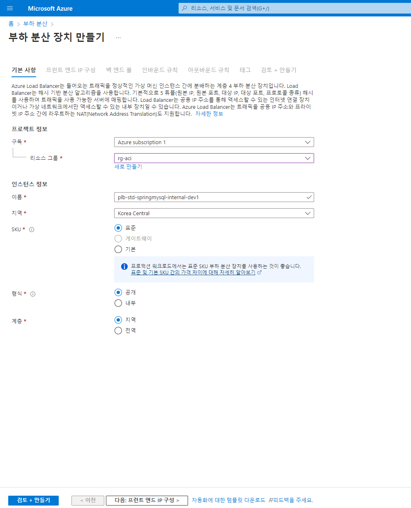  

### 2.  프런트 엔드 IP 구성
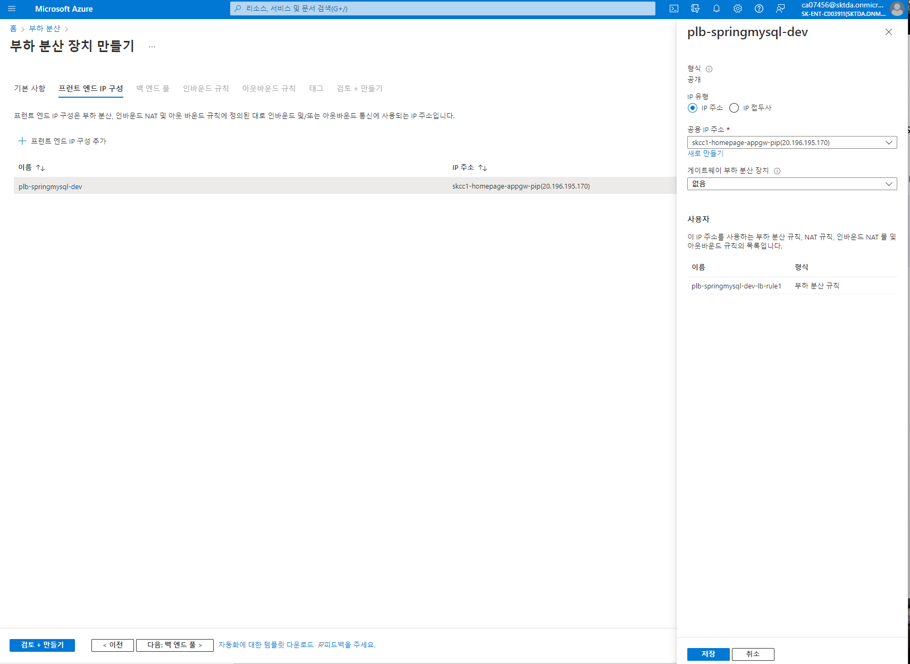  

### 3-1. 백 엔드 풀
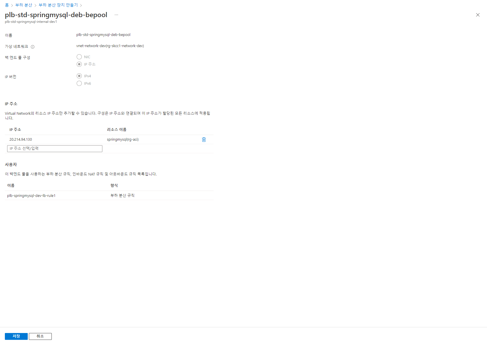  

### 3-2. 백 엔드 풀(plb-std-springmysql-dev-bepool)
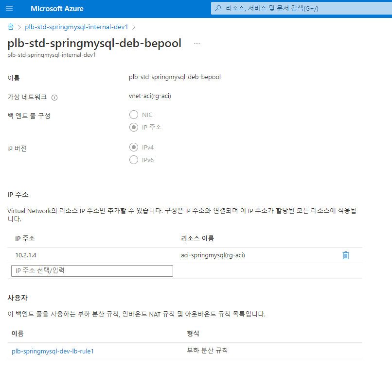  


### 4. 인바운드 규칙
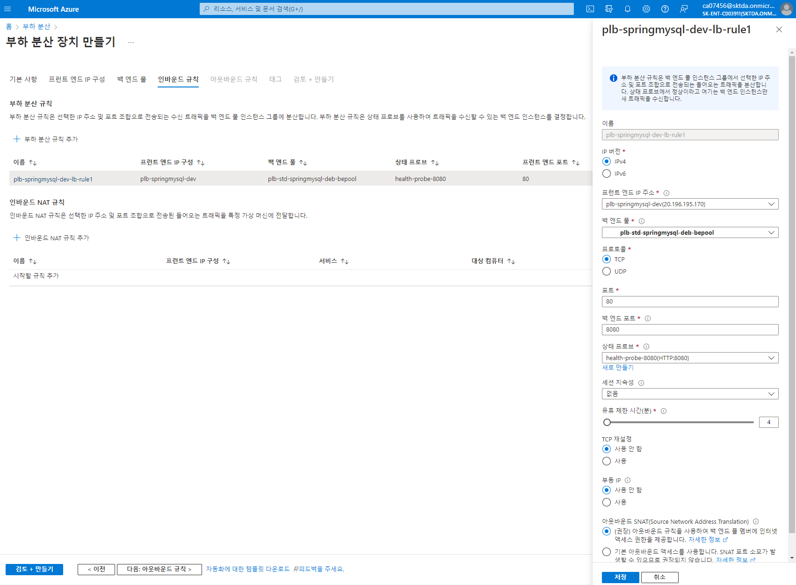  

### 5. 아웃바운드 규칙
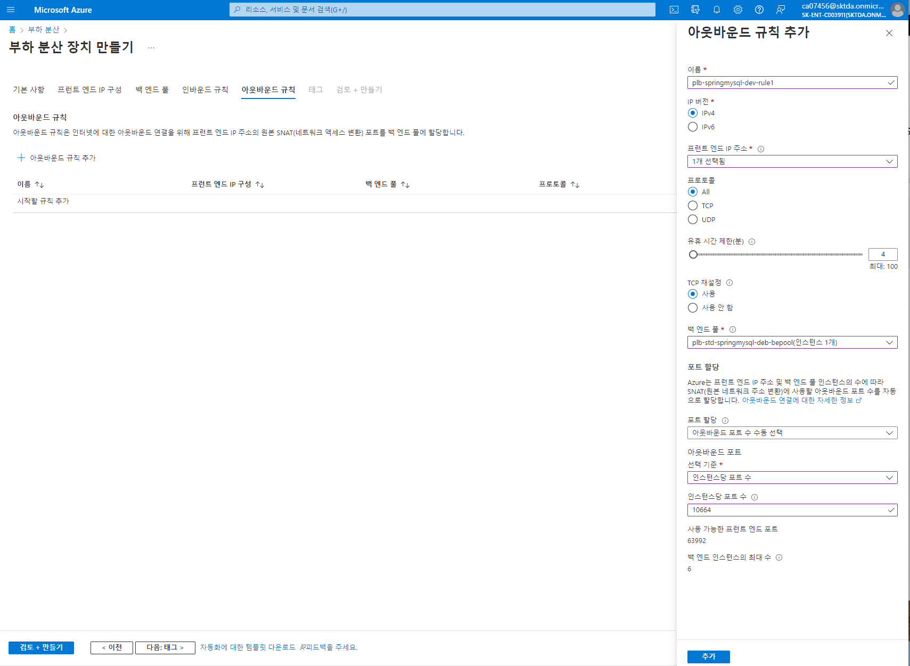  

### 6. 부하 분산 장치 만들기
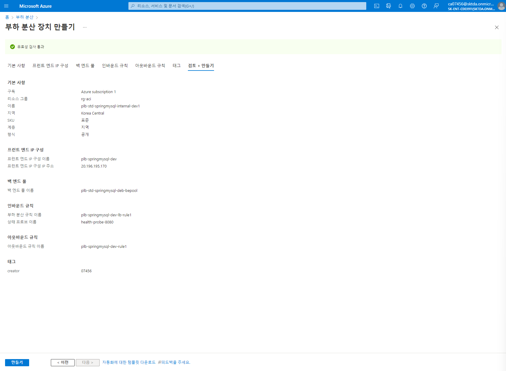  


### 결과
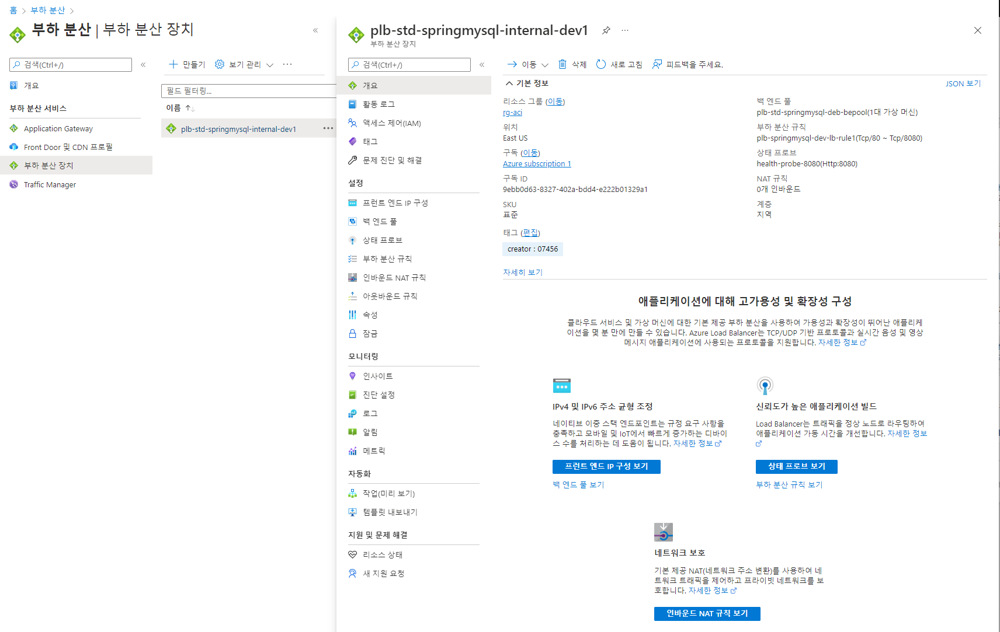  


#### Load Balancer ACI 연결 결과 조회
**Public IP Address 정보**  
  - 52.188.95.105(pip-lb-aci-springmysql)  

**DNS 등록**
- A Record 등록(www) : 52.188.95.105
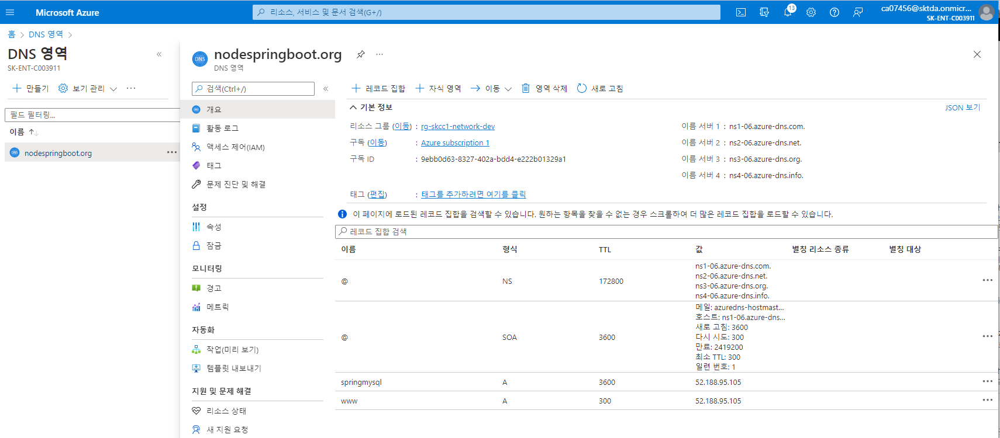

##### **Brower로 보기**
**http://52.188.95.105/**  
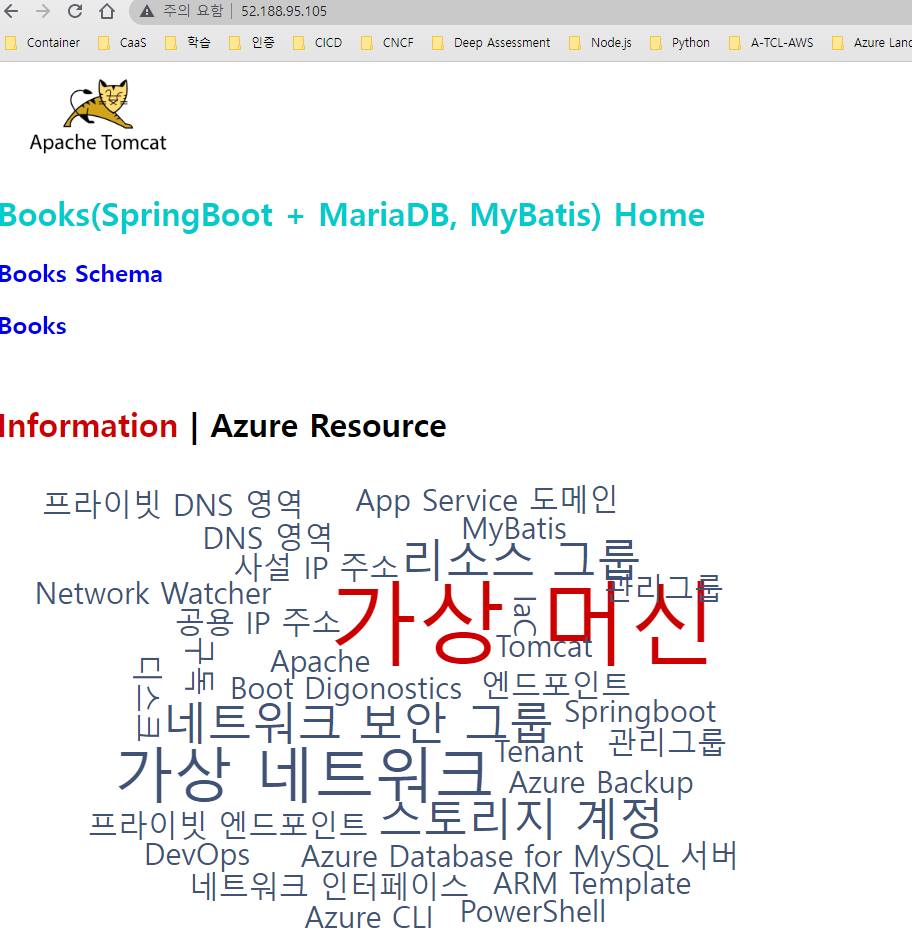  
**springmysql.nodespringboot.org**  
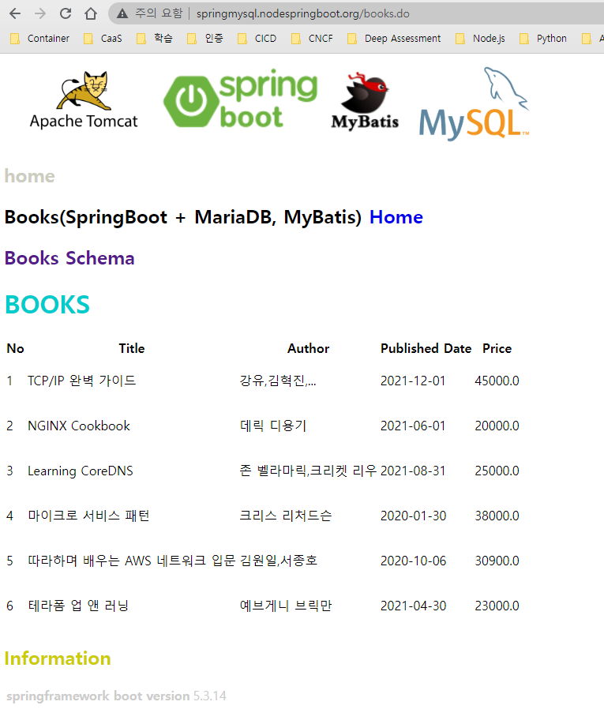  

**curl http://52.188.95.105/**  
```
PS D:\workspace\SpringBootMySQL> az network lb list         
[
  {
    "backendAddressPools": [
      {
        "backendIpConfigurations": null,
        "etag": "W/\"318d189a-3b4c-4797-904c-5aed1dfc3379\"",
        "id": "/subscriptions/9ebb0d63-8327-402a-bdd4-e222b01329a1/resourceGroups/rg-aci/providers/Microsoft.Network/loadBalancers/plb-std-springmysql-internal-dev1/backendAddressPools/plb-std-springmysql-deb-bepool",
        "inboundNatRules": [
          {
            "id": "/subscriptions/9ebb0d63-8327-402a-bdd4-e222b01329a1/resourceGroups/rg-aci/providers/Microsoft.Network/loadBalancers/plb-std-springmysql-internal-dev1/inboundNatRules/plb-inbound-nat-rule1",
            "resourceGroup": "rg-aci"
          }
        ],
        "loadBalancerBackendAddresses": [
          {
            "etag": "W/\"318d189a-3b4c-4797-904c-5aed1dfc3379\"",
            "id": "/subscriptions/9ebb0d63-8327-402a-bdd4-e222b01329a1/resourceGroups/rg-aci/providers/Microsoft.Network/loadBalancers/plb-std-springmysql-internal-dev1/backendAddressPools/plb-std-springmysql-deb-bepool/loadBalancerBackendAddresses/9fc1bb5b-f00a-4a81-9f00-f83c13c819ae",
            "inboundNatRulesPortMapping": [
              {
                "backendPort": 8080,
                "frontendPort": 8080,
                "inboundNatRuleName": "plb-inbound-nat-rule1"
              }
            ],
            "ipAddress": "10.2.1.4",
            "loadBalancerFrontendIpConfiguration": null,
            "name": "9fc1bb5b-f00a-4a81-9f00-f83c13c819ae",
            "networkInterfaceIpConfiguration": null,
            "resourceGroup": "rg-aci",
            "subnet": null,
            "type": "Microsoft.Network/loadBalancers/backendAddressPools/loadBalancerBackendAddresses",
            "virtualNetwork": {
              "id": "/subscriptions/9ebb0d63-8327-402a-bdd4-e222b01329a1/resourceGroups/rg-skcc1-network-dev/providers/Microsoft.Network/virtualNetworks/vnet-network-dev",
              "resourceGroup": "rg-skcc1-network-dev"
            }
          }
        ],
        "loadBalancingRules": [
          {
            "id": "/subscriptions/9ebb0d63-8327-402a-bdd4-e222b01329a1/resourceGroups/rg-aci/providers/Microsoft.Network/loadBalancers/plb-std-springmysql-internal-dev1/loadBalancingRules/plb-springmysql-dev-lb-rule1",
            "resourceGroup": "rg-aci"
          }
        ],
        "location": null,
        "name": "plb-std-springmysql-deb-bepool",
        "outboundRule": null,
        "outboundRules": [
          {
            "id": "/subscriptions/9ebb0d63-8327-402a-bdd4-e222b01329a1/resourceGroups/rg-aci/providers/Microsoft.Network/loadBalancers/plb-std-springmysql-internal-dev1/outboundRules/plb-springmysql-dev-rule1",
            "resourceGroup": "rg-aci"
          }
        ],
        "provisioningState": "Succeeded",
        "resourceGroup": "rg-aci",
        "tunnelInterfaces": null,
        "type": "Microsoft.Network/loadBalancers/backendAddressPools"
      }
    ],
    "etag": "W/\"318d189a-3b4c-4797-904c-5aed1dfc3379\"",
    "extendedLocation": null,
    "frontendIpConfigurations": [
      {
        "etag": "W/\"318d189a-3b4c-4797-904c-5aed1dfc3379\"",
        "gatewayLoadBalancer": null,
        "id": "/subscriptions/9ebb0d63-8327-402a-bdd4-e222b01329a1/resourceGroups/rg-aci/providers/Microsoft.Network/loadBalancers/plb-std-springmysql-internal-dev1/frontendIPConfigurations/plb-springmysql-dev",
        "inboundNatPools": null,
        "inboundNatRules": [
          {
            "id": "/subscriptions/9ebb0d63-8327-402a-bdd4-e222b01329a1/resourceGroups/rg-aci/providers/Microsoft.Network/loadBalancers/plb-std-springmysql-internal-dev1/inboundNatRules/plb-inbound-nat-rule1",
            "resourceGroup": "rg-aci"
          }
        ],
        "loadBalancingRules": [
          {
            "id": "/subscriptions/9ebb0d63-8327-402a-bdd4-e222b01329a1/resourceGroups/rg-aci/providers/Microsoft.Network/loadBalancers/plb-std-springmysql-internal-dev1/loadBalancingRules/plb-springmysql-dev-lb-rule1",
            "resourceGroup": "rg-aci"
          }
        ],
        "name": "plb-springmysql-dev",
        "outboundRules": [
          {
            "id": "/subscriptions/9ebb0d63-8327-402a-bdd4-e222b01329a1/resourceGroups/rg-aci/providers/Microsoft.Network/loadBalancers/plb-std-springmysql-internal-dev1/outboundRules/plb-springmysql-dev-rule1",
            "resourceGroup": "rg-aci"
          }
        ],
        "privateIpAddress": null,
        "privateIpAddressVersion": null,
        "privateIpAllocationMethod": "Dynamic",
        "provisioningState": "Succeeded",
        "publicIpAddress": {
          "ddosSettings": null,
          "deleteOption": null,
          "dnsSettings": null,
          "etag": null,
          "extendedLocation": null,
          "id": "/subscriptions/9ebb0d63-8327-402a-bdd4-e222b01329a1/resourceGroups/rg-skcc1-network-dev/providers/Microsoft.Network/publicIPAddresses/skcc1-homepage-appgw-pip",
          "idleTimeoutInMinutes": null,
          "ipAddress": null,
          "ipConfiguration": null,
          "ipTags": null,
          "linkedPublicIpAddress": null,
          "location": null,
          "migrationPhase": null,
          "name": null,
          "natGateway": null,
          "provisioningState": null,
          "publicIpAddressVersion": null,
          "publicIpAllocationMethod": null,
          "publicIpPrefix": null,
          "resourceGroup": "rg-skcc1-network-dev",
          "resourceGuid": null,
          "servicePublicIpAddress": null,
          "sku": null,
          "tags": null,
          "type": null,
          "zones": null
        },
        "publicIpPrefix": null,
        "resourceGroup": "rg-aci",
        "subnet": null,
        "type": "Microsoft.Network/loadBalancers/frontendIPConfigurations",
        "zones": null
      }
    ],
    "id": "/subscriptions/9ebb0d63-8327-402a-bdd4-e222b01329a1/resourceGroups/rg-aci/providers/Microsoft.Network/loadBalancers/plb-std-springmysql-internal-dev1",
    "inboundNatPools": [],
    "inboundNatRules": [
      {
        "backendAddressPool": {
          "id": "/subscriptions/9ebb0d63-8327-402a-bdd4-e222b01329a1/resourceGroups/rg-aci/providers/Microsoft.Network/loadBalancers/plb-std-springmysql-internal-dev1/backendAddressPools/plb-std-springmysql-deb-bepool",
          "resourceGroup": "rg-aci"
        },
        "backendIpConfiguration": null,
        "backendPort": 8080,
        "enableFloatingIp": false,
        "enableTcpReset": false,
        "etag": "W/\"318d189a-3b4c-4797-904c-5aed1dfc3379\"",
        "frontendIpConfiguration": {
          "id": "/subscriptions/9ebb0d63-8327-402a-bdd4-e222b01329a1/resourceGroups/rg-aci/providers/Microsoft.Network/loadBalancers/plb-std-springmysql-internal-dev1/frontendIPConfigurations/plb-springmysql-dev",
          "resourceGroup": "rg-aci"
        },
        "frontendPort": 0,
        "frontendPortRangeEnd": 8181,
        "frontendPortRangeStart": 8080,
        "id": "/subscriptions/9ebb0d63-8327-402a-bdd4-e222b01329a1/resourceGroups/rg-aci/providers/Microsoft.Network/loadBalancers/plb-std-springmysql-internal-dev1/inboundNatRules/plb-inbound-nat-rule1",
        "idleTimeoutInMinutes": 4,
        "name": "plb-inbound-nat-rule1",
        "protocol": "Tcp",
        "provisioningState": "Succeeded",
        "resourceGroup": "rg-aci",
        "type": "Microsoft.Network/loadBalancers/inboundNatRules"
      }
    ],
    "loadBalancingRules": [
      {
        "backendAddressPool": {
          "id": "/subscriptions/9ebb0d63-8327-402a-bdd4-e222b01329a1/resourceGroups/rg-aci/providers/Microsoft.Network/loadBalancers/plb-std-springmysql-internal-dev1/backendAddressPools/plb-std-springmysql-deb-bepool",
          "resourceGroup": "rg-aci"
        },
        "backendAddressPools": [
          {
            "id": "/subscriptions/9ebb0d63-8327-402a-bdd4-e222b01329a1/resourceGroups/rg-aci/providers/Microsoft.Network/loadBalancers/plb-std-springmysql-internal-dev1/backendAddressPools/plb-std-springmysql-deb-bepool",
            "resourceGroup": "rg-aci"
          }
        ],
        "backendPort": 8080,
        "disableOutboundSnat": true,
        "enableFloatingIp": false,
        "enableTcpReset": false,
        "etag": "W/\"318d189a-3b4c-4797-904c-5aed1dfc3379\"",
        "frontendIpConfiguration": {
          "id": "/subscriptions/9ebb0d63-8327-402a-bdd4-e222b01329a1/resourceGroups/rg-aci/providers/Microsoft.Network/loadBalancers/plb-std-springmysql-internal-dev1/frontendIPConfigurations/plb-springmysql-dev",
          "resourceGroup": "rg-aci"
        },
        "frontendPort": 80,
        "id": "/subscriptions/9ebb0d63-8327-402a-bdd4-e222b01329a1/resourceGroups/rg-aci/providers/Microsoft.Network/loadBalancers/plb-std-springmysql-internal-dev1/loadBalancingRules/plb-springmysql-dev-lb-rule1",
        "idleTimeoutInMinutes": 4,
        "loadDistribution": "Default",
        "name": "plb-springmysql-dev-lb-rule1",
        "probe": {
          "id": "/subscriptions/9ebb0d63-8327-402a-bdd4-e222b01329a1/resourceGroups/rg-aci/providers/Microsoft.Network/loadBalancers/plb-std-springmysql-internal-dev1/probes/health-probe-8080",
          "resourceGroup": "rg-aci"
        },
        "protocol": "Tcp",
        "provisioningState": "Succeeded",
        "resourceGroup": "rg-aci",
        "type": "Microsoft.Network/loadBalancers/loadBalancingRules"
      }
    ],
    "location": "koreacentral",
    "name": "plb-std-springmysql-internal-dev1",
    "outboundRules": [
      {
        "allocatedOutboundPorts": 10664,
        "backendAddressPool": {
          "id": "/subscriptions/9ebb0d63-8327-402a-bdd4-e222b01329a1/resourceGroups/rg-aci/providers/Microsoft.Network/loadBalancers/plb-std-springmysql-internal-dev1/backendAddressPools/plb-std-springmysql-deb-bepool",
          "resourceGroup": "rg-aci"
        },
        "enableTcpReset": true,
        "etag": "W/\"318d189a-3b4c-4797-904c-5aed1dfc3379\"",
        "frontendIpConfigurations": [
          {
            "id": "/subscriptions/9ebb0d63-8327-402a-bdd4-e222b01329a1/resourceGroups/rg-aci/providers/Microsoft.Network/loadBalancers/plb-std-springmysql-internal-dev1/frontendIPConfigurations/plb-springmysql-dev",
            "resourceGroup": "rg-aci"
          }
        ],
        "id": "/subscriptions/9ebb0d63-8327-402a-bdd4-e222b01329a1/resourceGroups/rg-aci/providers/Microsoft.Network/loadBalancers/plb-std-springmysql-internal-dev1/outboundRules/plb-springmysql-dev-rule1",
        "idleTimeoutInMinutes": 4,
        "name": "plb-springmysql-dev-rule1",
        "protocol": "All",
        "provisioningState": "Succeeded",
        "resourceGroup": "rg-aci",
        "type": "Microsoft.Network/loadBalancers/outboundRules"
      }
    ],
    "probes": [
      {
        "etag": "W/\"318d189a-3b4c-4797-904c-5aed1dfc3379\"",
        "id": "/subscriptions/9ebb0d63-8327-402a-bdd4-e222b01329a1/resourceGroups/rg-aci/providers/Microsoft.Network/loadBalancers/plb-std-springmysql-internal-dev1/probes/health-probe-8080",  
        "intervalInSeconds": 5,
        "loadBalancingRules": [
          {
            "id": "/subscriptions/9ebb0d63-8327-402a-bdd4-e222b01329a1/resourceGroups/rg-aci/providers/Microsoft.Network/loadBalancers/plb-std-springmysql-internal-dev1/loadBalancingRules/plb-springmysql-dev-lb-rule1",
            "resourceGroup": "rg-aci"
          }
        ],
        "name": "health-probe-8080",
        "numberOfProbes": 2,
        "port": 8080,
        "protocol": "Http",
        "provisioningState": "Succeeded",
        "requestPath": "/",
        "resourceGroup": "rg-aci",
        "type": "Microsoft.Network/loadBalancers/probes"
      }
    ],
    "provisioningState": "Succeeded",
    "resourceGroup": "rg-aci",
    "resourceGuid": "a6dcb86a-de7f-4e42-955b-2bd452733f08",
    "sku": {
      "name": "Standard",
      "tier": "Regional"
    },
    "tags": {
      "creator": "07456"
    },
    "type": "Microsoft.Network/loadBalancers"
  }
]
PS D:\workspace\SpringBootMySQL> 20.196.195.170(skcc1-homepage-appgw-^C  
PS D:\workspace\SpringBootMySQL> curl http://52.188.95.105/
<html>
<head>
<meta http-equiv="Context-Type" content="text/html" charset="UTF-8" />
<title>MAIN PAGE</title>
<!-- link rel="icon" type="image/x-icon" href="/favicon.ico" -->
<link rel="icon" type="image/x-icon" href="/ico/favicon.ico">
<!--
<script type="text/javascript">
  location.href="/home.do";
</script>
-->
</head>
  
  <H1> <font color="#00cccc">Books(SpringBoot + MariaDB, MyBatis) Home </font></H1>
  <H2> <font color="#00cccc"><a href="/home.do" style="text-decoration:none">Books Schema</a></font></H2>
  <H2> <font color="#00cccc"><a href="/books.do" style="text-decoration:none">Books</a></font></H2>
  <!--
  <table>
  <tr>
  <th>Name</th>
  <th>Property</th>
  <th>Length</th>
  </tr>
  <tr> <td> seqNo </td><td> int </td><td>4 Byte, -2,147,483,648 ~ 2,147,483,647</td> </tr>
  <tr> <td> title </td><td> string </td><td>80</td> </tr>
  <tr> <td> author </td><td> string </td><td>40</td> </tr>
  <tr> <td> published_date </td><td> Date </td><td>yyyy-MM-dd</td></tr>
  <tr> <td> price </td><td> double </td><td>8 byte, (+/-)4.9E-324 ~ (+/-)1.7976931348623157E308</td></tr>
  </table>
  -->
  </br>
  <div class="column">
    <h1> <font color="#cc0000"> Information</font> | Azure Resource </h1>
  </div>
  <script src="https://d3js.org/d3.v3.min.js"></script>
  <script src="https://rawgit.com/jasondavies/d3-cloud/master/build/d3.layout.cloud.js" type="text/JavaScript"></script>
  <script>
    var width = 960,
        height = 500

    var svg = d3.select("body").append("svg")
        .attr("width", width)
        .attr("height", height);
    d3.csv("worddata.csv", function (data) {
        showCloud(data)
        setInterval(function(){
              showCloud(data)
        },2000)
    });
    //scale.linear: 선형적인 스케일로 표준화를 시킨다.
    //domain: 데이터의 범위, 입력 크기
    //range: 표시할 범위, 출력 크기
    //clamp: domain의 범위를 넘어간 값에 대하여 domain의 최대값으로 고정시킨다.
    wordScale = d3.scale.linear().domain([0, 100]).range([0, 150]).clamp(true);
    var keywords = ["CDN 프로필", "애플리케이션 게이트웨이", "가상 머신"]
    width = 800
    var svg = d3.select("svg")
                .append("g")
                .attr("transform", "translate(" + width / 2 + "," + height / 2 + ")")

    function showCloud(data) {
      d3.layout.cloud().size([width, height])
        //클라우드 레이아웃에 데이터 전달
        .words(data)
        .rotate(function (d) {
          return d.text.length > 3 ? 0 : 90;
        })
        //스케일로 각 단어의 크기를 설정
        .fontSize(function (d) {
          return wordScale(d.frequency);
        })
        //클라우드 레이아웃을 초기화 > end이벤트 발생 > 연결된 함수 작동
        .on("end", draw)
        .start();

      function draw(words) {
          var cloud = svg.selectAll("text").data(words)
          //Entering words
          cloud.enter()
            .append("text")
            .style("font-family", "overwatch")
            .style("fill", function (d) {
                return (keywords.indexOf(d.text) > -1 ? "#cc0000" : "#405275");
            })
            .style("fill-opacity", .5)
            .attr("text-anchor", "middle")
            .attr('font-size', 1)
            .text(function (d) {
                return d.text;
            });
          cloud
            .transition()
            .duration(600)
            .style("font-size", function (d) {
                return d.size + "px";
            })
            .attr("transform", function (d) {
                return "translate(" + [d.x, d.y] + ")rotate(" + d.rotate + ")";
            })
            .style("fill-opacity", 1);
      }
    }
  </script>
</body>
</html>
PS D:\workspace\SpringBootMySQL>
```