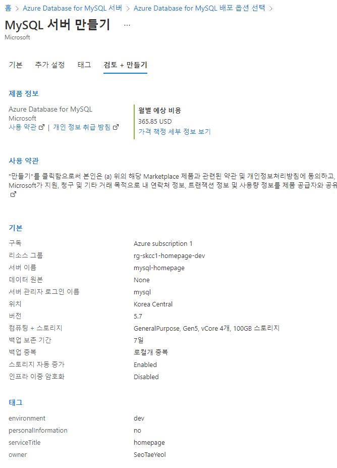
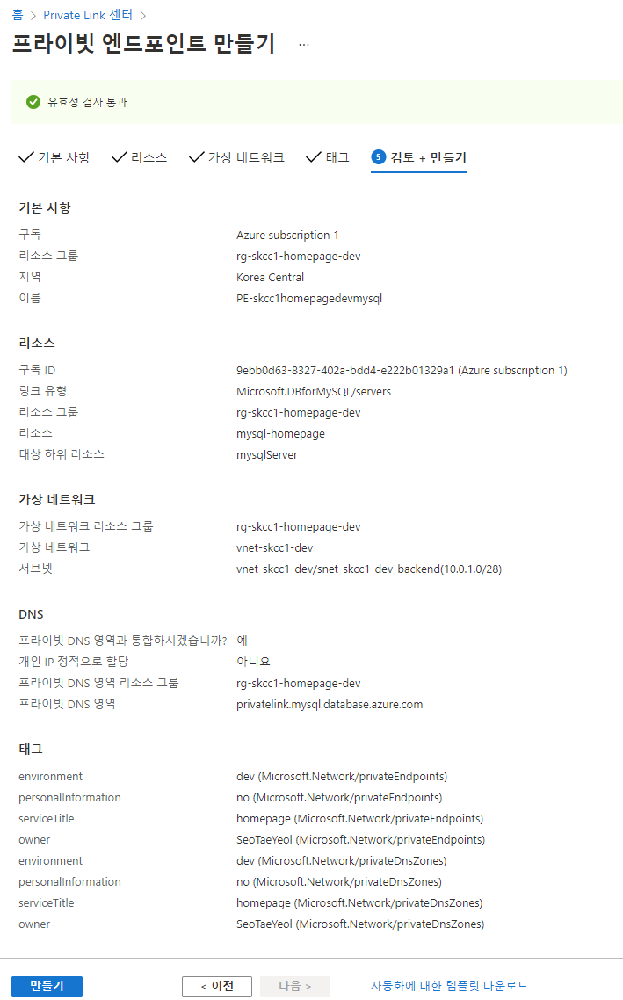
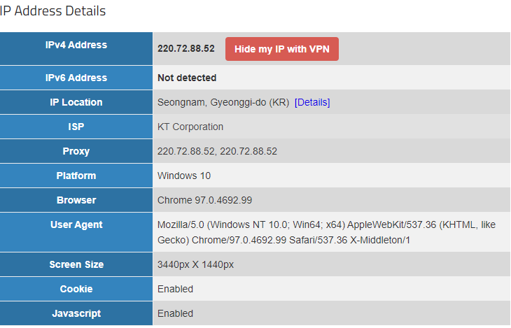
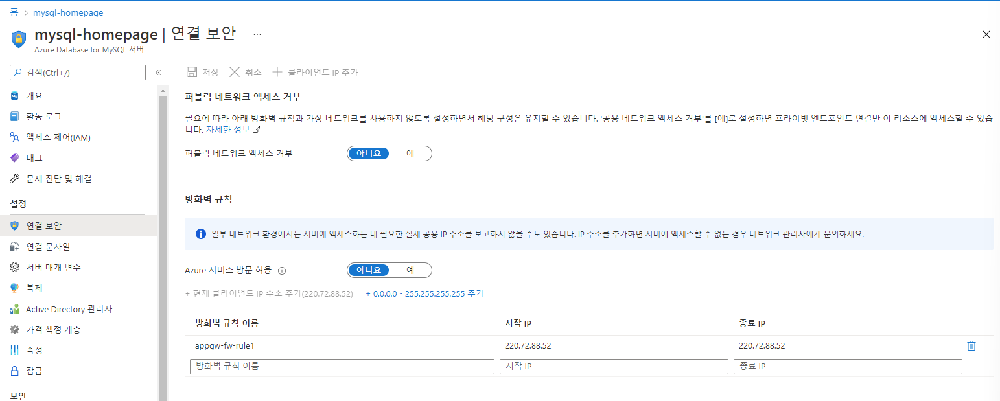
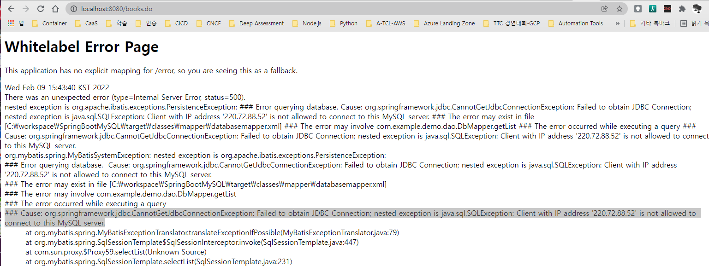
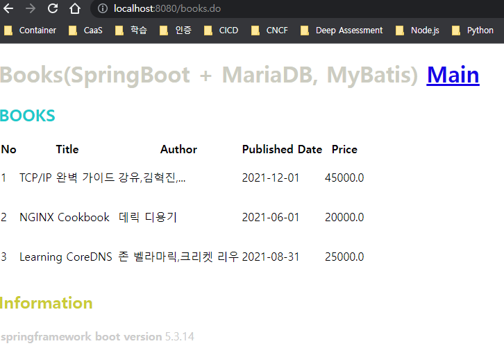
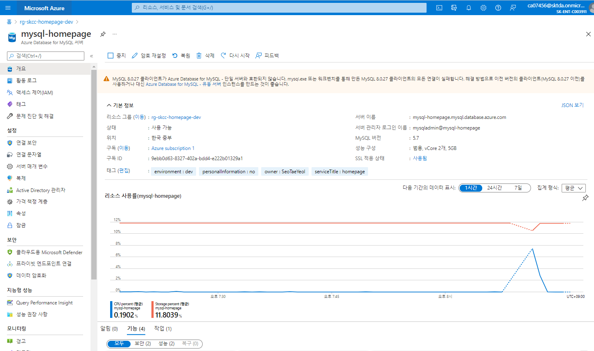

# [Azure MySQL](https://docs.microsoft.com/ko-kr/azure/mysql/overview)

> [Azure Database for MySQL에서 Spring Data JDBC 사용](https://docs.microsoft.com/ko-kr/azure/developer/java/spring-framework/configure-spring-data-jdbc-with-azure-mysql?toc=/azure/mysql/toc.json&bc=/azure/bread/toc.json)  
> [Azure Database for MySQL에 대한 Private Link](https://docs.microsoft.com/ko-kr/azure/mysql/concepts-data-access-security-private-link)  


## Portal 
### 홈 > MySQL 서버 만들기
#### 기본
- 프로젝트 세부 정보
  - 리소스 그룹 : rg-skcc1-homepage-dev
- 서버정보
  - 서버 이름 : mysql-homepage
  - 위치 : Korea Central
  - 버전 : 5.7
- 관리자 계정
  - 관리자 사용자 이름 : mysql
  - 암호 : *******


##### SKU
| SKU | 분류 | 스펙 | 가격/월 | 비고 |  
|:---|:---|:---|:---|:---|
| B_Gen5_1 | 기본 | 5세대, 1 vCore | US$37.96 |사용 가능한 가장 작은 SKU, 단일 서버 </br> **Private Endpoint 생성 불가** | 
| GP_Gen5_2 | 범용 | 5세대, 2 vCore | US$176.37 | |
| GP_Gen5_32 | 범용 | 5세대, 32 vCore | US$2,821.89 | |
| MO_Gen5_2 | 메모리 최적화 | 5세대, 2 vCore | US$207.03 | |
| MO_Gen5_4 | 메모리 최적화 | 5세대, 4 vCore | US$414.06 | |

### 홈 > Private Link 센터 : 프라이빗 엔트포이트 > 프라이빗 엔드포인트 만들기
#### 기본사항
- 프로젝트 정보
  - 리소스 그룹 : rg-skcc1-homepage-dev
- 인스턴스 정보
  - PE-skcchomepagedevmysql
  - 지역 : Korea Central

#### 리소스
- 연결 방법 : 내 디렉토리에서 Azure 리소스에 연결합니다.
- 리소스 종류 : Microsoft.DBforMySQL/servers
- 리소스 : mysql-homepage
- 대상 하위 리소스 : mysqlServer

#### 가상 네트워크
- 네트워킹
  - 가상 네트워크 : vnet-skcc1-dev
  - 서브넷 : vnet-network-dev/snet-skcc1-dev-backend(10.0.1.0/28)
- 프라이빗 DNS 통합
  - 프라이빗 DNS 영역과 통합 : 예
  - 구성이름 : privatelink-mysql-database-azure-com
  - 리소스 그룹 : rg-skcc1-homepage-dev

#### 태그
#### 검토 + 만들기  

  

- 연결 문자열 : jdbc:mysql://mysql-homepage.mysql.database.azure.com:3306/tutorial
- 접속 ID : tutorial@mysql-homepage
- applicaton.properties 에 커넥션 정보 설정(# MySQL)
```
server.port 8080


# MySQL
spring.datasource.driverClassName=com.mysql.cj.jdbc.Driver
spring.datasource.url=jdbc:mysql://mysql-homepage.mysql.database.azure.com:3306/tutorial
spring.datasource.username=tutorial@mysql-homepage
spring.datasource.password=tutorial

# JSP
# JSP 수정시 서버 재시작없이 바로 적용될 수 있게 설정(개발, 테스트 용)
# server.servlet.jsp.init-parameters.development=true
devtools.livereload.enabled=true

spring.mvc.view.prefix=/WEB-INF/jsp/
spring.mvc.view.suffix=.jsp
```

- nslookup 결과
```powershell
PS C:\workspace\AzureBasic> nslookup mysql-homepage.mysql.database.azure.com
서버:    dns.google
Address:  8.8.8.8

권한 없는 응답:
이름:    cr3.koreacentral1-a.control.database.windows.net
Address:  52.231.17.13
Aliases:  mysql-homepage.mysql.database.azure.com
          mysql-homepage.privatelink.mysql.database.azure.com

PS C:\workspace\AzureBasic> nslookup mysql-homepage.privatelink.mysql.database.azure.com
서버:    dns.google
Address:  8.8.8.8

권한 없는 응답:
이름:    cr3.koreacentral1-a.control.database.windows.net
Address:  52.231.17.13
Aliases:  mysql-homepage.privatelink.mysql.database.azure.com

PS C:\workspace\AzureBasic> 
```
```bash
azureuser@vm-skcc1-comdap1:~$ nslookup mysql-homepage.mysql.database.azure.com
Server:         127.0.0.53
Address:        127.0.0.53#53

Non-authoritative answer:
mysql-homepage.mysql.database.azure.com canonical name = mysql-homepage.privatelink.mysql.database.azure.com.
Name:   mysql-homepage.privatelink.mysql.database.azure.com
Address: 10.0.1.5

azureuser@vm-skcc1-comdap1:~$ nslookup mysql-homepage.privatelink.mysql.database.azure.com
Server:         127.0.0.53
Address:        127.0.0.53#53

Non-authoritative answer:
Name:   mysql-homepage.privatelink.mysql.database.azure.com
Address: 10.0.1.5

azureuser@vm-skcc1-comdap1:~$
```

### PC 에서 접속시 IP 확인 후 MySQL IP 등록을 해 주어야 함
#### curl ip.memozee.com/?ipv4
```
PS C:\workspace\AzureBasic> curl ip.memozee.com/?ipv4
220.72.88.52
```
#### http://www.iplocation.net/

#### MySQL 방화벽 등록(mysql-homepage|연결보안)  
"Azure 서비스 방문 허용"  에 추가
  

#### pc 에서 접속 화면
##### DB 접속 오류 화면

##### DB 접속 정상 화면
  


---


## [PowerShell](https://shell.azure.com)
<a href="https://shell.azure.com">
  
</a>

### Az PowerShell
| Database for MySQL | 설명 |
|:---|:---|  
| [New-AzMySqlServer](https://docs.microsoft.com/en-us/powershell/module/az.mysql/new-azmysqlserver?view=azps-7.1.0#examples) | 신규 서버 생성 |    
| [Get-AzMySqlServer](https://docs.microsoft.com/en-us/powershell/module/az.mysql/get-azmysqlserver?view=azps-7.1.0) | 서버 정보 가져오기 |   
| [Update-AzMySqlServer](https://docs.microsoft.com/en-us/powershell/module/az.mysql/update-azmysqlserver?view=azps-7.1.0) | 기존 서버를 업데이트 |
| [Remove-AzMySqlServer](https://docs.microsoft.com/en-us/powershell/module/az.mysql/remove-azmysqlserver?view=azps-7.1.0) | 서버 삭제 | 

## 모듈
```powershell
Install-Module -Name Az.MySql -AllowClobber
```

### 공급자 등록
- Azure Database for MySQL 서비스를 처음 사용하는 경우 Microsoft.DBforMySQL 리소스 공급자를 등록해야 함
```
Register-AzResourceProvider -ProviderNamespace Microsoft.DBforMySQL
```


### Sample
```powershell
Write-Host "구독 선택"
Set-AzContext -SubscriptionId '9ebb0d63-8327-402a-bdd4-e222b01329a1'

Write-Host "구독 확인"
Get-AzContext

Write-Host "MySQL 서버 생성 - 수분소요"
# $Password = Read-Host `
#   -Prompt 'Please enter your password' `
#   -AsSecureString
Write-Host "Convert password to secure string"
$Password = ConvertTo-SecureString 'dlalt!00' -AsPlainText -Force
$tags = @{
  owner='SeoTaeYeol'
  environment='dev'
  serviceTitle='homepage'
  personalInformation='no'
}

Write-Host "- SKU : B_Gen5_1"
Write-Host "- SKU : GP_Gen5_2"
Write-Host "- 최소 스토리지 : 5120"
Write-Host "- 서버백업 지역 중복 사용 여부 : Disabled"
New-AzMySqlServer `
  -Name mysql-homepage-dev `
  -ResourceGroupName rg-skcc-homepage-dev `
  -Sku GP_Gen5_2 `
  -BackupRetentionDay 14 `
  -GeoRedundantBackup Disabled `
  -Location koreacentral `
  -AdministratorUsername mysqladmin `
  -AdministratorLoginPassword $Password `
  -StorageAutogrow Enabled `
  -StorageInMb 5120 `
  -Tag $tags `
  -Version 5.7

# Write-Host "백업 설정"
# Update-AzMySqlServer `
#   -Name mysql-homepage-dev `
#   -ResourceGroupName rg-skcc-homepage-dev `
#   -BackupRetentionDay 14

Write-Host "방화벽 규칙 적용"
New-AzMySqlFirewallRule `
  -Name AllowMyIP `
  -ResourceGroupName rg-skcc-homepage-dev `
  -ServerName mysql-homepage-dev `
  -StartIPAddress 192.168.0.1 `
  -EndIPAddress 192.168.0.1

Write-Host "Azure Database for MySQL 서버에서 SSL을 사용하지 않도록 설정"
Update-AzMySqlServer `
  -Name mysql-homepage `
  -ResourceGroupName rg-skcc-homepage-dev `
  -SslEnforcement Disabled

Write-Host "연결정보 가져오기"
# mysql-homepage.mysql.database.azure.com
Get-AzMySqlServer `
  -Name mysql-homepage `
  -ResourceGroupName rg-skcc-homepage-dev |
  Select-Object `
    -Property FullyQualifiedDomainName, AdministratorLogin
$mysql = Get-AzMySqlServer `
  -Name mysql-homepage `
  -ResourceGroupName rg-skcc-homepage-dev
$mysql.id

Write-Host ""
Get-AzMySqlServer `
  -ResourceGroupName PowershellMySqlTest `
  -ServerName mysql-homepage | `
    Update-AzMySqlServer `
      -BackupRetentionDay 23 `
      -StorageMb 10240
```
```
Remove-AzMySqlServer `
  -ResourceGroupName rg-skcc-homepage-dev `
  -Name mysql-homepage
```

## Azure CLI
### 확장 설치
```
az extension add --name db-up
```

### 생성
```bash
groupName='rg-skcc1-homepage-dev'
locationName='koreacentral'
mysqlName='mysql-homepage'
mysqlSKU='GP_Gen5_2'
# mysqlSKU='B_Gen5_1'
mysqlStorageSize=5120
mysqlAdminUser='mysql'
mysqlAdminPassword='dlatl!00'

startIpAddress='10.0.1.4'
endIpAddress='10.0.1.15'

az mysql server create \
  --resource-group $groupName \
  --name $mysqlName \
  --location $locationName \
  --sku-name GP_Gen5_2 \
  --storage-size $mysqlStorageSize \
  --admin-user $mysqlAdminUser \
  --admin-password $mysqlAdminPassword \
  | jq

## 방화벽
az mysql server firewall-rule create \
  --resource-group $groupName \
  --server $mysqlName \
  --name AllowMyIP \
  --start-ip-address $startIpAddress \
  --end-ip-address $endIpAddress

## 연결정보 가져오기
az mysql server show \
  --resource-group $groupName \
  --name $mysqlName
```
### private endpoint 만들기
```bash
az network private-endpoint create \  
    --name pe-mysql-homepage \  
    --resource-group rg-skcc-homepage-dev \  
    --vnet-name vnet-skcc-dev  \  
    --subnet snet-skcc-dev-frontend \  
    --private-connection-resource-id $(az resource show -g rg-skcc-homepage-dev -n mysql --resource-type "Microsoft.DBforMySQL/servers" --query "id" -o tsv) \    
    --group-id mysqlServer \  
    --connection-name myConnection  
```

## 운영 명령
### 리소스 정리
```
az mysql down --delete-group
```
```
az mysql down
```

### MySQL 접속
```
 mysql -h mydemoserver.mysql.database.azure.com -u myadmin@mydemoserver -p
```

## 생성로그
```powershell
PS D:\workspace\AzureBasic> $Password = ConvertTo-SecureString 'dlalt!00' -AsPlainText -Force

PS D:\workspace\AzureBasic> $tags = @{
>>   owner='SeoTaeYeol'
>>   environment='dev'
>>   serviceTitle='homepage'
>>   personalInformation='no'
>> }

PS D:\workspace\AzureBasic> New-AzMySqlServer `
>>   -Name mysql-homepage-dev `
>>   -ResourceGroupName rg-skcc-homepage-dev `
>>   -Sku GP_Gen5_2 `
>>   -BackupRetentionDay 14 `
>>   -GeoRedundantBackup Disabled `
>>   -Location koreacentral `
>>   -AdministratorUsername mysqladmin `
>>   -AdministratorLoginPassword $Password `
>>   -StorageAutogrow Enabled `
>>   -StorageInMb 5120 `
>>   -Tag $tags `
>>   -Version 5.7


Name           Location     AdministratorLogin Version SkuName   SkuTier        SslEnforcement
----           --------     ------------------ ------- -------   -------        --------------
mysql-homepage koreacentral mysqladmin         5.7     GP_Gen5_2 GeneralPurpose Enabled

PS D:\workspace\AzureBasic>
```

