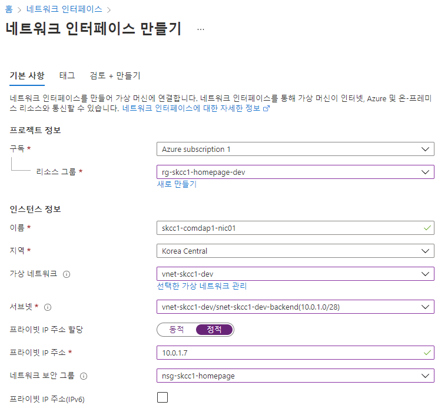

# Azure NIC
Azure Virtual Machine이 인터넷, Azure 및 온-프레미스 리소스와 통신할 때 사용

| 항목 | 내용 |  
|:---|:---|  
| 리소스 그룹 | rg-skcc1-homepage-dev |  
| 이름 | skcc1-comdpt1-nic01 |  
| 지역 | korea Central |  
| 가상 네트워크 | vnet-skcc1-dev |  
| subnet | snet-skcc1-dev-frontend |  
| 프라이빗 IP 주소 할당 | 정적 |  
| 프라이빗 IP 주소 | 10.0.0.7 |  
| 네트워크 보안 그룹 | nsg-skcc1-homepage |  

| 항목 | 내용 |  
|:---|:---|  
| 리소스 그룹 | rg-skcc1-homepage-dev |  
| 이름 | skcc1-comdap1-nic01 |  
| 지역 | korea Central |  
| 가상 네트워크 | vnet-skcc1-dev |  
| subnet | snet-skcc1-dev-backend |  
| 프라이빗 IP 주소 할당 | 정적 |  
| 프라이빗 IP 주소 | 10.0.1.7 |  
| 네트워크 보안 그룹 | nsg-skcc1-homepage |  

## Portal
### "홈" > "네트워크 인터페이스" > "+ 만들기"
  
  
## [PowerShell](https://shell.azure.com)
<a href="https://shell.azure.com">
  
</a>

```powershell
$groupName = "rg-skcc1-homepage-dev"
$locationName = "koreacentral"
$zone=1

$vnetName = "vnet-skcc1-dev"
$subnetFrontendName = 'snet-skcc1-dev-frontend'

$nsgName = 'nsg-skcc1-homepage' 

$pipName = 'skcc1-comdpt1-nic01'
$nicName = 'skcc1-comdpt1-nic01'

$tags = @{
  owner='SeoTaeYeol'
  environment='dev'
  serviceTitle='homepage'
  personalInformation='no'
}
```


```powershell
# vnet 정보 가져오기
# $vnet = Get-AzVirtualNetwork |?{$_.Name -eq $vnetName }
$vnet = Get-AzVirtualNetwork -Name $vnetName

# subnet 정보 가져오기
$frontEndSubnet = $vnet.Subnets|?{$_.Name -eq $subnetFrontendName }

# NSG 정보 가져오기
$nsg = Get-AzNetworkSecurityGroup `
  -Name $nsgName `
  -ResourceGroupName $groupName

$pip = Get-AzPublicIpAddress `
  -Name $pipName `
  -ResourceGroupName $groupName

$nic = New-AzNetworkInterface `
  -ResourceGroupName $groupName `
  -Name $nicName `
  -Location $locationName `
  -SubnetId $frontEndSubnet.Id `
  -PublicIpAddressId $pip.Id `
  -NetworkSecurityGroupId $nsg.Id
```

## Azure CLI
```bash
#!/bin/bash

groupName="rg-skcc1-homepage-dev"
locationName="koreacentral"
zone=1

vnetName="vnet-skcc1-dev"
subnetFrontendName='snet-skcc1-dev-frontend'

nsgName='nsg-skcc1-homepage' 

pipName='pip-skcc1-comdpt1'
nicName='nic-skcc1-comdpt1'

tags='owner=SeoTaeYeol environment=dev serviceTitle=homepage personalInformation=no'

az network nic create \
  --resource-group $groupName \
  --name $nicName \
  --vnet-name $vnetName \
  --subnet $subnetFrontendName \
  --network-security-group $nsgName \
  --public-ip-address $pipName \
  --tags $tags

az network nic list \
  --resource-group $groupName
```