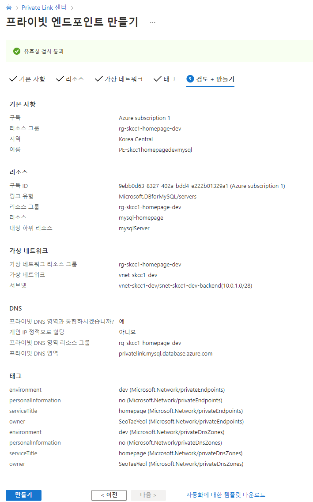

# [Azure Private Endpoint(프라이빗 엔드포인트)](https://docs.microsoft.com/ko-kr/azure/private-link/private-endpoint-overview)  
- 가상 네트워크의 개인 IP 주소를 사용 하는 네트워크 인터페이스(NIC)
- 네트워크 인터페이스는 개인적이고 안전하게 Azure 개인 링크를 통해 제공 되는 서비스에 연결


### Azure Private Endpoint 를 사용하는 Azure 서비스들
- Azure Storage
- Azure Cosmos DB
- Azure SQL Database
- ...

## Azure Private Link(프라이빗 링크)
- Private Link는 이 Private Endpoint의 네트워크 인터페이스를 통해서 Azure PaaS 서비스에 연동할수 있으며 표준 로드발란서를 사용해서 실행 되는 서비스를 연동하기 위한 서비스
- Private Link 서비스가 다수의 PaaS 나 다수의 VM들에 연동될수 있게 해주는 서비스


* [New-AzPrivateLinkServiceConnection](https://docs.microsoft.com/ko-kr/powershell/module/az.network/New-AzPrivateLinkServiceConnection?view=azps-7.1.0)
* [New-AzPrivateEndpoint](https://docs.microsoft.com/ko-kr/powershell/module/az.network/new-azprivateendpoint?view=azps-7.1.0)

* [빠른 시작: Azure PowerShell을 사용하여 Azure Private Endpoint 만들기](https://docs.microsoft.com/ko-kr/azure/private-link/create-private-endpoint-powershell)   
* [CLI를 사용하여 Azure Database for MySQL의 프라이빗 링크 만들기 및 관리](https://docs.microsoft.com/ko-kr/azure/mysql/howto-configure-privatelink-cli)

## Portal
### 홈 > Private Link 센터 : 프라이빗 엔트포이트 > 프라이빗 엔드포인트 만들기
#### 기본사항
- 프로젝트 정보
  - 리소스 그룹 : rg-skcc1-homepage-dev
- 인스턴스 정보
  - PE-skcchomepagedevmysql
  - 지역 : Korea Central

#### 리소스
- 연결 방법 : 내 디렉토리에서 Azure 리소스에 연결합니다.
- 리소스 종류 : Microsoft.DBforMySQL/servers
- 리소스 : mysql-homepage
- 대상 하위 리소스 : mysqlServer

#### 가상 네트워크
- 네트워킹
  - 가상 네트워크 : vnet-skcc1-dev
  - 서브넷 : vnet-network-dev/snet-skcc1-dev-backend(10.0.1.0/28)
- 프라이빗 DNS 통합
  - 프라이빗 DNS 영역과 통합 : 예
  - 구성이름 : privatelink-mysql-database-azure-com
  - 리소스 그룹 : rg-skcc1-homepage-dev
#### 검토 + 만들기  

  

## [PowerShell](https://shell.azure.com)
<a href="https://shell.azure.com">
  
</a>

```powershell
$location = "koreacentral"
$vnetName = "vnet-skcc-dev"
$resourceGroupName = "rg-skcc-homepage-dev"
$subnetName = "snet-skcc-dev-backend"
$privateEndPointName = "pe-skcc1homepagedevmysql"
$subscriptionId = "9ebb0d63-8327-402a-bdd4-e222b01329a1"


$virtualNetwork = Get-AzVirtualNetwork `
  -ResourceName $vnetName `
  -ResourceGroupName $resourceGroupName

$subnet = $virtualNetwork | `
  Select-Object -ExpandProperty subnets | `
    Where-Object Name -eq $subnetName

Write-Host "## "
$mysql = Get-AzMySqlServer `
  -Name mysql-homepage `
  -ResourceGroupName rg-skcc-homepage-dev
$mysql.id

Write-Host "## Create private endpoint connection##"
$parameters1 = @{
    Name = $privateEndPointName
    PrivateLinkServiceId = $mysql.ID
    GroupID = 'mysqlServer'
    # RequestMessage 'Please Approve my request'
}
$privateEndpointConnection = New-AzPrivateLinkServiceConnection @parameters1

Write-Host "## Place virtual network into variable. ##"
$vnet = Get-AzVirtualNetwork `
  -ResourceGroupName $resourceGroupName `
  -Name $vnetName

Write-Host "## Disable private endpoint network policy ##"
$vnet.Subnets[0].PrivateEndpointNetworkPolicies = "Disabled"
$vnet | Set-AzVirtualNetwork

Write-Host "## Create private endpoint"
$tags = @{
  owner='SeoTaeYeol'
  environment='dev'
  serviceTitle='homepage'
  personalInformation='no'
}

New-AzPrivateEndpoint `
  -Name $privateEndPointName `
  -ResourceGroup $resourceGroupName `
  -Location $location `
  -PrivateLinkServiceConnection $privateEndpointConnection  `
  -Subnet $subnet `
  -Tag $tags
```

### 실행결과
#### Basic 서버에서 Private Endpoint 가 안됨
```powershell
PS D:\workspace\AzureBasic> New-AzPrivateEndpoint `
>>   -Name $privateEndPointName `
>>   -ResourceGroup $resourceGroupName `
>>   -Location $location `
>>   -PrivateLinkServiceConnection $privateEndpointConnection  `
>>   -Subnet $subnet

New-AzPrivateEndpoint: Operation returned an invalid status code 'BadRequest'
StatusCode: 400
ReasonPhrase: Bad Request
ErrorCode: UnsupportedServerSku
ErrorMessage: Call to Microsoft.DBforMySQL/servers failed. Error message: Private endpoint is not supported for Basic Servers  
```

#### Private Endpoint 생성 로그
```powershell
PS D:\workspace\AzureBasic> Write-Host "## Create private endpoint"

## Create private endpoint
PS D:\workspace\AzureBasic> New-AzPrivateEndpoint `
>>   -Name $privateEndPointName `
>>   -ResourceGroup $resourceGroupName `
>>   -Location $location `
>>   -PrivateLinkServiceConnection $privateEndpointConnection  `
>>   -Subnet $subnet


Name                                : pe-skccdevhomepagemysql
Type                                : Microsoft.Network/privateEndpoints
Location                            : koreacentral
ResourceGroupName                   : rg-skcc-homepage-dev
ProvisioningState                   : Succeeded
Etag                                : W/"f9bc2b0a-14d6-47f2-bfc6-d8c344bcb01c"
Id                                  : /subscriptions/9ebb0d63-8327-402a-bdd4-e222b01329a1/resourceGroups/rg-skcc-homepage-dev/provid 
                                      ers/Microsoft.Network/privateEndpoints/pe-skccdevhomepagemysql
Subnet                              : {
                                        "Id": "/subscriptions/9ebb0d63-8327-402a-bdd4-e222b01329a1/resourceGroups/rg-skcc-homepage-d 
                                      ev/providers/Microsoft.Network/virtualNetworks/vnet-skcc-dev/subnets/snet-skcc-dev-frontend",  
                                        "IpAllocations": []
                                      }
NetworkInterfaces                   : [
                                        {
                                          "Id": "/subscriptions/9ebb0d63-8327-402a-bdd4-e222b01329a1/resourceGroups/rg-skcc-homepage 
                                      -dev/providers/Microsoft.Network/networkInterfaces/pe-skccdevhomepagemysql.nic.4968bbfe-e883-4 
                                      592-b0f0-8524b5fe31cc"
                                        }
                                      ]
PrivateLinkServiceConnections       : [
                                        {
                                          "ProvisioningState": "Succeeded",
                                          "PrivateLinkServiceId": "/subscriptions/9ebb0d63-8327-402a-bdd4-e222b01329a1/resourceGroup 
                                      s/rg-skcc-homepage-dev/providers/Microsoft.DBforMySQL/servers/mysql-homepage",
                                          "GroupIds": [
                                            "mysqlServer"
                                          ],
                                          "PrivateLinkServiceConnectionState": {
                                            "Status": "Approved",
                                            "Description": "Auto-approved",
                                            "ActionRequired": "None"
                                          },
                                          "Name": "pe-skccdevhomepagemysql",
                                          "Etag": "W/\"f9bc2b0a-14d6-47f2-bfc6-d8c344bcb01c\"",
                                          "Id": "/subscriptions/9ebb0d63-8327-402a-bdd4-e222b01329a1/resourceGroups/rg-skcc-homepage 
                                      -dev/providers/Microsoft.Network/privateEndpoints/pe-skccdevhomepagemysql/privateLinkServiceCo 
                                      nnections/pe-skccdevhomepagemysql"
                                        }
                                      ]
ManualPrivateLinkServiceConnections : []
CustomDnsConfigs                    : [
                                        {
                                          "Fqdn": "mysql-homepage.mysql.database.azure.com",
                                          "IpAddresses": [
                                            "10.0.0.5"
                                          ]
                                        }
                                      ]
ExtendedLocation                    : null


```

#### Private Endpoint 삭제 로그
```
PS D:\workspace\AzureBasic> Remove-AzPrivateEndpoint -Name $privateEndPointName -ResourceGroup $resourceGroupName

Confirm
Are you sure you want to remove resource 'pe-skccdevhomepagemysql'
[Y] Yes [N] No [S] Suspend [?] Help (default is "Yes"): Y
PS D:\workspace\AzureBasic> 
```
