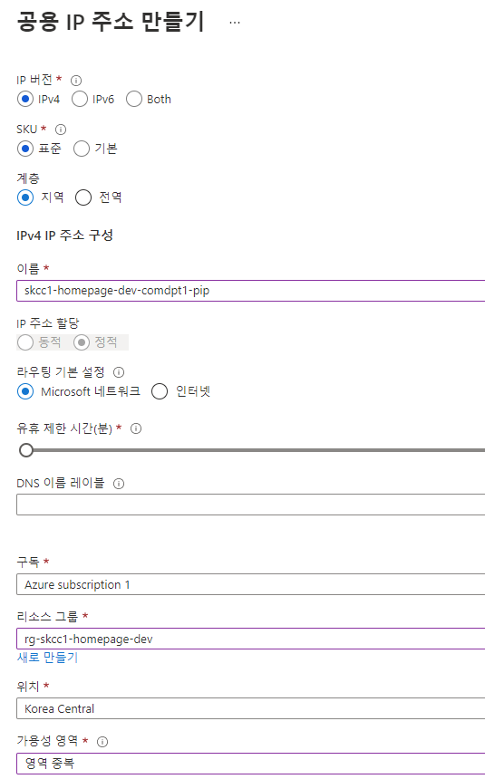
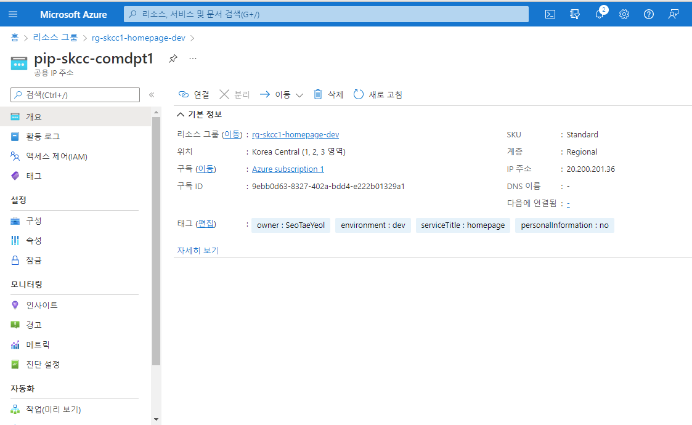

# Azure Public IP Address
- 인터넷 리소스가 Azure 리소스에 대한 인바운드 통신을 할 수 있음
- Public IP Address 리소스를 연결할 수 있는 일부 리소스
  - Virtual machine network interfaces
  - Virtual machine scale sets
  - Public Load Balancers
  - Virtual Network Gateways (VPN/ER)
  - NAT gateways
  - Application Gateways
  - Azure Firewall
  - Bastion Host


### 홈 > "공용 IP 주소" > "+ 만들기"


## [PowerShell](https://shell.azure.com)
<a href="https://shell.azure.com">
  
</a>

### PowerShell 명령어
* [New-AzPublicIpAddress](https://docs.microsoft.com/en-us/powershell/module/az.network/new-azpublicipaddress?view=azps-7.1.0)
* [Get-AzPublicIpAddress](https://docs.microsoft.com/en-us/powershell/module/az.network/get-azpublicipaddress?view=azps-7.1.0)
* [Set-AzPublicIpAddress](https://docs.microsoft.com/en-us/powershell/module/az.network/set-azpublicipaddress?view=azps-7.1.0)

### Create IP tag for Internet and Routing Preference.
```powershell

## 변수 선언
$groupName = "rg-skcc1-network"
$locationName = "koreacentral"

$agVnetName = "vnet-skcc1-network"
$agVnetPrefix = "10.21.0.0/16"

$agPulicIPName = "pip-ag"
$agDomainNameLabel = "skcchomepage"
$customFqdn = "skcchomepage.koreacentral.cloudapp.azure.com"
 

$tag = @{
    IpTagType = 'RoutingPreference'
    Tag = 'Internet'   
}
$ipTag = New-AzPublicIpTag @tag

## Create IP. ##
New-AzPublicIpAddress `
  -ResourceGroupName $groupName `
  -Location $locationName `
  -Name $agPulicIPName `
  -AllocationMethod Static `
  -Sku Standard

$pipName = "pip-ag"
$agDomainNameLabel = "skcchomepage"
$customFqdn = "skcchomepage.koreacentral.cloudapp.azure.com"

$tags = @{
  owner='SeoTaeYeol'
  environment='dev'
  serviceTitle='homepage'
  personalInformation='no'
}

$ip = @{
    Name = $pipName
    ResourceGroupName = $groupName
    Location = $locationName
    Sku = 'Standard'
    AllocationMethod = 'Static'
    IpAddressVersion = 'IPv4'
    IpTag = $ipTag
    Zone = 1,2,3   
    Tag = $tags
}
New-AzPublicIpAddress @ip

# Add DNS domain label of a public IP address
$publicIp = Get-AzPublicIpAddress `
  -Name $agPulicIPName `
  -ResourceGroupName $resourceGroup
$publicIp.DnsSettings = @{"DomainNameLabel" = $agDomainNameLabel}
Set-AzPublicIpAddress -PublicIpAddress $publicIp
$publicIp = Get-AzPublicIpAddress `
  -Name $pipName `
  -ResourceGroupName $groupName
```



## Azure CLI
```bash
#!/bin/bash

groupName="rg-skcc1-homepage-dev"
pipName='pip-skcc1-comdpt1'

tags='owner=SeoTaeYeol environment=dev serviceTitle=homepage personalInformation=no'

az network public-ip create \
  --resource-group $groupName \
  --name $pipName \
  --version IPv4 \
  --sku Standard \
  --zone 1 2 3 \
  --tags

az network public-ip delete \
  --resource-group $groupName \
  --name $pipName

az network public-ip list \
  --resource-group $groupName \
  -o table
```
