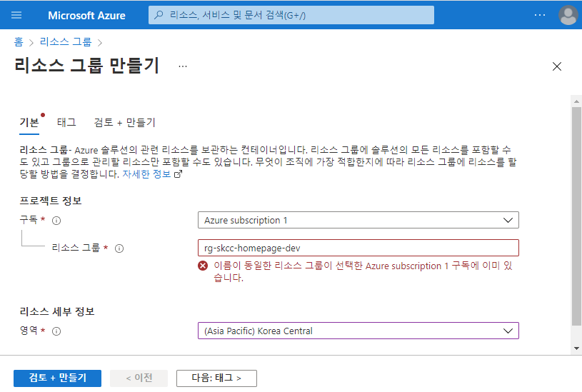
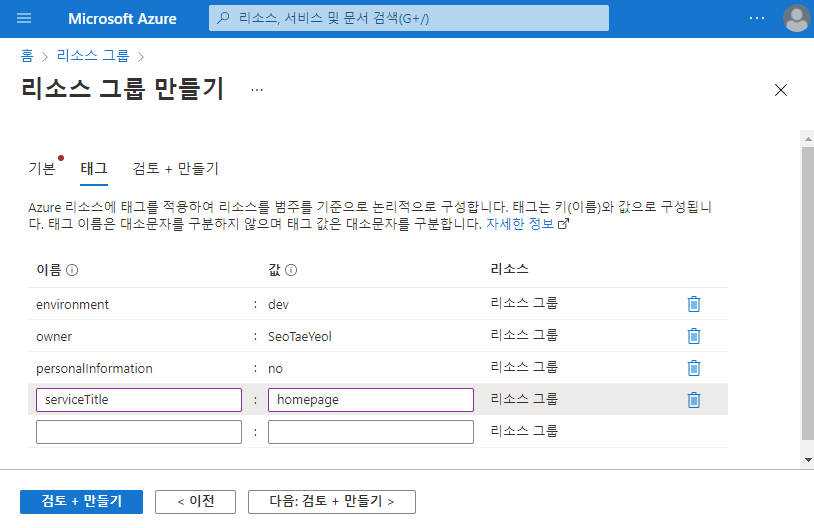
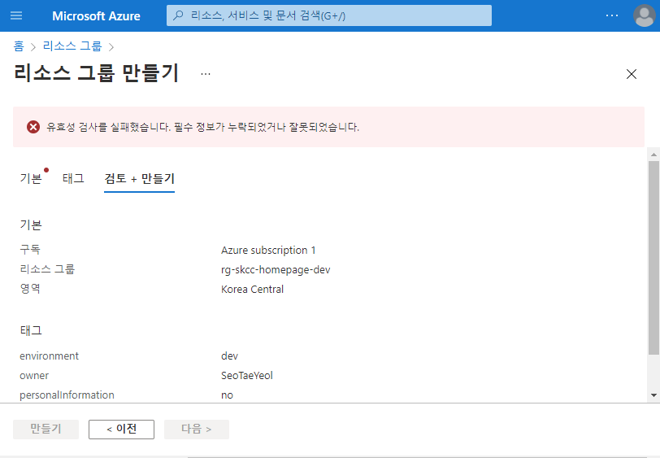
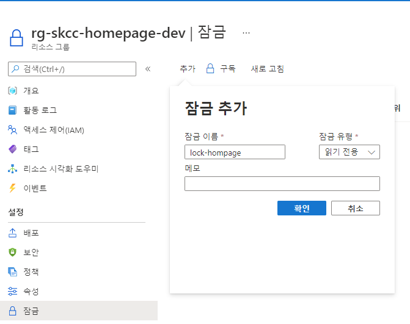

# Azure Resource Group

|구분| 내용 |  
|:---|:---|  
| 그룹 명칭 | rg-skcchomepage-dev |  
| 태그 | owner='SeoTaeYeol' </br> environment='dev' </br>    serviceTitle='homepage' </br> personalInformation='no' |
| 잠금 | rock-homepage |

## Portal
자원그룹 > "+ 만들기" > 
  
  
  
  

---

## [PowerShell](https://shell.azure.com)
<a href="https://shell.azure.com">
  
</a>  

[New-AzResourceGroup](https://docs.microsoft.com/ko-kr/powershell/module/az.resources/new-azresourcegroup?view=azps-7.1.0)  
```powershell
$groupName='rg-skcc-homepage-dev'
$locationName='koreacentral'
$tags = @{
  owner='SeoTaeYeol'
  environment='dev'
  serviceTitle='homepage'
  personalInformation='no'
}

$rg = @{
    Name = $groupName
    Location = $locationName
    Tag=$tags
}
New-AzResourceGroup @rg

Write-Host "리소스 그룹 잠금"
New-AzResourceLock `
  -LockName LockGroup `
  -LockLevel CanNotDelete `
  -ResourceGroupName $groupName

Write-Host "리소스 그룹 잠금 확인"
Get-AzResourceLock `
  -ResourceGroupName $groupName
```
```powershell
$groupName='rg-skcc-network-dev'
$rg = @{
    Name = $groupName
    Location = $locationName
    Tag=$tags
}
New-AzResourceGroup @rg
```

### Azure CLI
```bash
#!/bin/bash

groupName="rg-skcc1-homepage-dev"
locationName='koreacentral'

lockName="lock-homepage"
lockType="CanNotDelete" # "ReadOnly"

tags='owner=SeoTaeYeol environment=dev serviceTitle=homepage personalInformation=no'

az group create \
  --name "$groupName" \
  --location "$locationName" \
  --tags $tags

## 잠금 생성
az group lock create \
  --lock-type ReadOnly \
  -n $lockName \
  -g $groupName

## 그룹 조회
az group show \
  --name $groupName

## 그룹 삭제
az group delete \
  --name $groupName


az group lock delete \
  --name $lockName \
  --resource-group $groupName

groupName="rg-skcc1-network-dev"
az group create --name "$groupName" \
  --location "$locationName" \
  --tags $tags
```