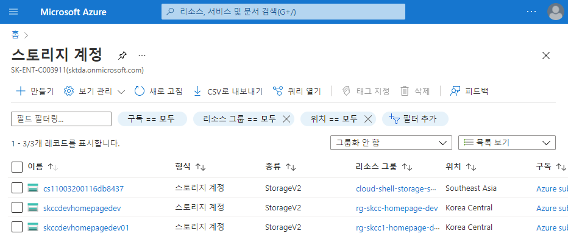
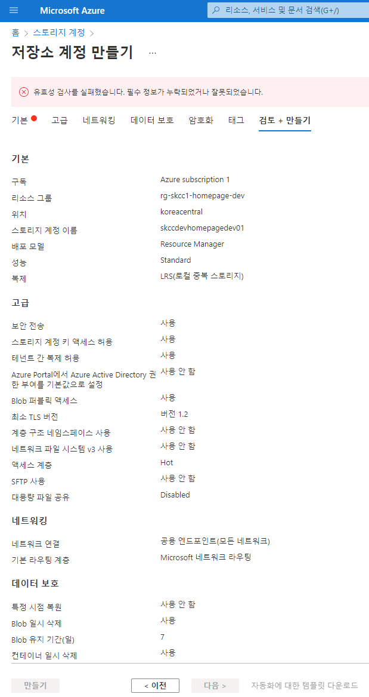

# Azure Storage Account

## Storage 계정 유형
| 스토리지 계정의 유형 | 지원되는 스토리지 서비스 | 중복 옵션 | 사용 |   
|:---|:---|:---|:---|  
| 표준 범용 v2 | Blob(Data Lake Storage 포함) </br> 큐 및 Table Storage </br> Azure Files | LRS/GRS/RA-GRS </br> ZRS/GZRS/RA-GZRS2 | Blob, 파일 공유, 큐 및 테이블 </br> Azure Files NFS 파일 공유에 대한 지원을 원하는 경우 프리미엄 파일 공유 계정 유형을 사용 | 
| 프리미엄 블록 Blob | Blob 스토리지(Data Lake Storage 포함) | LRS </br> ZRS2 | 블록 Blob 및 추가 Blob </br> 트랜잭션 속도가 높은 시나리오 또는 더 작은 개체를 사용하거나 지속적으로 짧은 스토리지 대기 시간이 필요한 경우 |  
| 프리미엄 파일 공유 | Azure 파일 | LRS </br> ZRS2 | 파일 공유 전용 프리미엄 스토리지 계정 유형 </br> 엔터프라이즈 또는 고성능 규모의 애플리케이션에 추천 </br> SMB 및 NFS 파일 공유를 모두 지원하는 스토리지 계정을 원하는 경우 |  
| 프리미엄 페이지 Blob | 페이지 Blob만 해당 | LRS | 페이지 Blob에 대한 프리미엄 스토리지 계정 유형 |  

### Azure Blob 종류
| 구분 | 특징 | 사용예 |  
|:---|:---|:---|  
| 블록 Blob | 블록으로 구성되며 텍스트 또는 이진 파일을 저장 | 큰 파일을 효율적으로 업로드하는 데 적합 |    
| 추가 Blob | 블록으로 구성 </br> 추가 작업에 최적화 | 로깅 시나리오에 적합 |  
| 페이지 Blob | 전체 크기는 512바이트 페이지(최대 8TB)로 구성 </br> 빈번한 임의의 읽기/쓰기 작업에 맞게 고안 </br> Azure IaaS 디스크의 기반 | 가상 머신과 데이터베이스의 OS 및 데이터 디스크와 같은 인덱스 기반 및 스파스 데이터 구조를 저장하는 데 적합 |    

## Storage 계정 endpoint
| 스토리지 서비스 | endpoint |  
|:---|:---|  
| Blob Storage | https://<storage-account>.blob.core.windows.net |  
| Data Lake Storage Gen2 | https://<storage-account>.dfs.core.windows.net |  
| Azure 파일 | https://<storage-account>.file.core.windows.net |  
| Queue Storage | https://<storage-account>.queue.core.windows.net |  
| Table Storage | https://<storage-account>.table.core.windows.net |  


## Storage Account 설정
- Name : "skccdevhomepagedev"
- SKU : "Standard_LRS" (가장 저렴한 중복성 옵션) # Standard_RAGRS
- 생성시 시간이 1 ~ 2 분 걸림
- 이름이 구독내에서 유일해야 함(범위 추가 확인 필요)
- Azure Storage 방화벽 정책 확인 필요
> [Azure Storage 방화벽 및 가상 네트워크 구성](https://docs.microsoft.com/ko-kr/azure/storage/common/storage-network-security?tabs=azure-powershell)

## Portal
"스토리지 계정" > "+ 만들기"
  
  


## [PowerShell](https://shell.azure.com)
<a href="https://shell.azure.com">
  
</a>


### 기능등록
```
Install-Module Az.Storage -Repository PsGallery -RequiredVersion 3.0.1-preview -AllowClobber -AllowPrerelease -Force

Register-AzProviderFeature -ProviderNamespace Microsoft.Network -FeatureName AllowGlobalTagsForStorage
Get-AzProviderFeature -ProviderNamespace Microsoft.Network -FeatureName AllowGlobalTagsForStorage
```
### Stroage Account 만들기
```powershell
$groupName='rg-skcc1-homepage-dev'
$locationName='koreacentral'

$storageAccountName = 'skccdevhomepagedev01'
$storageAccountSkuName ='Standard_LRS'

$tags = @{
  owner='SeoTaeYeol'
  environment='dev'
  serviceTitle='homepage'
  personalInformation='no'
}
```

```powershell
New-AzStorageAccount `
  -ResourceGroupName $groupName `
  -Name $storageAccountName `
  -Location $locationName `
  -SkuName $storageAccountSkuName `
  -Kind StorageV2 `
  -Tag $tags
```

```powershell
$storage_account = @{
    Name = $storageAccountName
    ResourceGroupName = $groupName
    Location = $locationName
    SkuName = $storageAccountSkuName
    Kind = 'StorageV2'
    Tag = $tags
}
New-AzStorageAccount @storage_account
```


### 컨테이너 만들기(예시)
```powershell
# Create variables
$containerName  = "individual-container"
$prefixName     = "loop"

# Approach 1: Create a container
New-AzStorageContainer -Name $containerName -Context $ctx

# Approach 2: Create containers with a PowerShell loop
for ($i = 1; $i -le 3; $i++) { 
    New-AzStorageContainer -Name (-join($prefixName, $i)) -Context $ctx
   } 

# Approach 3: Create containers using the PowerShell Split method
"$($prefixName)4 $($prefixName)5 $($prefixName)6".split() | New-AzStorageContainer -Context $ctx
```

- boot diagnostics 컨테이너  


### 제거
```
Remove-AzStorageAccount `
  -Name $storageAccountName `
  -ResourceGroupName $groupName
```

## Azure CLI
```
#!/bin/bash

groupName="rg-skcc1-homepage-dev"
locationName="koreacentral"

storageAccountName='skccdevhomepagedev01'
storageAccountSkuName='Standard_LRS'

tags='owner=SeoTaeYeol environment=dev serviceTitle=homepage personalInformation=no'

## 해당 구독에 대해 지원되는 지역 검색
az account list-locations \
  --query "[].{Region:name}" \
  --out table

## 생성하기
az storage account create \
  --name $storageAccountName \
  --resource-group $groupName \
  --location $locationName \
  --sku $storageAccountSkuName \
  --kind StorageV2 \
  --tag $tags

## 삭제하기
az storage account delete \
  --name $storageAccountName \
  --resource-group $groupName
```
