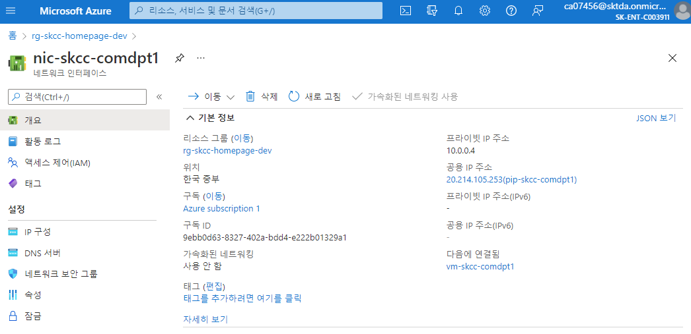
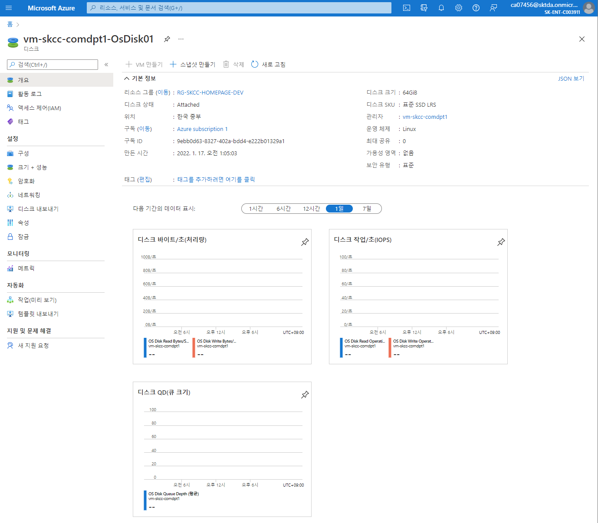
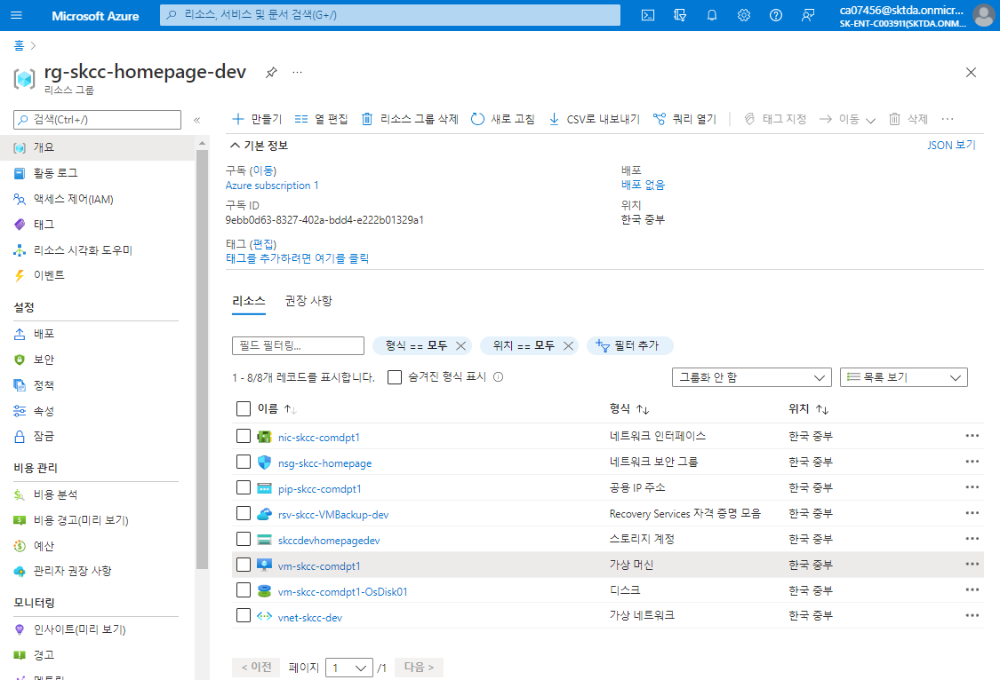
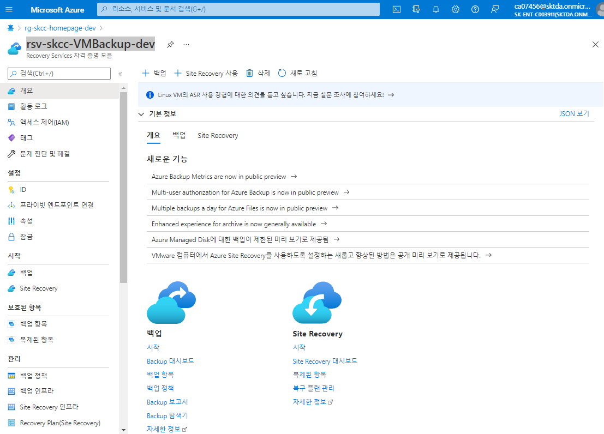

# [Azure Virtual Machine](https://docs.microsoft.com/ko-kr/azure/virtual-machines/) 

- ​Azure에서 제공하는 여러 유형의 확장성 있는 주문형 컴퓨팅 리소스 중 하나
- Azure VM은 가상 컴퓨터를 실행하는 실제 하드웨어를 구입 및 유지 관리하지 않고도 가상화의 유연성을 제공
- 가상 컴퓨터에서 실행하는 소프트웨어의 구성, 패치 및 설치와 같은 작업을 수행하여 VM을 계속 유지 관리할 필요가 있음

> [빠른 시작: PowerShell을 사용하여 Azure에서 Linux 가상 머신 만들기](https://docs.microsoft.com/ko-kr/azure/virtual-machines/linux/quick-create-powershell)  
> [빠른 시작: Azure CLI를 사용하여 Linux 가상 머신 만들기](https://docs.microsoft.com/ko-kr/azure/virtual-machines/linux/quick-create-cli)  
> [빠른 시작: ARM 템플릿을 사용하여 Ubuntu Linux 가상 머신 만들기](https://docs.microsoft.com/ko-kr/azure/virtual-machines/linux/quick-create-template)  
> [빠른 시작: Azure Portal에서 Linux 가상 머신 만들기](https://docs.microsoft.com/ko-kr/azure/virtual-machines/linux/quick-create-portal)
> [랩: 가상 머신 배포 및 관리.](https://github.com/MicrosoftLearning/AZ-103KO-MicrosoftAzureAdministrator/blob/master/Instructions/Labs/02a%20-%20Deploy%20and%20Manage%20Virtual%20Machines%20(az-100-03).md)


## CLI
```bash
az group create --name "rg-skcc-homepage-dev" \
  -location "koreacentral"
az vm create \
  --resource-group myResourceGroup \
  --name myVM \
  --image UbuntuLTS \
  --admin-username azureuser \
  --generate-ssh-keys
az vm open-port --port 80 \
  --resource-group "rg-skcc-homepage-dev" \
  --name myVM
```

## PowerShell
### 환경 설정
```powershell
$groupName = "rg-skcc-homepage-dev"
$locationName = "koreacentral"

$vnetName = "vnet-skcc-dev"
$vnetAddressPrefix = '10.0.0.0/16'

$subnetFrontendName = 'snet-skcc-dev-frontend'
$subnetFronendAddressPrefix = '10.0.0.0/28'
$subnetBackendName = 'snet-skcc-dev-backend'
$subnetAddressPrefix = '10.0.1.0/28'

$storageAccountName = 'skccdevhomepagedev'
$storageAccountSkuName ='Standard_LRS'

$nsgName = 'nsg-skcc-homepage' 

$pipName = 'pip-skcc-comdpt1'
$nicName = 'nic-skcc-comdpt1'

$vmName = "vm-skcc-comdpt1"
$vmSize = "Standard_B2s"

$vmOSDisk = $vmName + "-OSDisk01"
$osDiskType = "StandardSSD_LRS"
$osDiskSizeInGB = 64

$vmDataDisk = $vmName + "-DataDisk01"
$osDataDiskSizeInGB = 64
$StorageAccountType = 'StandardSSD_LRS'
```


### Resource Group 만들기
```powershell
New-AzResourceGroup `
   -ResourceGroupName $groupName `
   -Location $locationName 
```
```powershell
$rg = @{
    Name = $groupName
    Location = $locationName 
}
New-AzResourceGroup @rg
```
### 리소스 그룹 잠금
```powershell
New-AzResourceLock `
  -LockName LockGroup `
  -LockLevel CanNotDelete `
  -ResourceGroupName $groupName
```
- 확인
```
Get-AzResourceLock \
  -ResourceGroupName $groupName
```

## VNet 만들기
- vnet : vnet-skcc-dev
```powershell
$vnet = @{
    Name = $vnetName
    ResourceGroupName = $groupName
    Location = $locationName
    AddressPrefix = $vnetAddressPrefix    
}
$virtualNetwork = New-AzVirtualNetwork @vnet
```

## NSG 만들기
```powershell
```

## subnet 만들기
- frontend subnet : snet-skcc-dev-frontend
- backend subnet : snet-skcc-dev-backend
```powershell
$subnet_frontend = @{
    Name = $subnetFrontendName
    VirtualNetwork = $virtualNetwork
    AddressPrefix = $subnetFronendAddressPrefix
}
$subnetConfig_frontend = Add-AzVirtualNetworkSubnetConfig @subnet_frontend
$subnet_backend = @{
    Name = $subnetBackendName
    VirtualNetwork = $virtualNetwork
    AddressPrefix = $subnetAddressPrefix
}
$subnetConfig_backend = Add-AzVirtualNetworkSubnetConfig @subnet_backend
```

## 가상 네트워크에 subnet 연결
```powershell
$virtualNetwork | Set-AzVirtualNetwork
```


## Storage Account
- SKU : "Standard_LRS" (가장 저렴한 중복성 옵션)
- 생성시 시간이 1 ~ 2 분 걸림
### Stroage Account 만들기
```powershell
New-AzStorageAccount `
  -ResourceGroupName $groupName `
  -Name $storageAccountName `
  -Location $locationName `
  -SkuName $storageAccountSkuName `
  -Kind StorageV2
```

```powershell
$storage_account = @{
    Name = $storageAccountName
    ResourceGroupName = $groupName
    Location = $locationName
    SkuName = $storageAccountSkuName
    Kind = 'StorageV2'
}
New-AzStorageAccount @storage_account
```

### 컨테이너 만들기(예시)
```powershell
# Create variables
$containerName  = "individual-container"
$prefixName     = "loop"

# Approach 1: Create a container
New-AzStorageContainer -Name $containerName -Context $ctx

# Approach 2: Create containers with a PowerShell loop
for ($i = 1; $i -le 3; $i++) { 
    New-AzStorageContainer -Name (-join($prefixName, $i)) -Context $ctx
   } 

# Approach 3: Create containers using the PowerShell Split method
"$($prefixName)4 $($prefixName)5 $($prefixName)6".split() | New-AzStorageContainer -Context $ctx
```

- boot diagnostics 컨테이너  


### 제거
```
Remove-AzStorageAccount `
  -Name $storageAccountName `
  -ResourceGroupName $groupName
```

## NSG Rule 만들기
### Create an inbound network security group rule for port 22
```powershell
$nsgRuleSSH = New-AzNetworkSecurityRuleConfig `
  -Name "nsg-rule-ssh"  `
  -Protocol "Tcp" `
  -Direction "Inbound" `
  -Priority 1000 `
  -SourceAddressPrefix * `
  -SourcePortRange * `
  -DestinationAddressPrefix * `
  -DestinationPortRange 22 `
  -Access "Allow"
```

### Create an inbound network security group rule for port 80
```powershell
$nsgRuleWeb = New-AzNetworkSecurityRuleConfig `
  -Name "nsg-rule-www"  `
  -Protocol "Tcp" `
  -Direction "Inbound" `
  -Priority 1001 `
  -SourceAddressPrefix * `
  -SourcePortRange * `
  -DestinationAddressPrefix * `
  -DestinationPortRange 10080 `
  -Access "Allow"
```

### Create a network security group
```powershell
$nsg = New-AzNetworkSecurityGroup `
  -ResourceGroupName $groupName `
  -Location $locationName `
  -Name $nsgName `
  -SecurityRules $nsgRuleSSH,$nsgRuleWeb
```


### public-ip 만들기
```powershell
$vnet = $virtualNetwork = Get-AzVirtualNetwork |?{$_.Name -eq 'vnet-skcc-dev'}
$pip = New-AzPublicIpAddress `
  -Name $pipName `
  -ResourceGroupName $groupName `
  -Location $locationName `
  -AllocationMethod Static `
  -IdleTimeoutInMinutes 4
```


### nic 만들기
[가상 머신에 네트워크 인터페이스 추가 또는 제거](https://docs.microsoft.com/ko-kr/azure/virtual-network/virtual-network-network-interface-vm)
| 도구 | 명령 |  
|:---|:---|
| CLI | az network nic create |  
| PowerShell | New-AzNetworkInterface |  

#### vnet 정보 가져오기
```powershell
$virtualNetwork = Get-AzVirtualNetwork |?{$_.Name -eq $vnetName }
```

#### 
```powershell
$frontEnd = $virtualNetwork.Subnets|?{$_.Name -eq $subnetFrontendName }
$nic = New-AzNetworkInterface `
  -ResourceGroupName $groupName `
  -Name $nicName `
  -Location $locationName `
  -SubnetId $frontEnd.Id `
  -PublicIpAddressId $pip.Id `
  -NetworkSecurityGroupId $nsg.Id
```


### credential object 정의
```powershell
$securePassword = ConvertTo-SecureString 'dlatl!00' -AsPlainText -Force
$cred = New-Object System.Management.Automation.PSCredential ("azureuser", $securePassword)
```

### VM 크기 설정
```
$vmConfig = New-AzVMConfig `
  -VMName $vmName `
  -VMSize $vmSize
```

### VM 크기 예시
- Standard_B2s : [B-시리즈 버스터블 가상 머신](https://docs.microsoft.com/ko-kr/azure/virtual-machines/sizes-b-series-burstable)
  - CPU : 2 vCPU
  - 메모리 : 4 GiB
  - 임시 스토리지(SSD) : 8 GiB

- Standard_D1_v2 : [Dv2 시리즈](https://docs.microsoft.com/ko-kr/azure/virtual-machines/dv2-dsv2-series)
  - CPU : 1 vCPU
  - 메모리 : 3.5 GiB
  - 임시 스토리지(SSD) : 50 GiB

- Standard_DS3_v2 : DSv2 시리즈
  - CPU : 4 vCPU
  - 메모리 : 14 GiB
  - 임시 스토리지(SSD) : 28 GiB


### 소스 이미지 구성
#### Windows
```powershell
$vmConfig = Set-AzVMOperatingSystem `
  -VM $vmConfig `
  -Windows `
  -ComputerName $vmName`
  -Credential $cred `
  -ProvisionVMAgent `
  -EnableAutoUpdate
$vmConfig = Set-AzVMSourceImage -VM $vmConfig `
  -PublisherName "MicrosoftWindowsServer" `
  -Offer "WindowsServer" `
  -Skus "2016-Datacenter" `
  -Version "latest"
```

#### Linux (Ubuntu)
- APACHE : vm-skcc-comdpt1
- TOMCAT : vm-skcc-comdap1
```powershell
$vmConfig = Set-AzVMOperatingSystem `
  -VM $vmConfig `
  -Linux `
  -ComputerName $vmName `
  -Credential $cred `
  -DisablePasswordAuthentication
$vmConfig = Set-AzVMSourceImage `
  -VM $vmConfig `
  -PublisherName "Canonical" `
  -Offer "UbuntuServer" `
  -Skus "18.04-LTS" `
  -Version "latest"
```

### 인터페이스 추가
```
$vmConfig = Add-AzVMNetworkInterface `
  -VM $vmConfig `
  -Id $nic.Id
```

### SSH key 구성
#### SSH 키 쌍 만들기
- [ssh-keygen](https://www.ssh.com/academy/ssh/keygen) 사용
- 옵션 -t rsa : 모든 SSH 클라이언트는 이 알고리즘을 지원
```
PS C:\workspace\AzureBasic\0.ENV> ssh-keygen -t rsa -b 4096

Generating public/private rsa key pair.
Enter file in which to save the key (C:\Users\taeey/.ssh/id_rsa): 
Enter passphrase (empty for no passphrase): 
Enter same passphrase again: 
Your identification has been saved in ./.ssh/id_rsa
Your public key has been saved in ./.ssh/id_rsa.pub
The key fingerprint is:
SHA256:gEfKu1joY11R+waG51xWMs2roEHi/qgirTDdcn5j4OU taeey@DESKTOP-QR555PR
The key's randomart image is:
+---[RSA 4096]----+
|      . . oo.    |
|   ..+.o . +o    |
|   .+o= = o  .   |
|   ..o.B.=  .    |
|  ..o .oS.o.     |
| o =ooo  ..      |
|o.B.=*           |
|+o.=o E          |
|oo...o .         |
+----[SHA256]-----+
PS C:\workspace\AzureBasic\0.ENV>
```
```powershell
$sshPublicKey = cat ./.ssh/id_rsa.pub
Add-AzVMSshPublicKey `
  -VM $vmConfig `
  -KeyData $sshPublicKey `
  -Path "/home/azureuser/.ssh/authorized_keys"
```

### OS Disk 설정
```powershell
$resourceGroup = Get-AzResourceGroup -Name 'rg-skcc-homepage-dev'
$location = $resourceGroup.Location
$osDiskType = (Get-AzDisk -ResourceGroupName $resourceGroup.ResourceGroupName)[0].Sku.Name

$vmConfig = Set-AzVMOSDisk `
  -VM $vmConfig `
  -Name $vmOSDisk `
  -DiskSizeinGB $osDiskSizeInGB `
  -StorageAccountType $osDiskType `
  -CreateOption FromImage `
  -Caching ReadWrite `
  -Linux
```


### Data 디스크 설정
```powershell
$vmConfig = Add-AzVMDataDisk `
  -VM $vmConfig `
  -Name $vmDataDisk `
  -DiskSizeinGB $osDataDiskSizeInGB `
  -CreateOption Empty `
  -StorageAccountType $StorageAccountType `
  -Caching ReadWrite `
  -Lun 1
```


### boot diagnotics
```
$vmConfig = Set-AzVMBootDiagnostic `
  -VM $vmConfig `
  -Enable `
  -resourceGroup "rg-skcc-homepage-dev" `
  -StorageAccountName "skccdevhomepagedev"
```

### VM 만들기
```
New-AzVM -VM $vmConfig `
  -ResourceGroupName "rg-skcc-homepage-dev" `
  -Location "koreacentral"
```
  
  

### Backup 적용
- 기본 정책을 설정
  ```powershell
  $policy = Get-AzRecoveryServicesBackupProtectionPolicy `
    -Name "DefaultPolicy"
  ```

- VM 백업을 사용하도록 설정
  ```powershell
  $vm='vm-skcc-comdpt1';
  Enable-AzRecoveryServicesBackupProtection `
      -ResourceGroupName "rg-skcc-homepage-dev" `
      -Name "$vm" `
      -Policy $policy
  ```
  
  

### apache vm 만들기
- VM 자격 증명을 설정 : Get-Credential
- -AsJob : 백그라운드 옵션
```powershell
$cred = Get-Credential
$apache-vm1 = @{
    ResourceGroupName = 'rg-skcc-homepage-dev'
    Location = 'koreacentral'
    Name = 'vm-skcc-homept1'
    VMSize = 'Standard_DS3_v2'
    SecurityGroupName = ''
    PublicIpAddressName = ''
    VirtualNetworkName = 'vnet-skcc-dev'
    SubnetName = 'vnet-skcc-dev-frontend'
    OpenPorts = '10080,7500'
    Credential = $cred
}
New-AzVM @apache-vm -AsJob
```

### tomcat vm 만들기
```powershell
$cred = Get-Credential
New-AzVm `
    -ResourceGroupName "myResourceGroupVM" `
    -Name "myVM" `
    -Location "koreacentral" `
    -VirtualNetworkName "myVnet" `
    -SubnetName "mySubnet" `
    -SecurityGroupName "myNetworkSecurityGroup" `
    -PublicIpAddressName "myPublicIpAddress" `
    -OpenPorts 80,3389 `
    -Credential $cred
```

## 리소스 정리
```
Remove-AzResourceGroup -Name 'rg-skcc-homepage-dev' -Force
```

---

| 명령어(cmdlet) | 설명 | 예시 | 
|:---|:---|:---|  
| Import-CSV | CSV 파일 읽기 | Import-CSV -Path ./vm_parameter_template.csv |
| ForEach-Object | 파이프라인에서 항목을 반복 | | 
| ConvertTo-SecureString | SecureString 타입으로 만듬 | | 
| New-Object | 개체를 만듬 | |  
| New-AzResourceGroup | 리소스 그룹 만들기 | -Name myResourceGroup -Location EastUS | 
| Get-AzLocation | 지역 목록 검색 | Get-AzLocation | select Location |  
| New-AzStorageAccount | 스토리지 계정 생성 | |  
| New-AzStorageContainer | 컨테이너 만들기 | |  
| Set-AzVMOperatingSystem | VM OS 지정 | -Windows, -Linux |  
| Set-AzVMSourceImage | VM 이미지 지정 | Standard_D1_v2 |
| Select-AzSubscription | 현재 및 기본 Azure 구독을 변경 | | 
| Get-AzVirtualNetwork | 가상 네트워크에 대한 정보 가져오기 | -Name "myVNet" -ResourceGroupName $myResourceGroup |  
| Get-AzVirtualNetworkSubnetConfig | 서브넷에 대한 정보 가져오기 |  -Name "mySubnet1" -VirtualNetwork $vnet |  
| Get-AzNetworkSecurityGroup | 네트워크 보안 그룹을 가져옴| |  
| Get-AzNetworkInterface | 네트워크 인터페이스 구하기 | |  
| New-AzNetworkInterface | 네트워크 인터페이스를 생성 | |  
| New-AzVMConfig | 구성 가능한 가상 머신 개체 | |  
| Set-AzVMOperatingSystem | 가상 머신의 운영 체제 속성을 설정 | -Windows, -Linux |  
| Set-AzVMSourceImage | 가상 머신의 이미지를 지정 | |  
| New-AzVMConfig | 구성 가능한 가상 머신 개체를 만듬 | |  
| Set-AzVMOperatingSystem | 가상 머신의 운영 체제 속성을 설정 | |  
| Set-AzVMSourceImage | 가상 머신의 이미지를 지정 | |  
| Set-AzVMNetworkInterface | 가상 머신에 네트워크 인터페이스를 추가 | |  
| Add-AzVMNetworkInterface | 네트워크 인터페이스 추가  | |  
| Set-AzVMOSDisk | 가상 머신의 운영 체제 디스크 속성을 설정 | |  
| Add-AzVMDataDisk | 가상 머신에 데이터 디스크를 추가 | |  
| Add-AzVMBootDiagnostic | 가상 머신의 부팅 진단 속성을 수정 </br> 진단 데이터는 지정된 계정에 저장 |  -VM $VM -Enable -ResourceGroupName "ResourceGroup11" -StorageAccountName "DiagnosticStorage" |  
| New-AzVM | 가상 머신을 생성 | |  
| Get-AzRecoveryServiceVault | Recovery Services 자격 증명 모음 목록을 가져옴 | |  
| Set-AzRecoveryServicesVaultContext | 볼트 컨텍스트를 설정 | | 
| Get-AzRecoveryServiceBackupProtectionPolicy | 볼트에 대한 백업 보호 정책을 가져옴 | |  
| Enable-AzRecoveryServiceBackupProtection | 지정된 백업 보호 정책이 있는 항목에 대한 백업을 활성화 | | 

[PowerShell-Script-Sample.md](./PowerShell-Script-Sample.md)

## [Azure Storage 방화벽 및 가상 네트워크 구성](https://github.com/MicrosoftDocs/azure-docs.ko-kr/blob/master/articles/storage/common/storage-network-security.md)