# [Azure Virtual Machine](https://docs.microsoft.com/ko-kr/azure/virtual-machines/) 

- ​Azure에서 제공하는 여러 유형의 확장성 있는 주문형 컴퓨팅 리소스 중 하나
- Azure VM은 가상 컴퓨터를 실행하는 실제 하드웨어를 구입 및 유지 관리하지 않고도 가상화의 유연성을 제공
- 가상 컴퓨터에서 실행하는 소프트웨어의 구성, 패치 및 설치와 같은 작업을 수행하여 VM을 계속 유지 관리할 필요가 있음

> [빠른 시작: PowerShell을 사용하여 Azure에서 Linux 가상 머신 만들기](https://docs.microsoft.com/ko-kr/azure/virtual-machines/linux/quick-create-powershell)  
> [빠른 시작: Azure CLI를 사용하여 Linux 가상 머신 만들기](https://docs.microsoft.com/ko-kr/azure/virtual-machines/linux/quick-create-cli)  
> [빠른 시작: ARM 템플릿을 사용하여 Ubuntu Linux 가상 머신 만들기](https://docs.microsoft.com/ko-kr/azure/virtual-machines/linux/quick-create-template)  
> [빠른 시작: Azure Portal에서 Linux 가상 머신 만들기](https://docs.microsoft.com/ko-kr/azure/virtual-machines/linux/quick-create-portal)  
> [랩: 가상 머신 배포 및 관리.](https://github.com/MicrosoftLearning/AZ-103KO-MicrosoftAzureAdministrator/blob/master/Instructions/Labs/02a%20-%20Deploy%20and%20Manage%20Virtual%20Machines%20(az-100-03).md)  
> [Ubuntu::Long term support and interim releases](https://ubuntu.com/about/release-cycle)  
> [Microsoft and Canonical Increase Velocity with Azure Tailored Kernel](https://ubuntu.com/blog/microsoft-and-canonical-increase-velocity-with-azure-tailored-kernel)  


## Portal
### 홈 > 가상 머신 > 가상 머신 만들기 

> [이미지 선택](https://portal.azure.com/#create/Microsoft.VirtualMachine)  
#### 기본사항
- 프로젝트 정보
  - 리소스 그룹 : rg-skcc1-homepage-dev
- 인스턴스 정보
  - 가상 머신 이름 : vm-skcc1-comdap1
  - 지역 : (Asia Pacific) Korea Central
  - 가용성 옵션 : 가용성 집합
  - 가용성 집합 : avset-skcc1-homepage
  - 보안 유형 : 표준
  - 이미지 : Ubuntu Server 20.04 LTS - Gen2
  - 크기 : Standard_B1|s - 1 vcpu, 0.5 GiB 메모리 (US$4.75/월)  
- 관리자 계정
  - 인증형식 : 암호
- 인바운드 포트 규칙
  - 공용 인바운드 포트 : 선택한 포트 허용
  - 인바운드 포트 선택 : SSH(22)
####  디스크
- 디스크 옵션  
  - OS 디스크 유형 :  표준 SSD(로컬 중복 스토리지)
#### 네트워크
- 네트워크 인터페이스
  - 가상 네트워크 : vnet-skcc1-dev
  - 서브넷 : snet-skc1-dev-backend(10.0.1.0/28)
  - 공용 IP : 없음
  - NIC 네트워크 보안 그룹 : 고급
  - 네트워크 보안 그룹 구성 : nsg-skcc1-homepage
#### 관리
- Azure Security Center
- 모니터링
  - 부트 진단 : 사용자 지정 스토리지 계정으로 사용하도록 설정
  - 진단 스토리지 계정 : skcc1devhomepagedev01
- 백업
  - 백업 사용 : 체크
  - Recovery Services 자격 증명 모음 : skcc1-rsv-VMbackup-dev
  - 백업 정책 : DefaultPolicy
#### 고급
#### 태그
- owner : 'SeoTaeYeol'
- environment:'dev'
- serviceTitle:'homepage'
- personalInformation:'no'

#### 검토 + 만들기
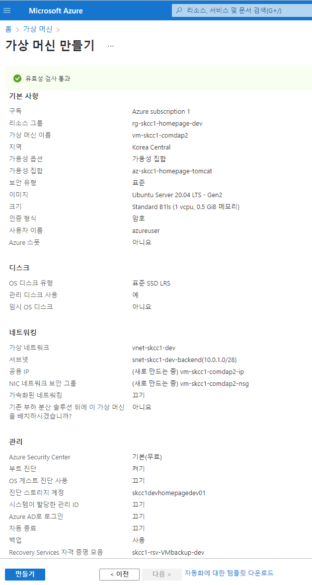  


## [PowerShell](https://shell.azure.com)
<a href="https://shell.azure.com">
  
</a>  

### 환경 설정
```powershell
$groupName = "rg-skcc1-homepage-dev"
$locationName = "koreacentral"
$zone=1

$vnetName = "vnet-skcc1-dev"
$vnetAddressPrefix = '10.0.0.0/16'

$subnetFrontendName = 'snet-skcc1-dev-frontend'
$subnetFronendAddressPrefix = '10.0.0.0/28'
$subnetBackendName = 'snet-skcc1-dev-backend'
$subnetAddressPrefix = '10.0.1.0/28'

$storageAccountName = 'skcc1devhomepagedev'
$storageAccountSkuName ='Standard_LRS'

$nsgName = 'nsg-skcc1-homepage' 

$pipName = 'pip-skcc1-comdpt1'
$nicName = 'nic-skcc1-comdpt1'

$vmApacheName = "vm-skcc1-comdpt1"
$vmTomcatName = "vm-skcc1-comdap1"
$vmName = $vmApacheName
$vmSize = "Standard_B2s"

$vmOSDisk = $vmName + "-OSDisk01"
$osDiskType = "StandardSSD_LRS"
$osDiskSizeInGB = 64

$vmDataDisk = $vmName + "-DataDisk01"
$osDataDiskSizeInGB = 64
$storageAccountType = 'StandardSSD_LRS'
# $storageAccountName = "skcc1devhomepagedev"

$avsetName = "avset-skcc1-homepage"
$vmssName = "vmss-skcc1-homepage-apache"

$apacheOpenPorts = '22,10080'
$tomcatOpenPorts = '22,18080,8009'

$tags = @{
  owner='SeoTaeYeol'
  environment='dev'
  serviceTitle='homepage'
  personalInformation='no'
}
```


### [Public IP 만들기](./AzurePublicIPAddress.md)
### public-ip 가져오기
```powershell
# $vnet = Get-AzVirtualNetwork |?{$_.Name -eq $vnetName}
$vnet = Get-AzVirtualNetwork -Name $vnetName
<# 
$pip = New-AzPublicIpAddress `
  -Name $pipName `
  -ResourceGroupName $groupName `
  -Location $locationName `
  -AllocationMethod Static `
  -IdleTimeoutInMinutes 4 `
  -Tag $tags
#>
$pip = Get-AzPublicIpAddress `
  -Name $pipName `
  -ResourceGroupName $groupName
```
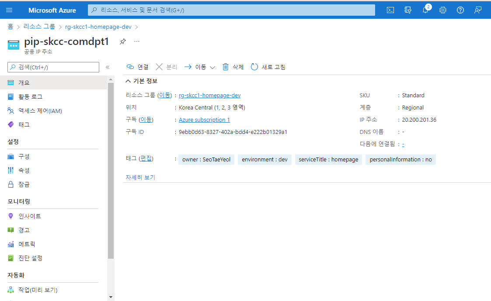


### [NIC 만들기](./AzureNIC.md)
[가상 머신에 네트워크 인터페이스 추가 또는 제거](https://docs.microsoft.com/ko-kr/azure/virtual-network/virtual-network-network-interface-vm)
| 도구 | 명령 |  
|:---|:---|
| CLI | az network nic create |  
| PowerShell | New-AzNetworkInterface |  

#### vnet 정보 가져오기
```powershell
# $vnet = Get-AzVirtualNetwork |?{$_.Name -eq $vnetName }
$vnet = Get-AzVirtualNetwork -Name $vnetName
```

#### subnet 정보 가져오기
```powershell
<# 
$frontEnd = $vnet.Subnets|?{$_.Name -eq $subnetFrontendName }
$nic = New-AzNetworkInterface `
  -ResourceGroupName $groupName `
  -Name $nicName `
  -Location $locationName `
  -SubnetId $frontEnd.Id `
  -PublicIpAddressId $pip.Id `
  -NetworkSecurityGroupId $nsg.Id
#>
```

#### NIC 정보 가져오기
```powershell
$nic = Get-AzNetworkInterface `
  -ResourceGroupName $groupName `
  -Name $nicName
$nic.id
$nic.name
```


### credential object 정의
```powershell
$securePassword = ConvertTo-SecureString 'dlatl!00Imsi' -AsPlainText -Force
$cred = New-Object System.Management.Automation.PSCredential ("azureuser", $securePassword)
```

### 가용 영역 만들기
```powershell
$avset = New-AzAvailabilitySet `
   -Location $locationName `
   -Name $avsetName `
   -ResourceGroupName $groupName `
   -Sku aligned `
   -PlatformFaultDomainCount 2 `
   -PlatformUpdateDomainCount 2
$avset = Get-AzAvailabilitySet `
  -ResourceGroupName $groupName `
  -Name $availablitySetName
```

### VM 크기 설정
```powershell
$vmConfig = New-AzVMConfig `
  -VMName $vmName `
  -VMSize $vmSize `
  -AvailabilitySetID $avset.Id
```

### VM 크기 예시
- Standard_B2s : [B-시리즈 버스터블 가상 머신](https://docs.microsoft.com/ko-kr/azure/virtual-machines/sizes-b-series-burstable)
  - CPU : 2 vCPU
  - 메모리 : 4 GiB
  - 임시 스토리지(SSD) : 8 GiB

- Standard_D1_v2 : [Dv2 시리즈](https://docs.microsoft.com/ko-kr/azure/virtual-machines/dv2-dsv2-series)
  - CPU : 1 vCPU
  - 메모리 : 3.5 GiB
  - 임시 스토리지(SSD) : 50 GiB

- Standard_DS3_v2 : DSv2 시리즈
  - CPU : 4 vCPU
  - 메모리 : 14 GiB
  - 임시 스토리지(SSD) : 28 GiB


### 소스 이미지 구성
#### Windows
```powershell
$vmConfig = Set-AzVMOperatingSystem `
  -VM $vmConfig `
  -Windows `
  -ComputerName $vmName`
  -Credential $cred `
  -ProvisionVMAgent `
  -EnableAutoUpdate
$vmConfig = Set-AzVMSourceImage -VM $vmConfig `
  -PublisherName "MicrosoftWindowsServer" `
  -Offer "WindowsServer" `
  -Skus "2016-Datacenter" `
  -Version "latest"
```

#### Linux (Ubuntu)
- APACHE : vm-skcc-comdpt1
- TOMCAT : vm-skcc-comdap1
```powershell
# $vmApacheName = "vm-skcc-comdpt1"
# $vmTomcatName = "vm-skcc-comdap1"
# $vmName = $vmApacheName
$vmApacheConfig = Set-AzVMOperatingSystem `
  -VM $vmConfig `
  -Linux `
  -ComputerName $vmName `
  -Credential $cred `
  -DisablePasswordAuthentication
<#
$vmApacheConfig = Set-AzVMSourceImage `
  -VM $vmConfig `
  -PublisherName "Canonical" `
  -Offer "UbuntuServer" `
  -Skus "18.04-LTS" `
  -Version "latest"
#>
$vmApacheConfig = Set-AzVMSourceImage `
  -VM $vmConfig `
  -PublisherName "Canonical" `
  -Offer "UbuntuServer" `
  -Skus "20.04-LTS" ` # 22.04-lTS, 20.04-LTS, 18.04-LTS
  -Version "latest"
```

### 인터페이스 추가
- APACHE
```powershell
$vmApacheConfig = Add-AzVMNetworkInterface `
  -VM $vmConfig `
  -Id $nic.Id
```

### SSH key 구성
#### SSH 키 쌍 만들기
- [ssh-keygen](https://www.ssh.com/academy/ssh/keygen) 사용
- 옵션 -t rsa : 모든 SSH 클라이언트는 이 알고리즘을 지원
```
PS C:\workspace\AzureBasic> ssh-keygen -t rsa -b 4096
Generating public/private rsa key pair.
Enter file in which to save the key (C:\Users\taeey/.ssh/id_rsa):  
C:\Users\taeey/.ssh/id_rsa already exists.
Overwrite (y/n)? y
Enter passphrase (empty for no passphrase): 
Enter same passphrase again: 
Your identification has been saved in C:\Users\taeey/.ssh/id_rsa
Your public key has been saved in C:\Users\taeey/.ssh/id_rsa.pub
The key fingerprint is:
SHA256:0PYGXZPZGojLr8y+oHopS2mlgqR6nFG/c1MARXUmK8w taeey@DESKTOP-QR555PR
The key's randomart image is:
+---[RSA 4096]----+
|       oooo.=+   |
|      .+...*+..  |
|      .oE.o  o   |
|    .  o++  .    |
| . ...  Soo      |
|+ .+  .  .o      |
|+.=o ..+ o       |
|.+= o.o.*        |
|..o=.  +oo       |
+----[SHA256]-----+
PS C:\workspace\AzureBasic>
```
```powershell
$sshPublicKey = cat ~/.ssh/id_rsa.pub
Add-AzVMSshPublicKey `
  -VM $vmConfig `
  -KeyData $sshPublicKey `
  -Path "/home/azureuser/.ssh/authorized_keys"
```

### OS Disk 설정
```powershell
$resourceGroup = Get-AzResourceGroup -Name $groupName
$location = $resourceGroup.Location
$osDiskType = (Get-AzDisk -ResourceGroupName $resourceGroup.ResourceGroupName)[0].Sku.Name

$vmConfig = Set-AzVMOSDisk `
  -VM $vmConfig `
  -Name $vmOSDisk `
  -DiskSizeinGB $osDiskSizeInGB `
  -StorageAccountType $osDiskType `
  -CreateOption FromImage `
  -Caching ReadWrite `
  -Linux
```
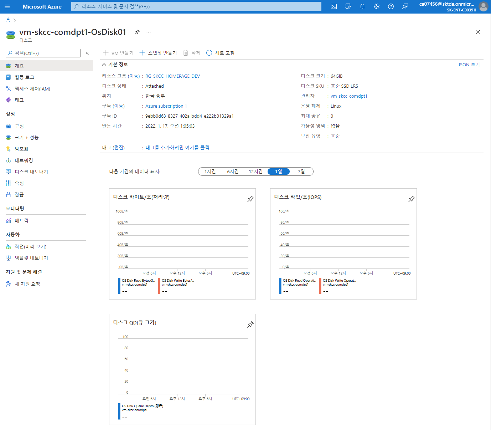

### Data 디스크 설정
```powershell
$vmConfig = Add-AzVMDataDisk `
  -VM $vmConfig `
  -Name $vmDataDisk `
  -DiskSizeinGB $osDataDiskSizeInGB `
  -CreateOption Empty `
  -StorageAccountType $storageAccountType `
  -Caching ReadWrite `
  -Lun 1
```

### boot diagnotics
```powershell
$vmConfig = Set-AzVMBootDiagnostic `
  -VM $vmConfig `
  -Enable `
  -resourceGroup $groupName `
  -StorageAccountName $storageAccountName
```

### VM 만들기
```powershell
New-AzVM -VM $vmConfig `
  -ResourceGroupName $groupName `
  -Location $locationName
```
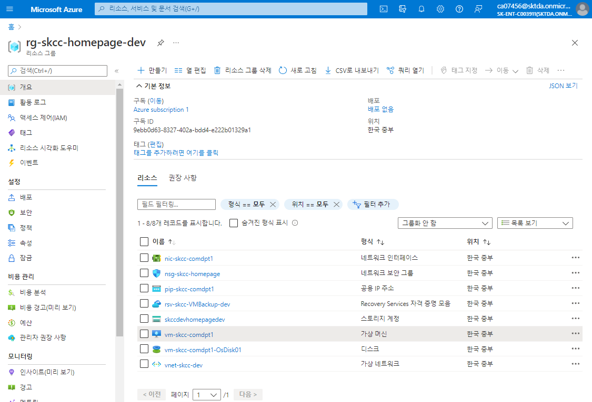  
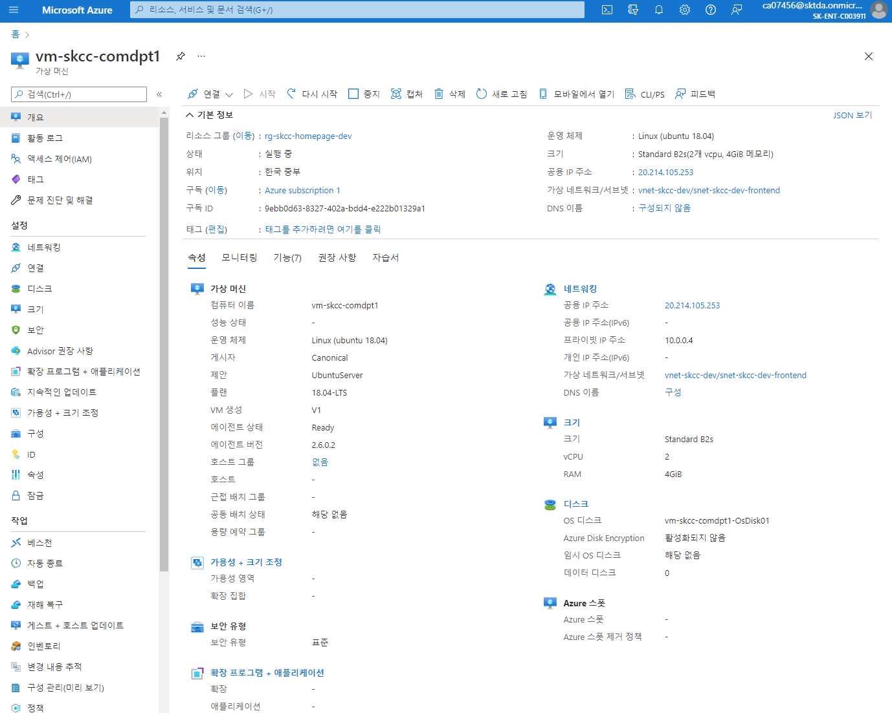  

### Backup 적용(RecoverySerivces)
```powershell
## 기본 정책을 설정
$policy = Get-AzRecoveryServicesBackupProtectionPolicy `
  -Name "DefaultPolicy"

## VM 백업을 사용하도록 설정
$vm='vm-skcc1-comdpt1';
Enable-AzRecoveryServicesBackupProtection `
  -ResourceGroupName $groupName `
  -Name $vmName `
  -Policy $policy
```

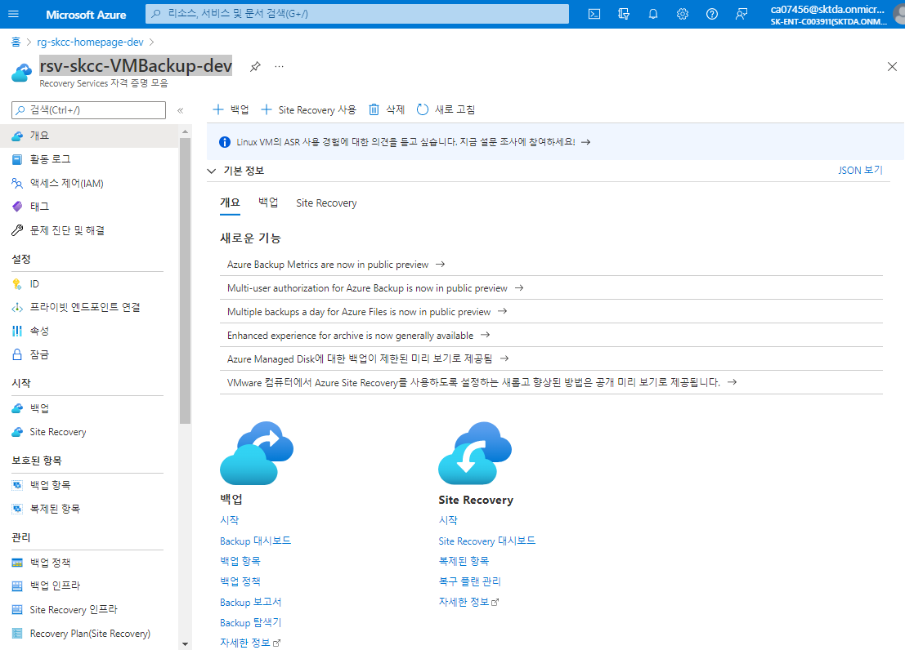  
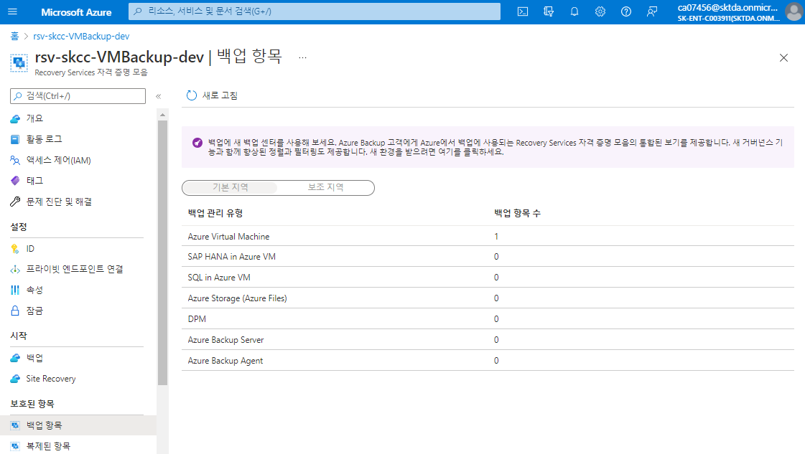  

### apache vm 만들기
- VM 자격 증명을 설정 : Get-Credential
- -AsJob : 백그라운드 옵션
```powershell
$vmApacheName = "vm-skcc-comdpt1"
$vmTomcatName = "vm-skcc-comdap1"
$subnetFrontendName = 'snet-skcc-dev-frontend'
$subnetBackendName = 'snet-skcc-dev-backend'
$vmSize = "Standard_B2s" # 'Standard_DS3_v2'
$cred = Get-Credential
$apache-vm1 = @{
    ResourceGroupName = $groupName
    Location = $locationName
    Name = $vmApacheName
    VMSize = $vmSize
    SecurityGroupName = $nsgName
    PublicIpAddressName = $pipName
    VirtualNetworkName = $vnetName
    SubnetName = $subnetFrontendName
    OpenPorts = '22,10080,8009'
    Credential = $cred
}
New-AzVM @apache-vm1 -AsJob
```

### tomcat vm 만들기
```powershell
$cred = Get-Credential
$tomcat-vm1 = @{
    ResourceGroupName = $groupName
    Location = $locationName
    Name = $vmTomcatName
    VMSize = $vmSize
    SecurityGroupName = $nsgName    
    VirtualNetworkName = $vnetName
    SubnetName = $subnetBackendName
    OpenPorts = '22,18080,8009'
    Credential = $cred
}
New-AzVM @tomcat-vm1 -AsJob
```

## 리소스 정리
```
Remove-AzResourceGroup -Name 'rg-skcc-homepage-dev' -Force
```

---

| 명령어(cmdlet) | 설명 | 예시 | 
|:---|:---|:---|  
| Import-CSV | CSV 파일 읽기 | Import-CSV -Path ./vm_parameter_template.csv |
| ForEach-Object | 파이프라인에서 항목을 반복 | | 
| ConvertTo-SecureString | SecureString 타입으로 만듬 | | 
| New-Object | 개체를 만듬 | |  
| New-AzResourceGroup | 리소스 그룹 만들기 | -Name myResourceGroup -Location EastUS | 
| Get-AzLocation | 지역 목록 검색 | Get-AzLocation | select Location |  
| New-AzStorageAccount | 스토리지 계정 생성 | |  
| New-AzStorageContainer | 컨테이너 만들기 | |  
| Set-AzVMOperatingSystem | VM OS 지정 | -Windows, -Linux |  
| Set-AzVMSourceImage | VM 이미지 지정 | Standard_D1_v2 |
| Select-AzSubscription | 현재 및 기본 Azure 구독을 변경 | | 
| Get-AzVirtualNetwork | 가상 네트워크에 대한 정보 가져오기 | -Name "myVNet" -ResourceGroupName $myResourceGroup |  
| Get-AzVirtualNetworkSubnetConfig | 서브넷에 대한 정보 가져오기 |  -Name "mySubnet1" -VirtualNetwork $vnet |  
| Get-AzNetworkSecurityGroup | 네트워크 보안 그룹을 가져옴| |  
| Get-AzNetworkInterface | 네트워크 인터페이스 구하기 | |  
| New-AzNetworkInterface | 네트워크 인터페이스를 생성 | |  
| New-AzVMConfig | 구성 가능한 가상 머신 개체 | |  
| Set-AzVMOperatingSystem | 가상 머신의 운영 체제 속성을 설정 | -Windows, -Linux |  
| Set-AzVMSourceImage | 가상 머신의 이미지를 지정 | |  
| New-AzVMConfig | 구성 가능한 가상 머신 개체를 만듬 | |  
| Set-AzVMOperatingSystem | 가상 머신의 운영 체제 속성을 설정 | |  
| Set-AzVMSourceImage | 가상 머신의 이미지를 지정 | |  
| Set-AzVMNetworkInterface | 가상 머신에 네트워크 인터페이스를 추가 | |  
| Add-AzVMNetworkInterface | 네트워크 인터페이스 추가  | |  
| Set-AzVMOSDisk | 가상 머신의 운영 체제 디스크 속성을 설정 | |  
| Add-AzVMDataDisk | 가상 머신에 데이터 디스크를 추가 | |  
| Add-AzVMBootDiagnostic | 가상 머신의 부팅 진단 속성을 수정 </br> 진단 데이터는 지정된 계정에 저장 |  -VM $VM -Enable -ResourceGroupName "ResourceGroup11" -StorageAccountName "DiagnosticStorage" |  
| New-AzVM | 가상 머신을 생성 | |  
| Get-AzRecoveryServiceVault | Recovery Services 자격 증명 모음 목록을 가져옴 | |  
| Set-AzRecoveryServicesVaultContext | 볼트 컨텍스트를 설정 | | 
| Get-AzRecoveryServiceBackupProtectionPolicy | 볼트에 대한 백업 보호 정책을 가져옴 | |  
| Enable-AzRecoveryServiceBackupProtection | 지정된 백업 보호 정책이 있는 항목에 대한 백업을 활성화 | | 

[PowerShell-Script-Sample.md](./PowerShell-Script-Sample.md)

## [Azure Storage 방화벽 및 가상 네트워크 구성](https://github.com/MicrosoftDocs/azure-docs.ko-kr/blob/master/articles/storage/common/storage-network-security.md)  

## Azure VM SSH 공개 키 생성 및 교체
### 1. 공개키 생성
```powershell
PS C:\Users\taeey\.ssh> ssh-keygen -m PEM -t rsa -b 4096
Generating public/private rsa key pair.
Enter file in which to save the key (C:\Users\taeey/.ssh/id_rsa):
C:\Users\taeey/.ssh/id_rsa already exists.
Overwrite (y/n)? y
Enter passphrase (empty for no passphrase):
Enter same passphrase again:
Your identification has been saved in C:\Users\taeey/.ssh/id_rsa
Your public key has been saved in C:\Users\taeey/.ssh/id_rsa.pub
The key fingerprint is:
SHA256:3tkrAkJeXpBiqBACgVZiHmL7jArvOni3CReO38TzYMQ taeey@DESKTOP-QR555PR
The key's randomart image is:
+---[RSA 4096]----+
|OB.o   .         |
|O.= o o          |
|o+ . . .         |
|. + ... .        |
|.. =.oE.S        |
|o. oo+o. . o     |
|o + o.*.. o .    |
|o..+.= +. .  .   |
|.+..+.. .. ..    |
+----[SHA256]-----+
PS C:\Users\taeey\.ssh> dir

    Directory: C:\Users\taeey\.ssh

Mode                 LastWriteTime         Length Name
----                 -------------         ------ ----
-a---        2022-01-28  오후 3:10           3243 id_rsa
-a---        2022-01-28  오후 3:10            748 id_rsa.pub
-a---        2022-01-17  오전 1:37             97 known_hosts

PS C:\Users\taeey\.ssh> cat id_rsa.pub
nb9FSDXH+plmakmzRSArjSSYBcz9t5lX5V9MHF9YRNaPhieSB7ZgsLE7QDnTJuPUZHm3eC+tTLKCLjsKyDC13/...+BJjcA3rfiURKkdnzJd5LBG8U+BP/aQKBjzyn12lTt8MyHHnLQ0y2yxk9GHhF5SqzYI1M8xQgi/zudK19EyMYt4GjrjlyH4a6KMHBKZz+PuQ== ....@DESKTOP-.......
```

### Azure Portal 에서 공개키 교체
교체하고자 하는 VM 을 선택 > 암호 다시 설정 > SSH 공개 키 재설정
- 모드 : SSH 공개 키 재 설정
- 사용자 이름 : azureuser
- SSH 공개 키 : 위에서 재생성한 공개키값 복사 붙여넣기
- 상단의 업데이트 버튼을 눌려 재설정함
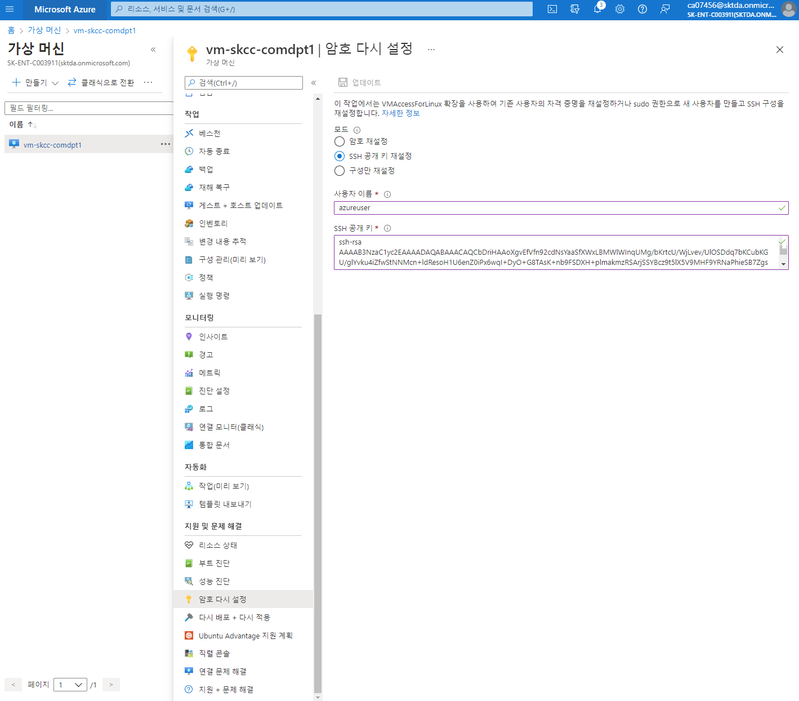  

### ssh 로 접속
1. 접속시도 시 기존 RSA 공유키 충돌 문제 발생
```powershell
PS C:\Users\taeey\.ssh> ssh azureuser@11.111.111.111
@@@@@@@@@@@@@@@@@@@@@@@@@@@@@@@@@@@@@@@@@@@@@@@@@@@@@@@@@@@
@    WARNING: REMOTE HOST IDENTIFICATION HAS CHANGED!     @
@@@@@@@@@@@@@@@@@@@@@@@@@@@@@@@@@@@@@@@@@@@@@@@@@@@@@@@@@@@
IT IS POSSIBLE THAT SOMEONE IS DOING SOMETHING NASTY!
Someone could be eavesdropping on you right now (man-in-the-middle attack)!
It is also possible that a host key has just been changed.
The fingerprint for the ED25519 key sent by the remote host is
SHA256:vvb4GQ9e101Tb/JgVQ73EUa4ie975NYu8/GWvzUyqKs.
Please contact your system administrator.
Add correct host key in C:\\Users\\taeey/.ssh/known_hosts to get rid of this message.
Offending ED25519 key in C:\\Users\\taeey/.ssh/known_hosts:1
Host key for 11.111.111.111 has changed and you have requested strict checking.
Host key verification failed.
```
2. ~/.ssh/known_hosts 를 삭제
```powershell
PS C:\Users\taeey\.ssh> rm known_hosts
```

3. 재접속
```powershell
PS C:\Users\taeey\.ssh> ssh azureuser@11.111.111.111
The authenticity of host '11.111.111.111 (11.111.111.111)' can't be established.
ED25519 key fingerprint is SHA256:vvb4GQ9e101Tb/JgVQ73EUa4ie975NYu8/GWvzUyqKs.
This key is not known by any other names
Are you sure you want to continue connecting (yes/no/[fingerprint])? ye
Please type 'yes', 'no' or the fingerprint: yes
Warning: Permanently added '11.111.111.111' (ED25519) to the list of known hosts.
Welcome to Ubuntu 18.04.6 LTS (GNU/Linux 5.4.0-1065-azure x86_64)

 * Documentation:  https://help.ubuntu.com
 * Management:     https://landscape.canonical.com
 * Support:        https://ubuntu.com/advantage

  System information as of Fri Jan 28 06:11:43 UTC 2022

  System load:  0.0               Processes:           122
  Usage of /:   2.8% of 61.86GB   Users logged in:     0
  Memory usage: 8%                IP address for eth0: 10.0.0.4
  Swap usage:   0%


1 update can be applied immediately.
To see these additional updates run: apt list --upgradable


*** System restart required ***
Last login: Mon Jan 17 09:21:25 2022 from 211.45.60.5
To run a command as administrator (user "root"), use "sudo <command>".
See "man sudo_root" for details.

azureuser@vm-skcc-comdpt1:~$ grep . /etc/*-release
/etc/lsb-release:DISTRIB_ID=Ubuntu
/etc/lsb-release:DISTRIB_RELEASE=18.04
/etc/lsb-release:DISTRIB_CODENAME=bionic
/etc/lsb-release:DISTRIB_DESCRIPTION="Ubuntu 18.04.6 LTS"
/etc/os-release:NAME="Ubuntu"
/etc/os-release:VERSION="18.04.6 LTS (Bionic Beaver)"
/etc/os-release:ID=ubuntu
/etc/os-release:ID_LIKE=debian
/etc/os-release:PRETTY_NAME="Ubuntu 18.04.6 LTS"
/etc/os-release:VERSION_ID="18.04"
/etc/os-release:HOME_URL="https://www.ubuntu.com/"
/etc/os-release:SUPPORT_URL="https://help.ubuntu.com/"
/etc/os-release:BUG_REPORT_URL="https://bugs.launchpad.net/ubuntu/"
/etc/os-release:PRIVACY_POLICY_URL="https://www.ubuntu.com/legal/terms-and-policies/privacy-policy"
/etc/os-release:VERSION_CODENAME=bionic
/etc/os-release:UBUNTU_CODENAME=bionic

azureuser@vm-skcc-comdpt1:~$ grep . /etc/issue*
/etc/issue:Ubuntu 18.04.6 LTS \n \l
/etc/issue.net:Ubuntu 18.04.6 LTS

azureuser@vm-skcc-comdpt1:~$ sudo apt-get update
Hit:1 http://azure.archive.ubuntu.com/ubuntu bionic InRelease
Get:2 http://azure.archive.ubuntu.com/ubuntu bionic-updates InRelease [88.7 kB]
Get:3 http://azure.archive.ubuntu.com/ubuntu bionic-backports InRelease [74.6 kB]
Get:4 http://azure.archive.ubuntu.com/ubuntu bionic-updates/main amd64 Packages [2374 kB]
Get:5 http://azure.archive.ubuntu.com/ubuntu bionic-updates/universe amd64 Packages [1781 kB]
Get:6 http://security.ubuntu.com/ubuntu bionic-security InRelease [88.7 kB]
Get:7 http://security.ubuntu.com/ubuntu bionic-security/main amd64 Packages [2029 kB]
Get:8 http://security.ubuntu.com/ubuntu bionic-security/main Translation-en [361 kB]
Fetched 6796 kB in 3s (2237 kB/s)
Reading package lists... Done

azureuser@vm-skcc-comdpt1:~$ cat ~/.vimrc
set autoindent
set ts=4
set sts=4
set softtabstop=4
set showmatch
set tabstop=4
set shiftwidth=4
set sw=1
set cindent
set paste
syntax off sh
azureuser@vm-skcc-comdpt1:~$
azureuser@vm-skcc-comdpt1:~$ exit
logout
Connection to 11.111.111.111 closed.

PS C:\Users\taeey\.ssh>
```

## Azure CLI

> [자습서: Azure CLI를 사용하여 Azure VM의 사용자 지정 이미지 만들기](https://docs.microsoft.com/ko-kr/azure/virtual-machines/linux/tutorial-custom-images)  
> [Azure CLI를 사용하여 가용성 집합에서 가상 머신 만들기 및 배포](https://docs.microsoft.com/ko-kr/azure/virtual-machines/linux/tutorial-availability-sets)  
> [확장 집합 만들기](https://docs.microsoft.com/ko-kr/azure/virtual-machines/linux/tutorial-create-vmss)  
> [자습서: 고가용성을 위한 VM 부하 분산](https://docs.microsoft.com/ko-kr/azure/virtual-machines/linux/tutorial-load-balancer)  
> [자습서: Azure CLI를 사용하여 Linux 가상 머신을 위한 Azure 가상 네트워크 만들기 및 관리](https://docs.microsoft.com/ko-kr/azure/virtual-machines/linux/tutorial-virtual-network)  

```bash
#!/bin/bash

### 환경 설정
groupName="rg-skcc1-homepage-dev"
locationName="koreacentral"
zone=1

vnetName="vnet-skcc1-dev"
vnetAddressPrefix='10.0.0.0/16'

subnetFrontendName='snet-skcc1-dev-frontend'
subnetFronendAddressPrefix='10.0.0.0/28'
subnetBackendName='snet-skcc1-dev-backend'
subnetAddressPrefix='10.0.1.0/28'

storageAccountName='skcc1devhomepagedev'
storageAccountSkuName='Standard_LRS'

nsgName='nsg-skcc1-homepage' 

pipName='pip-skcc1-comdap1'
nicName='nic-skcc1-comdap1'

vmApacheName="vm-skcc1-comdpt1"
vmTomcatName="vm-skcc1-comdap1"
vmName=$vmTomcatName
vmSize="Standard_B2s"

vmOSDisk="${vmName}-OSDisk01"
osDiskType="StandardSSD_LRS"
osDiskSizeInGB=64

vmDataDisk="${vmName}-DataDisk01"
dataDiskSizeInGB=64
dataDiskSku='StandardSSD_LRS'
# $storageAccountName = "skcc1devhomepagedev"  

avsName="az-skcc1-homepage"
vmssName="vmss-skcc1-homepage-tomcat"

apacheOpenPorts='22,10080'
tomcatOpenPorts='22,18080,8009'

tags='owner=SeoTaeYeol environment=dev serviceTitle=homepage personalInformation=no'

## NIC 생성
az network nic create \
  --resource-group $groupName \
  --name $nicName \
  --vnet-name $vnetName \
  --subnet $subnetBackendName \
  --network-security-group $nsgName \
  --tags $tags

az network nic list -o table -g $groupName -o table

## 가용성 집합 민들기
## 장애 도메인 : 서버 + 네트워크 + 스토리지 리소스의 격리된 컬렉션
##              2개의 장애 도메인으로 분산
## 업데이트 도메인 : Azure 소프트웨어 업데이트를 수행할 때 VM 리소스가 격리, 동시에 모든 소프트웨어가 업데이트되지 않도록 함
##                 2개의 업데이트 도메인으로 분산
az vm availability-set create \
  --resource-group $groupName \
  --name $avsName \
  --platform-fault-domain-count 2 \
  --platform-update-domain-count 2 \
  --tags $tags

az vm availability-set list \
  --resource-group $groupName \
  -o table

## 가용성 집합에 포함된 VM 만들기
## NIC 를 명시할 경우, NSG, public IP, ASGs, VNet or subnet 를 설정하지 않음
# image : "Publisher:Offer:Sku:Version"
# https://docs.microsoft.com/azure/virtual-machines/linux/cli-ps-findimage
# az vm image list --output table
# - PublisherName "Canonical" `
# - Offer "UbuntuServer" `
# - Skus "18.04-LTS" ` # 22.04-lTS, 20.04-LTS, 18.04-LTS
# - Version "latest"
# The password length must be between 12 and 72. Password must have the 3 of the following: 1 lower case character, 1 upper case character, 1 number and 1 special character.
az vm create \
  --resource-group $groupName \
  --name $vmName \
  --availability-set $azName \
  --image "Canonical:UbuntuServer:18.04-LTS:latest" \
  --size $vmSize \
  --authentication-type 'Password' \
  --admin-username azureuser \
  --admin-password 'dlatl!00Imsi' \
  --os-disk-name $vmOSDisk \
  --os-disk-size-gb $osDiskSizeInGB \
  --nics $nicName \
  --public-ip-address "" \
  --public-ip-sku Standard \
  --tags $tags

## Data Disk 붙이기
az vm disk attach \
    --resource-group $groupName \
    --vm-name $vmName \
    --name $vmDataDisk \
    --size-gb $dataDiskSizeInGB \
    --sku $dataDiskSku \
    --new
```
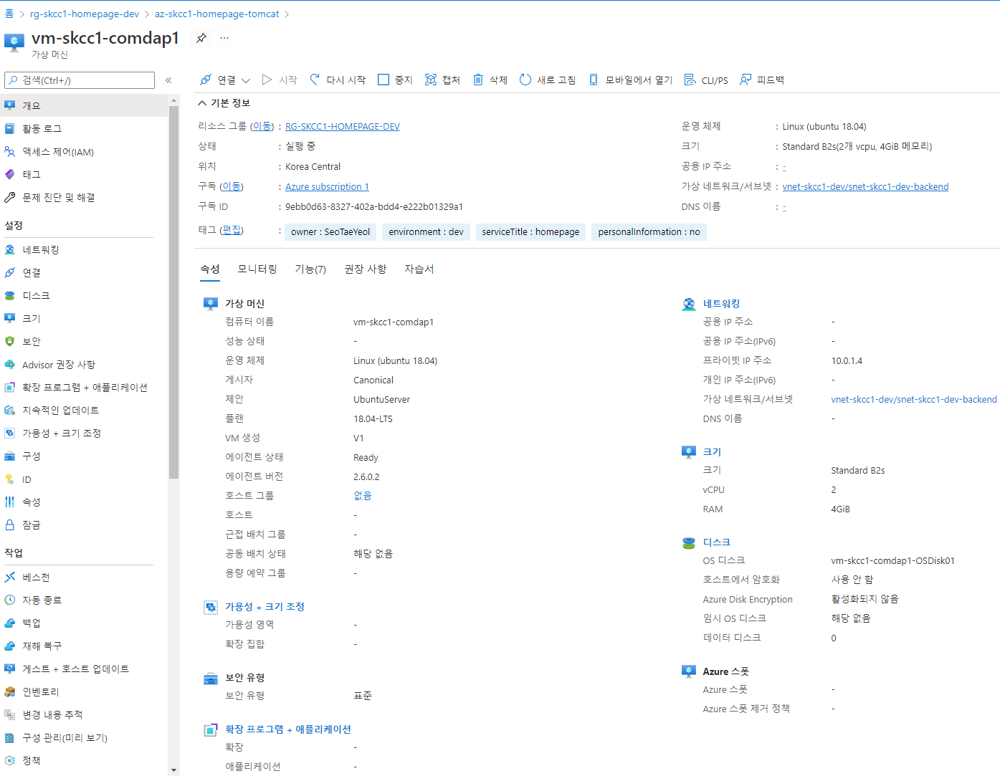  
### az vm open-port 명령은 vm 의 기본 NSG 에 rule 을 생성
- NSG 를 별도로 만들 경우 사용하지 않아도 됨
```bash
## 포트 오픈
## open-port-22
az vm open-port \
  --port 22 \
  --resource-group $groupName \
  --name $vmName

# Tomcat 포트
az vm open-port \
  --port 18080 \
  --resource-group $groupName \
  --name $vmName \
  --priority 1010

## AJP/1.3 Connector on port 8009
az vm open-port \
  --port 8009 \
  --resource-group $groupName \
  --name $vmName \
  --priority 1011
```
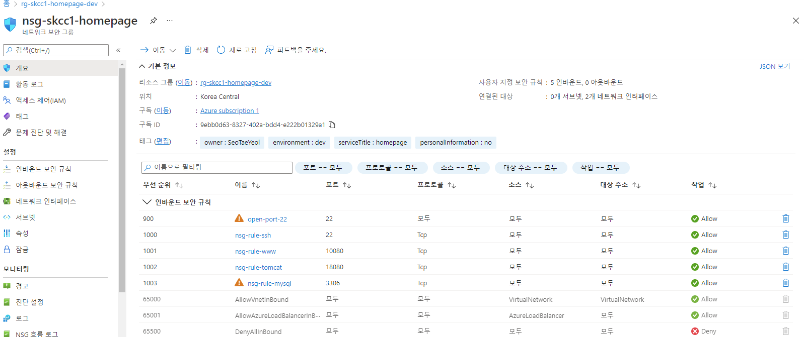

### Azure VM 에 백업 사용
```bash
# VM에 대한 백업 보호 사용을 설정
az backup protection enable-for-vm \
    --resource-group $groupName \
    --vault-name $rsvName \
    --vm $vmName \
    --policy-name DefaultPolicy
```
### 바로 백업
```bash
az backup protection backup-now \
  --resource-group $groupName \
  --vault-name $rsvName \
  --container-name $vmName \
  --item-name $vmName \
  --backup-management-type AzureIaaSVM \
  --retain-until 15-02-2022
```

```bash
ca07456@Azure:~$ az vm image list --output table
You are viewing an offline list of images, use --all to retrieve an up-to-date list
Offer                         Publisher               Sku                 Urn                                                             UrnAlias             Version
----------------------------  ----------------------  ------------------  --------------------------------------------------------------  -------------------  ---------
CentOS                        OpenLogic               7.5                 OpenLogic:CentOS:7.5:latest                                     CentOS               latest
debian-10                     Debian                  10                  Debian:debian-10:10:latest                                      Debian               latest
flatcar-container-linux-free  kinvolk                 stable              kinvolk:flatcar-container-linux-free:stable:latest              Flatcar              latest
openSUSE-Leap                 SUSE                    42.3                SUSE:openSUSE-Leap:42.3:latest                                  openSUSE-Leap        latest
RHEL                          RedHat                  7-LVM               RedHat:RHEL:7-LVM:latest                                        RHEL                 latest
SLES                          SUSE                    15                  SUSE:SLES:15:latest                                             SLES                 latest
UbuntuServer                  Canonical               18.04-LTS           Canonical:UbuntuServer:18.04-LTS:latest                         UbuntuLTS            latest
WindowsServer                 MicrosoftWindowsServer  2019-Datacenter     MicrosoftWindowsServer:WindowsServer:2019-Datacenter:latest     Win2019Datacenter    latest
WindowsServer                 MicrosoftWindowsServer  2016-Datacenter     MicrosoftWindowsServer:WindowsServer:2016-Datacenter:latest     Win2016Datacenter    latest
WindowsServer                 MicrosoftWindowsServer  2012-R2-Datacenter  MicrosoftWindowsServer:WindowsServer:2012-R2-Datacenter:latest  Win2012R2Datacenter  latest
WindowsServer                 MicrosoftWindowsServer  2012-Datacenter     MicrosoftWindowsServer:WindowsServer:2012-Datacenter:latest     Win2012Datacenter    latest
WindowsServer                 MicrosoftWindowsServer  2008-R2-SP1         MicrosoftWindowsServer:WindowsServer:2008-R2-SP1:latest         Win2008R2SP1         latest
```

## VM 중지
### Portal
#### 홈 > 가상 머신 > vm-skcc1-comdap1 > 중지

### PowerShell
```powershell
$groupName='rg-skcc1-homepage-dev'
$vmName='vm-skcc1-comdap1'

Stop-AzVM `
  -ResourceGroupName $groupName `
  -Name $vmName
```

### Azure CLI
```bash
groupName='rg-skcc1-homepage-dev'
vmName='vm-skcc1-comdap1'

az vm deallocate \
  --resource-group $groupName \
  --name $vmName
```

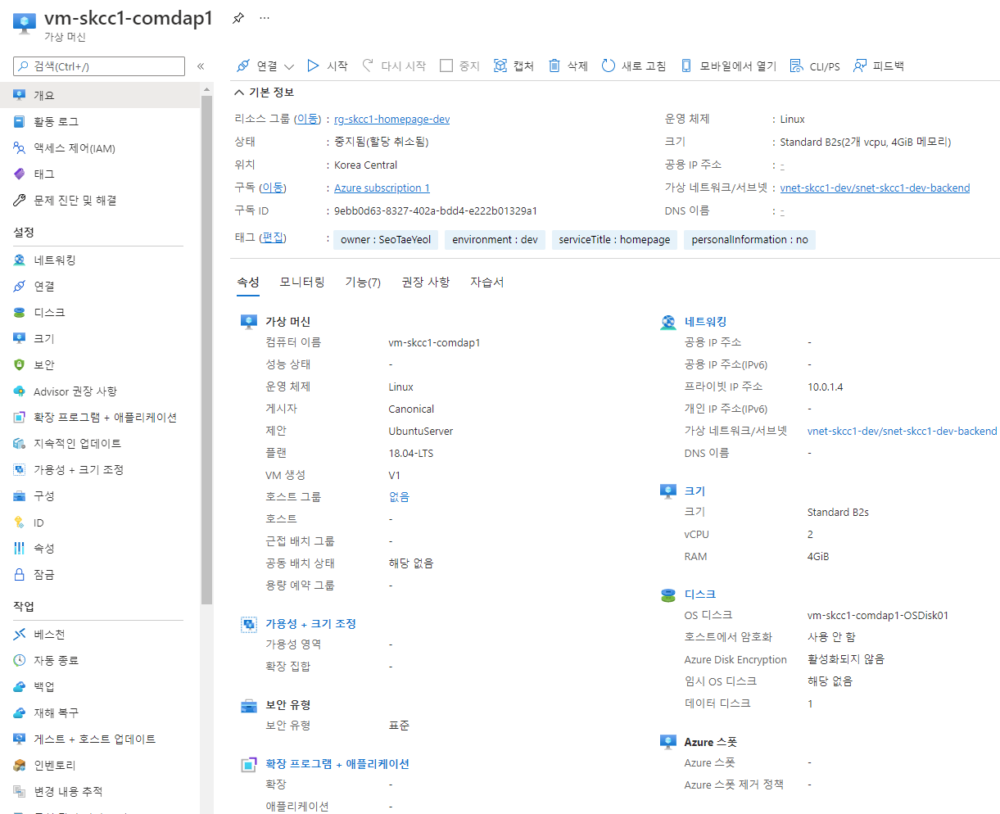

