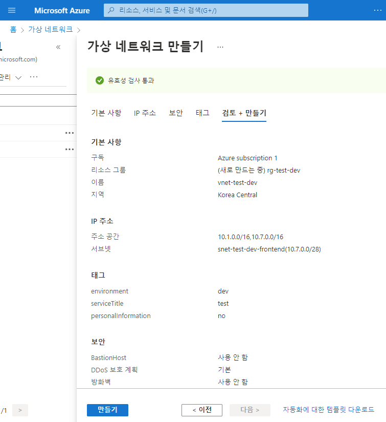
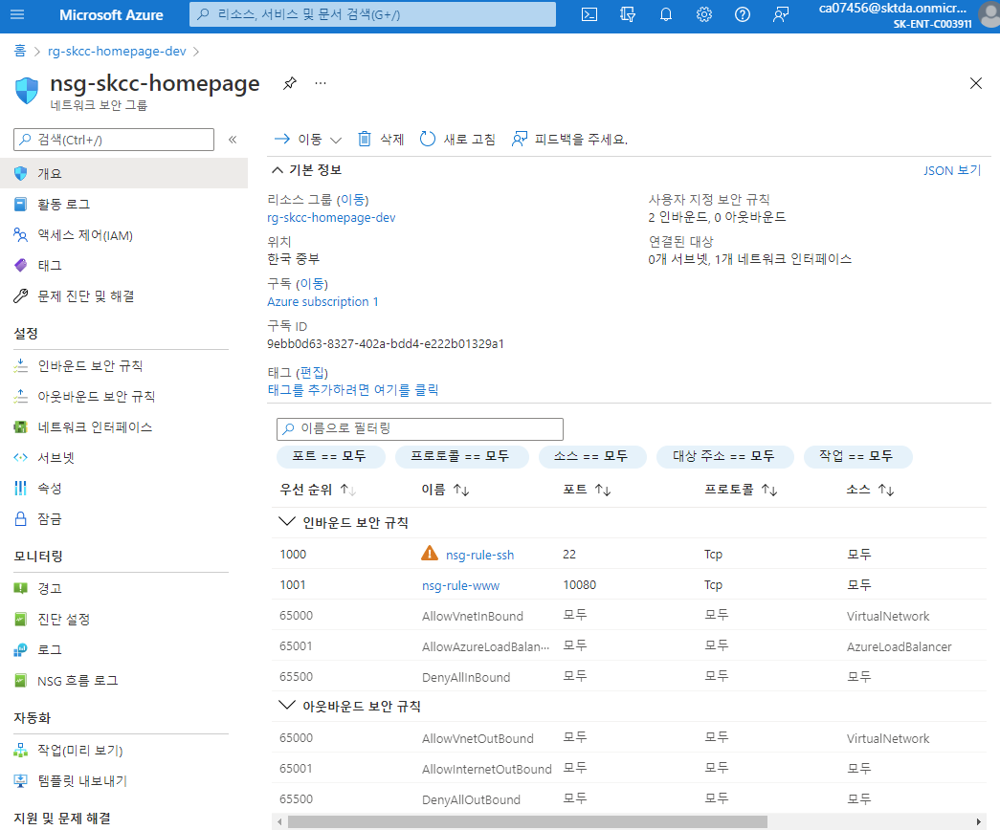
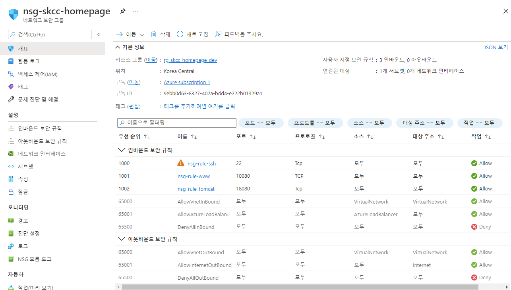
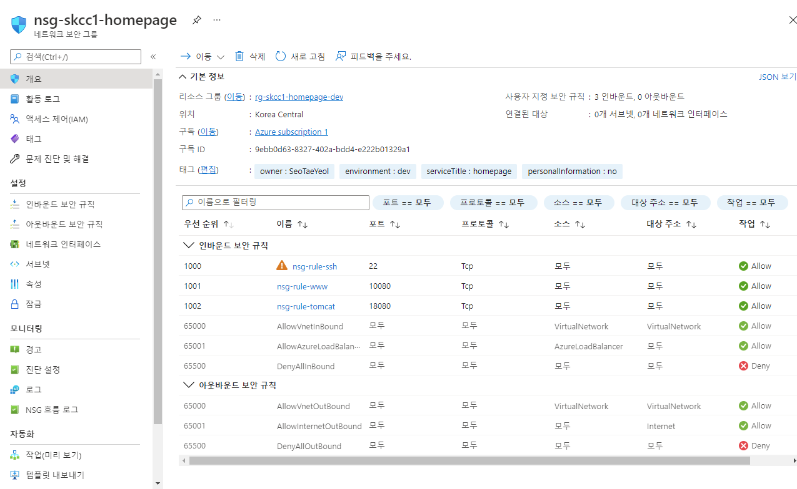

# Azure Virtual Network
Private Network 로 Azure VM(Virtual Machines)과 같은 다양한 형식의 Azure 리소스가 서로, 인터넷 및 특정 온-프레미스 네트워크와 안전하게 통신
## 가상 네트워크 피어링
### 가격 정책
- 동일 지역 : GB당 $0.01
### 가상 네트워크 주소공간
- 가상 네트워크 간의 주소 공간이 겹칠 경우 가상 네트워크는 피어링을 할 수 없음

## Portal
가상 네트워크 > +만들기
### 기본사항
- 프로젝트 정보
  - 리소스 그룹 : 새로만들기 : rg-test
- 인스턴스 정보
  - 이름 : vnet-test-dev
  - 지역 : Korea Central
### IP 주소
- IPv4 주소공간 : 10.0.0.0/16
- +서브넷 추가
  - 서브넷 이름: snet-test-dev-frontend
  - 서브넷 주소 범위 : 10.0.0.0/28
  - frontend subnet : snet-skcc-dev-frontend
  - backend subnet : snet-skcc-dev-backend
### 보안
- BastionHost : 사용 안 함
- DDoS Protection 표준 : 사용 안함
- 방화벽 : 사용 안함
### 태그  
- environment='dev'  
- serviceTitle='test'  
- personalInformation='no'  



---

## [PowerShell](https://shell.azure.com)
<a href="https://shell.azure.com">
  
</a>

```powershell

$groupName = "rg-skcc-homepage-dev"
$locationName = "koreacentral"

$vnetName = "vnet-skcc-dev"
$vnetAddressPrefix = '10.0.0.0/16'

$subnetFrontendName = 'snet-skcc-dev-frontend'
$subnetFronendAddressPrefix = '10.0.0.0/28'
$subnetBackendName = 'snet-skcc-dev-backend'
$subnetAddressPrefix = '10.0.1.0/28'

$tags = @{
  owner='SeoTaeYeol'
  environment='dev'
  serviceTitle='homepage'
  personalInformation='no'
}

$vnet = @{
    Name = $vnetName
    ResourceGroupName = $groupName
    Location = $locationName
    AddressPrefix = $vnetAddressPrefix    
    Tag = $tags    
}
$virtualNetwork = New-AzVirtualNetwork @vnet

Write-Host "# subnet 만들기"
Write-Host "## Create frontend subnet config ##"
$subnet_frontend = @{
    Name = $subnetFrontendName
    VirtualNetwork = $virtualNetwork
    AddressPrefix = $subnetFronendAddressPrefix
}
$subnetConfig_frontend = Add-AzVirtualNetworkSubnetConfig @subnet_frontend

Write-Host "## Create backend subnet config ##"
$subnet_backend = @{
    Name = $subnetBackendName
    VirtualNetwork = $virtualNetwork
    AddressPrefix = $subnetAddressPrefix
}
$subnetConfig_backend = Add-AzVirtualNetworkSubnetConfig @subnet_backend

Write-Host "## 가상 네트워크에 subnet 연결"
$virtualNetwork | Set-AzVirtualNetwork
```


## Azure CLI
### 생성하기
```bash
#!/bin/bash

groupName="rg-skcc1-homepage-dev"
locationName="koreacentral"

vnetName="vnet-skcc1-dev"
vnetAddressPrefix='10.0.0.0/16'

subnetFrontendName='snet-skcc1-dev-frontend'
subnetFrontendAddressPrefix='10.0.0.0/28'
subnetBackendName='snet-skcc1-dev-backend'
subnetBackendAddressPrefix='10.0.1.0/28'

tags='owner=SeoTaeYeol environment=dev serviceTitle=homepage personalInformation=no'

az network vnet create \
  --resource-group $groupName \
  --location $locationName \
  --name $vnetName \
  --address-prefix $vnetAddressPrefix \
  --subnet-name $subnetFrontendName \
  --subnet-prefix $subnetFrontendAddressPrefix \
  --tags $tags

az network vnet subnet create \
  -n $subnetBackendName  \
  --vnet-name $vnetName \
  -g $groupName \
  --address-prefixes $subnetBackendAddressPrefix

# network 그룹 생성 
groupName="rg-skcc1-network-dev"
vnetName="vnet-network-dev"
vnetAddressPrefix='10.21.0.0/16'

subnetFrontendName='snet-skcc1-network-frontend'
subnetFrontendAddressPrefix='10.21.0.0/28'
subnetBackendName='snet-skcc1-network-backend'
subnetBackendAddressPrefix='10.21.1.0/28'

az network vnet create \
  --resource-group $groupName \
  --location $locationName \
  --name $vnetName \
  --address-prefix $vnetAddressPrefix \
  --subnet-name $subnetFrontendName \
  --subnet-prefix $subnetFrontendAddressPrefix \
  --tags $tags

az network vnet subnet create \
  -n $subnetBackendName  \
  --vnet-name $vnetName \
  -g $groupName \
  --address-prefixes $subnetBackendAddressPrefix
```
### 삭제하기
```bash
az group delete -n $groupName
```

## NSG
### NSG Rule 만들기
| 명령 | 설명 |  
|:---|:---|  
| New-AzNetworkSecurityRuleConfig | 보안 규칙 구성을 생성 |  
| Set-AzNetworkSecurityRuleConfig | 보안 규칙 변경 | 
| New-AzNetworkSecurityGroup | 네트워크 보안 그룹 생성 |  
| Get-AzNetworkSecurityGroup | 이름으로 보안 그룹을 가져옴 |  
| Add-AzNetworkSecurityRuleConfig | 네트워크 보안 그룹에 보안 규칙 구성을 추가 |  
| Set-AzNetworkSecurityGroup | 네트워크 보안 그룹에 대한 목표 상태를 설정 |  

```powershell
## 기존 설정
$groupName = "rg-skcc-homepage-dev"
$locationName = "koreacentral"
$zone=1

$vnetName = "vnet-skcc-dev"

$nsgName = 'nsg-skcc-homepage' 

### Create an inbound network security group rule for port 22
$nsgRuleSSH = New-AzNetworkSecurityRuleConfig `
  -Name "nsg-rule-ssh"  `
  -Protocol "Tcp" `
  -Direction "Inbound" `
  -Priority 1000 `
  -SourceAddressPrefix * `
  -SourcePortRange * `
  -DestinationAddressPrefix * `
  -DestinationPortRange 22 `
  -Access "Allow"

### Create an inbound network security group rule for port 80
$nsgRuleWeb = New-AzNetworkSecurityRuleConfig `
  -Name "nsg-rule-www"  `
  -Protocol "Tcp" `
  -Direction "Inbound" `
  -Priority 1001 `
  -SourceAddressPrefix * `
  -SourcePortRange * `
  -DestinationAddressPrefix * `
  -DestinationPortRange 10080 `
  -Access "Allow"

### Create a network security group
$nsg = New-AzNetworkSecurityGroup `
  -ResourceGroupName $groupName `
  -Location $locationName `
  -Name $nsgName `
  -SecurityRules $nsgRuleSSH,$nsgRuleWeb

# Update the NSG.
### Get the NSG resource
$nsg = Get-AzNetworkSecurityGroup `
  -Name $nsgName `
  -ResourceGroupName $groupName 

### Add the inbound security rule.
$nsg | `
  Add-AzNetworkSecurityRuleConfig `
    -Name nsg-rule-tomcat  `
    -Description "Allow app port" `
    -Access Allow `
    -Protocol Tcp `
    -Direction Inbound `
    -Priority 1002 `
    -SourceAddressPrefix "*" `
    -SourcePortRange * `
    -DestinationAddressPrefix * `
    -DestinationPortRange 18080

### Update the NSG.
$nsg | Set-AzNetworkSecurityGroup
```
  
  

### Azure CLI
| 명령 | 메모 |  
|:---|:---|  
| az network nsg rule create | 보안 규칙 만들기 |  
| az network nsg rule update | 보안 규칙 변경 | 
| az network nsg create| 네트워크 보안 그룹 생성 |  
| az network nsg delete | 네트워크 보안 그룹 삭제 |  
| az network nsg show | 이름으로 보안 그룹을 가져옴 |  
구성을 추가 |  
| az network nsg update | 네트워크 보안 그룹 변경 |  
```bash
#!/bin/bash

## 기존 설정
groupName="rg-skcc1-homepage-dev"
locationName="koreacentral"

vnetName="vnet-skcc1-dev"

nsgName='nsg-skcc1-homepage' 

tags='owner=SeoTaeYeol environment=dev serviceTitle=homepage personalInformation=no'

az network nsg create \
  -g $groupName \
  -n $nsgName \
  --tags $tags

az network nsg rule create \
  -g $groupName \
  -n "nsg-rule-ssh"  \
  --priority 1000 \
  --nsg-name $nsgName \
  --protocol "Tcp" \
  --direction "Inbound" \
  --source-address-prefixes '*' \
  --source-port-ranges '*' \
  --destination-address-prefixes '*' \
  --destination-port-ranges 22 \
  --access "Allow"
  
az network nsg rule create \
  --name "nsg-rule-www"  \
  --resource-group $groupName \
  --nsg-name $nsgName \
  --protocol "Tcp" \
  --direction "Inbound" \
  --priority 1001 \
  --source-address-prefixes '*' \
  --source-port-ranges '*' \
  --destination-address-prefixes '*' \
  --destination-port-ranges 10080 \
  --access "Allow"

az network nsg rule create \
  --name "nsg-rule-tomcat"  \
  --nsg-name $nsgName \
  --resource-group $groupName \
  --protocol "Tcp" \
  --direction "Inbound" \
  --priority 1002 \
  --source-address-prefixes '*' \
  --source-port-ranges '*' \
  --destination-address-prefixes '*' \
  --destination-port-ranges 18080 \
  --access "Allow"

az network nsg rule create \
  --name "nsg-rule-mysql"  \
  --nsg-name $nsgName \
  --resource-group $groupName \
  --protocol "Tcp" \
  --direction "Inbound" \
  --priority 1003 \
  --source-address-prefixes '*' \
  --source-port-ranges '*' \
  --destination-address-prefixes '*' \
  --destination-port-ranges 3306 \
  --access "Allow"

az network nsg show \
  --resource-group $groupName \
  --name $nsgName
```

  

```bash
## NSG 삭제
az network nsg delete -g $groupName -n $nsgName

## NSG 목록 보기
az network nsg list -o table -g $groupName 

## NSG rule 보기
az network nsg rule list -o table -g $groupName --name $nsgName

## 지역 'koreacentral'에 생성된 NSG 보기
az network nsg list \
--query "[?location=='koreacentral']" -o table
```