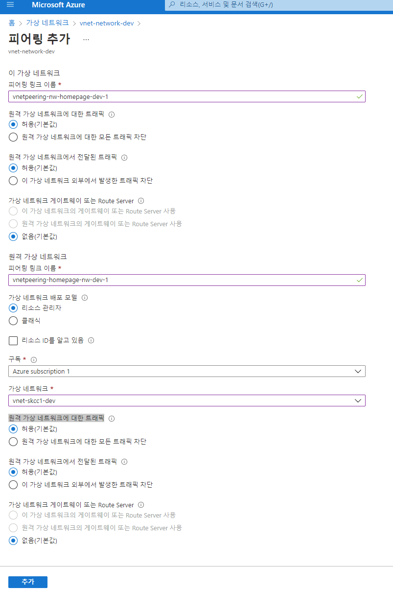
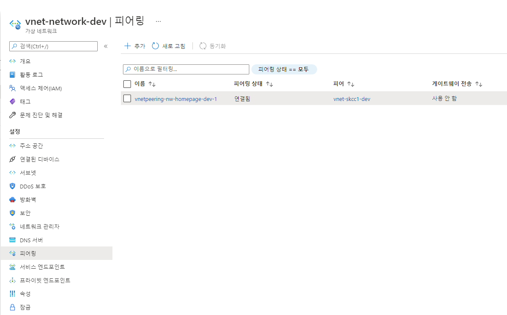
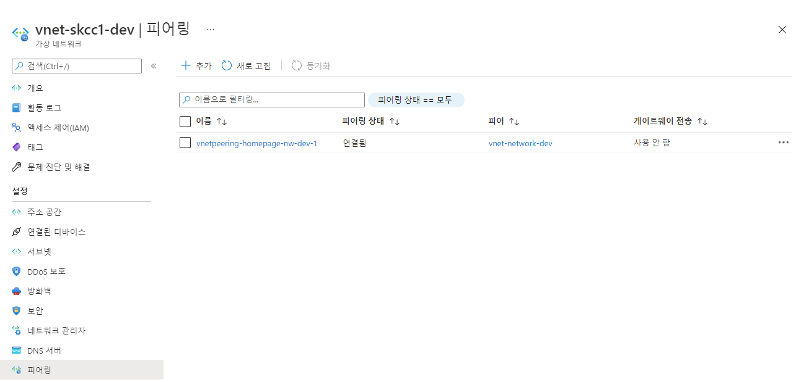

# 가상 네트워크 피어링
* [가상 네트워크 피어링](https://docs.microsoft.com/ko-kr/azure/virtual-network/virtual-network-peering-overview)
* [Virtual Network 가격](https://azure.microsoft.com/ko-kr/pricing/details/virtual-network/)
* [자습서: Azure Portal을 사용하여 가상 네트워크 피어링으로 가상 네트워크 연결](https://docs.microsoft.com/ko-kr/azure/virtual-network/tutorial-connect-virtual-networks-portal)  
* [Azure CLI를 사용하여 가상 네트워크 피어링으로 가상 네트워크 연결](https://docs.microsoft.com/ko-kr/azure/virtual-network/tutorial-connect-virtual-networks-cli)
* [PowerShell을 사용하여 VNet-VNet VPN Gateway 연결 구성](https://docs.microsoft.com/ko-kr/azure/vpn-gateway/vpn-gateway-vnet-vnet-rm-ps)
* [PowerShell과 함께 Application Gateway를 사용하여 엔드투엔드 TLS 구성](https://github.com/MicrosoftDocs/azure-docs.ko-kr/blob/master/articles/application-gateway/application-gateway-end-to-end-ssl-powershell.md)  
* [How to re-size Azure virtual networks that are peered—now in preview](https://azure.microsoft.com/ko-kr/blog/how-to-resize-azure-virtual-networks-that-are-peered-now-in-preview/)

## 만드는 이유
- 두 네트워크 간에 트래픽을 라우팅하는 데 사용
- 지역 간 지리적 중복 및 지리적 상태
- 분리 또는 관리 경계를 가진 지역별 다중 계층 애플리케이션

## 종류
| 가상 네트워크 피어링 | 동일한 Azure 지역 내에서 가상 네트워크를 연결 |
| 글로벌 가상 네트워크 피어링 | Azure 지역에서 가상 네트워크를 연결 |

## 주의사항
피어링을 작동시키려면 피어링 링크를 두 개 만들어야 하며, 원격 가상 네트워크를 선택하면 Azure가 피어링 링크를 두 개 만듭니다.  
Portal 삭제시도 2개를 동시 삭제함  
- 스크립트로 만들 경우 2개를 만듭니다.
## Portal
### 홈 > 가상 네트워크 > vnet-network-dev | 피어링 > "피어링 추가"
#### 이 가상 네트워크
- 피어링 링크 이름 이름 : vnetpeering-nw-homepage-dev-1
- 원격 가상 네트워크에 대한 트래픽 : 허용(기본값)
- 원격 가상 네트워크에서 전달된 트래픽 : 허용(기본값)
- 가상 네트워크 게이트웨이 또는 Route Server : 없음(기본값)
#### 원격 가상네트워크
- 피어링 링크 이름 : vnetpeering-homepage-nw-dev-1
- 가상 네트워크 배포 모델 : 리소스 관리자
- 구독 : Azure subscription 1
- 가상 네트워크 : vnet-skcc1-dev
- 원격 가상 네트워크에 대한 트래픽 : 허용(기본값)
- 원격 가상 네트워크에서 전달된 트래픽 : 허용(기본값)
- 가상 네트워크 게이트웨이 또는 Route Server : 없음(기본값)  

  

### 결과 확인
#### vnet-network-dev | 피어링
  
#### vnet-skcc1-dev | 피어링
  


## [PowerShell](https://shell.azure.com)
<a href="https://shell.azure.com">
  
</a>

### Peering
myVirtualNetwork2에서 myVirtualNetwork1으로 피어링을 만들 때까지 해당 피어링은 Initiated 상태를 유지

#### 변수설정
```powershell
$groupNWName = "rg-skcc1-network-dev"
$vnetNWName = "vnet-network-dev"
$groupHomepageName = "rg-skcc-homepage-dev"
$vnetHomepageName = "vnet-skcc1-dev"
$peeringNWHomepageName = 'vnetpeering-nw-homepage-dev-1'
$peeringHomepageNWName = 'vnetpeering-homepage-nw-dev-1'

$tags = @{
  owner='SeoTaeYeol'
  environment='dev'
  serviceTitle='homepage'
  personalInformation='no'
}
```

```powershell
Add-AzVirtualNetworkPeering `
  -Name myVirtualNetwork1-myVirtualNetwork2 `
  -VirtualNetwork $virtualNetwork1 `
  -RemoteVirtualNetworkId $virtualNetwork2.Id
# PeeringState : Initiated

Add-AzVirtualNetworkPeering `
  -Name myVirtualNetwork2-myVirtualNetwork1 `
  -VirtualNetwork $virtualNetwork2 `
  -RemoteVirtualNetworkId $virtualNetwork1.Id
```

### 상태 확인
- PeeringState : Connected
```powershell
Get-AzVirtualNetworkPeering `
  -ResourceGroupName myResourceGroup `
  -VirtualNetworkName myVirtualNetwork1 `
  | Select PeeringState
```


## Azure CLI

### 0. 변수 설정
```bash
groupNWName="rg-skcc1-network-dev"
vnetNWName="vnet-network-dev"
groupHomepageName="rg-skcc1-homepage-dev"
vnetHomepageName="vnet-skcc1-dev"
peeringNWHomepageName='vnetpeering-nw-homepage-dev-1'
peeringHomepageNWName='vnetpeering-homepage-nw-dev-1'

tags='owner=SeoTaeYeol environment=dev serviceTitle=homepage personalInformation=no'
```

### 1. 네트워크의 ID를 가져오고 ID를 변수에 저장
```bash
# Get the id for $vnetNWName
vNet1Id=$(az network vnet show \
  --resource-group $groupNWName \
  --name $vnetNWName \
  --query id \
  --out tsv)

# Get the id for $vnetHomepageName
vNet2Id=$(az network vnet show \
  --resource-group $groupHomepageName \
  --name $vnetHomepageName \
  --query id \
  --out tsv)
```

### 2. "vnet-network-dev" 에서 "vnet-skcc1-dev" 로 피어링을 만듬
```bash
az network vnet peering create \
  --name $peeringNWHomepageName \
  --resource-group $groupNWName \
  --vnet-name $vnetNWName \
  --remote-vnet $vNet2Id \
  --allow-vnet-access
az network vnet peering create \
  --name $peeringHomepageNWName \
  --resource-group $groupHomepageName \
  --vnet-name $vnetHomepageName \
  --remote-vnet $vNet1Id \
  --allow-vnet-access
```

### 3. peeringState 가 Connected 로 변경되었는지 확인
```bash
az network vnet peering show \
  --name $peeringNWHomepageName \
  --resource-group $groupNWName \
  --vnet-name $vnetNWName \
  --query peeringState

az network vnet peering show \
  --name $peeringHomepageNWName \
  --resource-group $groupHomepageName \
  --vnet-name $vnetHomepageName \
  --query peeringState
```
- 두 가상 네트워크의 피어링에 대한 peeringState가 Connected가 될 때까지, 한 가상 네트워크의 리소스는 다른 가상 네트워크의 리소스와 통신할 수 없습니다.
- 시간이 좀 걸림
  


### 4. 생성 조회
```bash
az network vnet peering list \
  -o table \
  -g $groupNWName \
  --vnet-name $vnetNWName

az network vnet peering list \
  -o table \
  -g $groupHomepageName \
  --vnet-name $vnetHomepageName
```

## 수행 결과(Azure CLI, Windows)
```powershell
PS C:\workspace\AzureBasic\1.IaaS> az network vnet list -o table    
                                                
Name             ResourceGroup         Location      NumSubnets    Prefixes      DnsServers    DDOSProtection
---------------  --------------------  ------------  ------------  ------------  ------------  ----------------
vnet-kubernetes  rg-kubernetes         koreacentral  1             10.0.0.0/16                 False
vnet-skcc-ag     rg-skcc-ag            koreacentral  2             10.21.0.0/16                False
vnet-skcc-dev    rg-skcc-homepage-dev  koreacentral  2             10.0.0.0/16                 False
PS C:\workspace\AzureBasic\1.IaaS> $vNet1Id=$(az network vnet show `
>>   --resource-group rg-skcc-ag `
>>   --name vnet-skcc-ag `
>>   --query id --out tsv)

PS C:\workspace\AzureBasic\1.IaaS> $vNet2Id=$(az network vnet show `
>>   --resource-group rg-skcc-homepage-dev `
>>   --name vnet-skcc-dev `
>>   --query id `
>>   --out tsv)
PS C:\workspace\AzureBasic\1.IaaS> az network vnet peering create `
>>   --name peering-vnet-skcc-ag-vnet-skcc-dev `
>>   --resource-group rg-skcc-ag `
>>   --vnet-name vnet-skcc-ag `
>>   --remote-vnet $vNet2Id `
>>   --allow-vnet-access

{
  "allowForwardedTraffic": false,
  "allowGatewayTransit": false,
  "allowVirtualNetworkAccess": true,
  "etag": "W/\"cb1cd6df-fa0e-4cb7-9a35-9a12e60a4974\"",
  "id": "/subscriptions/9ebb0d63-8327-402a-bdd4-e222b01329a1/resourceGroups/rg-skcc-ag/providers/Microsoft.Network/virtualNetworks/vnet-skcc-ag/virtualNetworkPeerings/peering-vnet-skcc-ag-vnet-skcc-dev",
  "name": "peering-vnet-skcc-ag-vnet-skcc-dev",
  "peeringState": "Initiated",
  "provisioningState": "Succeeded",
  "remoteAddressSpace": {
    "addressPrefixes": [
      "10.0.0.0/16"
    ]
  },
  "remoteBgpCommunities": null,
  "remoteVirtualNetwork": {
    "id": "/subscriptions/9ebb0d63-8327-402a-bdd4-e222b01329a1/resourceGroups/rg-skcc-homepage-dev/providers/Microsoft.Network/virtualNetworks/vnet-skcc-dev",
    "resourceGroup": "rg-skcc-homepage-dev"
  },
  "resourceGroup": "rg-skcc-ag",
  "type": "Microsoft.Network/virtualNetworks/virtualNetworkPeerings",
  "useRemoteGateways": false
}
PS C:\workspace\AzureBasic\1.IaaS> az network vnet peering show `
>>   --name peering-vnet-skcc-ag-vnet-skcc-dev `
>>   --resource-group rg-skcc-ag `
>>   --vnet-name vnet-skcc-ag `
>>   --query peeringState

"Initiated"
PS C:\workspace\AzureBasic\1.IaaS> az network vnet peering show `
>>   --name peering-vnet-skcc-ag-vnet-skcc-dev `
>>   --resource-group rg-skcc-ag `
>>   --vnet-name vnet-skcc-ag `
>>   --query peeringState

"Initiated"
PS C:\workspace\AzureBasic\1.IaaS> az network vnet peering show `
>>   --name peering-vnet-skcc-ag-vnet-skcc-dev `
>>   --resource-group rg-skcc-ag `
>>   --vnet-name vnet-skcc-ag `
>>   --query peeringState

"Initiated"
PS C:\workspace\AzureBasic\1.IaaS> az network vnet peering show `
>>   --name peering-vnet-skcc-ag-vnet-skcc-dev `
>>   --resource-group rg-skcc-ag `
>>   --vnet-name vnet-skcc-ag `
>>   --query peeringState

"Initiated"
PS C:\workspace\AzureBasic\1.IaaS> az network vnet peering show `
>>   --name peering-vnet-skcc-ag-vnet-skcc-dev `
>>   --resource-group rg-skcc-ag `
>>   --vnet-name vnet-skcc-ag `
>>   --query peeringState

"Initiated"
PS C:\workspace\AzureBasic\1.IaaS> az network vnet peering show `
>>   --name peering-vnet-skcc-ag-vnet-skcc-dev `
>>   --resource-group rg-skcc-ag `
>>   --vnet-name vnet-skcc-ag `
>>   --query peeringState

"Initiated"
PS C:\workspace\AzureBasic\1.IaaS> 
```

```powershell
PS C:\workspace\AzureBasic\1.IaaS> az network vnet peering list -o table -g rg-skcc-ag --vnet-name vnet-skcc-ag

AllowForwardedTraffic    AllowGatewayTransit    AllowVirtualNetworkAccess    Name                                PeeringState    ProvisioningState    ResourceGroup    UseRemoteGateways
-----------------------  ---------------------  ---------------------------  ----------------------------------  --------------  -------------------  ---------------  -------------------     
False                    False                  True                         peering-vnet-skcc-ag-vnet-skcc-dev  Initiated       Succeeded            rg-skcc-ag       False
PS C:\workspace\AzureBasic\1.IaaS> 
```
