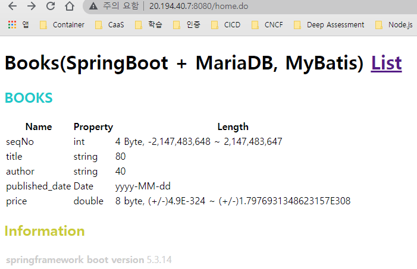

# Springboot MySQL Sample

> [Accessing data with MySQL](https://spring.io/guides/gs/accessing-data-mysql/)  
> [Azure Database for MySQL에서 Spring Data JDBC 사용](https://docs.microsoft.com/ko-kr/azure/developer/java/spring-framework/configure-spring-data-jdbc-with-azure-mysql)  


## Azure MySQL 접속 
- 서버 이름 : mysql-homepage.mysql.database.azure.com
- 서버 관리자 로그인 이름 : mysql@mysql-homepage
- Sample Database 로그인 이름 : tutorial@mysql-homepage
- MySQL 버전 : 5.7

### 접속
```
mysql -h mysql-homepage.mysql.database.azure.com 
  -u mysql@mysql-homepage -p
```

### DB 만들기
```
create database tutorial default character set utf8;
```

### 사용자 만들기
#### tutorial database 의 로컬 접속 사용자 만들기
```
create user 'tutorial'@'localhost' identified by 'tutorial';
```

#### tutorial database 의 로컬 및 리모트 접속 사용자 만들기
```
create user 'tutorial'@'%' identified by 'tutorial';
```

### 권한 주기

#### tutorial database 를 로컬 접속 가능하도록 tutorial user 에게 권한 주기
```
grant all privileges on tutorial.* to 'tutorial'@'localhost';
```

#### tutorial database 를 로컬 및 리모트에서도 접속 가능하도록 설정
```
grant all privileges on tutorial.* to 'tutorial'@'%' identified by 'tutorial';
```
#### 권한 변경 사항 저장
```
flush privileges;
```

### Table 만들기
```
CREATE TABLE IF NOT EXISTS TUTORIAL.BOOKS
(
  SeqNo INT NOT NULL AUTO_INCREMENT,
  Title VARCHAR(20) NOT NULL,
  Author VARCHAR(20) NOT NULL,
  Price DOUBLE NOT NULL DEFAULT 0,
  published_date DATE NOT NULL,
  PRIMARY KEY(SeqNo)
);
```

### 데이터 넣기
```
insert into books (Title, Author, Price, published_date)
values ('TCP/IP 완벽 가이드', '강유,김혁진,...', 45000, '2021-12-01');
insert into books (Title, Author, Price, published_date)
values ('NGINX Cookbook', '데릭 디용기', 20000, '2021-06-01');
insert into books (Title, Author, Price, published_date)
values ('Learning CoreDNS', '존 벨라마릭,크리켓 리우', 25000, '2021-08-31');

insert into books (Title, Author, Price, published_date) values
 ('TCP/IP 완벽 가이드', '강유,김혁진,...', 45000, '2021-12-01'),
 ('NGINX Cookbook', '데릭 디용기', 20000, '2021-06-01'),
 ('Learning CoreDNS', '존 벨라마릭,크리켓 리우', 25000, '2021-08-31');
```

### 실행 예
```
azureuser@vm-skcc1-comdap1:~$ mysql -h mysql-homepage.mysql.database.azure.com -u mysql@mysql-homepage -p
Enter password:
Welcome to the MySQL monitor.  Commands end with ; or \g.
Your MySQL connection id is 64703
Server version: 5.6.47.0 MySQL Community Server (GPL)

Copyright (c) 2000, 2022, Oracle and/or its affiliates.

Oracle is a registered trademark of Oracle Corporation and/or its
affiliates. Other names may be trademarks of their respective
owners.

Type 'help;' or '\h' for help. Type '\c' to clear the current input statement.

mysql> show databases ;
+--------------------+
| Database           |
+--------------------+
| information_schema |
| mysql              |
| performance_schema |
| sys                |
+--------------------+
4 rows in set (0.01 sec)

mysql> use mysql
Reading table information for completion of table and column names
You can turn off this feature to get a quicker startup with -A

selDatabase changed
mysql> select version( );
+------------+
| version( ) |
+------------+
| 5.7.32-log |
+------------+
1 row in set (0.00 sec)

mysql> create database tutorial default character set utf8;
Query OK, 1 row affected (0.04 sec)

mysql> show databases ;
+--------------------+
| Database           |
+--------------------+
| information_schema |
| mysql              |
| performance_schema |
| sys                |
| tutorial           |
+--------------------+
5 rows in set (0.04 sec)

mysql> create user 'tutorial'@'localhost' identified by 'tutorial';
Query OK, 0 rows affected (0.02 sec)

mysql> grant all privileges on tutorial.* to 'tutorial'@'localhost';
Query OK, 0 rows affected, 1 warning (0.02 sec)

mysql> grant all privileges on tutorial.* to 'tutorial'@'%';
Query OK, 0 rows affected, 1 warning (0.05 sec)

mysql> flush privileges
    -> ;
Query OK, 0 rows affected (0.00 sec)

mysql> use tutorial
Reading table information for completion of table and column names
You can turn off this feature to get a quicker startup with -A

Database changed
mysql> show tables ;
+--------------------+
| Tables_in_tutorial |
+--------------------+
| books              |
+--------------------+
1 row in set (0.00 sec)

mysql> insert into books (Title, Author, Price, published_date) values
    ->  ('TCP/IP 완벽 가이드', '강유,김혁진,...', 45000, '2021-12-01'),
    ->  ('NGINX Cookbook', '데릭 디용기', 20000, '2021-06-01'),
    ->  ('Learning CoreDNS', '존 벨라마릭,크리켓 리우', 25000, '2021-08-31');
Query OK, 3 rows affected (0.03 sec)
Records: 3  Duplicates: 0  Warnings: 0

mysql> select * from books ;
+-------+-------------------------+-----------------------------------+-------+----------------+
| SeqNo | Title                   | Author                            | Price | published_date |
+-------+-------------------------+-----------------------------------+-------+----------------+
|     1 | TCP/IP 완벽 가이드      | 강유,김혁진,...                   | 45000 | 2021-12-01     |
|     2 | NGINX Cookbook          | 데릭 디용기                       | 20000 | 2021-06-01     |
|     3 | Learning CoreDNS        | 존 벨라마릭,크리켓 리우           | 25000 | 2021-08-31     |
+-------+-------------------------+-----------------------------------+-------+----------------+
3 rows in set (0.00 sec)

mysql> exit
Bye
azureuser@vm-skcc1-comdap1:~$
```

```
PS C:\Program Files\MariaDB 10.8\data> mysql -u root -p
Enter password: *******
ERROR 1045 (28000): Access denied for user 'root'@'localhost' (using password: YES)
PS C:\Program Files\MariaDB 10.8\data> mysql -u root -p
Enter password: ********
Welcome to the MariaDB monitor.  Commands end with ; or \g.
Your MySQL connection id is 6
Server version: 5.7.36-log MySQL Community Server (GPL)

Copyright (c) 2000, 2018, Oracle, MariaDB Corporation Ab and others.

Type 'help;' or '\h' for help. Type '\c' to clear the current input statement.

MySQL [(none)]> create user 'tutorial'@'%' identified by 'tutorial';
ERROR 1396 (HY000): Operation CREATE USER failed for 'tutorial'@'%'
MySQL [(none)]>  show grants for 'tutorial'@'%';
+-----------------------------------------------------------------+
| Grants for tutorial@%                                           |
+-----------------------------------------------------------------+
| GRANT ALL PRIVILEGES ON *.* TO 'tutorial'@'%' WITH GRANT OPTION |
| GRANT ALL PRIVILEGES ON `tutorial`.* TO 'tutorial'@'%'          |
+-----------------------------------------------------------------+
2 rows in set (0.000 sec)

MySQL [(none)]> drop user 'tutorial';
Query OK, 0 rows affected (0.001 sec)

MySQL [(none)]> create user 'tutorial'@'%' identified by 'tutorial';
Query OK, 0 rows affected (0.000 sec)

MySQL [(none)]> grant all privileges on tutorial.* to 'tutorial'@'%' identified by 'tutorial';
Query OK, 0 rows affected, 1 warning (0.000 sec)

MySQL [(none)]> flush privileges;
Query OK, 0 rows affected (0.002 sec)

MySQL [(none)]>
```

## Spring
```
server.port=8080

# MySQL

logging.level.org.springframework.jdbc.core=DEBUG

spring.datasource.driver-class-name=com.mysql.cj.jdbc.Driver
spring.datasource.url=jdbc:mysql://mysql-homepage.mysql.database.azure.com:3306/tutorial
spring.datasource.username=tutorial@mysql-homepage
spring.datasource.password=tutorial

 spring.datasource.initialization-mode=always

# JSP
# JSP 수정시 서버 재시작없이 바로 적용될 수 있게 설정(개발, 테스트 용)
devtools.livereload.enabled=true

spring.mvc.view.prefix=/WEB-INF/jsp/
spring.mvc.view.suffix=.jsp
# spring.mvc.view.suffix=.do
```
## Tomcat 화면

