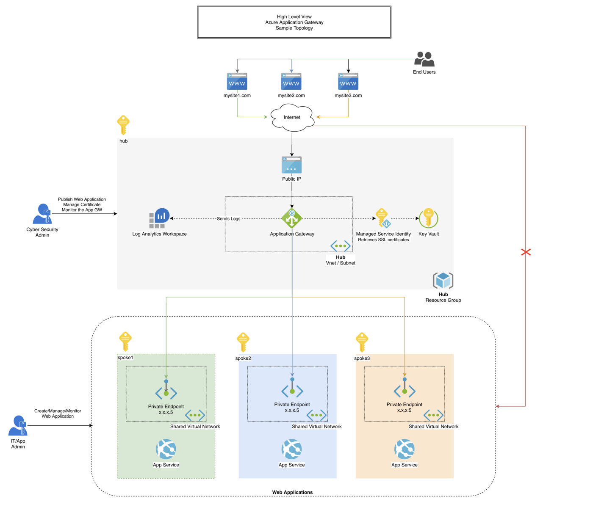

# 

> [Build an Azure Application Gateway with Terraform](https://faun.pub/build-an-azure-application-gateway-with-terraform-8264fbd5fa42) 

  

## 스크립트
Application Gateway를 빌드하는 데 사용되는 단계 나열
| 순서 | 파일 | 명칭 | 설명 |
|:---|:---|:---|:---|
| 0 | agw-var.tf | 변수 설정  재사용되기 때문에 locals 블록을 사용, 보다 쉽게 ​​유지 관리 |
| 1 | agw-log.tf | Log Analytics Workspace | 관리 솔루션 Azure Application Gateway 분석 이 포함 된 Log Analytics 작업 영역 |
| 2 | agw-msi.tf | Managed Service Identity | Key Vault에 대한 권한을 갖게 될 Application Gateway의 관리형 서비스 ID |
| 3 | agw-kv.tf | Key Vault, Policy, certificate | |  
| 4 | agw-pip.tf | Public IP ||
| 5 | agw-agw.tf | Application Gateway | Application Gateway v2 및 가용 영역 인식 리소스를 사용할 때 사용 |
| 6 | agw-diag.tf | Diagonostic Setting | 진단 설정을 Log Analytics 작업 영역으로 보냄 |  

## 자원
| | resource | 설명 |
|:---|:---|:---|
| | azurerm_key_vault | Manages a Key Vault. |
| | azurerm_key_vault_access_policy | | 


## 실행
### terraform init
```
PS C:\workspace\AzureBasic\1.IaaS\Terraform\ApplicationGateway> terraform init

Initializing the backend...

Initializing provider plugins...
- Finding latest version of hashicorp/azurerm...
- Finding latest version of hashicorp/time...
- Installing hashicorp/azurerm v3.0.1...
- Installed hashicorp/azurerm v3.0.1 (signed by HashiCorp)
- Installing hashicorp/time v0.7.2...
- Installed hashicorp/time v0.7.2 (signed by HashiCorp)

Terraform has created a lock file .terraform.lock.hcl to record the provider
selections it made above. Include this file in your version control repository
so that Terraform can guarantee to make the same selections by default when
you run "terraform init" in the future.

Terraform has been successfully initialized!

You may now begin working with Terraform. Try running "terraform plan" to see
any changes that are required for your infrastructure. All Terraform commands
should now work.

If you ever set or change modules or backend configuration for Terraform,
rerun this command to reinitialize your working directory. If you forget, other
commands will detect it and remind you to do so if necessary.
PS C:\workspace\AzureBasic\1.IaaS\Terraform\ApplicationGateway> 
```
