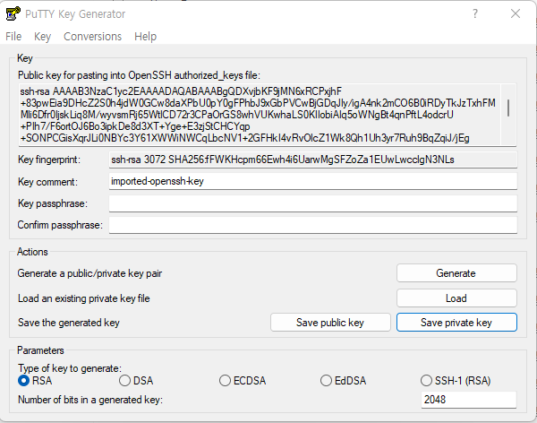
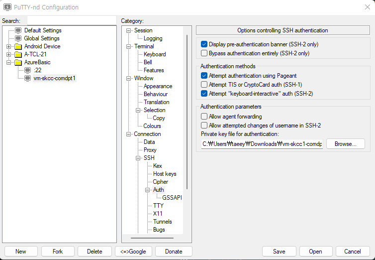

# VM 접속

## PuTTY VM 접속
Azure VM 생성시 만든 pem 파일을 ssh-keygen 을 통해 ppk 로 만들 경우 사용 

> [putty](https://www.putty.org/)  
> [puttynd : 세션 관리 기능과 멀티 탭 기능 ](https://sourceforge.net/projects/putty-nd/)  
> [putty.exe download](https://www.chiark.greenend.org.uk/~sgtatham/putty/latest.html)  
> [puttygen.exe](https://the.earth.li/~sgtatham/putty/latest/w64/puttygen.exe)  

### PEM -> PPK 포맷 변환
#### Conversions > import key -> Save private key


### putty 인증서(ppk) 설정
#### Connection > SSH > Auth


###  puttynd 설치
[puttynd-설치.png](./img/puttynd-설치.png)

## Windows에서 접속
### ssh -i <private key path> azureuser@1.1.1.1
- ssh -i vm-skcc1-comdpt1_key.pem azureuser@1.1.1.1

### 퍼미션 오류
- VM 생성시 받은 PEM 은 사용시 오류 발생
```
PS C:\workspace\AzureBasic> ssh -i vm-skcc1-comdpt1_key.pem azureuser@1.1.1.1
Bad permissions. Try removing permissions for user: NT AUTHORITY\\Authenticated Users (S-1-5-11) on file C:/workspace/AzureBasic/vm-skcc1-comdpt1_key.pem.
@@@@@@@@@@@@@@@@@@@@@@@@@@@@@@@@@@@@@@@@@@@@@@@@@@@@@@@@@@@
@         WARNING: UNPROTECTED PRIVATE KEY FILE!          @
@@@@@@@@@@@@@@@@@@@@@@@@@@@@@@@@@@@@@@@@@@@@@@@@@@@@@@@@@@@
Permissions for 'vm-skcc1-comdpt1_key.pem' are too open.
It is required that your private key files are NOT accessible by others.
This private key will be ignored.
Load key "vm-skcc1-comdpt1_key.pem": bad permissions
azureuser@1.1.1.1: Permission denied (publickey).
PS C:\workspace\AzureBasic>
```

### Permission 퍼미션 변경
#### Powershell
- 환경 변수 사용법이 CMD 와 다름
- 사용자 보기 : $env:USERNAME
- 전체 환경 변수 보기 : $env
```powershell
icacls.exe vm-skcc1-comdpt1_key.pem /reset
icacls.exe vm-skcc1-comdpt1_key.pem /grant:r "$($env:USERNAME):(R)" 
icacls.exe vm-skcc1-comdpt1_key.pem /inheritance:r
```

#### CMD
```powershell
# cmd에서만 되고 powershell에서는 안됨
# myec2.pem 자리에 본인의 pem 파일 명을 대입하면 됨
# cmd는 pem 파일이 있는 폴더에서 실행해야 함

icacls.exe vm-skcc1-comdpt1_key.pem /reset
icacls.exe 'vm-skcc1-comdpt1_key.pem' /grant:r %username%:(R)
icacls.exe vm-skcc1-comdpt1_key.pem /inheritance:r
```

### Permission 변경 후 접속 화면
```
PS C:\workspace\AzureBasic> ssh -i vm-skcc1-comdpt1_key.pem azureuser@52.231.38.231
Welcome to Ubuntu 20.04.3 LTS (GNU/Linux 5.11.0-1028-azure x86_64)

 * Documentation:  https://help.ubuntu.com
 * Management:     https://landscape.canonical.com
 * Support:        https://ubuntu.com/advantage

  System information as of Sun Feb  6 02:09:13 UTC 2022

  System load:  0.0               Processes:             105
  Usage of /:   5.3% of 28.90GB   Users logged in:       0
  Memory usage: 54%               IPv4 address for eth0: 10.0.1.4
  Swap usage:   0%

 * Super-optimized for small spaces - read how we shrank the memory
   footprint of MicroK8s to make it the smallest full K8s around.

   https://ubuntu.com/blog/microk8s-memory-optimisation

10 updates can be applied immediately.
6 of these updates are standard security updates.
To see these additional updates run: apt list --upgradable


Last login: Sun Feb  6 02:05:29 2022 from 220.72.88.52
azureuser@vm-skcc1-comdpt1:~$ 
```

## Linux 에서 접속
```
chmod 400 vm-skcc1-comdpt1_key.pem
ssh -i vm-skcc1-comdpt1_key.pem azureuser@1.1.1.1
```


## 용어
### PEM(Privacy Enhanced Mail Certificate)
- Key Pair 포맷으로 ssh-keygen 명령을 통해 생성됨
- 이메일을 통해 바이너리 데이터를 보내는 복잡한 과정에서 발생
- 인증 기관 파일, 공개 및 개인 키, 루트 인증서 등을 보관하는 데 사용
#### PEM 형식
- 바이너리를 base64 로 인코딩
- 확장자 : CER, CRT, 공개 또는 개인 키의 경우 KEY와 같은 다른 파일 확장자를 대신 사용할 수 있음

### PPK(PuTTY Private Key)
PuTTY에서 사용하는 키 포맷으로 PuTTY Key Generator를 통해 저장하면 기본적으로 생성되는 포맷

