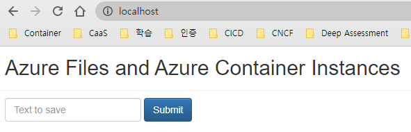

# aci-hellofiles

A simple Node.js application showing how to interact with mounted Azure Files volumes from Azure Container Instances, as described in [Mount an Azure file share in Azure Container Instances](https://docs.microsoft.com/azure/container-instances/container-instances-volume-azure-files).

## 빌드
npm intall
```
PS D:\workspace\SpringBootMySQL\aci-hellofiles> npm install

added 74 packages, and audited 75 packages in 3s

8 packages are looking for funding
  run `npm fund` for details

1 low severity vulnerability

To address all issues (including breaking changes), run:
  npm audit fix --force

Run `npm audit` for details.
npm notice
npm notice New minor version of npm available! 8.5.0 -> 8.7.0
npm notice Changelog: https://github.com/npm/cli/releases/tag/v8.7.0
npm notice Run npm install -g npm@8.7.0 to update!
npm notice
PS D:\workspace\SpringBootMySQL\aci-hellofiles>
```

## 실행
node index.js
```
PS D:\workspace\SpringBootMySQL\aci-hellofiles> node index.js
listening on port undefined
{ name: 'aaaa' }
[Error: ENOENT: no such file or directory, open 'D:\aci\logs\1650294405337.txt'] {
  errno: -4058,
  code: 'ENOENT',
  syscall: 'open',
  path: 'D:\\aci\\logs\\1650294405337.txt'
}

```

- browser 화면  
