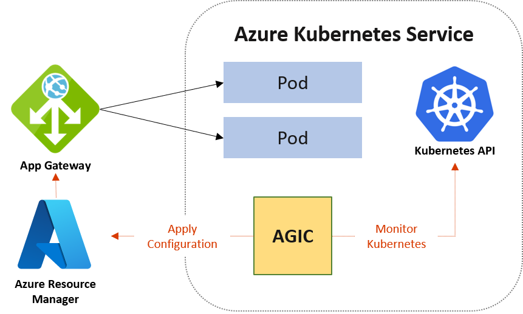

# [Application Gateway 수신 컨트롤러란?](https://docs.microsoft.com/ko-kr/azure/application-gateway/ingress-controller-overview)  
- 수신 컨트롤러는 고객의 AKS에서 자체 pod로 실행  
- AGIC(Helm 및 AKS 추가 기능)으로 배포  가능  
- AKS 클러스터의 상태는 Application Gateway 특정 구성으로 변환되고 ARM(Azure Resource Manager)에 적용
- AGIC는 서비스 및 배포/Pod와 함께 Kubernetes 수신 리소스를 통해 구성

  
  
> [AGIC Helm에서 AGIC 추가 기능으로 마이그레이션](https://docs.microsoft.com/ko-kr/azure/application-gateway/ingress-controller-migration)

### 제공 기능
- URL 라우팅
- 쿠키 기반 선호도
- TLS 종료
- 엔드투엔드 TLS
- 공용, 개인 및 하이브리드 웹 사이트 지원
- 통합 웹 애플리케이션 방화벽  

### 사전 준비
```
# AKS 변수 선언
$groupName = 'rg-skcc2-aks'
$locationName = 'koreacentral'


$serviceName = 'Homeeee'
$ownerName = 'SeoTaeYeol'
$environment = 'Dev'
$personalInformation = 'No'
$tags="owner=$ownerName environment=$environment serviceTitle=$serviceName personalInformation=$personalInformation"


$acrName = 'acr' + $serviceName

$clusterName = 'aks-cluster-' + $serviceName  
$nodeGroupName = 'rg-' + $clusterName
$nodepoolName = ($serviceName).ToLower( ) + '01'
$appgwIGName = 'agic-' + $clusterName
$appgwSubnetCidr = '10.2.0.0/16'


$serviceCidr = '10.0.0.0/16'
$dnsServiceIp = '10.0.0.10'
$podCidr = '10.244.0.0/16'
$dockerBridgeAddress = '172.17.0.1/16'
```

## 기존 Applcation Gateway 를 사용하여  AGIC 설치

### 사전 요구사항
- Azure CNI(Container Networking Interface)가 있는 AKS
- AKS와 동일한 가상 네트워크의 Application Gateway v2
- AKS 클러스터에 설치된 AAD Pod ID
- Cloud Shell은 CLIkubectl가 있고 helm 설치된 Azure 셸 환경입니다. 이러한 도구는 아래 명령에 필요합니다.

### Helm 설치
#### helm 패키지를 추가
```
kubectl create serviceaccount --namespace kube-system tiller-sa
kubectl create clusterrolebinding tiller-cluster-rule --clusterrole=cluster-admin --serviceaccount=kube-system:tiller-sa
helm init --tiller-namespace kube-system --service-account tiller-sa
```

#### helm init 
```
helm init
```

#### AGIC 리포지토리 추가
```
helm repo add application-gateway-kubernetes-ingress https://appgwingress.blob.core.windows.net/ingress-azure-helm-package/
helm repo update
```

### Azure Resource Manager 인증
#### AAD Pod ID 설정
##### AKS 노드와 동일한 리소스 그룹에 Azure ID 생성
```
az identity create -g <agent-pool-resource-group> -n <identity-name>
```

##### ID Contributor에 Application Gateway에 대한 액세스 권한을 부여
```
az role assignment create `
    --role Contributor `
    --assignee <principalId> `
    --scope <App-Gateway-ID>
```

##### ID Reader에 Application Gateway 리소스 그룹에 대한 액세스 권한을 부여
```
az role assignment create `
    --role Reader `
    --assignee <principalId> `
    --scope <App-Gateway-Resource-Group-ID>
```
##### 역할 할당 명령으로 새로 만든 ID에 대한 principalId를 가져옴
```
az identity show -g <resourcegroup> -n <identity-name>
```

### 서비스 주체 사용
#### Active Directory 서비스 주체를 만들고 base64로 인코딩
```
az ad sp create-for-rbac --role Contributor --sdk-auth | base64 -w0
```

### Ingress Controller 를 Helm Chart 로 설치
#### application-gateway-kubernetes-ingress Helm 리포지토리를 추가하고 Helm 업데이트를 수행
```
helm repo add application-gateway-kubernetes-ingress https://appgwingress.blob.core.windows.net/ingress-azure-helm-package/
helm repo update
```

#### base64 인코딩 JSON blob을 helm-config.yaml 파일에 추가
```
armAuth:
    type: servicePrincipal
    secretJSON: <Base64-Encoded-Credentials>
```

#### AGIC 구성파일 다운
```
wget https://raw.githubusercontent.com/Azure/application-gateway-kubernetes-ingress/master/docs/examples/sample-helm-config.yaml -O helm-config.yaml
```
```
# This file contains the essential configs for the ingress controller helm chart

# Verbosity level of the App Gateway Ingress Controller
verbosityLevel: 3

################################################################################
# Specify which application gateway the ingress controller will manage
#
appgw:
    subscriptionId: <subscriptionId>
    resourceGroup: <resourceGroupName>
    name: <applicationGatewayName>

    # Setting appgw.shared to "true" will create an AzureIngressProhibitedTarget CRD.
    # This prohibits AGIC from applying config for any host/path.
    # Use "kubectl get AzureIngressProhibitedTargets" to view and change this.
    shared: false

################################################################################
# Specify which kubernetes namespace the ingress controller will watch
# Default value is "default"
# Leaving this variable out or setting it to blank or empty string would
# result in Ingress Controller observing all acessible namespaces.
#
# kubernetes:
#   watchNamespace: <namespace>

################################################################################
# Specify the authentication with Azure Resource Manager
#
# Two authentication methods are available:
# - Option 1: AAD-Pod-Identity (https://github.com/Azure/aad-pod-identity)
armAuth:
    type: aadPodIdentity
    identityResourceID: <identityResourceId>
    identityClientID:  <identityClientId>

## Alternatively you can use Service Principal credentials
# armAuth:
#    type: servicePrincipal
#    secretJSON: <<Generate this value with: "az ad sp create-for-rbac --role Contributor --sdk-auth | base64 -w0" >>

################################################################################
# Specify if the cluster is Kubernetes RBAC enabled or not
rbac:
    enabled: false # true/false

# Specify aks cluster related information. THIS IS BEING DEPRECATED.
aksClusterConfiguration:
    apiServerAddress: <aks-api-server-address>
```

#### helm-config.yaml을 편집하고 appgw 및 armAuth 값을 채움
```
vi helm-config.yaml
```

#### helm-config.yaml 구성을 사용하여 Helm Chart application-gateway-kubernetes-ingress를 설치
```
helm install ./helm/ingress-azure `
     --name ingress-azure `
     --namespace default `
     --debug `
     --set appgw.name=applicationgatewayABCD `
     --set appgw.resourceGroup=your-resource-group `
     --set appgw.subscriptionId=subscription-uuid `
     --set appgw.shared=false `
     --set armAuth.type=servicePrincipal `
     --set armAuth.secretJSON=$(az ad sp create-for-rbac --role Contributor --sdk-auth | base64 -w0) `
     --set rbac.enabled=true `
     --set verbosityLevel=3 `
     --set kubernetes.watchNamespace=default `
     --set aksClusterConfiguration.apiServerAddress=aks-abcdefg.hcp.westus2.azmk8s.io
```

### 다중 클러스터/공유 Application Gateway
```
cat <<EOF | kubectl apply -f -
apiVersion: "appgw.ingress.k8s.io/v1"
kind: AzureIngressProhibitedTarget
metadata:
  name: prod-contoso-com
spec:
  hostname: prod.contoso.com
EOF
```

#### 
```
kubectl apply -f https://raw.githubusercontent.com/Azure/application-gateway-kubernetes-ingress/ae695ef9bd05c8b708cedf6ff545595d0b7022dc/crds/AzureIngressProhibitedTarget.yaml
```


## addon 형태의 배포(그린필드)
### 배포
- Standard_B2s : vCPU 2, Memory 4GiB, 임시스토리지 8
- Standard_DS2_v2 : vCPU 2, Memory 7GiB, 임시스토리지 100
- Standard_DS3_v2 : vCPU 2, Memory 8GiB, 임시스토리지 50
```
az aks create `
  --tags $tags `
  -n $clusterName `
  -g $groupName `
  --network-plugin azure `
  --enable-managed-identity `
  -a ingress-appgw `
  --appgw-name $appgwIGName `
  --appgw-subnet-cidr "$appgwSubnetCidr" `
  --name $clusterName `
  --node-resource-group $nodeGroupName `
  --aks-custom-headers CustomizedUbuntu=aks-ubuntu-1804,ContainerRuntime=containerd `
  --node-osdisk-type Ephemeral `
  --nodepool-name $nodepoolName `
  --nodepool-tags $tags `
  --node-vm-size Standard_DS2_v2 `
  --node-count 1 `
  --vm-set-type VirtualMachineScaleSets `
  --load-balancer-sku standard `
  --cluster-autoscaler-profile scan-interval=30s `
  --network-plugin kubenet `
  --network-policy calico `
  --service-cidr $serviceCidr `
  --dns-service-ip $dnsServiceIp `
  --pod-cidr $podCidr `
  --docker-bridge-address $dockerBridgeAddress `
  --enable-addons http_application_routing,monitoring `
  --generate-ssh-keys `
  --attach-acr $acrName
```
```
az aks create `
  --tags $tags `
  --resource-group $groupName `
  --name $clusterName `
  --node-resource-group $nodeGroupName `
  --aks-custom-headers CustomizedUbuntu=aks-ubuntu-1804,ContainerRuntime=containerd `
  --node-osdisk-type Ephemeral `
  --nodepool-name $nodepoolName `
  --nodepool-tags $tags `
  --node-vm-size Standard_DS3_v2 `
  --node-count 1 `
  --vm-set-type VirtualMachineScaleSets `
  --load-balancer-sku standard `
  --node-count 3 `
  --zones 1 2 3 `
  --enable-cluster-autoscaler `
  --min-count 1 `
  --max-count 4 `
  --cluster-autoscaler-profile scan-interval=30s `
  --network-plugin kubenet `
  --network-policy calico `
  --service-cidr $serviceCidr `
  --dns-service-ip $dnsServiceIp `
  --pod-cidr $podCidr `
  --docker-bridge-address $dockerBridgeAddress `
  --enable-addons http_application_routing,monitoring `
  --generate-ssh-keys `
  --attach-acr $acrName
```


#### AKS 클러스터에 대한 자격 증명을 가져옵
```
az aks get-credentials `
  --admin `
  --name $cluserName `
  --overwrite-existing `
  --resource-group $groupName
  
```

#### AGIC를 사용하여 샘플 애플리케이션 배포
```
kubectl apply `
  -f https://raw.githubusercontent.com/Azure/application-gateway-kubernetes-ingress/master/docs/examples/aspnetapp.yaml
```

#### Ingress IP 주소 가져오기
```
kubectl get ingress
```

```
apiVersion: v1
kind: Pod
metadata:
  name: aspnetapp
  labels:
    app: aspnetapp
spec:
  containers:
  - image: "mcr.microsoft.com/dotnet/core/samples:aspnetapp"
    name: aspnetapp-image
    ports:
    - containerPort: 80
      protocol: TCP

---

apiVersion: v1
kind: Service
metadata:
  name: aspnetapp
spec:
  selector:
    app: aspnetapp
  ports:
  - protocol: TCP
    port: 80
    targetPort: 80

---

apiVersion: networking.k8s.io/v1
kind: Ingress
metadata:
  name: aspnetapp
  annotations:
    kubernetes.io/ingress.class: azure/application-gateway
spec:
  rules:
  - http:
      paths:
      - path: /
        backend:
          service:
            name: aspnetapp
            port:
              number: 80
        pathType: Exact
```