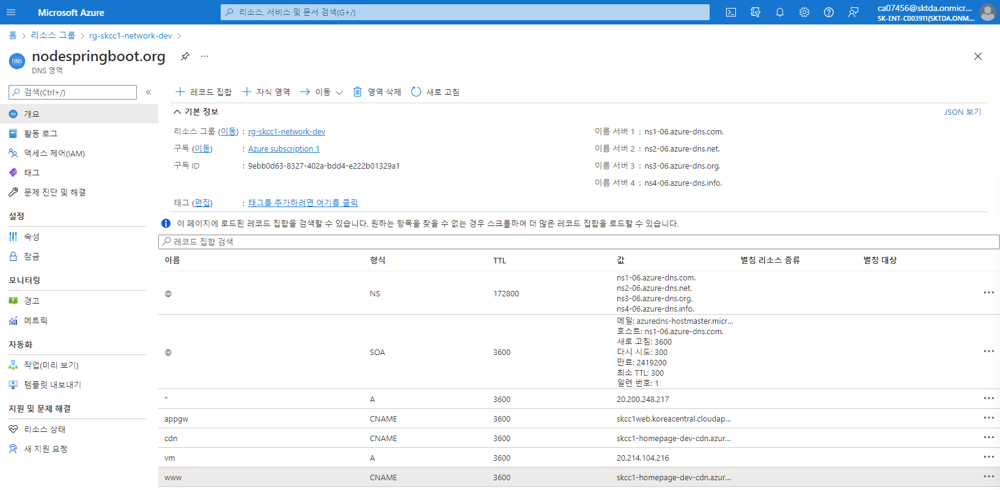
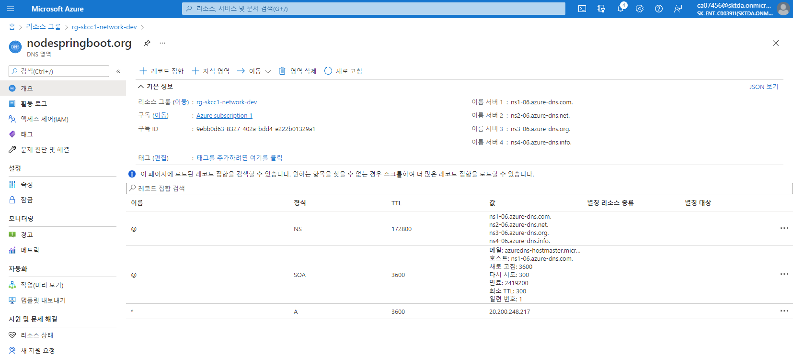

# Ingress Controller 
- 역방향 프록시
- 구성 가능한 트래픽 라우팅
- Kubernetes 서비스에 대한 TLS 종료 제공

[Let's Encrypt 와 함께 TLS 사용:동적 공용 IP 주소 사용](https://docs.microsoft.com/ko-kr/azure/aks/ingress-tls)  

> [AKS(Azure Kubernetes Service)에 수신 컨트롤러 만들기](https://docs.microsoft.com/ko-kr/azure/aks/ingress-basic?tabs=azure-cli)  
> [nginx 수신 컨틀롤러(NGINX Ingress Controller)](https://github.com/kubernetes/ingress-nginx)  
> [cert-manager](https://artifacthub.io/packages/helm/jetstack/cert-manager)  


### Ingress Controller 사용전(VM)
  

### Ingress Controller 사용후(Pod)
  
## namespace 생성
```
kubectl create namespace ingress-basic
namespace/ingress-basic created
```

## helm repo 추가하기
```
helm repo add ingress-nginx https://kubernetes.github.io/ingress-nginx
"ingress-nginx" already exists with the same configuration, skipping
```

## helm 으로 ingress controller 설치하기
```
helm install nginx-ingress ingress-nginx/ingress-nginx `
 --namespace ingress-basic `
 --set controller.replicaCount=2 `
 --set controller.nodeSelector."beta\.kubernetes\.io/os"=linux `
 --set defaultBackend.nodeSelector."beta\.kubernetes\.io/os"=linux
```
```
PS C:\workspace\AzureBasic\2.AKS\yaml> helm install nginx-ingress ingress-nginx/ingress-nginx `
>>  --namespace ingress-basic `
>>  --set controller.replicaCount=2 `
>>  --set controller.nodeSelector."beta\.kubernetes\.io/os"=linux `
>>  --set defaultBackend.nodeSelector."beta\.kubernetes\.io/os"=linux
NAME: nginx-ingress
LAST DEPLOYED: Wed Feb 23 17:16:30 2022
NAMESPACE: ingress-basic
STATUS: deployed
REVISION: 1
TEST SUITE: None
NOTES:
The ingress-nginx controller has been installed.
It may take a few minutes for the LoadBalancer IP to be available.
You can watch the status by running 'kubectl --namespace ingress-basic get services -o wide -w nginx-ingress-ingress-nginx-controller'

An example Ingress that makes use of the controller:
  apiVersion: networking.k8s.io/v1
  kind: Ingress
  metadata:
    name: example
    namespace: foo
  spec:
    ingressClassName: nginx
    rules:
      - host: www.example.com
        http:
          paths:
            - backend:
                service:
                  name: exampleService
                  port:
                    number: 80
              path: /
    # This section is only required if TLS is to be enabled for the Ingress
    tls:
      - hosts:
        - www.example.com
        secretName: example-tls

If TLS is enabled for the Ingress, a Secret containing the certificate and key must also be provided:

  apiVersion: v1
  kind: Secret
  metadata:
    name: example-tls
    namespace: foo
  data:
    tls.crt: <base64 encoded cert>
    tls.key: <base64 encoded key>
  type: kubernetes.io/tls
PS C:\workspace\AzureBasic\2.AKS\yaml>
```

## 부하 분산 장치 서비스 조회하기
```
kubectl --namespace ingress-basic get services -o wide -w nginx-ingress-ingress-nginx-controller
```
```
PS C:\workspace\AzureBasic\2.AKS\yaml> kubectl --namespace ingress-basic get services -o wide -w nginx-ingress-ingress-nginx-controller
NAME                                     TYPE           CLUSTER-IP    EXTERNAL-IP      PORT(S)                      AGE   SELECTOR
nginx-ingress-ingress-nginx-controller   LoadBalancer   10.0.59.153   20.200.248.217   80:30695/TCP,443:32407/TCP   10m   app.kubernetes.io/component=controller,app.kubernetes.io/instance=nginx-ingress,app.kubernetes.io/name=ingress-nginx
```

## DNS 영역에 A 레코드 추가
```
az network dns record-set a add-record `
    --resource-group rg-skcc1-network-dev `
    --zone-name nodespringboot.org `
    --record-set-name * `
    --ipv4-address 20.200.248.217
```
```
PS C:\workspace\AzureBasic\2.AKS\yaml> az network dns record-set a add-record `
>>     --resource-group rg-skcc1-network-dev `
>>     --zone-name nodespringboot.org `
>>     --record-set-name * `
>>     --ipv4-address 20.200.248.217
{
  "aRecords": [
    {
      "ipv4Address": "20.200.248.217"
    }
  ],
  "etag": "4425ac7b-a3db-449c-98e0-51da1dd4bd80",
  "fqdn": "*.nodespringboot.org.",
  "id": "/subscriptions/9ebb0d63-8327-402a-bdd4-e222b01329a1/resourceGroups/rg-skcc1-network-dev/providers/Microsoft.Network/dnszones/nodespringboot.org/A/*",
  "metadata": null,
  "name": "*",
  "provisioningState": "Succeeded",
  "resourceGroup": "rg-skcc1-network-dev",
  "targetResource": {
    "id": null
  },
  "ttl": 3600,
  "type": "Microsoft.Network/dnszones/A"
}
PS C:\workspace\AzureBasic\2.AKS\yaml> 
```

####  DNS 영역에 A 레코드 삭제
```
az network dns record-set a remove-record `
  --resource-group rg-skcc1-network-dev `
  --zone-name nodespringboot.org `
  --record-set-name * `
  --ipv4-address 20.200.248.217
```

### Sample Test 하기
```
## pod, svc 생성
kubectl apply -f aks-helloworld-one.yaml --namespace ingress-basic
kubectl apply -f aks-helloworld-two.yaml --namespace ingress-basic

## ingress(수신경로) 생성
kubectl apply -f hello-world-ingress.yaml --namespace ingress-basic

## 정리하기
kubectl delete -f aks-helloworld-one.yaml --namespace ingress-basic
kubectl delete -f aks-helloworld-two.yaml --namespace ingress-basic
```

## Cert Manage 설치
### Label the ingress-basic namespace to disable resource validation
**kubectl label namespace ingress-basic cert-manager.io/disable-validation=true**
```
PS C:\workspace\AzureBasic\2.AKS\yaml> kubectl label namespace ingress-basic cert-manager.io/disable-validation=true
namespace/ingress-basic labeled
```


### Add the Jetstack Helm repository
**helm repo add jetstack https://charts.jetstack.io**
```
PS C:\workspace\AzureBasic\2.AKS\yaml> helm repo add jetstack https://charts.jetstack.io
"jetstack" has been added to your repositories
PS C:\workspace\AzureBasic\2.AKS\yaml> 
```

### Update your local Helm chart repository cache
helm repo update
```
PS C:\workspace\AzureBasic\2.AKS\yaml> helm repo update
Hang tight while we grab the latest from your chart repositories...
...Successfully got an update from the "ingress-nginx" chart repository
...Successfully got an update from the "jetstack" chart repository
...Successfully got an update from the "stable" chart repository
Update Complete. ⎈Happy Helming!⎈
PS C:\workspace\AzureBasic\2.AKS\yaml> 
```  

### Install the cert-manager Helm chart
#### Helm Chart 조회
helm search repo jetstack/cert-manager
```
PS C:\workspace\AzureBasic\2.AKS\yaml> helm search repo jetstack/cert-manager
NAME                                    CHART VERSION   APP VERSION     DESCRIPTION
jetstack/cert-manager                   v1.7.1          v1.7.1          A Helm chart for cert-manager
jetstack/cert-manager-approver-policy   v0.3.0          v0.3.0          A Helm chart for cert-manager-approver-policy
jetstack/cert-manager-csi-driver        v0.2.1          v0.2.0          A Helm chart for cert-manager-csi-driver
jetstack/cert-manager-csi-driver-spiffe v0.1.0          v0.1.0          A Helm chart for cert-manager-csi-driver-spiffe
jetstack/cert-manager-istio-csr         v0.3.1          v0.3.0          A Helm chart for istio-csr
jetstack/cert-manager-trust             v0.1.1          v0.1.0          A Helm chart for cert-manager-trust
PS C:\workspace\AzureBasic\2.AKS\yaml> 
```

#### Helm Chart 설치
```
helm install `
  cert-manager `
  --namespace ingress-basic `
  --version v1.71.1 `
  --set installCRDs=true `
  --set nodeSelector."beta\.kubernetes\.io/os"=linux `
  jetstack/cert-manager
```

```
helm install cert-manager jetstack/cert-manager \
  --namespace ingress-basic \
  --version v1.3.1 \
  --set installCRDs=true \
  --set nodeSelector."beta\.kubernetes\.io/os"=linux \
  --set webhook.nodeSelector."kubernetes\.io/os"=linux \
  --set cainjector.nodeSelector."kubernetes\.io/os"=linux
```

```
helm install `
>>   cert-manager `
>>   --namespace ingress-basic `
>>   --version v1.1.0 `
>>   --set installCRDs=true `
>>   --set nodeSelector."kubernetes\.io/os"=linux `
>>   jetstack/cert-manager
NAME: cert-manager
LAST DEPLOYED: Wed Dec  9 17:20:57 2020
NAMESPACE: ingress-basic
STATUS: deployed
REVISION: 1
TEST SUITE: None
NOTES:
cert-manager has been deployed successfully!

In order to begin issuing certificates, you will need to set up a ClusterIssuer
or Issuer resource (for example, by creating a 'letsencrypt-staging' issuer).

More information on the different types of issuers and how to configure them
can be found in our documentation:

https://cert-manager.io/docs/configuration/

For information on how to configure cert-manager to automatically provision
Certificates for Ingress resources, take a look at the `ingress-shim`
documentation:

https://cert-manager.io/docs/usage/ingress/
```

```
$ helm install cert-manager jetstack/cert-manager \
>   --namespace ingress-basic \
>   --version v1.3.1 \
>   --set installCRDs=true \
>   --set nodeSelector."beta\.kubernetes\.io/os"=linux \
>   --set webhook.nodeSelector."kubernetes\.io/os"=linux \
>   --set cainjector.nodeSelector."kubernetes\.io/os"=linux

NAME: cert-manager
LAST DEPLOYED: Tue Apr 27 04:59:42 2021
NAMESPACE: ingress-basic
STATUS: deployed
REVISION: 1
TEST SUITE: None
NOTES:
cert-manager has been deployed successfully!

In order to begin issuing certificates, you will need to set up a ClusterIssuer
or Issuer resource (for example, by creating a 'letsencrypt-staging' issuer).

More information on the different types of issuers and how to configure them
can be found in our documentation:

https://cert-manager.io/docs/configuration/

For information on how to configure cert-manager to automatically provision
Certificates for Ingress resources, take a look at the `ingress-shim`
documentation:

https://cert-manager.io/docs/usage/ingress/
```

## CA 클러스터 발급자 만들기
### cluster-issuer.yaml
```
apiVersion: cert-manager.io/v1
kind: ClusterIssuer
metadata:
  name: letsencrypt
spec:
  acme:
    server: https://acme-v02.api.letsencrypt.org/directory
    email: taeeyoul@gmail.com
    privateKeySecretRef:
      name: letsencrypt
    solvers:
    - http01:
        ingress:
          class: nginx
          podTemplate:
            spec:
              nodeSelector:
                "kubernetes.io/os": linux
  ```

### cert-manager.io CRD 생성 
- 옵션으로 생성함으로 생성하지 말것
- 공식 문서에서는 CRD 생성 후 helm install 함
  - 옵션을 사용하지 않고 ...
#### CRD 생성
```
kubectl apply --validate=false -f https://github.com/jetstack/cert-manager/releases/download/v1.1.0/cert-manager-legacy.crds.yaml
customresourcedefinition.apiextensions.k8s.io/certificaterequests.cert-manager.io created
customresourcedefinition.apiextensions.k8s.io/certificates.cert-manager.io created
customresourcedefinition.apiextensions.k8s.io/challenges.acme.cert-manager.io created
customresourcedefinition.apiextensions.k8s.io/clusterissuers.cert-manager.io created
customresourcedefinition.apiextensions.k8s.io/issuers.cert-manager.io created
customresourcedefinition.apiextensions.k8s.io/orders.acme.cert-manager.io created
```
#### CRD 삭제
```
kubectl delete -f https://github.com/jetstack/cert-manager/releases/download/v1.1.0/cert-manager-legacy.crds.yaml                 
customresourcedefinition.apiextensions.k8s.io "certificaterequests.cert-manager.io" deleted
customresourcedefinition.apiextensions.k8s.io "certificates.cert-manager.io" deleted
customresourcedefinition.apiextensions.k8s.io "challenges.acme.cert-manager.io" deleted
customresourcedefinition.apiextensions.k8s.io "clusterissuers.cert-manager.io" deleted
customresourcedefinition.apiextensions.k8s.io "issuers.cert-manager.io" deleted
customresourcedefinition.apiextensions.k8s.io "orders.acme.cert-manager.io" deleted
```

### Helm 배포 확인
- ingress 와 certmanager 가 있어야 함
```
helm list --namespace ingress-basic
NAME            NAMESPACE       REVISION        UPDATED                                 STATUS          CHART                   APP VERSION
cert-manager    ingress-basic   1               2021-04-27 04:59:42.682314988 +0000 UTC deployed        cert-manager-v1.3.1     v1.3.1
nginx-ingress   ingress-basic   1               2021-04-27 01:58:28.449743969 +0000 UTC deployed        ingress-nginx-3.29.0    0.45.0
```

### 적용
```
kubectl apply -f cluster-issuer.yaml
clusterissuer.cert-manager.io/letsencrypt created
```

### Demo Application 실행
#### aks-helloworld-one.yaml
```
apiVersion: apps/v1
kind: Deployment
metadata:
  name: aks-helloworld-one
spec:
  replicas: 1
  selector:
    matchLabels:
      app: aks-helloworld-one
  template:
    metadata:
      labels:
        app: aks-helloworld-one
    spec:
      containers:
      - name: aks-helloworld-one
        image: mcr.microsoft.com/azuredocs/aks-helloworld:v1
        ports:
        - containerPort: 80
        env:
        - name: TITLE
          value: "Welcome to Azure Kubernetes Service (AKS)"
---
apiVersion: v1
kind: Service
metadata:
  name: aks-helloworld-one
spec:
  type: ClusterIP
  ports:
  - port: 80
  selector:
    app: aks-helloworld-one
```

#### aks-helloworld-two.yaml
```
apiVersion: apps/v1
kind: Deployment
metadata:
  name: aks-helloworld-two
spec:
  replicas: 1
  selector:
    matchLabels:
      app: aks-helloworld-two
  template:
    metadata:
      labels:
        app: aks-helloworld-two
    spec:
      containers:
      - name: aks-helloworld-two
        image: mcr.microsoft.com/azuredocs/aks-helloworld:v1
        ports:
        - containerPort: 80
        env:
        - name: TITLE
          value: "AKS Ingress Demo"
---
apiVersion: v1
kind: Service
metadata:
  name: aks-helloworld-two
spec:
  type: ClusterIP
  ports:
  - port: 80
  selector:
    app: aks-helloworld-two
```

#### 적용
```
kubectl apply -f aks-helloworld-one.yaml --namespace ingress-basic
kubectl apply -f aks-helloworld-two.yaml --namespace ingress-basic
```

### 수신경로 만들기
#### hello-world-ingress.yaml
```
apiVersion: networking.k8s.io/v1beta1
kind: Ingress
metadata:
  name: hello-world-ingress
  annotations:
    kubernetes.io/ingress.class: nginx
    nginx.ingress.kubernetes.io/rewrite-target: /$1
    nginx.ingress.kubernetes.io/use-regex: "true"
    cert-manager.io/cluster-issuer: letsencrypt
spec:
  tls:
  - hosts:
    - hello-world-ingress.paas-cloud.net
    secretName: tls-secret
  rules:
  - host: hello-world-ingress.paas-cloud.net
    http:
      paths:
      - backend:
          serviceName: aks-helloworld-one
          servicePort: 80
        path: /hello-world-one(/|$)(.*)
      - backend:
          serviceName: aks-helloworld-two
          servicePort: 80
        path: /hello-world-two(/|$)(.*)
      - backend:
          serviceName: aks-helloworld-one
          servicePort: 80
        path: /(.*)
---
apiVersion: networking.k8s.io/v1beta1
kind: Ingress
metadata:
  name: hello-world-ingress-static
  annotations:
    kubernetes.io/ingress.class: nginx
    nginx.ingress.kubernetes.io/rewrite-target: /static/$2
    nginx.ingress.kubernetes.io/use-regex: "true"
    cert-manager.io/cluster-issuer: letsencrypt
spec:
  tls:
  - hosts:
    - hello-world-ingress.paas-cloud.net
    secretName: tls-secret
  rules:
  - host: hello-world-ingress.paas-cloud.net
    http:
      paths:
      - backend:
          serviceName: aks-helloworld-one
          servicePort: 80
        path: /static(/|$)(.*)
```

### ingress 만들기
```
kubectl apply -f hello-world-ingress.yaml --namespace ingress-basic
```

```
ingress.networking.k8s.io/hello-world-ingress created
ingress.networking.k8s.io/hello-world-ingress-static created
```

```
kubectl -n ingress-basic get all
NAME                                                          READY   STATUS    RESTARTS   AGE
pod/aks-helloworld-one-7d5495f65d-xnb2x                       1/1     Running   0          6m20s
pod/aks-helloworld-two-597cd98f4c-fmw77                       1/1     Running   0          6m13s
pod/nginx-ingress-ingress-nginx-controller-7ff8c6c464-85z6s   1/1     Running   0          49m
pod/nginx-ingress-ingress-nginx-controller-7ff8c6c464-9hhzr   1/1     Running   0          49m

NAME                                                       TYPE           CLUSTER-IP     EXTERNAL-IP     PORT(S)                      AGE
service/aks-helloworld-one                                 ClusterIP      10.0.187.224   <none>          80/TCP                       6m20s
service/aks-helloworld-two                                 ClusterIP      10.0.18.116    <none>          80/TCP                       6m13s
service/nginx-ingress-ingress-nginx-controller             LoadBalancer   10.0.2.250     20.39.186.212   80:30891/TCP,443:30465/TCP   49m
service/nginx-ingress-ingress-nginx-controller-admission   ClusterIP      10.0.172.142   <none>          443/TCP                      49m

NAME                                                     READY   UP-TO-DATE   AVAILABLE   AGE
deployment.apps/aks-helloworld-one                       1/1     1            1           6m20s
deployment.apps/aks-helloworld-two                       1/1     1            1           6m13s
deployment.apps/nginx-ingress-ingress-nginx-controller   2/2     2            2           49m

NAME                                                                DESIRED   CURRENT   READY   AGE
replicaset.apps/aks-helloworld-one-7d5495f65d                       1         1         1       6m20s
replicaset.apps/aks-helloworld-two-597cd98f4c                       1         1         1       6m13s
replicaset.apps/nginx-ingress-ingress-nginx-controller-7ff8c6c464   2         2         2       49m
```

### 인증서 객체가 만들어졌는지 확인
- 수분이 소요됨
```
kubectl get certificate --namespace ingress-basic
NAME         READY   SECRET       AGE
tls-secret   True    tls-secret   3m53s
```
```
kubectl get certificate 
NAME         READY   SECRET       AGE
tls-secret   True    tls-secret   23h
```

