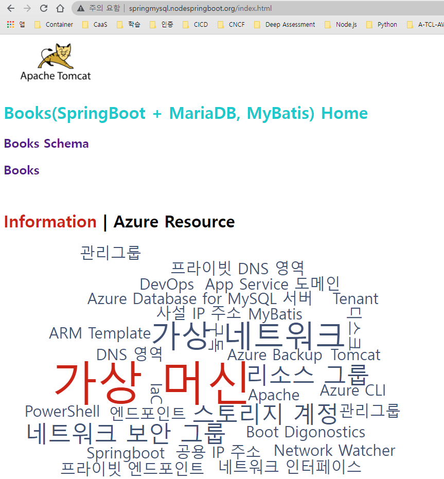
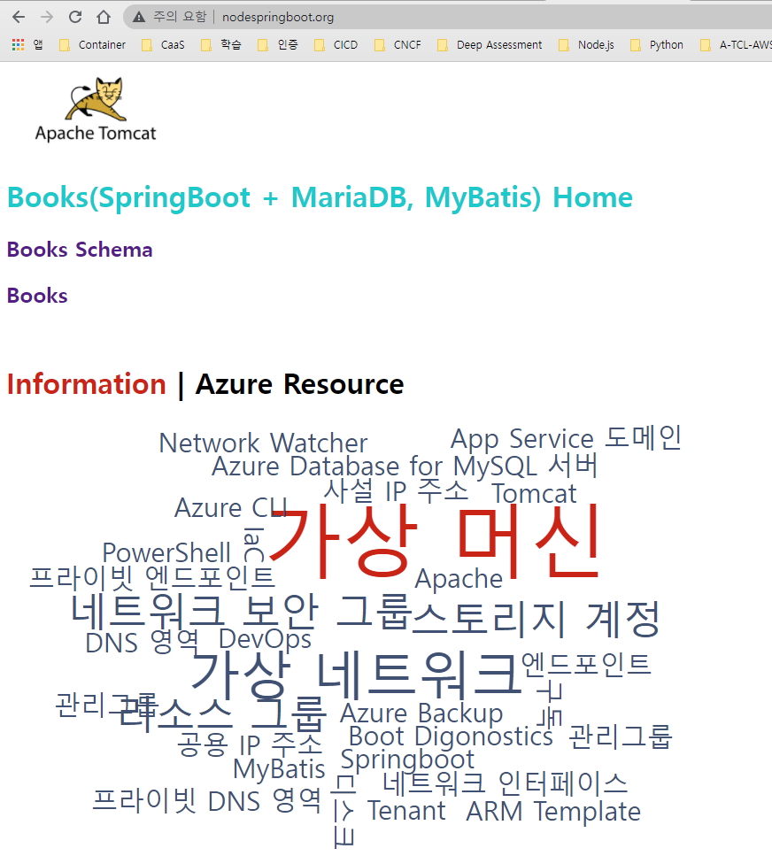

# AKS Pod 배포하기

## container image build & push
### Dockerfile
```

```
### container build
#### podman 를 사용한 빌드
```
podman build --rm=true --network=host --tag nodejs-bot:1.1.0 .
podman tag nodejs-bot:1.1.0 nodespringboot.azurecr.io/nodejs-bot:1.1.0
```

### container registory 에 넣기
```
podman login nodespringboot.azurecr.io --username 00000000-0000-0000-0000-000000000000 -p
podman push nodespringboot.azurecr.io/springboot:1.1.0
```
```
ubuntu@DESKTOP-QR555PR:/mnt/c/workspace/SpringBootMySQL$ cat podman-push.sh
. ./podman.env

podman tag "${repositoryName}:${tag}" "${acrName}.azurecr.io/${repositoryName}:${tag}"
podman push "${acrName}.azurecr.io/${repositoryName}:${tag}"

ubuntu@DESKTOP-QR555PR:/mnt/c/workspace/SpringBootMySQL$ sh podman-push.sh
The behavior of this command has been altered by the following extension: aks-preview
Merged "aks-cluster-Homeeee" as current context in C:\Users\taeey\.kube\config
Getting image source signatures
Copying blob 9b9b7f3d56a0 done
Copying blob 5f70bf18a086 done
Copying blob 28837d33e35d done
Copying blob c5b1300a6f77 done
Copying blob f1b5933fe4b5 done
Copying blob 2fd7b17b4df1 done
Copying blob 315ed9cb40ea done
Copying blob ceaf9e1ebef5 done
Copying config d8e482b4c0 done
Writing manifest to image destination
Storing signatures
ubuntu@DESKTOP-QR555PR:/mnt/c/workspace/SpringBootMySQL$
```
### az acr 를 사용한 빌드 및 ACR 에 push하기
#### bash(acr-build.sh)
```
PS C:\workspace\SpringBootMySQL> cat acr-build.sh
. ./podman.env

az acr build \
  --image "${repositoryName}:${tag}" \
  --registry $acrName \
  --file Dockerfile .

az acr repository show-tags -o table -n $acrName --repository ${repositoryName}
PS C:\workspace\SpringBootMySQL>
```
```
PS C:\workspace\SpringBootMySQL> wsl
ubuntu@DESKTOP-QR555PR:/mnt/c/workspace/SpringBootMySQL$ dir
Apache-Ubuntu.md   JSTL.md     README.md                 Tomcat-Windows.md  img           podman-push.sh  podman.md
Apache-Windows.md  Lombok.md   Springboot.md             acr-build.sh       jmx-exporter  podman-run.sh   pom.xml
Azure-ACR.md       MariaDB.md  SpringbootMySQLSample.md  acr-login.sh       mvnw          podman.env      src
Dockerfile         Maven.md    Tomcat-Ubuntu.md          icon               mvnw.cmd      podman.env~     target
ubuntu@DESKTOP-QR555PR:/mnt/c/workspace/SpringBootMySQL$ sh ./acr-build.sh
The behavior of this command has been altered by the following extension: aks-preview
Merged "aks-cluster-Homeeee" as current context in C:\Users\taeey\.kube\config
WARNING: You can perform manual login using the provided access token below, for example: 'docker login loginServer -u 00000000-0000-0000-0000-000000000000 -p accessToken'
Packing source code into tar to upload...
Excluding '.git' based on default ignore rules
Excluding '.gitignore' based on default ignore rules
Uploading archived source code from 'C:\Users\taeey\AppData\Local\Temp\build_archive_9a8fa0ee1443474bafda2e09b8333acc.tar.gz'...
Sending context (78.361 MiB) to registry: acrHomeeee...
Queued a build with ID: de3
Waiting for an agent...
2022/02/24 08:58:24 Downloading source code...
2022/02/24 08:58:26 Finished downloading source code
2022/02/24 08:58:26 Using acb_vol_f909212c-69ba-429c-865e-f454877be744 as the home volume
2022/02/24 08:58:26 Setting up Docker configuration...
2022/02/24 08:58:27 Successfully set up Docker configuration
2022/02/24 08:58:27 Logging in to registry: acrhomeeee.azurecr.io
2022/02/24 08:58:27 Successfully logged into acrhomeeee.azurecr.io
2022/02/24 08:58:27 Executing step ID: build. Timeout(sec): 28800, Working directory: '', Network: ''
2022/02/24 08:58:27 Scanning for dependencies...
2022/02/24 08:58:28 Successfully scanned dependencies
2022/02/24 08:58:28 Launching container with name: build
Sending build context to Docker daemon  88.12MB
Step 1/13 : FROM openjdk:8-jdk-alpine
8-jdk-alpine: Pulling from library/openjdk
e7c96db7181b: Pulling fs layer
f910a506b6cb: Pulling fs layer
c2274a1a0e27: Pulling fs layer
e7c96db7181b: Verifying Checksum
e7c96db7181b: Download complete
f910a506b6cb: Verifying Checksum
f910a506b6cb: Download complete
e7c96db7181b: Pull complete
f910a506b6cb: Pull complete
c2274a1a0e27: Verifying Checksum
c2274a1a0e27: Download complete
c2274a1a0e27: Pull complete
Digest: sha256:94792824df2df33402f201713f932b58cb9de94a0cd524164a0f2283343547b3
Status: Downloaded newer image for openjdk:8-jdk-alpine
 ---> a3562aa0b991
Step 2/13 : RUN addgroup -S spring && adduser -S spring -G spring
 ---> Running in 213dcbfaa5bb
Removing intermediate container 213dcbfaa5bb
 ---> ae4488f25750
Step 3/13 : USER spring:spring
 ---> Running in 850061f751b6
Removing intermediate container 850061f751b6
 ---> 8187db1ff061
Step 4/13 : ARG WAR_FILE=target/*.war
 ---> Running in 7cc0b68fa00c
Removing intermediate container 7cc0b68fa00c
 ---> 1c3217192fb3
Step 5/13 : ARG APP_NAME=app
 ---> Running in e50dab7c87c7
Removing intermediate container e50dab7c87c7
 ---> 5a0a14c67fed
Step 6/13 : ARG DEPENDENCY=target/classes
 ---> Running in e6234c1a07da
Removing intermediate container e6234c1a07da
 ---> 9b19db2ff7d2
Step 7/13 : RUN mkdir -p /home/spring
 ---> Running in d2189f7e55db
Removing intermediate container d2189f7e55db
 ---> dab165c912b8
Step 8/13 : WORKDIR /home/spring
 ---> Running in 48455702f69b
Removing intermediate container 48455702f69b
 ---> b64072134b12
Step 9/13 : COPY ${WAR_FILE} /home/spring/app.war
 ---> 703fe43c4d77
Step 10/13 : COPY jmx-exporter/jmx_prometheus.yml /home/spring/jmx_prometheus.yml
 ---> b91d629909cd
Step 11/13 : COPY ./jmx-exporter/jmx_prometheus_javaagent-0.16.1.jar /home/spring/jmx_prometheus_javaagent.jar
 ---> 9e4e9f0bb7cf
Step 12/13 : EXPOSE 8088
 ---> Running in d032c6ceb78b
Removing intermediate container d032c6ceb78b
 ---> b41080f9584b
Step 13/13 : ENTRYPOINT java -cp app:app/lib/* -Xms512m -Xmx512m -XX:NewSize=256m -XX:MaxNewSize=256m -XX:MaxMetaspaceSize=128m -XX:MetaspaceSize=128m -XX:ParallelGCThreads=3          -XX:+PrintGCDetails -XX:+PrintGCDateStamps -XX:+PrintHeapAtGC -Xloggc:/gclog/gc_${HOSTNAME}_$(date +%Y%m%d%H%M%S).log -Dgclog_file=/gclog/gc_${HOSTNAME}_$(date +%Y%m%d%H%M%S).log              -XX:+HeapDumpOnOutOfMemoryError -XX:HeapDumpPath=/gclog/${HOSTNAME}.log                 -javaagent:/home/spring/jmx_prometheus_javaagent.jar=8090:/home/spring/jmx_prometheus.yml               -Djava.security.egd=file:/dev/./urandom -jar /home/spring/app.war
 ---> Running in 7ee4b3942681
Removing intermediate container 7ee4b3942681
 ---> 06e52b046f6c
Successfully built 06e52b046f6c
Successfully tagged acrhomeeee.azurecr.io/springmysql:0.2.1
2022/02/24 08:58:48 Successfully executed container: build
2022/02/24 08:58:48 Executing step ID: push. Timeout(sec): 3600, Working directory: '', Network: ''
2022/02/24 08:58:48 Pushing image: acrhomeeee.azurecr.io/springmysql:0.2.1, attempt 1
The push refers to repository [acrhomeeee.azurecr.io/springmysql]
0f8a2d85494a: Preparing
a320fcab4fff: Preparing
3fc42cafb0ed: Preparing
575ff350958a: Preparing
ceaf9e1ebef5: Preparing
9b9b7f3d56a0: Preparing
f1b5933fe4b5: Preparing
9b9b7f3d56a0: Waiting
f1b5933fe4b5: Waiting
ceaf9e1ebef5: Layer already exists
9b9b7f3d56a0: Layer already exists
f1b5933fe4b5: Layer already exists
a320fcab4fff: Pushed
575ff350958a: Pushed
0f8a2d85494a: Pushed
3fc42cafb0ed: Pushed
0.2.1: digest: sha256:5ba867c504bebd9c2291904075e6260a2d1412fb310513b93b7fd7cd018de40e size: 1784
2022/02/24 08:58:51 Successfully pushed image: acrhomeeee.azurecr.io/springmysql:0.2.1
2022/02/24 08:58:51 Step ID: build marked as successful (elapsed time in seconds: 20.350554)
2022/02/24 08:58:51 Populating digests for step ID: build...
2022/02/24 08:58:52 Successfully populated digests for step ID: build
2022/02/24 08:58:52 Step ID: push marked as successful (elapsed time in seconds: 3.458214)
2022/02/24 08:58:52 The following dependencies were found:
2022/02/24 08:58:52
- image:
    registry: acrhomeeee.azurecr.io
    repository: springmysql
    tag: 0.2.1
    digest: sha256:5ba867c504bebd9c2291904075e6260a2d1412fb310513b93b7fd7cd018de40e
  runtime-dependency:
    registry: registry.hub.docker.com
    repository: library/openjdk
    tag: 8-jdk-alpine
    digest: sha256:94792824df2df33402f201713f932b58cb9de94a0cd524164a0f2283343547b3
  git: {}


Run ID: de3 was successful after 29s
Result
--------
0.2.0
0.2.1
ubuntu@DESKTOP-QR555PR:/mnt/c/workspace/SpringBootMySQL$
```
## pod 를 위한 manifest 작성
### Manifest 작성
#### springmysql-deploy.yaml
```yaml
---
apiVersion: apps/v1
kind: Deployment
metadata:
  name: springmysql
  namespace: homepage
spec:
  replicas: 1
  selector:
    matchLabels:
      app: springmysql
  template:
    metadata:
      labels:
        app: springmysql
    spec:
      containers:
        - name: springmysql
          image: acrhomepage.azurecr.io/springmysql:0.1.2
          imagePullPolicy: Always
          ports:
            - containerPort: 8080
          resources:
            requests:
              cpu: 250m
            limits:
              cpu: 500m
          env:
          - name: TITLE
            value: "AKS Ingress Demo"
```
### 서비스 Manifest 작성
```
apiVersion: v1
kind: Service
metadata:
  name: springmysql 
  namespace: homepage 
spec:
  type: ClusterIP
  ports:
  - port: 8080
  selector:
    app: springmysql
```

### Ingress manifest 작성
```
apiVersion: networking.k8s.io/v1
kind: Ingress
metadata:
  name: springmysql-ing
  namespace: homepage
  annotations:
    kubernetes.io/ingress.class: nginx
    nginx.ingress.kubernetes.io/ssl-redirect: "false"
    nginx.ingress.kubernetes.io/use-regex: "true"
    nginx.ingress.kubernetes.io/rewrite-target: /$1
spec:
  rules:
  - http:
      paths:
      - path: /springmysql(/|$)(.*)
        pathType: Prefix
        backend:
          service:
            name: springmysql
            port:
              number: 8080
      - path: /(.*)
        pathType: Prefix
        backend:
          service:
            name: springmysql
            port:
              number: 8080
```

## kubectl 를 사용한 배포
kubectl create -f springmysql-deploy.yaml
kubectl create -f springmysql-svc.yaml
kubectl create -f springmysql-ing.yaml
```
PS C:\workspace\AzureBasic\2.AKS\yaml> kubectl create -f springmysql-deploy.yaml
deployment.apps/springmysql created
PS C:\workspace\AzureBasic\2.AKS\yaml> kubectl create -f springmysql-svc.yaml
service/springmysql created
PS C:\workspace\AzureBasic\2.AKS\yaml> kubectl create -f springmysql-ing.yaml
ingress.networking.k8s.io/springmysql-ing created
PS C:\workspace\AzureBasic\2.AKS\yaml> 
```

#### PowerShell(acr-build.ps1)
```
PS C:\workspace\SpringBootMySQL> ./acr-build.ps1
Packing source code into tar to upload...
Excluding '.git' based on default ignore rules
Excluding '.gitignore' based on default ignore rules
Uploading archived source code from 'C:\Users\taeey\AppData\Local\Temp\build_archive_48cce1891bfe46d296d7edf95f62f46b.tar.gz'...
Sending context (78.361 MiB) to registry: acrHomeeee...
Queued a build with ID: de4
Waiting for an agent...
2022/02/24 09:54:54 Downloading source code...
2022/02/24 09:54:56 Finished downloading source code
2022/02/24 09:54:57 Using acb_vol_80798a30-7a3e-4319-a668-b2dc98001f30 as the home volume
2022/02/24 09:54:57 Setting up Docker configuration...
2022/02/24 09:54:57 Successfully set up Docker configuration
2022/02/24 09:54:57 Logging in to registry: acrhomeeee.azurecr.io
2022/02/24 09:54:58 Successfully logged into acrhomeeee.azurecr.io
2022/02/24 09:54:58 Executing step ID: build. Timeout(sec): 28800, Working directory: '', Network: ''
2022/02/24 09:54:58 Scanning for dependencies...
2022/02/24 09:54:59 Successfully scanned dependencies
2022/02/24 09:54:59 Launching container with name: build
Sending build context to Docker daemon  88.12MB
Step 1/13 : FROM openjdk:8-jdk-alpine
8-jdk-alpine: Pulling from library/openjdk
e7c96db7181b: Pulling fs layer
f910a506b6cb: Pulling fs layer
c2274a1a0e27: Pulling fs layer
f910a506b6cb: Verifying Checksum
f910a506b6cb: Download complete
e7c96db7181b: Verifying Checksum
e7c96db7181b: Download complete
e7c96db7181b: Pull complete
f910a506b6cb: Pull complete
c2274a1a0e27: Verifying Checksum
c2274a1a0e27: Download complete
c2274a1a0e27: Pull complete
Digest: sha256:94792824df2df33402f201713f932b58cb9de94a0cd524164a0f2283343547b3
Status: Downloaded newer image for openjdk:8-jdk-alpine
 ---> a3562aa0b991
Step 2/13 : RUN addgroup -S spring && adduser -S spring -G spring
 ---> Running in 435b602713e3
Removing intermediate container 435b602713e3
 ---> 0a5c914721d2
Step 3/13 : USER spring:spring
 ---> Running in 72ddb37fee71
Removing intermediate container 72ddb37fee71
 ---> 9e024b953b31
Step 4/13 : ARG WAR_FILE=target/*.war
 ---> Running in 2dae415e8a99
Removing intermediate container 2dae415e8a99
 ---> be1bbcbae7f4
Step 5/13 : ARG APP_NAME=app
 ---> Running in 9a198e09b902
Removing intermediate container 9a198e09b902
 ---> 4ad48aaa38e5
Step 6/13 : ARG DEPENDENCY=target/classes
 ---> Running in 8bd04978a68d
Removing intermediate container 8bd04978a68d
 ---> a6a016689174
Step 7/13 : RUN mkdir -p /home/spring
 ---> Running in 1a2f9cde0a3a
Removing intermediate container 1a2f9cde0a3a
 ---> f3b71b537a67
Step 8/13 : WORKDIR /home/spring
 ---> Running in ce9fbf05f30e
Removing intermediate container ce9fbf05f30e
 ---> f14ffd21357b
Step 9/13 : COPY ${WAR_FILE} /home/spring/app.war
 ---> 559808e7d7b4
Step 10/13 : COPY jmx-exporter/jmx_prometheus.yml /home/spring/jmx_prometheus.yml
 ---> cde0bf9933bf
Step 11/13 : COPY ./jmx-exporter/jmx_prometheus_javaagent-0.16.1.jar /home/spring/jmx_prometheus_javaagent.jar
 ---> 25bf01e867db
Step 12/13 : EXPOSE 8088
 ---> Running in 21e27c030203
Removing intermediate container 21e27c030203
 ---> 56182f1d8308
Step 13/13 : ENTRYPOINT java -cp app:app/lib/* -Xms512m -Xmx512m -XX:NewSize=256m -XX:MaxNewSize=256m -XX:MaxMetaspaceSize=128m -XX:MetaspaceSize=128m -XX:ParallelGCThreads=3          -XX:+PrintGCDetails -XX:+PrintGCDateStamps -XX:+PrintHeapAtGC -Xloggc:/gclog/gc_${HOSTNAME}_$(date +%Y%m%d%H%M%S).log -Dgclog_file=/gclog/gc_${HOSTNAME}_$(date +%Y%m%d%H%M%S).log            -XX:+HeapDumpOnOutOfMemoryError -XX:HeapDumpPath=/gclog/${HOSTNAME}.log               -javaagent:/home/spring/jmx_prometheus_javaagent.jar=8090:/home/spring/jmx_prometheus.yml               -Djava.security.egd=file:/dev/./urandom -jar /home/spring/app.war
 ---> Running in 0bae65b74b37
Removing intermediate container 0bae65b74b37
 ---> 98680e18f881
Successfully built 98680e18f881
Successfully tagged acrhomeeee.azurecr.io/springmysql:0.2.1
2022/02/24 09:55:19 Successfully executed container: build
2022/02/24 09:55:19 Executing step ID: push. Timeout(sec): 3600, Working directory: '', Network: ''
2022/02/24 09:55:19 Pushing image: acrhomeeee.azurecr.io/springmysql:0.2.1, attempt 1
The push refers to repository [acrhomeeee.azurecr.io/springmysql]
2a052ba43d57: Preparing
9b7248f24645: Preparing
aaf969f64b62: Preparing
8e729351d9b1: Preparing
ceaf9e1ebef5: Preparing
9b9b7f3d56a0: Preparing
f1b5933fe4b5: Preparing
f1b5933fe4b5: Waiting
9b9b7f3d56a0: Waiting
ceaf9e1ebef5: Layer already exists
9b9b7f3d56a0: Layer already exists
2a052ba43d57: Pushed
f1b5933fe4b5: Layer already exists
8e729351d9b1: Pushed
9b7248f24645: Pushed
aaf969f64b62: Pushed
0.2.1: digest: sha256:1251ccb76ac0c7c3d50f729a9dc5db7ea0f66cf882d869b0494c84eb87726622 size: 1784
2022/02/24 09:55:22 Successfully pushed image: acrhomeeee.azurecr.io/springmysql:0.2.1
2022/02/24 09:55:22 Step ID: build marked as successful (elapsed time in seconds: 20.583905)
2022/02/24 09:55:22 Populating digests for step ID: build...
2022/02/24 09:55:23 Successfully populated digests for step ID: build
2022/02/24 09:55:23 Step ID: push marked as successful (elapsed time in seconds: 2.925347)
2022/02/24 09:55:23 The following dependencies were found:
2022/02/24 09:55:23
- image:
    registry: acrhomeeee.azurecr.io
    repository: springmysql
    tag: 0.2.1
    digest: sha256:1251ccb76ac0c7c3d50f729a9dc5db7ea0f66cf882d869b0494c84eb87726622
  runtime-dependency:
    registry: registry.hub.docker.com
    repository: library/openjdk
    tag: 8-jdk-alpine
    digest: sha256:94792824df2df33402f201713f932b58cb9de94a0cd524164a0f2283343547b3
  git: {}

Run ID: de4 was successful after 29s
Result
--------
0.2.0
0.2.1
PS C:\workspace\SpringBootMySQL> 
```

## 배포 결과 확인
```
PS C:\workspace\AzureBasic> kubectl get pod,svc,ep,ing -n homepage
NAME                             READY   STATUS    RESTARTS   AGE
pod/springmysql-655bc7f7-rcncs   1/1     Running   0          16h

NAME                  TYPE        CLUSTER-IP    EXTERNAL-IP   PORT(S)    AGE
service/springmysql   ClusterIP   10.0.226.46   <none>        8080/TCP   18h

NAME                    ENDPOINTS          AGE
endpoints/springmysql   10.244.0.20:8080   18h

NAME                                        CLASS    HOSTS   ADDRESS          PORTS   AGE
ingress.networking.k8s.io/springmysql-ing   <none>   *       20.200.248.217   80      18h
PS C:\workspace\AzureBasic> 
```

### 브라우저에서 보기
http://springmysql.nodespringboot.org/  
  


http://www.nodespringboot.org/  
  


## 삭제
kubectl delete -f springmysql-deploy.yaml  
kubectl delete -f springmysql-svc.yaml  
kubectl delete -f springmysql-ing.yaml  
```
PS C:\workspace\AzureBasic\2.AKS\yaml> kubectl delete -f springmysql-deploy.yaml
deployment.apps "springmysql" deleted
PS C:\workspace\AzureBasic\2.AKS\yaml> kubectl delete -f springmysql-svc.yaml
service "springmysql" deleted
PS C:\workspace\AzureBasic\2.AKS\yaml> kubectl delete -f springmysql-ing.yaml
ingress.networking.k8s.io "springmysql-ing" deleted
PS C:\workspace\AzureBasic\2.AKS\yaml> 
```