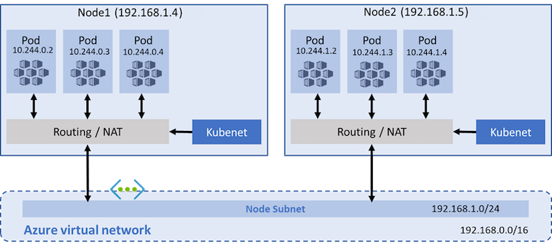

# ACR 및 AKS 클러스터 생성하기

> [Install and Set Up kubectl on Windows](https://kubernetes.io/docs/tasks/tools/install-kubectl-windows/)  

> [AKS 클러스터 구성](https://docs.microsoft.com/ko-kr/azure/aks/cluster-configuration)  
> [AKS(Azure Kubernetes Service)에서 Azure CNI 네트워킹 구성](https://docs.microsoft.com/ko-kr/azure/aks/configure-azure-cni)  
> [AKS(Azure Kubernetes Service) 노드 풀의 노드 구성 사용자 지정(미리 보기)](https://docs.microsoft.com/ko-kr/azure/aks/custom-node-configuration)  
> [Azure Kubernetes Service의 Azure Container Registry를 사용하여 인증](https://docs.microsoft.com/ko-kr/azure/aks/cluster-container-registry-integration?tabs=azure-cli)  
> [AKS(Azure Kubernetes Service)에서 애플리케이션 수요에 맞게 자동으로 클러스터 크기 조정](https://docs.microsoft.com/ko-kr/azure/aks/cluster-autoscaler)  
> [가용성 영역을 사용하는 AKS(Azure Kubernetes Service) 클러스터 만들기](https://docs.microsoft.com/ko-kr/azure/aks/availability-zones)  
> [AKS(Azure Kubernetes Service) 클러스터 업그레이드](https://docs.microsoft.com/ko-kr/azure/aks/upgrade-cluster)  
> [Open Service Mesh](https://release-v1-0.docs.openservicemesh.io/)  
> [Terraform을 사용하여 Azure Kubernetes Service로 Kubernetes 클러스터 만들기](https://docs.microsoft.com/ko-kr/azure/developer/terraform/create-k8s-cluster-with-tf-and-aks?toc=https%3A%2F%2Fdocs.microsoft.com%2Fko-kr%2Fazure%2Faks%2Ftoc.json&bc=https%3A%2F%2Fdocs.microsoft.com%2Fko-kr%2Fazure%2Fbread%2Ftoc.json)  

> [자습서: 새 Application Gateway 인스턴스를 사용하여 새 AKS 클러스터에 대한 수신 컨트롤러 추가 기능을 사용하도록 설정](https://docs.microsoft.com/ko-kr/azure/application-gateway/tutorial-ingress-controller-add-on-new)  

## Network 모델
### kubenet (default)

- IP 주소 공간이 제한되어 있을 경우
- Pod 통신 대부분이 클러스터 내에 있을 경우
- 가상 노드 또는 Azure 네트워크 정책과 같은 고급 AKS 기능이 필요하지 않을 경우 (Calico 사용)

### 


### 사전 준비
```
# AKS 변수 선언
$groupName = 'rg-skcc1-aks'
$locationName = 'koreacentral'


$serviceName = 'Homepage'
$ownerName = 'SeoTaeYeol'
$environment = 'Dev'
$personalInformation = 'No'
$tags="owner=$ownerName environment=$environment serviceTitle=$serviceName personalInformation=$personalInformation"


$acrName = 'acr' + $serviceName

$clusterName = 'aks-cluster-' + $serviceName  
$nodeGroupName = 'rg-' + $clusterName
$nodepoolName = ($serviceName).ToLower( ) + '01'


$serviceCidr = '10.0.0.0/16'
$dnsServiceIp = '10.0.0.10'
$podCidr = '10.244.0.0/16'
$dockerBridgeAddress = '172.17.0.1/16'
```

```
## Azure CLI 최신 버전 Update
az version
az upgrade

## Azure 서비스 공급자 등록
az provider register --namespace Microsoft.Kubernetes
az provider register --namespace Microsoft.ContainerService
az provider register --namespace Microsoft.KubernetesConfiguration

az provider show -n Microsoft.KubernetesConfiguration -o table

## CLI 확장
az extension add -n k8s-configuration
az extension add -n k8s-extension

az extension update -n k8s-configuration
az extension update -n k8s-extension

az feature register --namespace "Microsoft.ContainerService" --name "EnableAzureRBACPreview"
az provider register --namespace Microsoft.OperationsManagement
az provider register --namespace Microsoft.OperationalInsights
az provider show -n Microsoft.OperationsManagement -o table
az provider show -n Microsoft.OperationalInsights -o table

## aks-preview CLI 확장 설치
az extension add --name aks-preview
az extension update --name aks-preview

## CustomNodeConfigPreview 미리 보기 기능 등록
az feature register --namespace "Microsoft.ContainerService" --name "CustomNodeConfigPreview"
az feature list -o table --query "[?contains(name, 'Microsoft.ContainerService/CustomNodeConfigPreview')].{Name:name,State:properties.state}"
az provider register --namespace Microsoft.ContainerService

## CLI 확장 보기
az extension list -o table

az aks install-cli
```

### 자원그룹 생성
```
az group create --name $groupName --location $locationName
```
### ACR 생성하고 로그인하기
```
az acr create --resource-group $groupName --name $acrName --sku Basic
az acr list -o table
az acr login --name $acrName --expose-token
```

### ACR 빌드
```
az acr build --image nodespringbootsers:0.1.0 --registry $acrName --file Dockerfile .
```

### AKS 생성하고 ACR 붙이기
```
az aks create `
  --tags $tags `
  --resource-group $groupName `
  --name $clusterName `
  --node-resource-group $nodeGroupName `
  --aks-custom-headers CustomizedUbuntu=aks-ubuntu-1804,ContainerRuntime=containerd `
  --node-osdisk-type Ephemeral `
  --nodepool-name $nodepoolName `
  --nodepool-tags $tags `
  --node-vm-size Standard_DS3_v2 `
  --node-count 1 `
  --vm-set-type VirtualMachineScaleSets `
  --load-balancer-sku standard `
  --node-count 3 `
  --zones 1 2 3 `
  --enable-cluster-autoscaler `
  --min-count 1 `
  --max-count 4 `
  --cluster-autoscaler-profile scan-interval=30s `
  --network-plugin kubenet `
  --network-policy calico `
  --service-cidr $serviceCidr `
  --dns-service-ip $dnsServiceIp `
  --pod-cidr $podCidr `
  --docker-bridge-address $dockerBridgeAddress `
  --enable-addons http_application_routing,monitoring `
  --generate-ssh-keys `
  --attach-acr $acrName
 ``` 

### Attach만 따로 업데이트를 할 때 사용하는 명령어
```
az aks update -n $clusterName -g $groupName --attach-acr $acrName
```

### AKS 업데이트
```
az aks get-upgrades --resource-group $groupName --name $clusterName -o table
az aks upgrade -g $groupName -n $clusterName --kubernetes-version 1.22.4
```

### Kubectrl과 AKS 클러스터와 다시 연결하기
```
az aks get-credentials --resource-group $groupName --name $clusterName
kubectl get nodes
```

### AKS 중지
```
az aks list -o table
az aks stop -g $groupName -n $clusterName # node group의 크기를 0으로 줄임
```

### AKS 시작
```
az aks start -g $groupName -n $clusterName
```

```
Downloading client to "C:\Users\taeey\.azure-kubectl\kubectl.exe" from "https://storage.googleapis.com/kubernetes-release/release/v1.23.4/bin/windows/amd64/kubectl.exe"
Please add "C:\Users\taeey\.azure-kubectl" to your search PATH so the `kubectl.exe` can be found. 2 options: 
    1. Run "set PATH=%PATH%;C:\Users\taeey\.azure-kubectl" or "$env:path += 'C:\Users\taeey\.azure-kubectl'" for PowerShell. This is good for the current command session.
    2. Update system PATH environment variable by following "Control Panel->System->Advanced->Environment Variables", and re-open the command window. You only need to do it once
Downloading client to "C:\Users\taeey\AppData\Local\Temp\tmpavdnp6e9\kubelogin.zip" from "https://github.com/Azure/kubelogin/releases/download/v0.0.11/kubelogin.zip"
Please add "C:\Users\taeey\.azure-kubelogin" to your search PATH so the `kubelogin.exe` can be found. 2 options: 
    1. Run "set PATH=%PATH%;C:\Users\taeey\.azure-kubelogin" or "$env:path += 'C:\Users\taeey\.azure-kubelogin'" for PowerShell. This is good for the current command session.
    2. Update system PATH environment variable by following "Control Panel->System->Advanced->Environment Variables", and re-open the command window. You only need to do it once
```