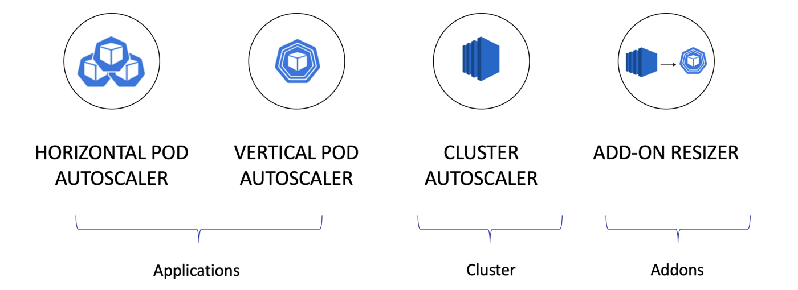

# AutoScaler 구성
Pod, Node AutoScaler 구성 및 모니터링 하기
- deployment (Pod + ControllerSet)
- Storage Class
- Prometheus/AlertManager, Grafana


## AutoScaler

### metric server
각 노드에 설치된 kubelet 을 통해서 node 및 pod 의 CPU, memory 의 사용량 metric 수집  
아래의 명령은 metric 서버가 설치되어 있어야 동작함  
- kubectl top pod  
- kubectl top node 
#### 배포 되어 있는지 확인
```
PS C:\workspace\AzureBasic\2.AKS\yaml> kubectl get pod -n kube-system
NAME                                                              READY   STATUS    RESTARTS   AGE
addon-http-application-routing-external-dns-84f4c7f8d4-55js8      1/1     Running   0          4h16m
addon-http-application-routing-nginx-ingress-controller-fc6kf9q   1/1     Running   0          4h16m
coredns-845757d86-m5xrq                                           1/1     Running   0          4h16m
coredns-845757d86-mwll4                                           1/1     Running   0          3h45m
coredns-autoscaler-5f85dc856b-f58nd                               1/1     Running   0          4h16m
csi-azuredisk-node-dx95c                                          3/3     Running   0          4h14m
csi-azurefile-node-bc6s2                                          3/3     Running   0          4h14m
kube-proxy-7qlw4                                                  1/1     Running   0          4h14m
metrics-server-774f99dbf4-zx6t9                                   1/1     Running   0          4h16m
omsagent-8xxpf                                                    2/2     Running   0          4h14m
omsagent-rs-7774d47549-s4pnn                                      1/1     Running   0          4h16m
tunnelfront-7b5f9d6dcf-bvl87                                      1/1     Running   0          3h27m
PS C:\workspace\AzureBasic\2.AKS\yaml> 
```
```
PS C:\workspace\AzureBasic\2.AKS\yaml> kubectl top node
NAME                                CPU(cores)   CPU%   MEMORY(bytes)   MEMORY%   
aks-homeeee01-39011919-vmss000002   357m         9%     2882Mi          26%
PS C:\workspace\AzureBasic\2.AKS\yaml> kubectl top pod --all-namespaces
NAMESPACE         NAME                                                              CPU(cores)   MEMORY(bytes)   
calico-system     calico-kube-controllers-8cc57f447-xsn89                           5m           32Mi
calico-system     calico-node-2v2jm                                                 31m          176Mi
calico-system     calico-typha-ffcfd94f6-s8szs                                      2m           33Mi
homeeee           springmysql-5d459db9cf-f5mrk                                      2m           376Mi
ingress-basic     nginx-ingress-ingress-nginx-controller-bb88cd997-6sssd            2m           101Mi
ingress-basic     nginx-ingress-ingress-nginx-controller-bb88cd997-zvq99            2m           100Mi
kube-system       addon-http-application-routing-external-dns-84f4c7f8d4-55js8      1m           27Mi
kube-system       addon-http-application-routing-nginx-ingress-controller-fc6kf9q   3m           136Mi
kube-system       coredns-845757d86-m5xrq                                           3m           24Mi
kube-system       coredns-845757d86-mwll4                                           3m           22Mi
kube-system       coredns-autoscaler-5f85dc856b-f58nd                               1m           8Mi
kube-system       csi-azuredisk-node-dx95c                                          3m           45Mi
kube-system       csi-azurefile-node-bc6s2                                          2m           46Mi
kube-system       kube-proxy-7qlw4                                                  1m           31Mi
kube-system       metrics-server-774f99dbf4-zx6t9                                   4m           20Mi
kube-system       omsagent-8xxpf                                                    9m           398Mi
kube-system       omsagent-rs-7774d47549-s4pnn                                      14m          298Mi
kube-system       tunnelfront-7b5f9d6dcf-bvl87                                      128m         16Mi
tigera-operator   tigera-operator-6d69c69b88-9jbjb                                  4m           61Mi
PS C:\workspace\AzureBasic\2.AKS\yaml> 
```

### HPA(Horizontal Pod Autoscaling)  
**복제본 수 늘리기**  
**복제본을 추가/제거하여 배포를 확장/축소**
- --horizontal-pod-autoscaler-sync-period : 15초 (default intervals)
- --horizontal-pod-autoscaler-initial-readiness-delay : 30 초
- --horizontal-pod-autoscaler-cpu-initialization-period : 5 분
  

> [수평형 포드 자동 확장](https://kubernetes.io/docs/tasks/run-application/horizontal-pod-autoscale/)  

- 원하는 복제수 = ceil[현재 복제수 * (현재 Metric 값 / 원하는 Metric 값)]
  - 2 = ceil(1 * (200m / 100m))
    - 메트릭 값 : 200m
    - 원하는 값 : 100m
    - 복제본 수 -> 2배
  - 1 = ceil(1 * (50m / 100m))
    - 메트릭 값 : 50m
    - 원하는 값 : 100m
    - 복제본 수 -> 0.5 -> 1 (조정작업 없음)

```
PS C:\workspace\AzureBasic> kubectl top pod -n homeeee
NAME                           CPU(cores)   MEMORY(bytes)   
springmysql-5d459db9cf-f5mrk   2m           424Mi
```
```
kubectl autoscale deployment springmysql -n homeeee --cpu-percent=10 --min=1 --max=10
kubectl get hpa -n homeeee
```
- 부하주기
  ```
  kubectl run -i --tty load-generator --image=busybox /bin/sh
  while true; do wget -q -O- http://springmysql.homeeee.svc.cluster.local:8080; done
  ```
- 확인하기
  ```
  PS C:\Users\taeey> kubectl get deploy springmysql -n homeeee -w
  NAME          READY   UP-TO-DATE   AVAILABLE   AGE
  springmysql   1/1     1            1           13h
  PS C:\workspace\AzureBasic\2.AKS\yaml> kubectl get hpa -n homeeee
  NAME          REFERENCE                TARGETS   MINPODS   MAXPODS   REPLICAS   AGE
  springmysql   Deployment/springmysql   99%/10%   1         10        8          31m
  PS C:\workspace\AzureBasic\2.AKS\yaml> kubectl get pod -n homeeee
  NAME                           READY   STATUS    RESTARTS   AGE
  springmysql-64b569c9b7-27rfp   1/1     Running   0          63s
  springmysql-64b569c9b7-58qkh   1/1     Running   0          66s
  springmysql-64b569c9b7-8dz69   0/1     Pending   0          6s
  springmysql-64b569c9b7-94ln5   0/1     Pending   0          5s
  springmysql-64b569c9b7-khllh   1/1     Running   0          66s
  springmysql-64b569c9b7-nz5mz   1/1     Running   0          66s
  springmysql-64b569c9b7-qgst4   0/1     Pending   0          6s
  springmysql-64b569c9b7-rpkxk   0/1     Pending   0          6s
  PS C:\Users\taeey> kubectl get node
  NAME                                STATUS     ROLES    AGE   VERSION
  aks-homeeee01-39011919-vmss000002   Ready      agent    18h   v1.21.9
  aks-homeeee01-39011919-vmss000003   NotReady   <none>   31s   v1.21.9
  PS C:\Users\taeey> kubectl get node
  NAME                                STATUS     ROLES   AGE   VERSION
  aks-homeeee01-39011919-vmss000002   Ready      agent   18h   v1.21.9
  aks-homeeee01-39011919-vmss000003   NotReady   agent   63s   v1.21.9
  PS C:\Users\taeey> kubectl get node
  NAME                                STATUS   ROLES   AGE   VERSION
  aks-homeeee01-39011919-vmss000002   Ready    agent   18h   v1.21.9
  aks-homeeee01-39011919-vmss000003   Ready    agent   82s   v1.21.9 PS C:\Users\taeey> kubectl get node
  NAME                                STATUS   ROLES   AGE     VERSION
  aks-homeeee01-39011919-vmss000002   Ready    agent   18h     v1.21.9
  aks-homeeee01-39011919-vmss000003   Ready    agent   3m20s   v1.21.9
  aks-homeeee01-39011919-vmss000004   Ready    agent   99s     v1.21.9
  PS C:\Users\taeey> kubectl get node
  ```
  ```
  PS C:\Users\taeey> kubectl get deploy springmysql -n homeeee -w
  NAME          READY   UP-TO-DATE   AVAILABLE   AGE
  springmysql   4/4     4            4           14h
  springmysql   4/8     4            4           14h
  springmysql   4/8     4            4           14h
  springmysql   4/8     4            4           14h
  springmysql   4/8     8            4           14h
  springmysql   4/10    8            4           14h
  springmysql   4/10    8            4           14h
  springmysql   4/10    8            4           14h
  springmysql   4/10    10           4           14h
  springmysql   5/10    10           5           14h
  springmysql   6/10    10           6           14h
  springmysql   7/10    10           7           14h
  springmysql   8/10    10           8           14h
  springmysql   8/1     10           8           14h
  springmysql   8/1     0            8           14h
  springmysql   8/1     0            8           14h
  springmysql   8/1     0            8           14h
  springmysql   1/1     0            1           14h
  springmysql   1/1     1            1           14h
  springmysql   1/4     1            1           14h
  springmysql   1/4     1            1           14h
  springmysql   1/4     1            1           14h
  springmysql   1/4     1            1           14h
  springmysql   1/4     3            1           14h
  springmysql   2/4     3            2           14h
  springmysql   3/4     3            3           14h
  springmysql   4/4     3            4           14h
  springmysql   5/4     3            5           14h
  springmysql   4/4     3            4           14h
  springmysql   4/4     4            4           14h
  springmysql   3/4     4            3           14h
  springmysql   4/4     4            4           14h
  springmysql   3/4     4            3           14h
  springmysql   4/4     4            4           14h
  springmysql   3/4     4            3           14h
  springmysql   2/4     4            2           14h
  springmysql   3/4     4            3           14h
  springmysql   4/4     4            4           14h
  springmysql   3/4     4            3           14h
  springmysql   2/4     4            2           14h
  springmysql   3/4     4            3           14h
  springmysql   2/4     4            2           14h
  springmysql   1/4     4            1           14h
  springmysql   0/4     4            0           14h
  springmysql   1/4     4            1           14h
  PS C:\Users\taeey>
  ```

### VPA(Vertical Pod Autoscaler)
#### 복제본당 할당된 리소스 늘리기

**HPA vs VPA**
| Horizontal Pod Autoscaler | Vertical Pod Autoscaler |
|:---|:---|
| 복제본을 추가하여 확장 | 기존 복제본 수에 더 많은 자원을 할당하여 스케일아웃 | 
| 새 복제본을 추가하면 이미 실행 중인 복제본에서 다운타임이 발생하지 않음 | 크기 조정은 현재 복제본을 제거하고 다시 예약하여 작업 중에 다운타임을 발생 |  
|성숙한 제품 | 아직 걸음마 단계 |
| 큰 군집과 함께 작동 | 대규모 클러스터에서의 사용에 대해 알려진 한계가 있음 |

### CA(Cluster Autoscaler)
> [AKS(Azure Kubernetes Service)에서 애플리케이션 수요에 맞게 자동으로 클러스터 크기 조정](https://docs.microsoft.com/ko-kr/azure/aks/cluster-autoscaler)  

### Cluster AutoSacler
  
- 클러스터의 노드 풀에서 클러스터 자동 크기 조정기를 사용하도록 설정
- 최소 1개
- 최대 3개
```bash
az aks create \
  --resource-group $groupName \
  --name $clusterName \
  --node-count 1 \
  --vm-set-type VirtualMachineScaleSets \
  --load-balancer-sku standard \
  --enable-cluster-autoscaler \
  --min-count 1 \
  --max-count 3 \
  --cluster-autoscaler-profile scan-interval=30s
```

#### 자동 크기 조정기 프로필을 사용하여 
- scan-interval : 10 초
- scale-down-delay-after-add : 10 분
- scale-down-delay-after-delete : scan-interval
```
PS C:\workspace\AzureBasic> kubectl get node
NAME                                STATUS   ROLES   AGE   VERSION
aks-homeeee01-39011919-vmss000002   Ready    agent   17h   v1.21.9
PS C:\workspace\AzureBasic> kubectl get configmap -n kube-system cluster-autoscaler-status -o yaml
apiVersion: v1
data:
  status: |+
    Cluster-autoscaler status at 2022-02-24 23:56:52.490683298 +0000 UTC:
    Cluster-wide:
      Health:      Healthy (ready=1 unready=0 notStarted=0 longNotStarted=0 registered=1 longUnregistered=0)
                   LastProbeTime:      2022-02-24 23:56:52.484894824 +0000 UTC m=+62741.549148644
                   LastTransitionTime: 2022-02-24 06:32:41.716774206 +0000 UTC m=+90.781028026
      ScaleUp:     NoActivity (ready=1 registered=1)
                   LastProbeTime:      2022-02-24 23:56:52.484894824 +0000 UTC m=+62741.549148644
                   LastTransitionTime: 2022-02-24 06:32:41.716774206 +0000 UTC m=+90.781028026
      ScaleDown:   NoCandidates (candidates=0)
                   LastProbeTime:      2022-02-24 23:56:52.484894824 +0000 UTC m=+62741.549148644
                   LastTransitionTime: 2022-02-24 07:03:14.730996138 +0000 UTC m=+1923.795249958

    NodeGroups:
      Name:        aks-homeeee01-39011919-vmss
      Health:      Healthy (ready=1 unready=0 notStarted=0 longNotStarted=0 registered=1 longUnregistered=0 cloudProviderTarget=1 (minSize=1, maxSize=4))
                   LastProbeTime:      2022-02-24 23:56:52.484894824 +0000 UTC m=+62741.549148644
                   LastTransitionTime: 2022-02-24 06:32:41.716774206 +0000 UTC m=+90.781028026
      ScaleUp:     NoActivity (ready=1 cloudProviderTarget=1)
                   LastProbeTime:      2022-02-24 23:56:52.484894824 +0000 UTC m=+62741.549148644
                   LastTransitionTime: 2022-02-24 06:32:41.716774206 +0000 UTC m=+90.781028026
      ScaleDown:   NoCandidates (candidates=0)
                   LastProbeTime:      2022-02-24 23:56:52.484894824 +0000 UTC m=+62741.549148644
                   LastTransitionTime: 2022-02-24 07:03:14.730996138 +0000 UTC m=+1923.795249958

kind: ConfigMap
metadata:
  annotations:
    cluster-autoscaler.kubernetes.io/last-updated: 2022-02-24 23:56:52.490683298 +0000
      UTC
  creationTimestamp: "2022-02-24T06:32:41Z"
  name: cluster-autoscaler-status
  namespace: kube-system
  resourceVersion: "275744"
  uid: 3ab752b2-653b-4402-acec-cb0d8d90a70f
PS C:\workspace\AzureBasic>
``` 
## Montoring 도구
### [Prometheus](./prometheus/README.md)  
오픈소스 시스템 모니터링 및 경고 툴킷  

### [Grafana](./grafana/README.md) 
시계열 데이터(Metric)에 대한 시각화 도구  

### [EFK(ElasticSearch, FluentBit, Kibana)](./EFK/README.md)
커스텀 로깅 솔루션을 구축할 때 가장 많이 쓰이는 컴포넌트의 조합  
Pod 의 로그를 수집, 저장, 시각화(검색)  
- Fluentd : 로그 수집
- ElasticSearch : 로그 저장
- Kibana : 로그 검색 및 시각화 도구