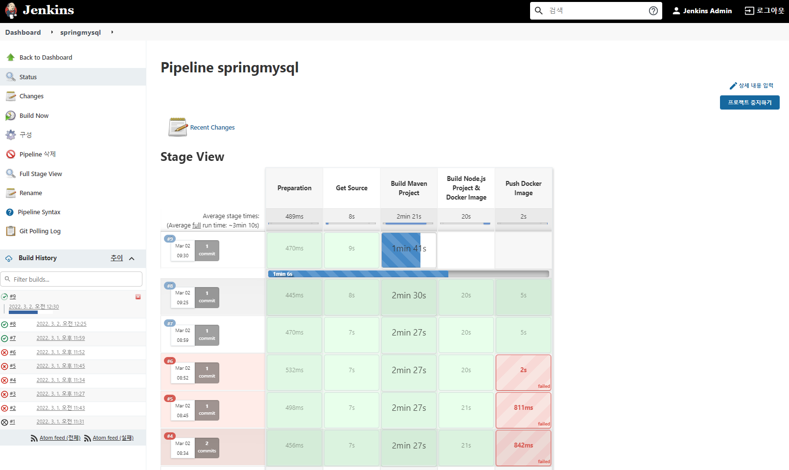
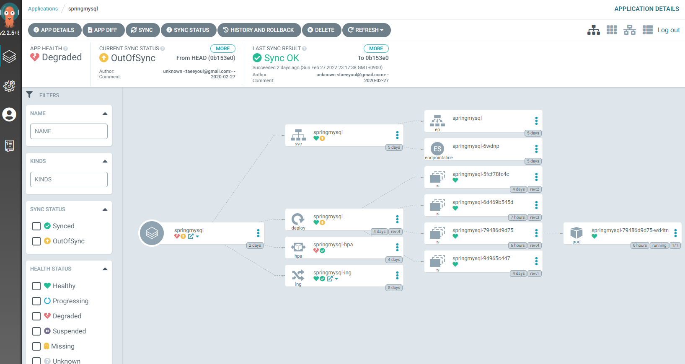

# OSS(Open Source Software) 를 통한 Pod 배포
Gitea, Jenkins, Harbor, ArgoCD 를 통한 GitOps 구성
- webhook, Jenkinsflies 구성/작성
- blue/green 배포

### [Gitea (저장소)](./GitOps/gitea/README.md)
편리한 설치형 Git 서비스  
- 저장소 생성
- CI 를 위한 Jenkins Webhook 등록
- 사용자 통보를 위한 Slack Webhook 등록
  
  

### [Jenkins (CI 도구)](./GitOps/jenkins/README.md)
소프트웨어 개발 시 지속적 통합 서비스를 제공하는 도구  
- Docker 빌드를 위한 Plugin 등  구성  
- Credentail 설정
  - 저장소 연동을 위한 Gitea Credentail(ID.PW) 설정 
  - Slack 의 Jenkins CI 연동을 위한 Token 값 서정
  - Habor 연동을 위한 ID/PW 설정
- Pipeline 구성
  - Pool SCM
  - Gitea 서버 등록
- Pipeline 작성
  - PodTemplate
  - Stage 구성
    - Prepare : 환경 구성
    - 빌드할 소스 가져오기
    - 소스 빌드
    - Docker Image 생성
    - Docker Image Push
  

### [Harbor (Container Registry)](./GitOps/harbor/README.md)
콘텐츠를 저장, 서명 및 스캔하는 오픈 소스 신뢰할 수 있는 클라우드 네이티브 레지스트리 프로젝트 

### [ArgoCD (CD 도구)](./GitOps/argocd/README.md)  
Kubernetes용 선언적 GitOps 지속적 전달 도구  
- Cluster 구성(내장된 것을 그대로 사용하면 됨)
  - in-cluser :  https//kubernetes.default.svc 1.21
- Project 생성
  - springmysql, nodejs-bot 생성
- Repositories 구성
  - 배포할 Repositoris 등록 : gitea 의 SpringMySQL, nodejs 등록
- App 생성 (SpringMySQL, nodejs-bot)
  - GENERAL
    - Application name
    - Project 선택
    - SYNC POLICY 선택
  - SOURCE
    - Repository URL 선택
    - Revison : HEAD
    - Path : .
  - DESTINATION
    - Cluster URL : Cluster 구성 정보 선택
    - Namespace : 
    