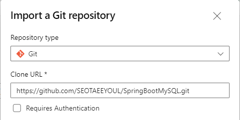
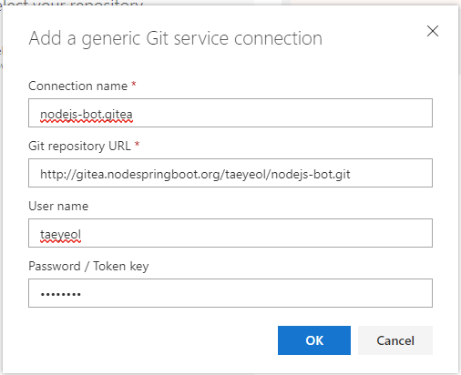
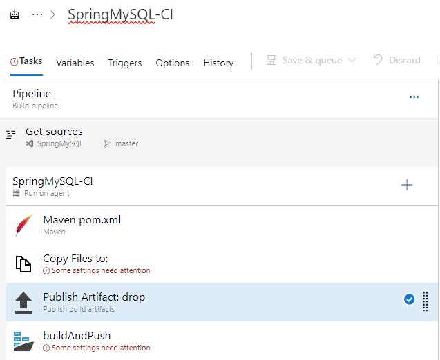

# [Azure DevOps](dev.azure.com)


[미리 정의된 변수 사용](https://docs.microsoft.com/ko-kr/azure/devops/pipelines/build/variables?view=azure-devops&tabs=yaml) 

| 변수명 | 설명 |
|:---|:---|
| $(System.DefaultWorkingDirectory) | 소스 코드 파일이 다운로드되는 에이전트의 로컬 경로 |  
| $(Build.ArtifactStagingDirectory) | 대상에 푸시되기 전에 아티팩트가 복사되는 에이전트의 로컬 경로 |  


## Organization Settings
  - Billing -> Set up Builling -> 종량제 선택 -> Save
    
  
## 
New Create Project
  - name : SpringMySQL
  

#### Azure Container Repository 정보
| 구분 | 내용 | 
|:---|:---|
| ACR | acrhomeeee.azurecr.io |  
| Registry | acrHomeeee |  
| Repogitory | springmysql |  

## "Repos" > "Files"
- "Clone in VS Code" 로 소스파일 생성  
- **Import a repository** 로 Git 저장소의 소스 가져오기(★)
  - https://github.com/SEOTAEEYOUL/SpringBootMySQL.git
- Files
  
  

## Overview > Summary 만들기
#### SpringMySQL > Summary > **"+ Add Project Description"**
  
#### About this project
- Description : SpringMySQL
- About : Readme file : SpringMySQL (Repos 선택)
    

## Pipelines 
### Pipelines(**CI**)
#### 1. Pipelines -> Create Pipelines 
  
#### 2. **Use the classic editor** Click
    

#### 3. Select a source
- **Azure Repos Git** 선택(★)
- continue 선택  


- Get source -> other Git 선택  
  ``` 
  Default branch for manual and scheduled builds : master
  Connection name : nodejs-bot.gitea  
  Repository : http://gitea.nodespringboot.org/taeyeol/nodejs-bot.git
  Connection name : nodejs-bot-deploy 
  Repository : http://gitea.chatops.ga/chatadmin/nodejs-bot-deploy.git
  ```		
  


#### 4. **Empty Job** 클릭  
    
  
  - **Agent job -> Pipeline -> Agent Specification -> ubuntu-20.04**
    
    

#### 5. Pipeline 설정
- Name : SpringMySQL-CI
- Agent pool : Azure Pipelines
- Agent Sepecification : ubuntu-20.04
    

#### 6. Task(Agent job) 설정
- Display name :  CI  
- Agent selection
  - Agent pool : Azure Pipelines
  - Agent Specification : ubuntu-20.04
  


#### 7. **CI** angent job 의 "+" 로 Task 추가  
##### 7.1 **Maven** 추가 (Maven pom.xml)
- 그대로 사용
##### 7.1 Node.js tool installer (Use Node 6.x)
- 그대로 사용
##### 7.1.1 **코드 커밋시 , 자동 트리거 설정**  
  - Triggers 탭 선택
  - repository : **Enable continuous integration** check
      
      

##### 7.2 **Copy Files** (Copy Files to)
- Display name : Copy Files to:
- Source Folder : **$(System.DefaultWorkingDirectory)**
- Contents : k8s/* 
- Target Folder : **$(Build.ArtifactStagingDirectory)**
    
    
#### 7.3 **Publish Build Artifacts** (Publish Artifact: drop)
- Display name : Publish Artifact: drop
- Path to publish : **$(Build.ArtifactStagingDirectory)**
- Artifact name : drop
- Artifact publish location : Azure Pipelines
    
    

##### 7.4 **Docker** 선택(buildAndPush 로 Taks 추가)
- Display name : buildAndPush
- Container Repository
  - Container registry : AKS
- **New service connection** 생성
  - Registry type : **Azure Container Registry** 선택
  - Subscription: **Azure subscrition 1(...)** 선택
  - Azure Container registry : **acrHomeeee** 선택 
  - Service connection name : **acrHomeeee** 입력
  - **Grant access permission to all pipelines** 체크
      
      
    
- **Container repository** : springmysql  
- **Commands**
  - Command : buildAndPush
  - Dockerfile : **/Dockerfile 
  - Build context : **
  - Tags : $(Build.BuildId)
  - **Add Pipeline metadata to image(s)** Check
  - **Add base image metadata to image(s)** Check
      
      


#### 8. Save  & queue 클릭
- **Save** 선택
	  
### Releases(**CD**)  
Articatis 의 deploy 의 container tag 를 빌드한 버전으로 바꿔준 후 Deployment(Pod) 와 Service 를 배포함

### 1. New pipeline
- **Empty job** 선택
  

### 2. Stage
- Properties
  - Stage name : **Dev**  

  

### 3. Add an Artifact
- Soruce type
- Project : **SpringMySQL** 선택
- Source (build pipeline) : **SpringMySQL-CI**
- Default version : Latest
- Source alias : _SpringMySQL-CI
  
  

### 4. Continous deployment trigger(번개 아이콘) 클릭 -> 활성화
- Continuous deployment trigger : **Enabled**  
git 소스가 변경될 때 CI 후 CD 가 되도록 설정  
  

  

### 5. **Stage** Task 설정
#### 5.1 Stage 화면에서 **"1 job, 0 task"** 클릭
#### 5.2 Agent Job 에 Taks 추가(**+**)
##### 5.2.1 **Bash** (Bash Script)
- Taks version : 3.*
- Display name : **Bash Script**
- Type: **Inline** 선택
- Script  
  ```bash
  sed -i "s/latest/$(Build.BuildId)/g" $(System.DefaultWorkingDirectory)/_SpringMySQL-CI/drop/k8s/springmysql-deploy.yaml
  ```
  
  ```bash
  sed -i "s/latest/$(Build.BuildId)/g" $(System.DefaultWorkingDirectory)/_NodeJs-Bot-CI/drop/k8s/nodejs-bot-deploy.yaml
  ```   
    

##### 5.2.2 **kubectl** (kubectl apply Deployment)
- Kubectl
  - Taks version: 1.*
  - Display name : kubectl apply deployment
- Kubernetes Cluster
  - Service connection type : Kubernetes service connection
  - Kubernetes service connection : aks-cluster-Homeeee
    없을 시 **+ New** 버튼을 눌러 아래와 같이 추가함  
    
  - Namespace : 비워둠
- Commands
  - Commands: apply
  - **Use configuration** 체크
  - Configureation type : Inline configuration
  - Inline configuration
    ```bash
    $(System.DefaultWorkingDirectory)/_SpringMySQL-CI/drop/k8s/springmysql-deploy.yaml
    ```
    ```bash
    $(System.DefaultWorkingDirectory)/_nodejs-bot-CI/drop/k8s/nodejs-bot-deploy.yaml
    ```  


##### 5.2.3 **kubectl** (kubectl apply Service)
- Kubectl
  - Taks version: 1.*
  - Display name : kubectl apply service
- Kubernetes Cluster
  - Service connection type : Kubernetes service connection
  - Kubernetes service connection : aks-cluster-Homeeee
    없을 시 **+ New** 버튼을 눌러 아래와 같이 추가함  
    
  - Namespace : 비워둠
- Commands
  - Commands: apply
  - **Use configuration** 체크
  - Configureation type : Inline configuration
  - Inline configuration
    ```
    $(System.DefaultWorkingDirectory)/_SpringMySQL-CI/drop/k8s/springmysql-svc.yaml
    ```
    ```
    $(System.DefaultWorkingDirectory)/_nodejs-bot-CI/drop/k8s/nodejs-bot-svc.yaml
    ```  

  

  

##### 6. Pipeline 명 바꾸기
- SpringMySQL-CD
    

---
## SpringMySql

#### Azure Container Repository 정보
| 구분 | 내용 | 
|:---|:---|
| ACR | acrhomeeee.azurecr.io |  
| Registry | acrHomeeee |  
| Repogitory | springmysql |  


## Pipelines > Pipelines(CI)
### Tasks
Build Step

#### Task 추가

Docker 선택 (buildAndPush)


- Copy Files(Copy Files to:)
  - $(system.defaultworkingdirectory) : 소스디렉토리
  - $(Build.ArtifactStagingDirectory) : 

Publish build artifacts(Publish)
  
  

$(System.DefaultWorkingDirectory)/_SpringMySQL-CI/drop/k8s/springmysql-deploy.yaml

## Pipelines > Release(CD)

### 승인후배포
#### 설정하기
.png)  

#### 승인하기
-1.png)
#### 승인 후 배포 결과
-2.png)  
-2-0.png)  

### Project(SpringMySQL) Pipeline 을 Export 받기
#### SpringMySQL > Pipelines > Pipelines > SpringMySQL-CI > (More actions) > Export to YAML
   
#### SpringMySQL > Pipelines > Release > (More actions) > Export
  

### 빌드 후 통보 받기(Service hooks 설정)
Project Settings > Service hooks > **+ Create subscription** > Service > **Slack**
  
  
  
  

#### Slack 화면  
  

