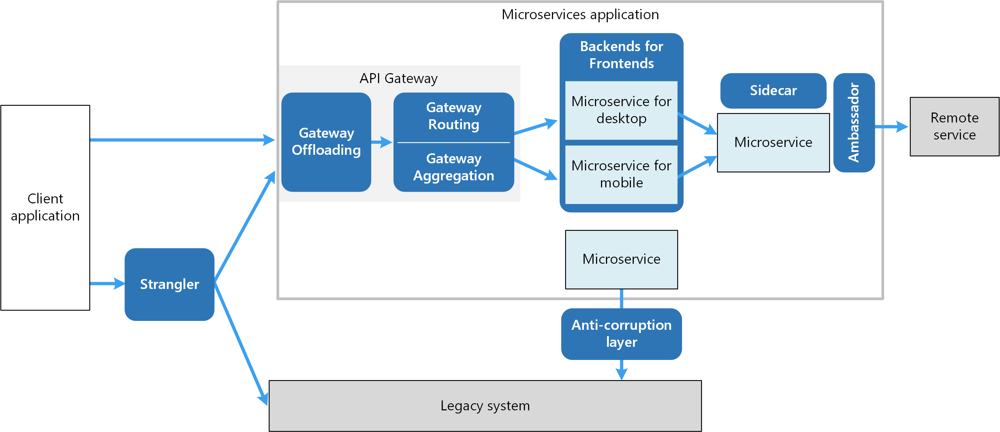

# Cloude Native

## [참고자료]
[Principles of container-based application design](https://www.redhat.com/en/resources/cloud-native-container-design-whitepaper)  
[Container Best Practices](http://docs.projectatomic.io/container-best-practices/)  
[The Twelve-Factor App](https://12factor.net/)   
[Best practices for writing Dockerfiles](https://docs.docker.com/develop/develop-images/dockerfile_best-practices/)  
[Container Patterns](https://gotocon.com/dl/goto-berlin-2015/slides/MatthiasLbken_PatternsInAContainerizedWorld.pdf)  
[일반적인 컨테이너 이미지 가이드라인](https://docs.openshift.com/enterprise/3.0/creating_images/guidelines.html)  
[파드](https://kubernetes.io/docs/concepts/workloads/pods/)  
[How Kubernetes Initializers work](https://medium.com/google-cloud/how-kubernetes-initializers-work-22f6586e1589)  
> [전능한일시 정지 컨테이너](https://www.ianlewis.org/en/almighty-pause-container)  
> [불변 서버(ImmutableServer )](https://martinfowler.com/bliki/ImmutableServer.html)  
> [EKS Workshop](https://www.eksworkshop.com/)
> [Amazon EKS 워크샵](https://awskrug.github.io/eks-workshop/)  
> [AWS - Cluster Autoscaler](https://docs.aws.amazon.com/ko_kr/eks/latest/userguide/cluster-autoscaler.html)  
> [AKS(Azure Kubernetes Service)에서 애플리케이션 수요에 맞게 자동으로 클러스터 크기 조정](https://docs.microsoft.com/ko-kr/azure/aks/cluster-autoscaler)

## Cloude Native 시스템의 속성
- 애플리케이션 또는 프로세스는 소프트웨어 컨테이너에서 분리된 단위로 실행됩니다.
- 프로세스는 리소스 사용을 개선하고 유지보수 비용을 줄이기 위해 중앙 - 오케스트레이션 프로세스에 의해 관리됩니다.
- 애플리케이션 또는 서비스(마이크로서비스)는 명시적으로 설명된 종속 항목과 느슨하게 결합됩니다.

## twelve-factor application

1. 버전화된 코드 베이스(예: Git 저장소)와 배치된 서비스 사이에는 일대일 연결이 있습니다. 동일한 코드 베이스가 여러 배치에 사용됩니다.
2. 서비스는 모든 종속 항목을 명시적으로 선언하며 시스템 수준 도구 또는 라이브러리의 존재 여부에 의존하지 않습니다.
3. 배치 환경마다 달라지는 구성은 환경, 특히 환경 변수에 저장됩니다.
4. 모든 지원 서비스는 첨부된 리소스로 처리되며, 이 리소스는 실행 환경에서 관리(첨부 및 분리)됩니다.
5. 전달 파이프라인은 빌드, 릴리스, 실행을 엄격하게 분리합니다.
6. 애플리케이션은 하나 이상의 상태 비저장(stateless) 프로세스로 6. 배치됩니다. 특히, 임시 프로세스는 상태 비저장(stateless)이며 아무것도 공유하지 않습니다. 지속적 데이터는 적절한 지원 서비스에 저장됩니다.
7. 자체 포함 서비스는 지정된 포트에서 청취하여 다른 서비스에서도 사용할 수 있도록 합니다.
8. 개별 프로세스(수평적 확장)를 확장하여 동시성을 달성합니다.
9. 프로세스는 일회용입니다. 빠른 시작 및 정상 시스템 종료 동작으로 보다 강력하고 탄력적인 시스템이 됩니다.
10. 로컬 개발에서 프로덕션에 이르기까지 모든 환경은 가능한 한 유사합니다.
11. 애플리케이션은 예를 들어 stdout 및 Stderr에 쓰는 이벤트 스트림으로 로그를 생성하고, 실행 환경을 신뢰하여 스트림을 집계합니다.
12. 일회성 관리 태스크가 필요한 경우 해당 태스크는 소스 제어에 보관되고 애플리케이션과 함께 패키징되어 애플리케이션과 동일한 환경에서 실행됩니다.

## MicroService
소규모의 독립적인 아키텍처 컴포넌트들의 집합으로서, 일반적인 경량 API를 통해 통신합니다. 
- 독립성
- 민첩성
- 유연성
- 폴리글랏 프로그래밍(polyglot programming)
- 탄력적

### Polyglot 에 적합한 도구 선택
### REST 및 JSON

## 클라우드 네이티브로 가는 길
- 쿠버네티스 패턴 : 대규모 자동화 컨테이너
- 마이크로 서비스 원칙 : 변경에 최적화된 서비스
- 도메인 주도 설계(Domain Driven Design) : Domain 인들이 서로 상호작용하며, 설계하는 것
  - Domain : 실세계에서 사건이 발생하는 집합
- 클린 코드(Clean Code) : 잘 짜인 코드