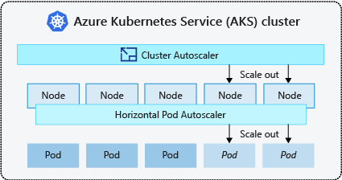

# Cloude Native

## [참고자료]
[Principles of container-based application design](https://www.redhat.com/en/resources/cloud-native-container-design-whitepaper)  
[Container Best Practices](http://docs.projectatomic.io/container-best-practices/)  
[The Twelve-Factor App](https://12factor.net/)   
[Best practices for writing Dockerfiles](https://docs.docker.com/develop/develop-images/dockerfile_best-practices/)  
[Container Patterns](https://gotocon.com/dl/goto-berlin-2015/slides/MatthiasLbken_PatternsInAContainerizedWorld.pdf)  
[일반적인 컨테이너 이미지 가이드라인](https://docs.openshift.com/enterprise/3.0/creating_images/guidelines.html)  
[파드](https://kubernetes.io/docs/concepts/workloads/pods/)  
[How Kubernetes Initializers work](https://medium.com/google-cloud/how-kubernetes-initializers-work-22f6586e1589)  
> [전능한일시 정지 컨테이너](https://www.ianlewis.org/en/almighty-pause-container)  
> [불변 서버(ImmutableServer )](https://martinfowler.com/bliki/ImmutableServer.html)  
> [EKS Workshop](https://www.eksworkshop.com/)
> [Amazon EKS 워크샵](https://awskrug.github.io/eks-workshop/)  
> [AWS - Cluster Autoscaler](https://docs.aws.amazon.com/ko_kr/eks/latest/userguide/cluster-autoscaler.html)  
> [AKS(Azure Kubernetes Service)에서 애플리케이션 수요에 맞게 자동으로 클러스터 크기 조정](https://docs.microsoft.com/ko-kr/azure/aks/cluster-autoscaler)

## Cloude Native 시스템의 속성
- 애플리케이션 또는 프로세스는 소프트웨어 컨테이너에서 분리된 단위로 실행됩니다.
- 프로세스는 리소스 사용을 개선하고 유지보수 비용을 줄이기 위해 중앙 - 오케스트레이션 프로세스에 의해 관리됩니다.
- 애플리케이션 또는 서비스(마이크로서비스)는 명시적으로 설명된 종속 항목과 느슨하게 결합됩니다.

## twelve-factor application

1. 버전화된 코드 베이스(예: Git 저장소)와 배치된 서비스 사이에는 일대일 연결이 있습니다. 동일한 코드 베이스가 여러 배치에 사용됩니다.
2. 서비스는 모든 종속 항목을 명시적으로 선언하며 시스템 수준 도구 또는 라이브러리의 존재 여부에 의존하지 않습니다.
3. 배치 환경마다 달라지는 구성은 환경, 특히 환경 변수에 저장됩니다.
4. 모든 지원 서비스는 첨부된 리소스로 처리되며, 이 리소스는 실행 환경에서 관리(첨부 및 분리)됩니다.
5. 전달 파이프라인은 빌드, 릴리스, 실행을 엄격하게 분리합니다.
6. 애플리케이션은 하나 이상의 상태 비저장(stateless) 프로세스로 6. 배치됩니다. 특히, 임시 프로세스는 상태 비저장(stateless)이며 아무것도 공유하지 않습니다. 지속적 데이터는 적절한 지원 서비스에 저장됩니다.
7. 자체 포함 서비스는 지정된 포트에서 청취하여 다른 서비스에서도 사용할 수 있도록 합니다.
8. 개별 프로세스(수평적 확장)를 확장하여 동시성을 달성합니다.
9. 프로세스는 일회용입니다. 빠른 시작 및 정상 시스템 종료 동작으로 보다 강력하고 탄력적인 시스템이 됩니다.
10. 로컬 개발에서 프로덕션에 이르기까지 모든 환경은 가능한 한 유사합니다.
11. 애플리케이션은 예를 들어 stdout 및 Stderr에 쓰는 이벤트 스트림으로 로그를 생성하고, 실행 환경을 신뢰하여 스트림을 집계합니다.
12. 일회성 관리 태스크가 필요한 경우 해당 태스크는 소스 제어에 보관되고 애플리케이션과 함께 패키징되어 애플리케이션과 동일한 환경에서 실행됩니다.

## MicroService
소규모의 독립적인 아키텍처 컴포넌트들의 집합으로서, 일반적인 경량 API를 통해 통신합니다. 
- 독립성
- 민첩성
- 유연성
- 폴리글롯 프로그래밍(polyglot programming)
- 탄력적

### Polyglot 에 적합한 도구 선택
### REST 및 JSON


## 클라우드 네이티브로 가는 길
- 쿠버네티스 패턴 : 대규모 자동화 컨테이너
- 마이크로 서비스 원칙 : 변경에 최적화된 서비스
- 도메인 주도 설계 : 유비쿼터스 도메인 모델
- 클린 코드 : 잘 짜인 코드

# Kubernetes 의 기본 요소와 분산 추상

## Container
패키징과 격리를 제공
- 하나의 문제를 해결하는 기능 단위로 재사용 할 수 있어여 함
- 하나의 팀에 의해 소유되며, 릴리즈 주기가 있다.
- 자기 완비적이며, 런타임 위존성을 정의하고 수행
- 기능을 노출시키기 위해 잘 정의된 API 가 있다.
- 일회용이며 언제든 Scale-Up, Scale-down 을 안전하게 수행할 수 있다.

## Pod
- 밀접하게 연관된 Container 그룹
- 스케줄링의 최소 단위
- Pod 에 속한 컨테이너들의 동일장소 배치(coocation)을 보장
- Pod 안의 모드 컨테이너가 공유하는 하나의 IP 주소와 이름, 포트 범위를 갖는다.
- Pod 는 네트워크 주소는 애플리케이션이 실행되는 동안 바뀔 수 있으며, Pod 를 찾고 로드 밸런싱하기 위한 또 다른 기본 요소가 필요
- Pod 는 초기화 컨테이너와 애플리케이션 컨테이버로 나뉨
  - 초기화 컨테이너 : 순차적으로 하나씩 실행되며 애플리케이션 컨테이너가 시작되기 전에 성공적으로 종료되어야 함 (>= 1.7)
  - 애플리케이션 컨테이너 : 병렬로 실행되며 시작 순서는 임의적
  ```
  apiVersion: v1
  kind: Pod
  metadata:
    name: www
    labels:
      app: www
  spec:
    initContainers:
    - name: download
      image: axeclbr/git
      # Clone an HTML page to be served
      command:
      - git
      - clone
      - https://github.com/mdn/beginner-html-site-scripted
      - /var/lib/data
      # Shared volume with main container
      volumeMounts:
      - mountPath: /var/lib/data
        name: source
    containers:
    # Simple static HTTP server for serving these pages
    - name: run
      image: docker.io/centos/httpd
      ports:
      - containerPort: 80
      # Shared volume with main container
      volumeMounts:
      - mountPath: /var/www/html
        name: source
    volumes:
    - emptyDir: {}
      name: source
  ```
  ```
  apiVersion: v1
  kind: Pod
  metadata:
    name: init-demo
  spec:
    containers:
    - name: nginx
      image: nginx
      ports:
      - containerPort: 80
      volumeMounts:
      - name: workdir
        mountPath: /usr/share/nginx/html
    # These containers are run during pod initialization
    initContainers:
    - name: install
      image: busybox
      command:
      - wget
      - "-O"
      - "/work-dir/index.html"
      - http://info.cern.ch
      volumeMounts:
      - name: workdir
        mountPath: "/work-dir"
    dnsPolicy: Default
    volumes:
    - name: workdir
      emptyDir: {}
  ```
## 서비스
Kubernetes 의 간단하면서도 강력한 또 하나의 추상화로, 서비스 이름을 IP 주소와 포트 번호로 영구히 연결시켜 줌
```
apiVersion: v1
kind: Service
metadata:
  name: www
spec:
  selector:
    app: www
  ports:
  - name: http
    port: 8080
    protocol: TCP
    targetPort: 80
  type: NodePort
```


## 레이블(Label)
- 실행 중인 특정 Pod 정의에는 인스턴스들을 가리키기 위해 ReplicaSet 에서 사용
- 스케줄러에서 많이 사용
  - 노드에 파드를 배치하기 위해, 레이블을 사용해 파드를 분산, 함께 노드에 위치
- 파드를 논리적 그룹으로 묶어 가리킬 수 있고 그 파드 그룹에 애플리케이션 식별자를 지정하 수 있음
- 메타데이터 저장하는 데 사용

## 애노테이션(Annotation)
- 사람보다는 기계를 위하 용도로 사용되며, 검색 불가능한 메타데이터를 지정하는 데 사용
- 빌드 ID, 릴리스 ID, 이미지 정보, 타임스탬프, Git Branch 명, Pull Request 번호, 이미지 해시, 레지스트리 주소, 작성자 이름, 도구 정보 등에 사용

## 네임스페이스
- 자원을 그룹화해 관리

## 패턴
### Sidecar
- 컨테이너의 기능을 확장시키고 향상시키기 위해 컨테이너를 Pod 에 넣는 시나리오를 기술하는데 사용
- 크기가 작으며 최소한의 자원 사용

#### Adapter
- 다양한 컨테이너화 시스템이 외부에서 사용할 수 있는 표준화되고 정규화된 형식의 일관된 통합 인터페이스슬 준수하게 함
- Sidecar 의 모든 특성을 상속받지만 Application 에 대해 적합한 접근만 제공함
- 다양한 Application 의 Metric 을 하나의 표준 형식(JSON) 및 Protocol(HTTP) 로 내 보냄으로써 통합된 모니터링 Interface 제공
- 예) Prometheus Exporter : jmx-exporter, 자기인식 기능을 이용한 logging
```
---
apiVersion: apps/v1
kind: Deployment
metadata:
  labels:
    app: spring-mongodb
    component: spring-mongodb
    release: mta-dev
    version: 0.7.5
  name: spring-mongodb
  namespace: mta-dev
spec:
  replicas: 1
  selector:
    matchLabels:
      app: spring-mongodb
  strategy:
    rollingUpdate:
      maxSurge: 1
      maxUnavailable: 1
    type: RollingUpdate
  template:
    metadata:
      creationTimestamp: null
      labels:
        app: spring-mongodb
        component: springboot
        version: 0.7.5
    spec:
      tolerations:
      - key: "dedicated"
        operator: "Exists"
        effect: "NoSchedule"
      affinity:
        nodeAffinity:
          requiredDuringSchedulingIgnoredDuringExecution:
            nodeSelectorTerms:
            - matchExpressions:
              - key: role
                operator: In
                values:
                - "worker"
      containers:
      - name: spring-mongodb
        imagePullPolicy: IfNotPresent
        image: harbor.skmta.net/mta-dev/spring-mongodb:0.7.5
        # securityContext:
        #   capabilities:
        #     add:
        #       - NET_ADMIN
        #       - SYS_MODULE
        #       - NET_RAW
        ports:
        - containerPort: 8088
          name: springmongo
        - containerPort: 8090
          name: jmx
        # volumeMounts:
        # - name: redis-info-volume
        #  mountPath: /home/appadmin/redis-info.json
        #  subPath: redis-info.json
        resources:
          limits:
            cpu: 500m
            memory: 512Mi
          requests:
            cpu: 500m
            memory: 512Mi
      hostAliases:
        # - hostnames:
        #  - mta-prd.skmta.net
        #  ip: 172.30.0.58
        # - hostnames:
        #   - mta-stg.skmta.net
        #   ip: 172.30.0.37
        - hostnames:
          - mta-dev.skmta.net
          ip: 172.30.0.37
      terminationGracePeriodSeconds: 60
  ```
  ```
  ---
  apiVersion: v1
  kind: Service
  metadata:
    labels:
      app: spring-mongodb
      release: mta-dev
    name: spring-mongodb
    namespace: mta-dev
    annotations:
      prometheus.io/scrape: 'true'
      prometheus.io/port: "8090"
  spec:
    ports:
    - name: spring-mongodb
      port: 8088
      protocol: TCP
      targetPort: 8088
      # nodePort: 31003
    - name: jmx-exporter
      port: 8090
      protocol: TCP
      targetPort: 8090
      # nodePort: 31004
    selector:
      app: spring-mongodb
    # type: NodePort
    type: ClusterIP
  ```  

#### Ambassador(Proxy)
- 복잡성을 숨기고 Pod 외부의 서비스에 접근하는 통합 인터페이스를 제공하는 Sidecar 의 특수 패턴   
- 외부 Proxy 역할  
- Application Container 는 비즈니스 로직에 중점을 두고 외부 서비스 이용에 대한 책임과 세부사항을 다른 특수 Container 에 위임할 수 있음

### Operator
- CRD(CustomResourceDefinition) 를 사용해 특정 애플리케이션에 대한 운영 지식을 알고리즘 및 자동화 된 형식으로 캡슐화하는 컨트롤러
- CRD(CustomResourceDefinition)
  - 사용자정의 자원을 추가하고 이것을 고유 자원처럼 사용해 Kubernetes API 를 확장
  - kubectl get crd
  - kubectl get Prometheus
  - kubectl get ServiceMonitor
- 설치 CRD
  - Application 을 설치하고 운영하는데 사용
  - 예) Prometheus CRD
- Applicaton CRD
  - Application Domain Concept 을 나타낼 때 사용
  - 예) ServiceMonitor

### Elastic Scale
- Pod 복제수, 자원할당, Cluster Node 증감 조정
#### Horizontal scaling
- Horizontal Pod Autoscaler(HPA)
- Pod 복제 갯수 조정
#### Vertical scaling
- Vertical Pod Autoscaler(VPA)
- Pod 의 CPU, Memory 활당량 조정
#### Cluster Autoscaling
- Addon 형태로 구동, 최소 Node 수, 최대 Node 수 지정
- Cloud Computing Infrastructure 상에서 실행 중일 때만 기능을 수행
- Amazon EC2 Auto Scaling 그룹
- Azure : VMSS(Virtual Machine Scale Sets)  
    

  ```
  az aks nodepool list --cluster-name aks-cluster-chatops -g rg-chatops -o table   
  Name       OsType    KubernetesVersion    VmSize           Count    MaxPods    ProvisioningState    Mode
  ---------  --------  -------------------  ---------------  -------  ---------  -------------------  ------
  chatops01  Linux     1.20.5               Standard_DS3_v2  0        110        Succeeded            System
  ```
  ```
  az aks nodepool list --cluster-name aks-cluster-chatops -g rg-chatops | jq .[].powerState.code
  ```
  ```
  az aks list | jq .[].powerState.code
  "Running"
  ```