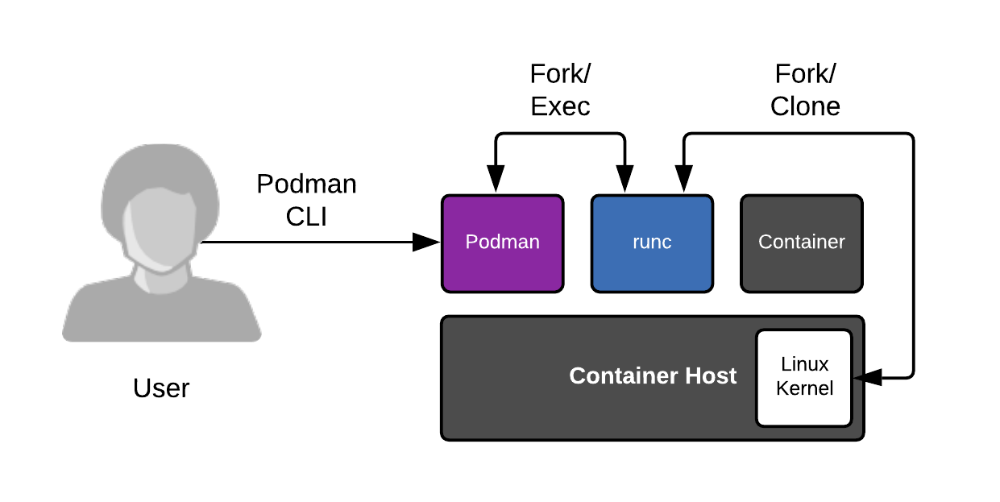

# CRI(Container Runtime Interface)
> [containerd](https://github.com/containerd/containerd/)

- [1.20 이후 docker Container Runtime 지원 중단, Docker Image 생성은 사용](https://kubernetes.io/blog/2020/12/02/dont-panic-kubernetes-and-docker/)  
- [Dockershim Deprecation FAQ](https://kubernetes.io/blog/2020/12/02/dockershim-faq/)  
  - docker : Volume, Network, Container Runtime 등을 가지고 있음
    - k8s 는 이중 container runtime 만 필요로 함
  - dockershim
    - docker 에서 CRI 를 지원하는 역활을 함
    - k8s 는 CRI 통신을 위해 bridge service 인 dockershim 을 사용함
      - 실제 운영상에서 문제를 다수의 야기함
  - k8s 는 kubelet 를 통해 node 내의 pod(container 들) 를 container runtime 을 CRI 를 통해 제어함  
- kubelet 이 container 구동을 위해 필요한 것이 CRI 임
- CRI
  - kubelet 으로 부터 gRPC request 받아
  - OCI 구동을 위한 json config 파일 생성, OCI 에 전달
  - CRI 을 통해 container 를 spawn 함
  - OCI
    - runC, gVisor 
- Container Runtime
  - [containerd](https://github.com/containerd/containerd/)  
    - 단순성, 견고성 및 이식성을 강조하는 산업 표준 컨테이너 런타임  
  - [cri-o](https://github.com/cri-o/cri-o)  
    - OCI Kubernetes 컨테이너 런타임 데몬  
    - [CRI-O 채택자](https://github.com/cri-o/cri-o/blob/master/ADOPTERS.md) : RedHat, Oracle, Suse ...  
    - [CRI-O Metrics](https://github.com/cri-o/cri-o/blob/master/tutorials/metrics.md)  

## container-d

- 설치
  ``` 
  wget https://github.com/containerd/containerd/archive/v1.5.2.zip
  unzip v1.5.2.zip
  ```

## CRI-O
    
  ```
  curl -L -o /etc/yum.repos.d/devel:kubic:libcontainers:stable.repo https://download.opensuse.org/repositories/devel:/kubic:/libcontainers:/stable/$OS/devel:kubic:libcontainers:stable.repo
  curl -L -o /etc/yum.repos.d/devel:kubic:libcontainers:stable:cri-o:$VERSION.repo https://download.opensuse.org/repositories/devel:kubic:libcontainers:stable:cri-o:$VERSION/$OS/devel:kubic:libcontainers:stable:cri-o:$VERSION.repo
  yum install cri-o
  ```

## Podman

- Red Hat Enterprise Linux 8 / CentOS 8 부터는 Docker 대신 Podman 이라는 도구를 제공  
- daemonless, root 권한 불필요, k8s 지원
- docker 또는 다른 활성 컨테이너 런타임이 필요하지 않음  
- Docker 사용법은 같음
- alias docker=podman

### 설치
#### Redhat 기준
  - repo 추가
  ```
  sudo curl -L -o /etc/yum.repos.d/devel:kubic:libcontainers:stable.repo  https://download.opensuse.org/repositories/devel:/kubic:/libcontainers:/stable/CentOS_7/devel:kubic:libcontainers:stable.repo
  ```
  - 설치
  ```
  yum -y install podman
  ```

#### Ubuntu
  - 20.04 이상
  ```
  sudo apt -y update
  sudo apt -y install podman
  ```
  - 20.04 이하
  ```
  . /etc/os-release
  echo "deb https://download.opensuse.org/repositories/devel:/kubic:/libcontainers:/stable/xUbuntu_${VERSION_ID}/ /" | sudo tee etc/apt/sources.list.d/devel:kubic:libcontainers:stable.list
  curl -L https://download.opensuse.org/repositories/devel:/kubic:/libcontainers:/stable/xUbuntu_${VERSION_ID}/Release.key | sudo apt-key add -
  sudo apt-get update
  sudo apt-get -y upgrade 
  sudo apt-get -y install podman
  ```

#### Ubuntu 18.04.5 LTS
- podman 설치
```
sudo apt-get update -y
sudo apt-get upgrade -y
sudo apt-get install software-properties-common -y
sudo add-apt-repository -y ppa:projectatomic/ppa
sudo apt-get install podman -y
```
```
podman info
host:
  BuildahVersion: 1.11.3
  CgroupVersion: v1
  Conmon:
    package: 'conmon: /usr/bin/conmon'
    path: /usr/bin/conmon
    version: 'conmon version 2.0.3, commit: unknown'
  Distribution:
    distribution: ubuntu
    version: "18.04"
  IDMappings:
    gidmap:
    - container_id: 0
      host_id: 1000
      size: 1
    - container_id: 1
      host_id: 165536
      size: 65536
    uidmap:
    - container_id: 0
      host_id: 1000
      size: 1
    - container_id: 1
      host_id: 165536
      size: 65536
  MemFree: 1074708480
  MemTotal: 2016989184
  OCIRuntime:
    name: runc
    package: 'containerd.io: /usr/bin/runc'
    path: /usr/bin/runc
    version: |-
      runc version 1.0.0-rc95
      commit: b9ee9c6314599f1b4a7f497e1f1f856fe433d3b7
      spec: 1.0.2-dev
      go: go1.13.15
      libseccomp: 2.5.1
  SwapFree: 0
  SwapTotal: 0
  arch: amd64
  cpus: 1
  eventlogger: journald
  hostname: VM-Bastion
  kernel: 5.4.0-1051-azure
  os: linux
  rootless: true
  slirp4netns:
    Executable: /usr/bin/slirp4netns
    Package: 'slirp4netns: /usr/bin/slirp4netns'
    Version: |-
      slirp4netns version 0.4.2
      commit: unknown
  uptime: 10m 23.15s
registries:
  blocked: null
  insecure: null
  search: null
store:
  ConfigFile: /home/azureuser/.config/containers/storage.conf
  ContainerStore:
    number: 0
  GraphDriverName: vfs
  GraphOptions: {}
  GraphRoot: /home/azureuser/.local/share/containers/storage
  GraphStatus: {}
  ImageStore:
    number: 0
  RunRoot: /run/user/1000
  VolumePath: /home/azureuser/.local/share/containers/storage/volumes
```
- podman 사용을 위해 /etc/containers/registries.conf 파일에서 docker.io 레지스트리를 정의
```
sudo echo -e "[registries.search]\nregistries = ['docker.io']" | sudo tee /etc/containers/registries.conf
[registries.search]
registries = ['docker.io']
```
```
podman run hello-world
Trying to pull docker.io/library/hello-world...
```

- container 실행
  ```
  podman run hello-world
  Trying to pull docker.io/library/hello-world...
  Getting image source signatures
  Copying blob b8dfde127a29 done
  Copying config d1165f2212 done
  Writing manifest to image destination
  Storing signatures

  Hello from Docker!
  This message shows that your installation appears to be working correctly.

  To generate this message, Docker took the following steps:
  1. The Docker client contacted the Docker daemon.
  2. The Docker daemon pulled the "hello-world" image from the Docker Hub.
      (amd64)
  3. The Docker daemon created a new container from that image which runs the
      executable that produces the output you are currently reading.
  4. The Docker daemon streamed that output to the Docker client, which sent it
      to your terminal.

  To try something more ambitious, you can run an Ubuntu container with:
  $ docker run -it ubuntu bash

  Share images, automate workflows, and more with a free Docker ID:
  https://hub.docker.com/

  For more examples and ideas, visit:
  https://docs.docker.com/get-started/

  ```
- container image build
  ```
  $ podman build --rm=true --network=host --tag nodejs-bot:1.0.0 .
  STEP 1: FROM centos:7.6.1810
  Getting image source signatures
  Copying blob ac9208207ada done
  Copying config f1cb7c7d58 done
  Writing manifest to image destination
  Storing signatures
  .
  .
  .
  1d500ecabaae810ec3b807897633de98f6f89982dcac14acc724d5af59234888
  STEP 30: COPY nodejs-exporter.js ./
  c898bc6c8263eec853e95cd865f963974c253f7af4a0836a037175f5ce6e0f33
  STEP 31: COPY logger.js ./
  debb6f4c01f5562f11ec54ac4e6c3009e748c8d02b389d2600ece817616d6e5b
  STEP 32: COPY redis-ha.js ./
  87fb26baf92c1254ca81313d889a3edcebe941a189f682e2e7369e84464bcfdf
  STEP 33: COPY server.js ./
  9116414cc824e9a461a8d86aa09efe27269ba1d3107a370f5bed9419615bc365
  STEP 34: EXPOSE 8080
  e3b11a7d9af9a9e09001036c44e6e3a688d1da1b0dd1b448643cb89a5eaeb0ec
  STEP 35: CMD [ "npm", "start" ]
  STEP 36: COMMIT nodejs-bot:1.0.0
  8bbf9fe29a9206a45b6d652b55950f49c2ce744fc6b92a6840495bf2d73540ca
  ```
- container image 보기
  ```
  $ podman images
  REPOSITORY                      TAG        IMAGE ID       CREATED         SIZE
  localhost/nodejs-bot            1.0.0      8bbf9fe29a92   4 minutes ago   572 MB
  docker.io/library/ubuntu        latest     9873176a8ff5   2 weeks ago     75.1 MB
  docker.io/library/hello-world   latest     d1165f221234   3 months ago    17.9 kB
  docker.io/library/centos        7.6.1810   f1cb7c7d58b7   2 years ago     209 MB
  ```
- acr login
  ```
  az acr login -n acrChatOps --expose-token
  You can perform manual login using the provided access token below, for example: 'docker login loginServer -u 00000000-0000-0000-0000-000000000000 -p accessToken'
  {
    "accessToken": "eyJhbGciOiJSUzI1NiIsInR5cCI6IkpXVCIsImtpZCI6IjQ1NlA6WjNCRjpCQ0tPOkpUN0w6MlNLSTpVQUpZOkRCSU46VU5KWTpHWUZHOjdMQTI6WUpNSzpWUkVaIn0.eyJqdGkiOiI1YTA0OWYwYy0yYWViLTRhZTAtYWRkNC04ZmNjYjU3NTQzMjMiLCJzdWIiOiJsank2MTZAYW5hYmFyYWxzay5vbm1pY3Jvc29mdC5jb20iLCJuYmYiOjE2MjUyMjg4NTYsImV4cCI6MTYyNTI0MDU1NiwiaWF0IjoxNjI1MjI4ODU2LCJpc3MiOiJBenVyZSBDb250YWluZXIgUmVnaXN0cnkiLCJhdWQiOiJhY3JjaGF0b3BzLmF6dXJlY3IuaW8iLCJ2ZXJzaW9uIjoiMS4wIiwicmlkIjoiNzQzZTJkNjQ2YmFmNDdhYzliZTJlNzQ0ZTEyNjg1Y2MiLCJncmFudF90eXBlIjoicmVmcmVzaF90b2tlbiIsImFwcGlkIjoiMDRiMDc3OTUtOGRkYi00NjFhLWJiZWUtMDJmOWUxYmY3YjQ2IiwidGVuYW50IjoiZTJlZjgxMDQtN2VjMi00NDJmLWFlZTctN2Y4YzM4ZDNkODdkIiwicGVybWlzc2lvbnMiOnsiYWN0aW9ucyI6WyJyZWFkIiwid3JpdGUiLCJkZWxldGUiXSwibm90QWN0aW9ucyI6bnVsbH0sInJvbGVzIjpbXX0.2Gq8RFJlp6MyIwVX30QR83IqEXSACgM3W3RipASKsPIK24_w7wci2SeeyGEdqfwfN7Q9BsrlKmfjJLKcrVt8lZ0Sm8_24dVe3CCyExY7cHSWb6xHY66HZesN8utPqiwvs985lwU79R-KoEBgYI62TZRZPi-6zp8loO-Mjxh0PTDpYrRyAqeUxtaJxjJJhLpS3v-307GglcYvaxiVTekDOFln5hb1CxQ3NLX1XDdJFgaIIRbElm_BI97likx2Gxn1VLUTJCRkkIeMl-P8Ih5dRGMrfsRNboY5jSLcyUOdOEm2gfFVHruU8fXsT0HCYNJZd3lMxRDN15Z-xlEOlRqFTQ",
    "loginServer": "acrchatops.azurecr.io"
  }
  ```
  ```
  $ podman login acrchatops.azurecr.io --username 00000000-0000-0000-0000-000000000000 -p "eyJhbGciOiJSUzI1NiIsInR5cCI6IkpXVCIsImtpZCI6IjQ1NlA6WjNCRjpCQ0tPOkpUN0w6MlNLSTpVQUpZOkRCSU46VU5KWTpHWUZHOjdMQTI6WUpNSzpWUkVaIn0.eyJqdGkiOiI1YTA0OWYwYy0yYWViLTRhZTAtYWRkNC04ZmNjYjU3NTQzMjMiLCJzdWIiOiJsank2MTZAYW5hYmFyYWxzay5vbm1pY3Jvc29mdC5jb20iLCJuYmYiOjE2MjUyMjg4NTYsImV4cCI6MTYyNTI0MDU1NiwiaWF0IjoxNjI1MjI4ODU2LCJpc3MiOiJBenVyZSBDb250YWluZXIgUmVnaXN0cnkiLCJhdWQiOiJhY3JjaGF0b3BzLmF6dXJlY3IuaW8iLCJ2ZXJzaW9uIjoiMS4wIiwicmlkIjoiNzQzZTJkNjQ2YmFmNDdhYzliZTJlNzQ0ZTEyNjg1Y2MiLCJncmFudF90eXBlIjoicmVmcmVzaF90b2tlbiIsImFwcGlkIjoiMDRiMDc3OTUtOGRkYi00NjFhLWJiZWUtMDJmOWUxYmY3YjQ2IiwidGVuYW50IjoiZTJlZjgxMDQtN2VjMi00NDJmLWFlZTctN2Y4YzM4ZDNkODdkIiwicGVybWlzc2lvbnMiOnsiYWN0aW9ucyI6WyJyZWFkIiwid3JpdGUiLCJkZWxldGUiXSwibm90QWN0aW9ucyI6bnVsbH0sInJvbGVzIjpbXX0.2Gq8RFJlp6MyIwVX30QR83IqEXSACgM3W3RipASKsPIK24_w7wci2SeeyGEdqfwfN7Q9BsrlKmfjJLKcrVt8lZ0Sm8_24dVe3CCyExY7cHSWb6xHY66HZesN8utPqiwvs985lwU79R-KoEBgYI62TZRZPi-6zp8loO-Mjxh0PTDpYrRyAqeUxtaJxjJJhLpS3v-307GglcYvaxiVTekDOFln5hb1CxQ3NLX1XDdJFgaIIRbElm_BI97likx2Gxn1VLUTJCRkkIeMl-P8Ih5dRGMrfsRNboY5jSLcyUOdOEm2gfFVHruU8fXsT0HCYNJZd3lMxRDN15Z-xlEOlRqFTQ"
  Login Succeeded!
  ```
- container image push
  ```
  $ podman tag nodejs-bot:1.0.0 acrchatops.azurecr.io/nodejs-bot:1.0.0
  $ podman push acrchatops.azurecr.io/nodejs-bot:1.0.0
  Getting image source signatures
  Copying blob dcad94415578 done
  Copying blob 267090b0ca6c done
  Copying blob 89169d87dbe2 done
  Copying blob f70713405493 done
  Copying blob dc9baddfe85f done
  Copying blob 54186556e54b done
  Copying blob 5f70bf18a086 done
  Copying blob 7c191ee1fb66 done
  Copying blob c8992e9a0045 done
  Copying blob 102c926c7ae2 done
  Copying blob 02fc894e6902 done
  Copying blob e2a46da99419 done
  Copying blob 6c17768cf843 done
  Copying blob a85a5c464dc3 done
  Copying blob 5bda30359381 done
  Copying blob fbc0fa91ef23 done
  Copying blob 3f7187d46c05 done
  Copying blob ae827f87abe4 done
  Copying blob 82c28daab6e3 done
  Copying blob 20a05b738f9d done
  Copying blob d4add955fac4 done
  Copying blob 933011da1ddc done
  Copying blob 47bcdde6abea done
  Copying blob 7a917f164a42 done
  Copying config 8bbf9fe29a done
  Writing manifest to image destination
  Storing signatures
  ```
#### Amazon Linux
  ```
  sudo amazon-linux-extras install epel -y
  sudo yum-config-manager --enable epel
  sudo yum repolist
  ```
  ```
  sudo curl -L -o /etc/yum.repos.d/devel:kubic:libcontainers:stable.repo https://download.opensuse.org/repositories/devel:/kubic:/libcontainers:/stable/CentOS_7/devel:kubic:libcontainers:stable.repo
  sudo yum -y install yum-plugin-copr
  ```
```
Error: Package: 4:containers-common-1-17.el7.17.1.noarch (devel_kubic_libcontainers_stable)
           Requires: oci-runtime
```
```
cd /etc/yum.repos.d/
sudo curl -L -o /etc/yum.repos.d/devel:kubic:libcontainers:stable.repo https://download.opensuse.org/repositories/devel:/kubic:/libcontainers:/stable/CentOS_7/devel:kubic:libcontainers:stable.repo
sudo wget https://download.opensuse.org/repositories/devel:kubic:libcontainers:stable/CentOS_7/devel:kubic:libcontainers:stable.repo
sudo yum -y install yum-plugin-copr
sudo yum -y copr enable lsm5/container-selinux
sudo yum -y install podman
```
- extra 라이브러리 설치
```
which amazon-linux-extras
sudo yum install -y amazon-linux-extras
yum clean metadata
yum install php-cli php-pdo php-fpm php-json php-mysqlnd
sudo yum clean metadata && sudo yum install php-cli php-pdo php-fpm php-json php-mysqlnd
yum list installed php-cli php-pdo php-fpm php-json php-mysqlnd
which php
php --version
```
- /etc/yum.repos.d/centos.repo
```
[centos-base]
name=CentOS-7 - Base
baseurl=http://mirror.centos.org/centos-7/7/os/x86_64/
enabled=0
gpgcheck=0
[centos-extras]
name=CentOS-7 - Extras
baseurl=http://mirror.centos.org/centos-7/7/extras/x86_64/
gpgcheck=0
```
- /etc/yum.repos.d/amzn2-core.repo
```
priority=10
```
```
sudo yum -y install podman --enablerepo=centos-base
```
```
yum.repos.d]$ ls -lt
total 20
-rw-r--r-- 1 root root  359 Jul  1 07:20 devel:kubic:libcontainers:stable.repo
-rw-r--r-- 1 root root  392 Jul  1 07:17 _copr_lsm5-container-selinux.repo
-rw-r--r-- 1 root root  587 Jul  1 07:14 devel:kubic:libcontainers:stable.repo.old
-rw-r--r-- 1 root root 3114 Jul  1 07:12 amzn2-extras.repo
-rw-r--r-- 1 root root 1005 Jul  1 04:57 amzn2-core.repo
```
```
$ cat devel:kubic:libcontainers:stable.repo
[devel_kubic_libcontainers_stable]
name=Stable Releases of Upstream github.com/containers packages (CentOS_7)
type=rpm-md
baseurl=https://download.opensuse.org/repositories/devel:/kubic:/libcontainers:/stable/CentOS_7/
gpgcheck=1
gpgkey=https://download.opensuse.org/repositories/devel:/kubic:/libcontainers:/stable/CentOS_7/repodata/repomd.xml.key
enabled=1
```
```
$ sudo yum -y install yum-plugin-copr
Loaded plugins: copr, extras_suggestions, langpacks, priorities, update-motd
devel_kubic_libcontainers_stable                                                                | 1.3 kB  00:00:00
511 packages excluded due to repository priority protections
Package yum-plugin-copr-1.1.31-46.amzn2.0.1.noarch already installed and latest version
Nothing to do
```
```
$  sudo yum -y copr enable lsm5/container-selinux
Loaded plugins: copr, extras_suggestions, langpacks, priorities, update-motd
copr done
```
```
sudo yum -y copr enable lsm5/container-selinux
Loaded plugins: copr, extras_suggestions, langpacks, priorities, update-motd
copr done
```
```
$ sudo yum -y install podman
Loaded plugins: copr, extras_suggestions, langpacks, priorities, update-motd
copr:copr.fedorainfracloud.org:lsm5:container-selinux                                           | 3.3 kB  00:00:00
511 packages excluded due to repository priority protections
Resolving Dependencies
--> Running transaction check
---> Package podman.x86_64 0:3.0.1-2.el7.3.1 will be installed
--> Processing Dependency: podman-plugins = 3.0.1-2.el7.3.1 for package: podman-3.0.1-2.el7.3.1.x86_64
--> Processing Dependency: slirp4netns >= 0.3.0-2 for package: podman-3.0.1-2.el7.3.1.x86_64
--> Processing Dependency: runc >= 2:1.0.0-148.rc93 for package: podman-3.0.1-2.el7.3.1.x86_64
--> Processing Dependency: containers-common >= 4:1-4 for package: podman-3.0.1-2.el7.3.1.x86_64
--> Processing Dependency: containernetworking-plugins >= 0.9.1-1 for package: podman-3.0.1-2.el7.3.1.x86_64
--> Processing Dependency: conmon >= 2:2.0.16-1 for package: podman-3.0.1-2.el7.3.1.x86_64
--> Processing Dependency: nftables for package: podman-3.0.1-2.el7.3.1.x86_64
--> Processing Dependency: container-selinux for package: podman-3.0.1-2.el7.3.1.x86_64
--> Processing Dependency: catatonit for package: podman-3.0.1-2.el7.3.1.x86_64
--> Running transaction check
---> Package catatonit.x86_64 0:0.1.5-6.el7.3.1 will be installed
---> Package conmon.x86_64 2:2.0.29-1.el7.3.1 will be installed
---> Package container-selinux.noarch 2:2.107-3.el7 will be installed
--> Processing Dependency: policycoreutils-python for package: 2:container-selinux-2.107-3.el7.noarch
---> Package containernetworking-plugins.x86_64 0:1.0.0-0.2.rc1.el7.6.1 will be installed
---> Package containers-common.noarch 4:1-17.el7.17.1 will be installed
--> Processing Dependency: fuse-overlayfs for package: 4:containers-common-1-17.el7.17.1.noarch
---> Package nftables.x86_64 1:0.9.0-14.amzn2.0.1 will be installed
--> Processing Dependency: libnftnl.so.11(LIBNFTNL_11)(64bit) for package: 1:nftables-0.9.0-14.amzn2.0.1.x86_64
--> Processing Dependency: libnftnl.so.11()(64bit) for package: 1:nftables-0.9.0-14.amzn2.0.1.x86_64
---> Package podman-plugins.x86_64 0:3.0.1-2.el7.3.1 will be installed
--> Processing Dependency: dnsmasq for package: podman-plugins-3.0.1-2.el7.3.1.x86_64
---> Package runc.x86_64 0:1.0.0-0.3.20210225.git12644e6.amzn2 will be updated
---> Package runc.x86_64 2:1.0.0-378.rc95.el7.2.1 will be an update
--> Processing Dependency: criu for package: 2:runc-1.0.0-378.rc95.el7.2.1.x86_64
---> Package slirp4netns.x86_64 0:1.1.8-4.el7.7.1 will be installed
--> Processing Dependency: libslirp.so.0(SLIRP_4.1)(64bit) for package: slirp4netns-1.1.8-4.el7.7.1.x86_64
--> Processing Dependency: libslirp.so.0(SLIRP_4.0)(64bit) for package: slirp4netns-1.1.8-4.el7.7.1.x86_64
--> Processing Dependency: libslirp.so.0()(64bit) for package: slirp4netns-1.1.8-4.el7.7.1.x86_64
--> Running transaction check
---> Package criu.x86_64 0:3.5-4.amzn2 will be installed
--> Processing Dependency: libprotobuf-c.so.1(LIBPROTOBUF_C_1.0.0)(64bit) for package: criu-3.5-4.amzn2.x86_64
--> Processing Dependency: libprotobuf-c.so.1()(64bit) for package: criu-3.5-4.amzn2.x86_64
--> Processing Dependency: libnet.so.1()(64bit) for package: criu-3.5-4.amzn2.x86_64
---> Package dnsmasq.x86_64 0:2.76-16.amzn2.1.3 will be installed
---> Package fuse-overlayfs.x86_64 0:1.5.0-1.el7.1.1 will be installed
--> Processing Dependency: libfuse3.so.3(FUSE_3.2)(64bit) for package: fuse-overlayfs-1.5.0-1.el7.1.1.x86_64
--> Processing Dependency: libfuse3.so.3(FUSE_3.0)(64bit) for package: fuse-overlayfs-1.5.0-1.el7.1.1.x86_64
--> Processing Dependency: fuse3 for package: fuse-overlayfs-1.5.0-1.el7.1.1.x86_64
--> Processing Dependency: libfuse3.so.3()(64bit) for package: fuse-overlayfs-1.5.0-1.el7.1.1.x86_64
---> Package libnftnl.x86_64 0:1.1.5-4.amzn2 will be installed
---> Package libslirp.x86_64 0:4.3.1-4.el7 will be installed
---> Package policycoreutils-python.x86_64 0:2.5-22.amzn2 will be installed
--> Processing Dependency: setools-libs >= 3.3.8-2 for package: policycoreutils-python-2.5-22.amzn2.x86_64
--> Processing Dependency: libsemanage-python >= 2.5-9 for package: policycoreutils-python-2.5-22.amzn2.x86_64
--> Processing Dependency: audit-libs-python >= 2.1.3-4 for package: policycoreutils-python-2.5-22.amzn2.x86_64
--> Processing Dependency: python-IPy for package: policycoreutils-python-2.5-22.amzn2.x86_64
--> Processing Dependency: libselinux-python for package: policycoreutils-python-2.5-22.amzn2.x86_64
--> Processing Dependency: libqpol.so.1(VERS_1.4)(64bit) for package: policycoreutils-python-2.5-22.amzn2.x86_64
--> Processing Dependency: libqpol.so.1(VERS_1.2)(64bit) for package: policycoreutils-python-2.5-22.amzn2.x86_64
--> Processing Dependency: libapol.so.4(VERS_4.0)(64bit) for package: policycoreutils-python-2.5-22.amzn2.x86_64
--> Processing Dependency: checkpolicy for package: policycoreutils-python-2.5-22.amzn2.x86_64
--> Processing Dependency: libqpol.so.1()(64bit) for package: policycoreutils-python-2.5-22.amzn2.x86_64
--> Processing Dependency: libapol.so.4()(64bit) for package: policycoreutils-python-2.5-22.amzn2.x86_64
--> Running transaction check
---> Package audit-libs-python.x86_64 0:2.8.1-3.amzn2.1 will be installed
---> Package checkpolicy.x86_64 0:2.5-6.amzn2 will be installed
---> Package fuse-overlayfs.x86_64 0:1.5.0-1.el7.1.1 will be installed
--> Processing Dependency: libfuse3.so.3(FUSE_3.2)(64bit) for package: fuse-overlayfs-1.5.0-1.el7.1.1.x86_64
--> Processing Dependency: libfuse3.so.3(FUSE_3.0)(64bit) for package: fuse-overlayfs-1.5.0-1.el7.1.1.x86_64
--> Processing Dependency: fuse3 for package: fuse-overlayfs-1.5.0-1.el7.1.1.x86_64
--> Processing Dependency: libfuse3.so.3()(64bit) for package: fuse-overlayfs-1.5.0-1.el7.1.1.x86_64
---> Package libnet.x86_64 0:1.1.6-7.amzn2.0.2 will be installed
---> Package libselinux-python.x86_64 0:2.5-12.amzn2.0.2 will be installed
---> Package libsemanage-python.x86_64 0:2.5-11.amzn2 will be installed
---> Package protobuf-c.x86_64 0:1.0.2-3.amzn2.0.1 will be installed
---> Package python-IPy.noarch 0:0.75-6.amzn2.0.1 will be installed
---> Package setools-libs.x86_64 0:3.3.8-2.amzn2.0.2 will be installed
--> Finished Dependency Resolution
Error: Package: fuse-overlayfs-1.5.0-1.el7.1.1.x86_64 (devel_kubic_libcontainers_stable)
           Requires: fuse3
Error: Package: fuse-overlayfs-1.5.0-1.el7.1.1.x86_64 (devel_kubic_libcontainers_stable)
           Requires: libfuse3.so.3(FUSE_3.0)(64bit)
Error: Package: fuse-overlayfs-1.5.0-1.el7.1.1.x86_64 (devel_kubic_libcontainers_stable)
           Requires: libfuse3.so.3()(64bit)
Error: Package: fuse-overlayfs-1.5.0-1.el7.1.1.x86_64 (devel_kubic_libcontainers_stable)
           Requires: libfuse3.so.3(FUSE_3.2)(64bit)
 You could try using --skip-broken to work around the problem
 You could try running: rpm -Va --nofiles --nodigest
[da-user@ip-10-0-1-117 yum.repos.d]$ sudo yum -y install podman --enablerepo=centos-base
Loaded plugins: copr, extras_suggestions, langpacks, priorities, update-motd


Error getting repository data for centos-base, repository not found
[da-user@ip-10-0-1-117 yum.repos.d]$ sudo vi centos.repo
[da-user@ip-10-0-1-117 yum.repos.d]$ sudo yum -y install podman --enablerepo=centos-base
Loaded plugins: copr, extras_suggestions, langpacks, priorities, update-motd
centos-base                                                                                     | 3.6 kB  00:00:00
centos-extras                                                                                   | 2.9 kB  00:00:00
519 packages excluded due to repository priority protections
Resolving Dependencies
--> Running transaction check
---> Package podman.x86_64 0:3.0.1-2.el7.3.1 will be installed
--> Processing Dependency: podman-plugins = 3.0.1-2.el7.3.1 for package: podman-3.0.1-2.el7.3.1.x86_64
--> Processing Dependency: slirp4netns >= 0.3.0-2 for package: podman-3.0.1-2.el7.3.1.x86_64
--> Processing Dependency: runc >= 2:1.0.0-148.rc93 for package: podman-3.0.1-2.el7.3.1.x86_64
--> Processing Dependency: containers-common >= 4:1-4 for package: podman-3.0.1-2.el7.3.1.x86_64
--> Processing Dependency: containernetworking-plugins >= 0.9.1-1 for package: podman-3.0.1-2.el7.3.1.x86_64
--> Processing Dependency: conmon >= 2:2.0.16-1 for package: podman-3.0.1-2.el7.3.1.x86_64
--> Processing Dependency: nftables for package: podman-3.0.1-2.el7.3.1.x86_64
--> Processing Dependency: container-selinux for package: podman-3.0.1-2.el7.3.1.x86_64
--> Processing Dependency: catatonit for package: podman-3.0.1-2.el7.3.1.x86_64
--> Running transaction check
---> Package catatonit.x86_64 0:0.1.5-6.el7.3.1 will be installed
---> Package conmon.x86_64 2:2.0.29-1.el7.3.1 will be installed
---> Package container-selinux.noarch 2:2.119.2-1.911c772.el7_8 will be installed
--> Processing Dependency: selinux-policy-targeted >= 3.13.1-216.el7 for package: 2:container-selinux-2.119.2-1.911c772.el7_8.noarch
--> Processing Dependency: selinux-policy-base >= 3.13.1-216.el7 for package: 2:container-selinux-2.119.2-1.911c772.el7_8.noarch
--> Processing Dependency: selinux-policy >= 3.13.1-216.el7 for package: 2:container-selinux-2.119.2-1.911c772.el7_8.noarch
--> Processing Dependency: policycoreutils-python for package: 2:container-selinux-2.119.2-1.911c772.el7_8.noarch
---> Package containernetworking-plugins.x86_64 0:1.0.0-0.2.rc1.el7.6.1 will be installed
---> Package containers-common.noarch 4:1-17.el7.17.1 will be installed
--> Processing Dependency: fuse-overlayfs for package: 4:containers-common-1-17.el7.17.1.noarch
---> Package nftables.x86_64 1:0.9.0-14.amzn2.0.1 will be installed
--> Processing Dependency: libnftnl.so.11(LIBNFTNL_11)(64bit) for package: 1:nftables-0.9.0-14.amzn2.0.1.x86_64
--> Processing Dependency: libnftnl.so.11()(64bit) for package: 1:nftables-0.9.0-14.amzn2.0.1.x86_64
---> Package podman-plugins.x86_64 0:3.0.1-2.el7.3.1 will be installed
--> Processing Dependency: dnsmasq for package: podman-plugins-3.0.1-2.el7.3.1.x86_64
---> Package runc.x86_64 0:1.0.0-0.3.20210225.git12644e6.amzn2 will be updated
---> Package runc.x86_64 2:1.0.0-378.rc95.el7.2.1 will be an update
--> Processing Dependency: criu for package: 2:runc-1.0.0-378.rc95.el7.2.1.x86_64
---> Package slirp4netns.x86_64 0:1.1.8-4.el7.7.1 will be installed
--> Processing Dependency: libslirp.so.0(SLIRP_4.1)(64bit) for package: slirp4netns-1.1.8-4.el7.7.1.x86_64
--> Processing Dependency: libslirp.so.0(SLIRP_4.0)(64bit) for package: slirp4netns-1.1.8-4.el7.7.1.x86_64
--> Processing Dependency: libslirp.so.0()(64bit) for package: slirp4netns-1.1.8-4.el7.7.1.x86_64
--> Running transaction check
---> Package criu.x86_64 0:3.12-2.el7 will be installed
--> Processing Dependency: libprotobuf-c.so.1(LIBPROTOBUF_C_1.0.0)(64bit) for package: criu-3.12-2.el7.x86_64
--> Processing Dependency: libprotobuf-c.so.1()(64bit) for package: criu-3.12-2.el7.x86_64
--> Processing Dependency: libnet.so.1()(64bit) for package: criu-3.12-2.el7.x86_64
---> Package dnsmasq.x86_64 0:2.76-16.el7 will be installed
---> Package fuse-overlayfs.x86_64 0:1.5.0-1.el7.1.1 will be installed
--> Processing Dependency: libfuse3.so.3(FUSE_3.2)(64bit) for package: fuse-overlayfs-1.5.0-1.el7.1.1.x86_64
--> Processing Dependency: libfuse3.so.3(FUSE_3.0)(64bit) for package: fuse-overlayfs-1.5.0-1.el7.1.1.x86_64
--> Processing Dependency: fuse3 for package: fuse-overlayfs-1.5.0-1.el7.1.1.x86_64
--> Processing Dependency: libfuse3.so.3()(64bit) for package: fuse-overlayfs-1.5.0-1.el7.1.1.x86_64
---> Package libnftnl.x86_64 0:1.1.5-4.amzn2 will be installed
---> Package libslirp.x86_64 0:4.3.1-4.el7 will be installed
---> Package policycoreutils-python.x86_64 0:2.5-34.el7 will be installed
--> Processing Dependency: policycoreutils = 2.5-34.el7 for package: policycoreutils-python-2.5-34.el7.x86_64
--> Processing Dependency: setools-libs >= 3.3.8-4 for package: policycoreutils-python-2.5-34.el7.x86_64
--> Processing Dependency: libsemanage-python >= 2.5-14 for package: policycoreutils-python-2.5-34.el7.x86_64
--> Processing Dependency: audit-libs-python >= 2.1.3-4 for package: policycoreutils-python-2.5-34.el7.x86_64
--> Processing Dependency: python-IPy for package: policycoreutils-python-2.5-34.el7.x86_64
--> Processing Dependency: libselinux-python for package: policycoreutils-python-2.5-34.el7.x86_64
--> Processing Dependency: libqpol.so.1(VERS_1.4)(64bit) for package: policycoreutils-python-2.5-34.el7.x86_64
--> Processing Dependency: libqpol.so.1(VERS_1.2)(64bit) for package: policycoreutils-python-2.5-34.el7.x86_64
--> Processing Dependency: libapol.so.4(VERS_4.0)(64bit) for package: policycoreutils-python-2.5-34.el7.x86_64
--> Processing Dependency: checkpolicy for package: policycoreutils-python-2.5-34.el7.x86_64
--> Processing Dependency: libqpol.so.1()(64bit) for package: policycoreutils-python-2.5-34.el7.x86_64
--> Processing Dependency: libapol.so.4()(64bit) for package: policycoreutils-python-2.5-34.el7.x86_64
---> Package selinux-policy.noarch 0:3.13.1-192.amzn2.6.7 will be updated
---> Package selinux-policy.noarch 0:3.13.1-268.el7 will be an update
--> Processing Dependency: libsemanage >= 2.5-13 for package: selinux-policy-3.13.1-268.el7.noarch
---> Package selinux-policy-targeted.noarch 0:3.13.1-192.amzn2.6.7 will be updated
---> Package selinux-policy-targeted.noarch 0:3.13.1-268.el7 will be an update
--> Running transaction check
---> Package audit-libs-python.x86_64 0:2.8.5-4.el7 will be installed
--> Processing Dependency: audit-libs(x86-64) = 2.8.5-4.el7 for package: audit-libs-python-2.8.5-4.el7.x86_64
---> Package checkpolicy.x86_64 0:2.5-8.el7 will be installed
---> Package fuse3.x86_64 0:3.6.1-4.el7 will be installed
--> Processing Dependency: /etc/fuse.conf for package: fuse3-3.6.1-4.el7.x86_64
---> Package fuse3-libs.x86_64 0:3.6.1-4.el7 will be installed
---> Package libnet.x86_64 0:1.1.6-7.el7 will be installed
---> Package libselinux-python.x86_64 0:2.5-15.el7 will be installed
--> Processing Dependency: libselinux(x86-64) = 2.5-15.el7 for package: libselinux-python-2.5-15.el7.x86_64
---> Package libsemanage.x86_64 0:2.5-11.amzn2 will be updated
--> Processing Dependency: libsemanage = 2.5-11.amzn2 for package: libsemanage-devel-2.5-11.amzn2.x86_64
---> Package libsemanage.x86_64 0:2.5-14.el7 will be an update
--> Processing Dependency: libsepol >= 2.5-10 for package: libsemanage-2.5-14.el7.x86_64
---> Package libsemanage-python.x86_64 0:2.5-14.el7 will be installed
---> Package policycoreutils.x86_64 0:2.5-22.amzn2 will be updated
---> Package policycoreutils.x86_64 0:2.5-34.el7 will be an update
--> Processing Dependency: libselinux-utils >= 2.5-14 for package: policycoreutils-2.5-34.el7.x86_64
---> Package protobuf-c.x86_64 0:1.0.2-3.el7 will be installed
---> Package python-IPy.noarch 0:0.75-6.el7 will be installed
---> Package setools-libs.x86_64 0:3.3.8-4.el7 will be installed
--> Running transaction check
---> Package audit-libs.x86_64 0:2.8.1-3.amzn2.1 will be updated
--> Processing Dependency: audit-libs(x86-64) = 2.8.1-3.amzn2.1 for package: audit-2.8.1-3.amzn2.1.x86_64
---> Package audit-libs.x86_64 0:2.8.5-4.el7 will be an update
---> Package fuse.x86_64 0:2.9.2-11.el7 will be installed
---> Package libselinux.x86_64 0:2.5-12.amzn2.0.2 will be updated
--> Processing Dependency: libselinux(x86-64) = 2.5-12.amzn2.0.2 for package: libselinux-devel-2.5-12.amzn2.0.2.x86_64
---> Package libselinux.x86_64 0:2.5-15.el7 will be an update
---> Package libselinux-utils.x86_64 0:2.5-12.amzn2.0.2 will be updated
---> Package libselinux-utils.x86_64 0:2.5-15.el7 will be an update
---> Package libsemanage-devel.x86_64 0:2.5-11.amzn2 will be updated
---> Package libsemanage-devel.x86_64 0:2.5-14.el7 will be an update
---> Package libsepol.x86_64 0:2.5-8.1.amzn2.0.2 will be updated
--> Processing Dependency: libsepol(x86-64) = 2.5-8.1.amzn2.0.2 for package: libsepol-devel-2.5-8.1.amzn2.0.2.x86_64
---> Package libsepol.x86_64 0:2.5-10.el7 will be an update
--> Running transaction check
---> Package audit.x86_64 0:2.8.1-3.amzn2.1 will be updated
---> Package audit.x86_64 0:2.8.5-4.el7 will be an update
---> Package libselinux-devel.x86_64 0:2.5-12.amzn2.0.2 will be updated
---> Package libselinux-devel.x86_64 0:2.5-15.el7 will be an update
---> Package libsepol-devel.x86_64 0:2.5-8.1.amzn2.0.2 will be updated
---> Package libsepol-devel.x86_64 0:2.5-10.el7 will be an update
--> Finished Dependency Resolution

Dependencies Resolved

=======================================================================================================================
 Package                         Arch       Version                         Repository                            Size
=======================================================================================================================
Installing:
 podman                          x86_64     3.0.1-2.el7.3.1                 devel_kubic_libcontainers_stable      21 M
Installing for dependencies:
 audit-libs-python               x86_64     2.8.5-4.el7                     centos-base                           76 k
 catatonit                       x86_64     0.1.5-6.el7.3.1                 devel_kubic_libcontainers_stable     326 k
 checkpolicy                     x86_64     2.5-8.el7                       centos-base                          295 k
 conmon                          x86_64     2:2.0.29-1.el7.3.1              devel_kubic_libcontainers_stable      45 k
 container-selinux               noarch     2:2.119.2-1.911c772.el7_8       centos-extras                         40 k
 containernetworking-plugins     x86_64     1.0.0-0.2.rc1.el7.6.1           devel_kubic_libcontainers_stable      39 M
 containers-common               noarch     4:1-17.el7.17.1                 devel_kubic_libcontainers_stable      55 k
 criu                            x86_64     3.12-2.el7                      centos-base                          453 k
 dnsmasq                         x86_64     2.76-16.el7                     centos-base                          279 k
 fuse                            x86_64     2.9.2-11.el7                    centos-base                           86 k
 fuse-overlayfs                  x86_64     1.5.0-1.el7.1.1                 devel_kubic_libcontainers_stable      67 k
 fuse3                           x86_64     3.6.1-4.el7                     centos-extras                         47 k
 fuse3-libs                      x86_64     3.6.1-4.el7                     centos-extras                         82 k
 libnet                          x86_64     1.1.6-7.el7                     centos-base                           59 k
 libnftnl                        x86_64     1.1.5-4.amzn2                   amzn2-core                            75 k
 libselinux-python               x86_64     2.5-15.el7                      centos-base                          236 k
 libsemanage-python              x86_64     2.5-14.el7                      centos-base                          113 k
 libslirp                        x86_64     4.3.1-4.el7                     devel_kubic_libcontainers_stable      60 k
 nftables                        x86_64     1:0.9.0-14.amzn2.0.1            amzn2-core                           252 k
 podman-plugins                  x86_64     3.0.1-2.el7.3.1                 devel_kubic_libcontainers_stable     2.5 M
 policycoreutils-python          x86_64     2.5-34.el7                      centos-base                          457 k
 protobuf-c                      x86_64     1.0.2-3.el7                     centos-base                           28 k
 python-IPy                      noarch     0.75-6.el7                      centos-base                           32 k
 setools-libs                    x86_64     3.3.8-4.el7                     centos-base                          620 k
 slirp4netns                     x86_64     1.1.8-4.el7.7.1                 devel_kubic_libcontainers_stable      49 k
Updating for dependencies:
 audit                           x86_64     2.8.5-4.el7                     centos-base                          256 k
 audit-libs                      x86_64     2.8.5-4.el7                     centos-base                          102 k
 libselinux                      x86_64     2.5-15.el7                      centos-base                          162 k
 libselinux-devel                x86_64     2.5-15.el7                      centos-base                          187 k
 libselinux-utils                x86_64     2.5-15.el7                      centos-base                          151 k
 libsemanage                     x86_64     2.5-14.el7                      centos-base                          151 k
 libsemanage-devel               x86_64     2.5-14.el7                      centos-base                           93 k
 libsepol                        x86_64     2.5-10.el7                      centos-base                          297 k
 libsepol-devel                  x86_64     2.5-10.el7                      centos-base                           77 k
 policycoreutils                 x86_64     2.5-34.el7                      centos-base                          917 k
 runc                            x86_64     2:1.0.0-378.rc95.el7.2.1        devel_kubic_libcontainers_stable     5.9 M
 selinux-policy                  noarch     3.13.1-268.el7                  centos-base                          497 k
 selinux-policy-targeted         noarch     3.13.1-268.el7                  centos-base                          7.0 M

Transaction Summary
=======================================================================================================================
Install  1 Package  (+25 Dependent packages)
Upgrade             ( 13 Dependent packages)

Total download size: 82 M
Downloading packages:
Delta RPMs disabled because /usr/bin/applydeltarpm not installed.
(1/39): audit-libs-2.8.5-4.el7.x86_64.rpm                                                       | 102 kB  00:00:00
(2/39): audit-2.8.5-4.el7.x86_64.rpm                                                            | 256 kB  00:00:00
(3/39): audit-libs-python-2.8.5-4.el7.x86_64.rpm                                                |  76 kB  00:00:00
(4/39): checkpolicy-2.5-8.el7.x86_64.rpm                                                        | 295 kB  00:00:00
(5/39): container-selinux-2.119.2-1.911c772.el7_8.noarch.rpm                                    |  40 kB  00:00:00
warning: /var/cache/yum/x86_64/2/devel_kubic_libcontainers_stable/packages/conmon-2.0.29-1.el7.3.1.x86_64.rpm: Header V3 RSA/SHA256 Signature, key ID 75060aa4: NOKEY
Public key for conmon-2.0.29-1.el7.3.1.x86_64.rpm is not installed
(6/39): conmon-2.0.29-1.el7.3.1.x86_64.rpm                                                      |  45 kB  00:00:02
(7/39): catatonit-0.1.5-6.el7.3.1.x86_64.rpm                                                    | 326 kB  00:00:04
(8/39): containers-common-1-17.el7.17.1.noarch.rpm                                              |  55 kB  00:00:00
(9/39): criu-3.12-2.el7.x86_64.rpm                                                              | 453 kB  00:00:00
(10/39): fuse-2.9.2-11.el7.x86_64.rpm                                                           |  86 kB  00:00:00
(11/39): dnsmasq-2.76-16.el7.x86_64.rpm                                                         | 279 kB  00:00:00
(12/39): fuse3-libs-3.6.1-4.el7.x86_64.rpm                                                      |  82 kB  00:00:00
(13/39): libnet-1.1.6-7.el7.x86_64.rpm                                                          |  59 kB  00:00:00
(14/39): libnftnl-1.1.5-4.amzn2.x86_64.rpm                                                      |  75 kB  00:00:00
(15/39): libselinux-2.5-15.el7.x86_64.rpm                                                       | 162 kB  00:00:00
(16/39): libselinux-python-2.5-15.el7.x86_64.rpm                                                | 236 kB  00:00:00
(17/39): fuse3-3.6.1-4.el7.x86_64.rpm                                                           |  47 kB  00:00:00
(18/39): libselinux-utils-2.5-15.el7.x86_64.rpm                                                 | 151 kB  00:00:00
(19/39): fuse-overlayfs-1.5.0-1.el7.1.1.x86_64.rpm                                              |  67 kB  00:00:00
(20/39): libsemanage-2.5-14.el7.x86_64.rpm                                                      | 151 kB  00:00:00
(21/39): libsemanage-devel-2.5-14.el7.x86_64.rpm                                                |  93 kB  00:00:00
(22/39): libselinux-devel-2.5-15.el7.x86_64.rpm                                                 | 187 kB  00:00:00
(23/39): libsemanage-python-2.5-14.el7.x86_64.rpm                                               | 113 kB  00:00:00
(24/39): nftables-0.9.0-14.amzn2.0.1.x86_64.rpm                                                 | 252 kB  00:00:00
(25/39): libsepol-devel-2.5-10.el7.x86_64.rpm                                                   |  77 kB  00:00:00
(26/39): libsepol-2.5-10.el7.x86_64.rpm                                                         | 297 kB  00:00:00
(27/39): libslirp-4.3.1-4.el7.x86_64.rpm                                                        |  60 kB  00:00:00
(28/39): containernetworking-plugins-1.0.0-0.2.rc1.el7.6.1.x86_64.rpm                           |  39 MB  00:00:07
(29/39): podman-3.0.1-2.el7.3.1.x86_64.rpm                                                      |  21 MB  00:00:04
(30/39): policycoreutils-2.5-34.el7.x86_64.rpm                                                  | 917 kB  00:00:00
(31/39): policycoreutils-python-2.5-34.el7.x86_64.rpm                                           | 457 kB  00:00:00
(32/39): podman-plugins-3.0.1-2.el7.3.1.x86_64.rpm                                              | 2.5 MB  00:00:00
(33/39): protobuf-c-1.0.2-3.el7.x86_64.rpm                                                      |  28 kB  00:00:00
(34/39): python-IPy-0.75-6.el7.noarch.rpm                                                       |  32 kB  00:00:00
(35/39): selinux-policy-3.13.1-268.el7.noarch.rpm                                               | 497 kB  00:00:00
(36/39): setools-libs-3.3.8-4.el7.x86_64.rpm                                                    | 620 kB  00:00:00
(37/39): selinux-policy-targeted-3.13.1-268.el7.noarch.rpm                                      | 7.0 MB  00:00:00
(38/39): slirp4netns-1.1.8-4.el7.7.1.x86_64.rpm                                                 |  49 kB  00:00:00
(39/39): runc-1.0.0-378.rc95.el7.2.1.x86_64.rpm                                                 | 5.9 MB  00:00:01
-----------------------------------------------------------------------------------------------------------------------
Total                                                                                  6.2 MB/s |  82 MB  00:00:13
Retrieving key from https://download.opensuse.org/repositories/devel:/kubic:/libcontainers:/stable/CentOS_7/repodata/repomd.xml.key
Importing GPG key 0x75060AA4:
 Userid     : "devel:kubic OBS Project <devel:kubic@build.opensuse.org>"
 Fingerprint: 2472 d6d0 d2f6 6af8 7aba 8da3 4d64 3903 7506 0aa4
 From       : https://download.opensuse.org/repositories/devel:/kubic:/libcontainers:/stable/CentOS_7/repodata/repomd.xml.key
Running transaction check
Running transaction test
Transaction test succeeded
Running transaction
  Updating   : libsepol-2.5-10.el7.x86_64                                                                         1/52
  Updating   : libselinux-2.5-15.el7.x86_64                                                                       2/52
  Updating   : audit-libs-2.8.5-4.el7.x86_64                                                                      3/52
  Updating   : libsemanage-2.5-14.el7.x86_64                                                                      4/52
  Updating   : libselinux-utils-2.5-15.el7.x86_64                                                                 5/52
  Updating   : policycoreutils-2.5-34.el7.x86_64                                                                  6/52
  Updating   : selinux-policy-3.13.1-268.el7.noarch                                                               7/52
  Updating   : libsepol-devel-2.5-10.el7.x86_64                                                                   8/52
  Installing : fuse3-libs-3.6.1-4.el7.x86_64                                                                      9/52
  Updating   : libselinux-devel-2.5-15.el7.x86_64                                                                10/52
  Updating   : selinux-policy-targeted-3.13.1-268.el7.noarch                                                     11/52
  Installing : libsemanage-python-2.5-14.el7.x86_64                                                              12/52
  Installing : audit-libs-python-2.8.5-4.el7.x86_64                                                              13/52
  Installing : setools-libs-3.3.8-4.el7.x86_64                                                                   14/52
  Installing : libselinux-python-2.5-15.el7.x86_64                                                               15/52
  Installing : containernetworking-plugins-1.0.0-0.2.rc1.el7.6.1.x86_64                                          16/52
  Installing : libnftnl-1.1.5-4.amzn2.x86_64                                                                     17/52
  Installing : 1:nftables-0.9.0-14.amzn2.0.1.x86_64                                                              18/52
  Installing : libnet-1.1.6-7.el7.x86_64                                                                         19/52
  Installing : dnsmasq-2.76-16.el7.x86_64                                                                        20/52
  Installing : protobuf-c-1.0.2-3.el7.x86_64                                                                     21/52
  Installing : criu-3.12-2.el7.x86_64                                                                            22/52
  Installing : catatonit-0.1.5-6.el7.3.1.x86_64                                                                  23/52
  Installing : python-IPy-0.75-6.el7.noarch                                                                      24/52
  Installing : fuse-2.9.2-11.el7.x86_64                                                                          25/52
  Installing : fuse3-3.6.1-4.el7.x86_64                                                                          26/52
  Installing : fuse-overlayfs-1.5.0-1.el7.1.1.x86_64                                                             27/52
  Installing : checkpolicy-2.5-8.el7.x86_64                                                                      28/52
  Installing : policycoreutils-python-2.5-34.el7.x86_64                                                          29/52
  Installing : 2:container-selinux-2.119.2-1.911c772.el7_8.noarch                                                30/52
setsebool:  SELinux is disabled.
  Updating   : 2:runc-1.0.0-378.rc95.el7.2.1.x86_64                                                              31/52
  Installing : libslirp-4.3.1-4.el7.x86_64                                                                       32/52
  Installing : slirp4netns-1.1.8-4.el7.7.1.x86_64                                                                33/52
  Installing : 4:containers-common-1-17.el7.17.1.noarch                                                          34/52
  Installing : 2:conmon-2.0.29-1.el7.3.1.x86_64                                                                  35/52
  Installing : podman-plugins-3.0.1-2.el7.3.1.x86_64                                                             36/52
  Installing : podman-3.0.1-2.el7.3.1.x86_64                                                                     37/52
  Updating   : libsemanage-devel-2.5-14.el7.x86_64                                                               38/52
  Updating   : audit-2.8.5-4.el7.x86_64                                                                          39/52
  Cleanup    : libsemanage-devel-2.5-11.amzn2.x86_64                                                             40/52
  Cleanup    : libselinux-devel-2.5-12.amzn2.0.2.x86_64                                                          41/52
  Cleanup    : selinux-policy-targeted-3.13.1-192.amzn2.6.7.noarch                                               42/52
  Cleanup    : selinux-policy-3.13.1-192.amzn2.6.7.noarch                                                        43/52
  Cleanup    : libsepol-devel-2.5-8.1.amzn2.0.2.x86_64                                                           44/52
  Cleanup    : policycoreutils-2.5-22.amzn2.x86_64                                                               45/52
  Cleanup    : libsemanage-2.5-11.amzn2.x86_64                                                                   46/52
  Cleanup    : libselinux-utils-2.5-12.amzn2.0.2.x86_64                                                          47/52
  Cleanup    : libselinux-2.5-12.amzn2.0.2.x86_64                                                                48/52
  Cleanup    : audit-2.8.1-3.amzn2.1.x86_64                                                                      49/52
  Cleanup    : audit-libs-2.8.1-3.amzn2.1.x86_64                                                                 50/52
  Cleanup    : libsepol-2.5-8.1.amzn2.0.2.x86_64                                                                 51/52
  Cleanup    : runc-1.0.0-0.3.20210225.git12644e6.amzn2.x86_64                                                   52/52
  Verifying  : slirp4netns-1.1.8-4.el7.7.1.x86_64                                                                 1/52
  Verifying  : 2:conmon-2.0.29-1.el7.3.1.x86_64                                                                   2/52
  Verifying  : libselinux-devel-2.5-15.el7.x86_64                                                                 3/52
  Verifying  : fuse3-3.6.1-4.el7.x86_64                                                                           4/52
  Verifying  : libslirp-4.3.1-4.el7.x86_64                                                                        5/52
  Verifying  : selinux-policy-targeted-3.13.1-268.el7.noarch                                                      6/52
  Verifying  : libselinux-2.5-15.el7.x86_64                                                                       7/52
  Verifying  : fuse-overlayfs-1.5.0-1.el7.1.1.x86_64                                                              8/52
  Verifying  : podman-3.0.1-2.el7.3.1.x86_64                                                                      9/52
  Verifying  : libsemanage-devel-2.5-14.el7.x86_64                                                               10/52
  Verifying  : 4:containers-common-1-17.el7.17.1.noarch                                                          11/52
  Verifying  : checkpolicy-2.5-8.el7.x86_64                                                                      12/52
  Verifying  : fuse-2.9.2-11.el7.x86_64                                                                          13/52
  Verifying  : podman-plugins-3.0.1-2.el7.3.1.x86_64                                                             14/52
  Verifying  : 2:runc-1.0.0-378.rc95.el7.2.1.x86_64                                                              15/52
  Verifying  : python-IPy-0.75-6.el7.noarch                                                                      16/52
  Verifying  : libselinux-utils-2.5-15.el7.x86_64                                                                17/52
  Verifying  : policycoreutils-python-2.5-34.el7.x86_64                                                          18/52
  Verifying  : catatonit-0.1.5-6.el7.3.1.x86_64                                                                  19/52
  Verifying  : setools-libs-3.3.8-4.el7.x86_64                                                                   20/52
  Verifying  : protobuf-c-1.0.2-3.el7.x86_64                                                                     21/52
  Verifying  : libsemanage-python-2.5-14.el7.x86_64                                                              22/52
  Verifying  : fuse3-libs-3.6.1-4.el7.x86_64                                                                     23/52
  Verifying  : dnsmasq-2.76-16.el7.x86_64                                                                        24/52
  Verifying  : audit-2.8.5-4.el7.x86_64                                                                          25/52
  Verifying  : 1:nftables-0.9.0-14.amzn2.0.1.x86_64                                                              26/52
  Verifying  : libsemanage-2.5-14.el7.x86_64                                                                     27/52
  Verifying  : libselinux-python-2.5-15.el7.x86_64                                                               28/52
  Verifying  : libsepol-2.5-10.el7.x86_64                                                                        29/52
  Verifying  : criu-3.12-2.el7.x86_64                                                                            30/52
  Verifying  : libnet-1.1.6-7.el7.x86_64                                                                         31/52
  Verifying  : audit-libs-python-2.8.5-4.el7.x86_64                                                              32/52
  Verifying  : 2:container-selinux-2.119.2-1.911c772.el7_8.noarch                                                33/52
  Verifying  : libnftnl-1.1.5-4.amzn2.x86_64                                                                     34/52
  Verifying  : selinux-policy-3.13.1-268.el7.noarch                                                              35/52
  Verifying  : containernetworking-plugins-1.0.0-0.2.rc1.el7.6.1.x86_64                                          36/52
  Verifying  : libsepol-devel-2.5-10.el7.x86_64                                                                  37/52
  Verifying  : policycoreutils-2.5-34.el7.x86_64                                                                 38/52
  Verifying  : audit-libs-2.8.5-4.el7.x86_64                                                                     39/52
  Verifying  : libselinux-utils-2.5-12.amzn2.0.2.x86_64                                                          40/52
  Verifying  : runc-1.0.0-0.3.20210225.git12644e6.amzn2.x86_64                                                   41/52
  Verifying  : policycoreutils-2.5-22.amzn2.x86_64                                                               42/52
  Verifying  : selinux-policy-3.13.1-192.amzn2.6.7.noarch                                                        43/52
  Verifying  : libsepol-devel-2.5-8.1.amzn2.0.2.x86_64                                                           44/52
  Verifying  : libsemanage-devel-2.5-11.amzn2.x86_64                                                             45/52
  Verifying  : audit-2.8.1-3.amzn2.1.x86_64                                                                      46/52
  Verifying  : audit-libs-2.8.1-3.amzn2.1.x86_64                                                                 47/52
  Verifying  : libselinux-devel-2.5-12.amzn2.0.2.x86_64                                                          48/52
  Verifying  : libsepol-2.5-8.1.amzn2.0.2.x86_64                                                                 49/52
  Verifying  : libsemanage-2.5-11.amzn2.x86_64                                                                   50/52
  Verifying  : libselinux-2.5-12.amzn2.0.2.x86_64                                                                51/52
  Verifying  : selinux-policy-targeted-3.13.1-192.amzn2.6.7.noarch                                               52/52

Installed:
  podman.x86_64 0:3.0.1-2.el7.3.1

Dependency Installed:
  audit-libs-python.x86_64 0:2.8.5-4.el7                 catatonit.x86_64 0:0.1.5-6.el7.3.1
  checkpolicy.x86_64 0:2.5-8.el7                         conmon.x86_64 2:2.0.29-1.el7.3.1
  container-selinux.noarch 2:2.119.2-1.911c772.el7_8     containernetworking-plugins.x86_64 0:1.0.0-0.2.rc1.el7.6.1
  containers-common.noarch 4:1-17.el7.17.1               criu.x86_64 0:3.12-2.el7
  dnsmasq.x86_64 0:2.76-16.el7                           fuse.x86_64 0:2.9.2-11.el7
  fuse-overlayfs.x86_64 0:1.5.0-1.el7.1.1                fuse3.x86_64 0:3.6.1-4.el7
  fuse3-libs.x86_64 0:3.6.1-4.el7                        libnet.x86_64 0:1.1.6-7.el7
  libnftnl.x86_64 0:1.1.5-4.amzn2                        libselinux-python.x86_64 0:2.5-15.el7
  libsemanage-python.x86_64 0:2.5-14.el7                 libslirp.x86_64 0:4.3.1-4.el7
  nftables.x86_64 1:0.9.0-14.amzn2.0.1                   podman-plugins.x86_64 0:3.0.1-2.el7.3.1
  policycoreutils-python.x86_64 0:2.5-34.el7             protobuf-c.x86_64 0:1.0.2-3.el7
  python-IPy.noarch 0:0.75-6.el7                         setools-libs.x86_64 0:3.3.8-4.el7
  slirp4netns.x86_64 0:1.1.8-4.el7.7.1

Dependency Updated:
  audit.x86_64 0:2.8.5-4.el7                                     audit-libs.x86_64 0:2.8.5-4.el7
  libselinux.x86_64 0:2.5-15.el7                                 libselinux-devel.x86_64 0:2.5-15.el7
  libselinux-utils.x86_64 0:2.5-15.el7                           libsemanage.x86_64 0:2.5-14.el7
  libsemanage-devel.x86_64 0:2.5-14.el7                          libsepol.x86_64 0:2.5-10.el7
  libsepol-devel.x86_64 0:2.5-10.el7                             policycoreutils.x86_64 0:2.5-34.el7
  runc.x86_64 2:1.0.0-378.rc95.el7.2.1                           selinux-policy.noarch 0:3.13.1-268.el7
  selinux-policy-targeted.noarch 0:3.13.1-268.el7

Complete!
[da-user@ip-10-0-1-117 yum.repos.d]$ podman
Error: missing command 'podman COMMAND'
Try 'podman --help' for more information.
```

## 구성
- /etc/containers/registries.conf
```
[registries.search]
registries = ['docker.io']

[registries.insecure]
registries = ['registry.chatops.ga']
```

- /etc/containers/storage.conf
```
# storage.conf is the configuration file for all tools
# that share the containers/storage libraries
# See man 5 containers-storage.conf for more information

# The "container storage" table contains all of the server options.
[storage]

# Default Storage Driver
driver = "overlay"

# Temporary storage location
runroot = "/var/run/containers/storage"

# Primary read-write location of container storage
graphroot = "/var/lib/containers/storage"

[storage.options]
# AdditionalImageStores is used to pass paths to additional read-only image stores
# Must be comma separated list.
additionalimagestores = [
]

# Size is used to set a maximum size of the container image.  Only supported by
# certain container storage drivers (currently overlay, zfs, vfs, btrfs)
size = ""

# OverrideKernelCheck tells the driver to ignore kernel checks based on kernel version
override_kernel_check = "true"
```