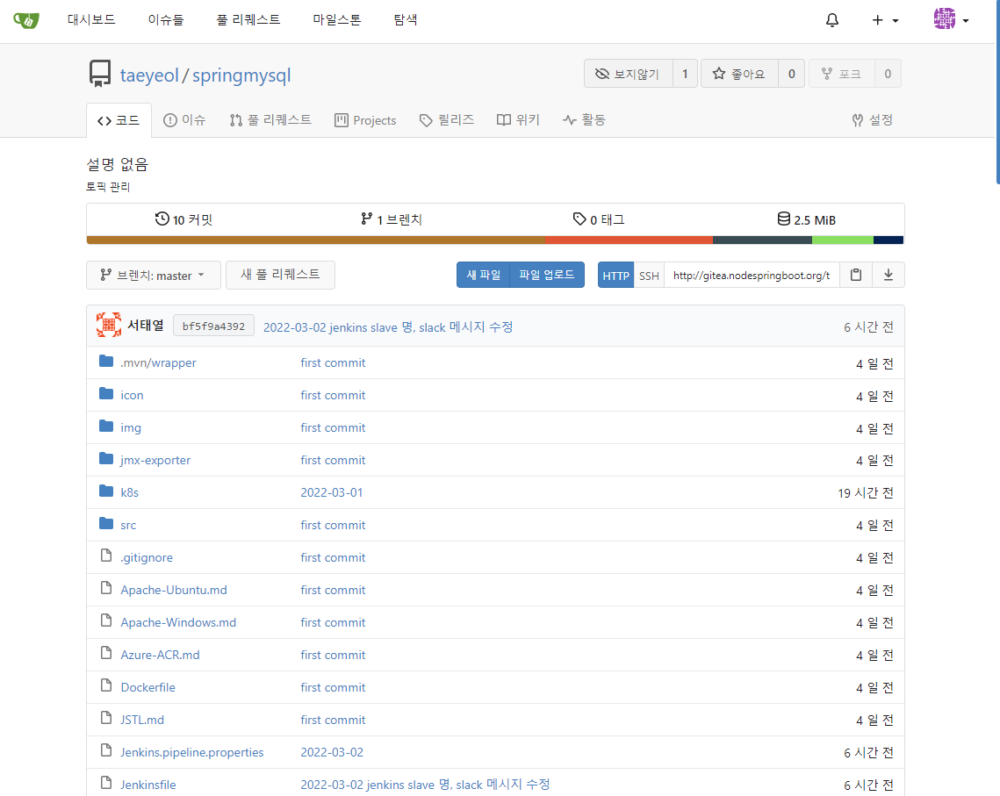

# GitOps
> [Guide To GitOps](https://www.weave.works/technologies/gitops/)  
> [GitOps vs. DevOps: What’s the Difference?](https://www.bunnyshell.com/blog/gitops-vs-devops)  

## GitOps = 지속적 전달 + 지속적인 작업.  
  - Git을 거의 모든 것을 작동하는 소스 로 사용 하는 것
  - 리소스를 수동으로(또는 스크립트나 파이프라인을 통해) 클러스터에 적용하는 대신 전용 에이전트가 변경 사항을 클러스터로 가져와 사용자를 대신하여 적용  
  - Git 저장소에 정의된 것이 무엇이든 Kubernetes 클러스터의 자동화된 에이전트를 사용하여 인프라 측에 반영되도록 지속적으로 발생 하는 조정 루프  

### Kelsey Hightower
GitOps is the best thing since configuration as code. Git changed how we collaborate, but declarative configuration is the key to dealing with infrastructure at scale, and sets the stage for the next generation of management tools. 

## GitOps 관련 도구  
### [ArgoCD](https://argoproj.github.io/argo-cd/)  
- Kubernetes용 선언적 GitOps 지속적 전달 도구
- 애플리케이션 정의, 구성 및 환경이 선언적이고 버전이 제어됨
- 애플리케이션 배포 및 수명 주기 관리는 자동화되고 감사 가능하며 이해하기 쉬움  
- 선언적이란 구성이 일련의 지침 대신 사실 집합에 의해 보장됨을 의미함  

> [ArgoCD Best Practices](https://argoproj.github.io/argo-cd/user-guide/best_practices/)  
  - [[DevOps] ArgoCD Best Practice](https://wookiist.dev/m/138)  
  - 매니페스트 파일만 수정했을 뿐인데도 CI가 자동으로 발생하는 상황을 막기 위해 ArgoCD 공식 문서에서도 매니페스트 파일과 소스 코드 레포지토리를 분리할 것을 권고

### [Gitea (저장소)](./GitOps/gitea/README.md)
편리한 설치형 Git 서비스  
- 저장소 생성
- **Webhook 추가**
  - **Gitea** : CI 를 위한 Jenkins Webhook 등록
  - **Slack** : 사용자 통보를 위한 Slack Webhook 등록
  
  

### [Jenkins (CI 도구)](./GitOps/jenkins/README.md)
소프트웨어 개발 시 지속적 통합 서비스를 제공하는 도구  
- Docker 빌드를 위한 Plugin 등  구성  
- Credentail 설정
  - 저장소 연동을 위한 Gitea Credentail(ID.PW) 설정 
  - Slack 의 Jenkins CI 연동을 위한 Token 값 서정
  - Habor 연동을 위한 ID/PW 설정
- Pipeline 구성
  - Pool SCM
  - Gitea 서버 등록
- Pipeline 작성
  - PodTemplate
  - Stage 구성
    - Prepare : 환경 구성
    - 빌드할 소스 가져오기
    - 소스 빌드
    - Docker Image 생성
    - Docker Image Push
  

### [Harbor (Container Registry)](../GitOps/harbor/README.md)
콘텐츠를 저장, 서명 및 스캔하는 오픈 소스 신뢰할 수 있는 클라우드 네이티브 레지스트리 프로젝트 

### [ArgoCD (CD 도구)](./GitOps/argocd/README.md)  
Kubernetes용 선언적 GitOps 지속적 전달 도구  
- Cluster 구성(내장된 것을 그대로 사용하면 됨)
  - in-cluser :  https//kubernetes.default.svc 1.21
- Project 생성
  - springmysql, nodejs-bot 생성
- Repositories 구성
  - 배포할 Repositoris 등록 : gitea 의 SpringMySQL, nodejs 등록
- App 생성 (SpringMySQL, nodejs-bot)
  - GENERAL
    - Application name
    - Project 선택
    - SYNC POLICY 선택
  - SOURCE
    - Repository URL 선택
    - Revison : HEAD
    - Path : .
  - DESTINATION
    - Cluster URL : Cluster 구성 정보 선택
    - Namespace : 
    
