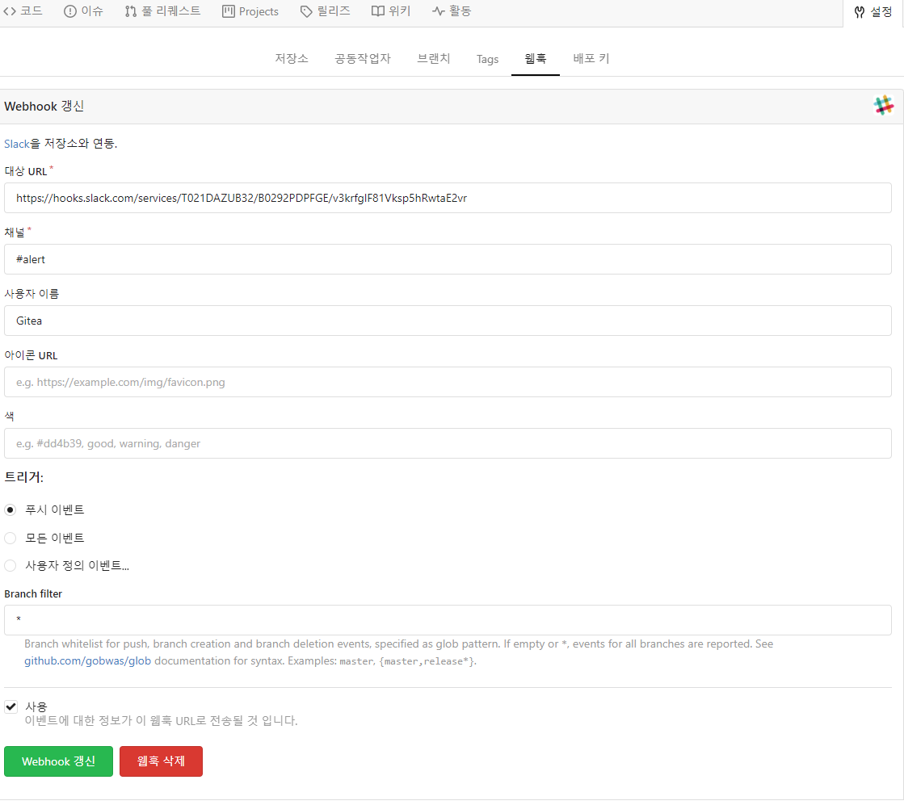
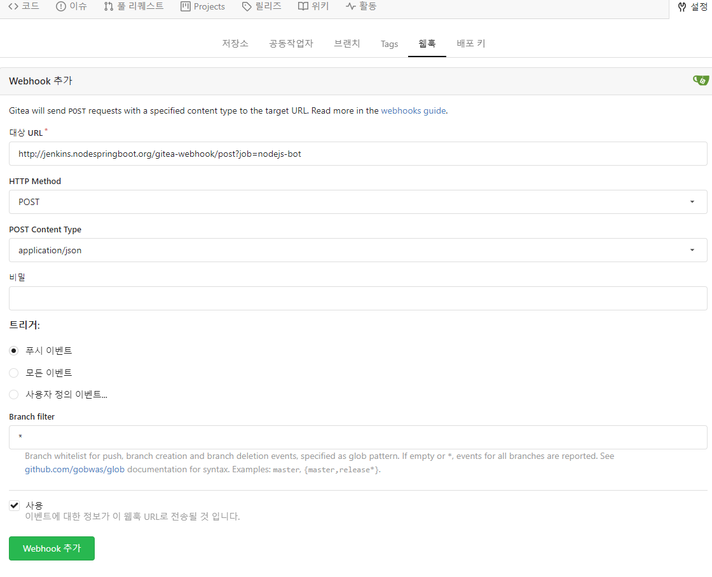

# [Gitea](https://gitea.io/) 
Go 로 작성된 커뮤니티 관리 경량 코드 호스팅 솔루션  
MIT 라이선스  

> [Gitea/Jenkins: Setting up Webhooks](https://gcube.wiki.gcube-system.org/gcube/Gitea/Jenkins:_Setting_up_Webhooks)
> [Git Push Fails - fatal: The remote end hung up unexpectedly](https://confluence.atlassian.com/stashkb/git-push-fails-fatal-the-remote-end-hung-up-unexpectedly-282988530.html)

```
git config --global http.postBuffer 157286400
```

## 설치 명령어
```
helm repo add gitea-charts https://dl.gitea.io/charts/
helm search repo gitea
helm fetch gitea-charts/gitea
tar -xzvf gitea-5.0.1.tgz
mv gitea gitea-5.0.1
cd gitea-5.0.1
cp values.yaml values.yaml.org
helm install gitea -n cicd -f values.yaml .
# helm install gitea gitea-charts/gitea
```

## 설치 로그
```
PS C:\workspace\AzureBasic\2.AKS\GitOps\gitea\gitea-5.0.1> helm install gitea -n cicd -f values.yaml .
NAME: gitea
LAST DEPLOYED: Fri Feb 25 21:24:19 2022
NAMESPACE: cicd
STATUS: deployed
REVISION: 1
NOTES:
1. Get the application URL by running these commands:
  echo "Visit http://127.0.0.1:3000 to use your application"
  kubectl --namespace cicd port-forward svc/gitea-http 3000:3000
PS C:\workspace\AzureBasic\2.AKS\GitOps\gitea\gitea-5.0.1> 
```
### gitea 검색
```
helm search repo gitea
NAME                    CHART VERSION   APP VERSION     DESCRIPTION
gitea-charts/gitea      4.0.1           1.14.3          Gitea Helm chart for Kubernetes
```

### gitea option (values-custom.yaml)
- "letsencrypt" 를 통해 인증을 받도록 함(현재 구성하지 않음)
- ingress 설정
  ```
  ingress:
    enabled: true
    annotations:
      kubernetes.io/ingress.class: nginx
      kubernetes.io/tls-acme: "true"
      cert-manager.io/cluster-issuer: letsencrypt
    hosts:
      - host: gitea.a-tcl-da.net
        paths:
          - path: /
            pathType: Prefix
    tls:
      - secretName: gitea-tls
        hosts:
          - gitea.a-tcl-da.net
  ```
- service 항목 수정
  - ClusterIP: None -> ClusterIP 로 변경 ClusterIP 를 받도록 함
  ```
  service:
  http:
    type: ClusterIP
    port: 3000
    clusterIP:
    # clusterIP: None
    #loadBalancerIP:
    #nodePort:
    #externalTrafficPolicy:
    #externalIPs:
    loadBalancerSourceRanges: []
    annotations:
  ssh:
    type: ClusterIP
    port: 22
    clusterIP:
    # clusterIP: None
    #loadBalancerIP:
    #nodePort:
    #externalTrafficPolicy:
    #externalIPs:
    loadBalancerSourceRanges: []
    annotations:
  ```
  
- admin id/pw 변경
  ```
  gitea:
    admin:
      #existingSecret: gitea-admin-secret
      username: gitea_admin
      password: dlatl!00
      email: "gitea@local.domain"
  ```

- metric enable
  ```
  metrics:
    enabled: true
    serviceMonitor:
      enabled: true
      additionalLabels:
        prometheus-release: prom1
  ```

- 내장 database (postgresql -> mariadb) 
  ```
  mariadb:
    enabled: true
    auth:
      database: gitea
      username: gitea
      password: dlatl!00
      rootPassword: dlalt!00
    primary:
      service:
        port: 3306
      persistence:
        size: 10Gi
  ```

### helm 설치 로그
- helm install
```
PS C:\workspace\AzureBasic\2.AKS\GitOps\gitea\gitea-5.0.1> helm install gitea -n cicd -f values.yaml .
NAME: gitea
LAST DEPLOYED: Fri Feb 25 21:24:19 2022
NAMESPACE: cicd
STATUS: deployed
REVISION: 1
NOTES:
1. Get the application URL by running these commands:
  echo "Visit http://127.0.0.1:3000 to use your application"
  kubectl --namespace cicd port-forward svc/gitea-http 3000:3000
PS C:\workspace\AzureBasic\2.AKS\GitOps\gitea\gitea-5.0.1> 
```
- pod
```
PS C:\workspace\AzureBasic\2.AKS\GitOps\gitea\gitea-5.0.1> kubectl -n cicd get pvc,pod,svc,ep,ing
NAME                                         STATUS   VOLUME                                     CAPACITY   ACCESS MODES   STORAGECLASS   AGE
persistentvolumeclaim/data-gitea-0           Bound    pvc-29233ff5-1eb3-4ee0-a364-9e31b75b2269   10Gi       RWO            default        11m
persistentvolumeclaim/data-gitea-mariadb-0   Bound    pvc-17681107-8b85-46bf-8667-b131db0ca61c   10Gi       RWO            default        11m

NAME                                  READY   STATUS    RESTARTS   AGE
pod/gitea-0                           1/1     Running   0          93s
pod/gitea-mariadb-0                   1/1     Running   0          93s
pod/gitea-memcached-9f7986c9c-qzn4p   1/1     Running   0          93s

NAME                      TYPE        CLUSTER-IP    EXTERNAL-IP   PORT(S)     AGE
service/gitea-http        ClusterIP   None          <none>        3000/TCP    93s
service/gitea-mariadb     ClusterIP   10.0.69.216   <none>        3306/TCP    93s
service/gitea-memcached   ClusterIP   10.0.40.8     <none>        11211/TCP   93s
service/gitea-ssh         ClusterIP   None          <none>        22/TCP      93s

NAME                        ENDPOINTS           AGE
endpoints/gitea-http        10.244.3.94:3000    93s
endpoints/gitea-mariadb     10.244.3.93:3306    93s
endpoints/gitea-memcached   10.244.3.92:11211   93s
endpoints/gitea-ssh         10.244.3.94:22      93s

NAME                                  CLASS    HOSTS                      ADDRESS          PORTS   AGE
ingress.networking.k8s.io/gitea-ing   <none>   gitea.nodespringboot.org   20.200.227.196   80      7m38s
PS C:\workspace\AzureBasic\2.AKS\GitOps\gitea\gitea-5.0.1>
```

## Troubleshooting
### 오류
#### **fatal: the remote end hung up unexpectedly**
```
PS C:\workspace\SpringBootMySQL.gitea> git push -u origin master
Enumerating objects: 116, done.
Counting objects: 100% (116/116), done.
Delta compression using up to 16 threads
Compressing objects: 100% (102/102), done.
Writing objects: 100% (116/116), 2.48 MiB | 101.60 MiB/s, done.
Total 116 (delta 4), reused 0 (delta 0), pack-reused 0
error: RPC failed; HTTP 413 curl 22 The requested URL returned error: 413
send-pack: unexpected disconnect while reading sideband packet
fatal: the remote end hung up unexpectedly
Everything up-to-date
PS C:\workspace\SpringBootMySQL.gitea> 
```

#### 해결 : ingress(nginx) 에 proxy-body-size: "0" 옵션 설정함
  ```
  apiVersion: networking.k8s.io/v1
  kind: Ingress
  metadata:
    annotations:
      meta.helm.sh/release-name: gitea
      meta.helm.sh/release-namespace: cicd
      kubernetes.io/ingress.class: nginx
      nginx.ingress.kubernetes.io/proxy-body-size: "0"
      nginx.ingress.kubernetes.io/ssl-redirect: "false"
      nginx.ingress.kubernetes.io/use-regex: "true"
      nginx.ingress.kubernetes.io/rewrite-target: /$1
  ```

#### 참조 설정
  ```
  git config --local http.postBuffer = 1024M # 보통 예제는 20M이 많음
  git config --local http.maxRequestBuffer = 1024M

  git config --local pack.deltaCacheSize = 1024M
  git config --local pack.packSizeLimit = 1024M
  git config --local pack.windowMemory = 1024M

  git config --local core.packedGitLimit - 1024m
  git config --local core.packedGitWindowSize - 1024m
  git config --local core.compression - 9

  git config --local ssh.postBuffer = 2048M
  git config --local ssh.maxRequestBuffer = 2048M
  ```

## Gitea Webhook 설정
웹훅은 Git 리포지토리 에 커밋이 푸시될 때 Jenkins 프로젝트 의 빌드를 자동으로 트리거하는 메커니즘 입니다.  

### Slack Notification
  

### Build Trigger 설정
  