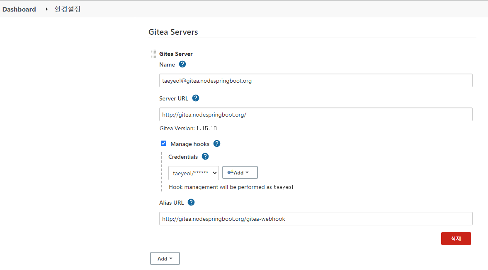
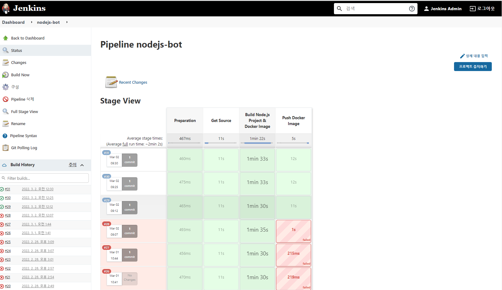

# [Jenkins](https://www.jenkins.io/)
소프트웨어 구축, 테스트, 전달 또는 배포와 관련된 모든 종류의 작업을 자동화하는 데 사용할 수 있는 독립형 오픈 소스 자동화 서버  

> [How to integrate Gitea and Jenkins](https://mike42.me/blog/2019-05-how-to-integrate-gitea-and-jenkins)

## 설치 명령어
```
helm repo add jenkins https://charts.jenkins.io
helm repo update
helm search repo jenkins
helm fetch jenkins/jenkins
tar -xzvf jenkins-3.11.4.tgz
mv jenkins jenkins-3.11.4
cd jenkins-3.11.4
cp values.yaml values.yaml.org
helm install jenkins -n cicd -f values.yaml .
```
```
helm show values jenkins/jenkins > values.yaml
helm install jenkins -n cicd -f values.yaml .
```

## 설치 로그
### jenkins 검색
```
helm search repo jenkins
NAME            CHART VERSION   APP VERSION     DESCRIPTION
bitnami/jenkins 8.0.5           2.289.2         The leading open source automation server
jenkins/jenkins 3.5.8           2.289.2         Jenkins - Build great things at any scale! The ...
stable/jenkins  2.5.4           lts             DEPRECATED - Open source continuous integration...
```

### jenkins option (values.yaml)
```
.
.
.
controller:
  .
  .
  .
  adminUser: "admin"
  adminPassword: "dlatl!00"
  admin:
    existingSecret: ""
    userKey: jenkins-admin-user
    passwordKey: jenkins-admin-password
.
.
.
  resources:
    requests:
      cpu: "200m"
      memory: "256Mi"
    limits:
      cpu: "2000m"
      memory: "4096Mi"
.
.
.
```


### helm 설치 로그
- helm install jenkins -n cicd -f values.yaml .
```
PS C:\workspace\AzureBasic\2.AKS\GitOps\jenkins\jenkins-3.11.4> helm install jenkins -n cicd -f values.yaml .
NAME: jenkins
LAST DEPLOYED: Sat Feb 26 16:49:27 2022
NAMESPACE: cicd
STATUS: deployed
REVISION: 1
NOTES:
1. Get your 'admin' user password by running:
  kubectl exec --namespace cicd -it svc/jenkins -c jenkins -- /bin/cat /run/secrets/chart-admin-password && echo
2. Get the Jenkins URL to visit by running these commands in the same shell:
  echo http://127.0.0.1:8080
  kubectl --namespace cicd port-forward svc/jenkins 8080:8080

3. Login with the password from step 1 and the username: admin
4. Configure security realm and authorization strategy
5. Use Jenkins Configuration as Code by specifying configScripts in your values.yaml file, see documentation: http:///configuration-as-code and examples: https://github.com/jenkinsci/configuration-as-code-plugin/tree/master/demos

For more information on running Jenkins on Kubernetes, visit:
https://cloud.google.com/solutions/jenkins-on-container-engine

For more information about Jenkins Configuration as Code, visit:
https://jenkins.io/projects/jcasc/


NOTE: Consider using a custom image with pre-installed plugins
PS C:\workspace\AzureBasic\2.AKS\GitOps\jenkins\jenkins-3.11.4> 
```

### bitname/jenkins 9.0.2 설치 로그
```
PS C:\workspace\AzureBasic\2.AKS\GitOps\jenkins\jenkins-9.0.2> helm install jenkins -n cicd -f values.yaml .
NAME: jenkins
LAST DEPLOYED: Sun Feb 27 20:55:01 2022
NAMESPACE: cicd
STATUS: deployed
REVISION: 1
TEST SUITE: None
NOTES:
CHART NAME: jenkins
CHART VERSION: 9.0.2
APP VERSION: 2.319.3

** Please be patient while the chart is being deployed **

1. Get the Jenkins URL by running:

** Please ensure an external IP is associated to the jenkins service before proceeding **
** Watch the status using: kubectl get svc --namespace cicd -w jenkins **

  export SERVICE_IP=$(kubectl get svc --namespace cicd jenkins --template "{{ range (index .status.loadBalancer.ingress 0) }}{{ . }}{{ end }}")
  echo "Jenkins URL: http://$SERVICE_IP/"

2. Login with the following credentials

  echo Username: admin
  echo Password: $(kubectl get secret --namespace cicd jenkins -o jsonpath="{.data.jenkins-password}" | base64 --decode)
PS C:\workspace\AzureBasic\2.AKS\GitOps\jenkins\jenkins-9.0.2> 
```

### ingress 생성

### 배포 확인
```
PS C:\workspace\AzureBasic\2.AKS\GitOps\jenkins> kubectl -n cicd get pvc,pod,svc,ep -l app.kubernetes.io/name=jenkins
NAME                            STATUS   VOLUME                                     CAPACITY   ACCESS MODES   STORAGECLASS   AGE
persistentvolumeclaim/jenkins   Bound    pvc-768ced20-b12b-4e1c-a8d8-fcec38940485   8Gi        RWO            default        5m23s

NAME            READY   STATUS    RESTARTS   AGE
pod/jenkins-0   2/2     Running   0          5m23s

NAME                    TYPE        CLUSTER-IP     EXTERNAL-IP   PORT(S)     AGE
service/jenkins         ClusterIP   10.0.102.182   <none>        8080/TCP    5m23s
service/jenkins-agent   ClusterIP   10.0.71.202    <none>        50000/TCP   5m23s

NAME                      ENDPOINTS            AGE
endpoints/jenkins         10.244.3.112:8080    5m23s
endpoints/jenkins-agent   10.244.3.112:50000   5m23s
PS C:\workspace\AzureBasic\2.AKS\GitOps\jenkins> kubectl -n cicd get pvc,pod,svc,ep,ing -l app.kubernetes.io/name=jenkins
NAME                            STATUS   VOLUME                                     CAPACITY   ACCESS MODES   STORAGECLASS   AGE
persistentvolumeclaim/jenkins   Bound    pvc-768ced20-b12b-4e1c-a8d8-fcec38940485   8Gi        RWO            default        5m30s

NAME            READY   STATUS    RESTARTS   AGE
pod/jenkins-0   2/2     Running   0          5m30s

NAME                    TYPE        CLUSTER-IP     EXTERNAL-IP   PORT(S)     AGE
service/jenkins         ClusterIP   10.0.102.182   <none>        8080/TCP    5m30s
service/jenkins-agent   ClusterIP   10.0.71.202    <none>        50000/TCP   5m30s

NAME                      ENDPOINTS            AGE
endpoints/jenkins         10.244.3.112:8080    5m30s
endpoints/jenkins-agent   10.244.3.112:50000   5m30s

NAME                                    CLASS    HOSTS                        ADDRESS   PORTS   AGE
ingress.networking.k8s.io/jenkins-ing   <none>   jenkins.nodespringboot.org             80      21s
PS C:\workspace\AzureBasic\2.AKS\GitOps\jenkins> 
```

## Plug-In 설치 항목
### **"Jenkins 관리 > 플러그인 관리"** 에서 설치  
| ID | Plugin 명 | Plugin Version | 기본 설치 여부 |  
| :--- | :--- | :--- |:---|  
| kubernetes | kubernetes | 3538.v6b_005a_ddced1 | ○ |   
| Pipeline:job | workflow-job | 1167.v8fe861b_09ef9  | ○ | 
| Pipeline Utility Steps | pipeline-utility-steps | 2.12.0 | |    
| Pipeline | workflow-aggregator | 2.6 | ○ |      
| Credentials Binding | credentials-binding | 1.27.1 | ○ |     
| git | git | 4.10.3 | ○ |      
| gitea | gitea | 1.41 | |   
| Configuration as Code | configuration-as-code | 1413.vb_1b_8cb_c67a_f4 | ○ |        
| Keycloak Authentication | keycloak | 2.3.0 | |     
| Slack Notification | slack | 602.v0da_f7458945d | |  
| Docker | docker-plugin | 1.2.6 | |
| Docker Build Step | docker-build-step | 2.8 | |  
| Docker Pipeline | docker-workflow | 1.28 | |  
| Prometheus metrics | prometheus | 2.0.10 | |    
  

- Jenkins 관리 > 플러그인 관리 > 위의 Plug-in 검색   
  https://plugins.jenkins.io/${plugin-item}/

## Troubleshooting
### Pipeline 오류  
#### docker 오류
**Cannot connect to the Docker daemon at unix:///var/run/docker.sock. Is the docker daemon running?** 
```
[Pipeline] // stage
[Pipeline] readProperties
[Pipeline] stage
[Pipeline] { (Build Node.js Project & Docker Image)
[Pipeline] container
[Pipeline] {
[Pipeline] sh
+ docker build '--rm=true' '--network=host' --tag nodejs-bot:1.2.0 .
Cannot connect to the Docker daemon at unix:///var/run/docker.sock. Is the docker daemon running?
[Pipeline] }
[Pipeline] // container
[Pipeline] }
[Pipeline] // stage
```
####[해결책]
**docker image 변경전**
```
podTemplate(
	label: label, 
	containers: [
		//container image는 docker search 명령 이용
		containerTemplate(name: "docker", image: "docker:latest", ttyEnabled: true, command: "cat"),
	],
	//volume mount
	volumes: [
		hostPathVolume(hostPath: "/var/run/docker.sock", mountPath: "/var/run/docker.sock")    
	]
)
```
**변경후**
```
podTemplate(
	label: label, 
	containers: [
    containerTemplate(name: 'docker', image: "desmart/dind", ttyEnabled: true, privileged: true, command: 'dockerd --host=unix:///var/run/docker.sock '),
		containerTemplate(name: "kubectl", image: "lachlanevenson/k8s-kubectl", command: "cat", ttyEnabled: true)
	],
	//volume mount
	volumes: [
   
	]
)
```


#### plugin 미설치 오류
"[**Pipeline Utility Steps**]"(https://plugins.jenkins.io/pipeline-utility-steps/)" 미설치로 인한 오류
```
[Pipeline] End of Pipeline
java.lang.NoSuchMethodError: No such DSL method 'readProperties' found among steps [archive, bat, build, catchError, checkout, container, containerLog, deleteDir, dir, dockerNode, echo, envVarsForTool, error, fileExists, getContext, git, input, isUnix, junit, library, libraryResource, load, lock, mail, milestone, node, parallel, podTemplate, powershell, properties, publishChecks, pwd, pwsh, readFile, re
```

#### 변수 처리 오류
```
[Pipeline] {
[Pipeline] sh
+ docker build '--rm=true' --tag '[app]:[version]' .
invalid argument "[app]:[version]" for "-t, --tag" flag: invalid reference format
See 'docker build --help'.
[Pipeline] }
```
**해결책**
- 변경전(잘못 쓴 Pipeline 소스 'props'가 빠짐)
  ```
  def app             = ["app"]
  def version         = ["version"]
  ```
- 변경 후(Pipeline 소스변경)
  ```
  //-- 환경변수 파일 읽어서 변수값 셋팅 
  def props = readProperties file: 'pipeline.properties'

  def image_server    = props["image_server"]
  def service_account = props["serivce_account"]
  def docker_id       = props["docker_id"]
  def cicd_namespace  = props["cicd_namespace"]
  def cicd_pvc        = props["cicd_pvc"]
  def namespace       = props["namespace"]
  def app             = props["app"]
  def version         = props["version"]
  ```

## Jenkins Slave 구동을 위한 설정

### Jenkins ServiceAccount, ClusterRoleBinding (현재 버전은 사용하지 않아도 됨)

#### jenkins-sa.yaml
```
---
apiVersion: v1
kind: ServiceAccount
metadata:
  namespace: cicd
  name: jenkins
---
kind: ClusterRoleBinding
apiVersion: rbac.authorization.k8s.io/v1beta1
metadata:
  name: cluster-admin-clusterrolebinding
subjects:
- kind: ServiceAccount
  name: jenkins
  namespace: cicd
roleRef:
  apiGroup: rbac.authorization.k8s.io
  kind: ClusterRole
  name: cluster-admin
---
kind: ClusterRoleBinding
apiVersion: rbac.authorization.k8s.io/v1beta1
metadata:
  name: cluster-admin-clusterrolebinding-2
subjects:
- kind: ServiceAccount
  name: default
  namespace: cicd
roleRef:
  apiGroup: rbac.authorization.k8s.io
  kind: ClusterRole
  name: cluster-admin
```

### Jenkins Slave 사용 pvc 추가 (현재 구성하지 않고 사용함 - 옵션)
- Jenkins Slave Container Image 빌드시 Pod 로 - 기동되어 빌드 작업을 위해 pvc 를 마운트하여 사용함
#### cicd-workspace-pvc.yaml
```
kind: PersistentVolumeClaim
metadata:
  name: cicd-workspace
spec:
  accessModes:
    - ReadWriteMany
  storageClassName: azurefile
  resources:
    requests:
      storage: 50Gi
```

## Credential 추가
- Gitea : ID/PW
- Harbor : ID/PW
- Slack (Jenkins CI) : Token 저장


## Gitea 설정
### Jenkins관리 > 시스템설정 > GiteaServer
 


## Slack Jenkins CI (지속적 통합 서버)
1. Jenkins 관리 > 플러그인 관리
2. Slack Notification 설치
3. 구성 : 
  Jenkins > System > Global credentials > Secret 에 Slack Token 자격 증명 추가 
  

### Credential 설정
#### [Gitea](https://plugins.jenkins.io/gitea/)


#### [Slack Notification](https://plugins.jenkins.io/slack/) - Secret Text
**Slack - Jenkins CI**
  
**Jenkins > 시스템 설정 > Slack**
  

#### Harbor
```
kubectl create secret docker-registry harbor `
  --docker-server=https://harbor.nodespringboot.org `
  --docker-username=taeyeol --docker-password=Callas007! `
  --docker-email=taeeyoul@gmail.com `
  -n cicd
```

### Pipeline 설정
#### Build Trigger 설정(Gitea Integration)
  

#### Advanced Project Options
**Gitea 저장소 정보(URL, branch) 및 Pipeline Script 명 설정


### Pipeline 구성 후 Build Now 를 눌러 한번 실행 시켜줘야 함  

## [Kubernetes plugin](https://www.jenkins.io/doc/pipeline/steps/kubernetes/)  

### container
컨테이너에서 빌드 단계 실행 

### podTemplate
kubernetes 플러그인에서 사용할 podTemplate 정의  

```
podTemplate(...) {
    node(POD_LABEL) {
        // some steps
    }
}
```

### kubeconfig
Kubernetes CLI 설정(kubectl)  

### containerLog  
Kubernetes에서 컨테이너 로그 가져오기  

> [Kubernetes plugin for Jenkins](https://github.com/jenkinsci/kubernetes-plugin) 

### service Acccount
```
PS C:\workspace\AzureBasic\2.AKS\GitOps\jenkins> kubectl -n cicd get sa                
NAME                              SECRETS   AGE
argocd-application-controller     1         3h7m
argocd-dex-server                 1         3h7m
argocd-notifications-bot          1         7h42m
argocd-notifications-controller   1         7h42m
argocd-server                     1         3h7m
default                           1         44h
gitea-mariadb                     1         26h
gitea-memcached                   1         26h
jenkins                           1         25h
PS C:\workspace\AzureBasic\2.AKS\GitOps\jenkins> kubectl -n cicd get sa jenkins -o yaml
apiVersion: v1
kind: ServiceAccount
metadata:
  annotations:
    meta.helm.sh/release-name: jenkins
    meta.helm.sh/release-namespace: cicd
  creationTimestamp: "2022-02-26T07:52:34Z"
  labels:
    app.kubernetes.io/component: jenkins-controller
    app.kubernetes.io/instance: jenkins
    app.kubernetes.io/managed-by: Helm
    app.kubernetes.io/name: jenkins
    helm.sh/chart: jenkins-3.11.4
  name: jenkins
  namespace: cicd
  resourceVersion: "808618"
  uid: 52b8ce75-48e1-4257-9c79-5e55b5bcb26a
secrets:
- name: jenkins-token-bclfd
PS C:\workspace\AzureBasic\2.AKS\GitOps\jenkins>
```

### Jenkins-Configure Cloud
  
  
  


## [Azure Container Registry Tasks](https://plugins.jenkins.io/azure-container-registry-tasks/)  

#### Jenkins Dashboard
  

#### Jenkins Dashboard - SpringMySQL
 

#### Jenkins Dashboard - nodejs-bot
  