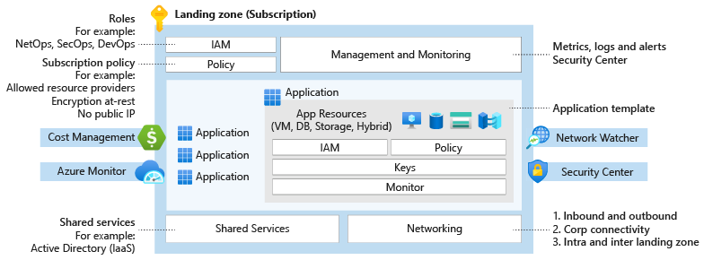

# [Azure Landing Zone](https://docs.microsoft.com/ko-kr/azure/cloud-adoption-framework/ready/landing-zone/)  
- 규모, 보안, 거버넌스, 네트워킹 및 ID를 설명하는 다중 구독 Azure 환경의 출력  
- 엔터프라이즈 규모의 애플리케이션 마이그레이션, 현대화 및 혁신을 지원  
- 서비스로서의 인프라 또는 서비스로서의 플랫폼의 차이를 구분하지 않음

**디자인**

**개념 아키텍처**
- Azure 랜딩 존 개념 아키텍처는 클라우드 채택 과정의 대상을 나타냄  
- 조직이 모범사례 보안 및 거버넌스를 유지하면서 비즈니스를 주도하는 성공적인 클라우드 환경을 운영할 수 있도록 지원하기 위한 성숙한 확장 대상 아키텍처  

## 주요 서비스
### 계정 권한 관리
#### Azure Active Directory
- 주요 기능
  - 계정 생성 / 그룹 생성
  - 엑세스 키 생성(앱 등록)
  - 계정 별 역할 관리
  - 외부 도메인 계정 추가
  - 사용자 별 정책 기능은 Azure Policy 사용
  - 네가지 등급의 기능 별 과금 체계
- 장점
  - Multi-factor Authentication 기본 제공
  - 등록된 계정으로 모든 Azure 리소스 관리
  - Single-Sign-On (클라우드 지원 SaaS Apps, On-Prmise to Azure)
#### Identity and Access Management

### 보안 관리
#### Azure Network Security Group(NSG)
- 주요 기능
  - IP / Port 방화벽
  - Subnet 에 연결됨
  - Network Interface (NIC) 에 연결됨
  - 최대 1000개 까지 정책 등록
  - Azure 서비스에 대한 Tag 제공
- 장점
  - 무료
  - 트랙픽 로그 수집(추가 기능)
#### Azure Security Center
- 주요 기능
  - 클라우드 리소스 보안 감사
  - 분석된 내용을 보안 점수로 평가
  - 보안 기능 적용 방법 안내
  - 국제 표준 패키지 (업계 표준 정책 제공: ISO270001, PCI DSS 3.2.1 등)
  - 사용자 지정 보안 점검 기준 작성(Preview)
- 장점
  - 보안 경고 발생시 알람
  - 업무 자동화 구축 가능 (Azure Logic Apps)
  - Azure Defender 보안 경고 설정 (IDS/악성 행위 탐지)
  - 리소스 별 과금
#### (참고)시스템 취약점 진단 서비스

### 운영 정책 관리
#### Azure Policy
- 주요기능
  - 정책 감사
  - 그룹 별 정책 관리(이니셔티브)
  - 커스텀 정책 생성(Json)
  - 국제 표준 운영 정책 패키지 제공
- 장점
  - 국제 표준 운영 정책 패키지 제공(ISO270001:2013, PCI v3.2.1:2018 등)
#### Azure Key Vault(암호/키/인증서)
- 주요기능
  - Key 관리(생성, 권한, 유효기간)
  - Secret 관리(생성, 권한, 유효기간)
  - 인증서 관리
  - Azure Disk 암호화
  - Azure SQL DB 암호화
  - Azure Active Directory 를 통한 역할 기반 엑세스 정책
- 장점
  - Azure 서비스와의 편리한 연동
  - Transaction 당 과금
  
#### (참고)Compliance Solutions

### 로그 중앙화
#### Azure Log  Analytics
- 주요 기능
  - 로그 수집(최소 10초)
  - 로그 저장
  - 로그 필터링(Kusto) / 차트 생성
  - Azure Dashboard 연동(Refresh 최소 5초)
- 장점
  - Azure Platform + Operation System + Application Log 중앙 관리
  - 무료 과금 구간
#### (참고)로그 관리 시스템

## Azure Blueprint
### 배포 방식
#### Custom Deployment
- 개념
  - 원하는 기능을 선별하여 배포
  - Azure Resources 선택
  - 자사 운영 정책에 맞는 커스텀 배포
- 제안 기준
  - Azure 클라우드 운영에 필요한 특정 기능이 있을 경우.
#### Azure Blueprint
- 개념
  - 국제 표준을 준수할 수 있도록 관리 기능을 패키지 형태로 제공
- 제안 기준
  - 국제 표준 및 Azure 표준으로 운영 관리를 원하는 경우
### Azure Blueprint
- 주요 기능
  - 시스템 운영에 대한 국제 표준 패키지 제공(ISO27001, MPAA 등)
    | 패키지 | 설명 |
    |:---|:---|
    | ISO27001 | 정보보호관리체계 |
    | PCI-DSS v3.2.1 | 신용카드 업계 데이터 표준 |
    | MPAA 감사 | 지적 재산권 데이터 보호 |  
    | HIPAA | 미국의료 정보 보호법 |  
    | CAF | Azure Cloud Adoption Framework |
    | 일반 정책 | 자주 사용되는 기능 | 
  - Landing Zone 관련 리소스 배포
  - Azure Policy 정책 활용
  - 정책 패키지(청사진) 버전 관리
- 장점
  - Cloud Landing Zone 버전 관리
  - 자사 운영 환경에 맞는 커스텀 Landing Zone 구성