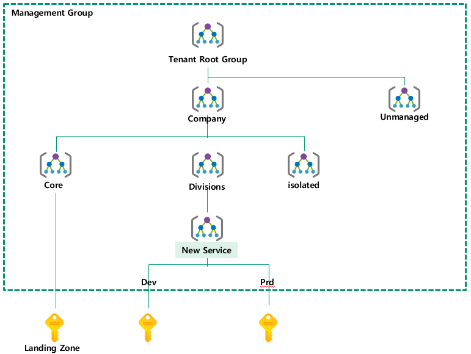

# Landing Zone

## 방향성
### Overall
- Landing Zone 이 없어 CSP 선호도가 떨어짐
  - 서비스별 개별 구성이 아니나 공통의 서비스/거버넌스 구성
    - **Enterprise-Scale LZ 을 수용하는 아키텍처 수립, Management Group 적용**(★)

### 계정관리
- AD 계정 메뉴얼 이원화 (On prem & 클라우드 ) 관리
  - On-Premise AD 와 연동
  - **Azure AD Connect로 계정/패스워드 동기화**

### 거버넌스
- 기존 사업부별 별도 리소스 생성으로 관리 불가
  - 확장되는 환경에서도 통합관리 제공
    - **Subscription 구조, Naming Convention, Tagging, Policy, RBAC 적용**(★)

### 네트워크
- On-Premise 와 미연동 및 확장성 제약
  - 여러 사업부의 서비스 수용으로 확장성 필요
    - **ER연동, Hub & Spoke NW 토폴로지 적용**

### 운영성
- Azure 포털을 통한 개별메뉴얼 구성으로 일관성 떨어짐
  - 구독별 기본사항 일괄구성, 유사환경 반복구성
    - **IaC활용, ARM Template, (Blueprint, Terraform) 적용**(★)

### 보안
- 별도의 보안체계/가이드 없어 사용자 혼란
  - On-Premise 와 동일한 수준의 보안보장
    - **Shared Service 영역 IaaS 기반 보안솔루션 구축, Security Center(무료)**

### 모니터링
- 별도의 모니터링 체계가 없음, On-Promise 와 연동 필요
  - 중앙집중식 모니터링과 On-Premise 의 Splunk 연동 필요
    - **Azure Monitor, Diagnostics Log, Event Hub 적용, Splunk 연동**

### 비용
- 네트워크 트래픽 비용 및 보안 솔루션 비용 과다
  - On-Premise 서비스 대체가능한 Azure 서비스 사용
    - **Tagging사용, (Third-party 솔루션 지양) Azure Backup, NSG, WAF**

## LZ 에서 신규 서비스 생성 절차
| Seq.No| 배포단계| 설명 |
|:---|:---|:---|
| 1 | 구독 생성 | Azzure Portal 에서 새로운 구독 생성 |  
| 2 | 관리 그룹 생성 | Azure Portal 에서 신규 서비스의 관리 그룹 생성 |  
| 3 | 관리 그룹에 구독 추가 | Azure Portal 에서 생성된 관리그룹에 서비스 구독을 추가 |  
| 4 | 관리그룹을 Divisions 에 추가 | Azure Portal 에서 생성된 관리 그룹을 Divisions 관리 그룹에 추가 |  
| 5 | RBAC 생성 | 신규 구독을 대상으로 RBAC 생성 스크립트 실행 |  
| 6 | 구독에 Role 을 Assign | Azure Portal 에서 신규 구독에 Role 을 Assign |
| 7 | Activity Log 설정 | 신규구독을 대상으로 Activity Log 설정 스크립트를 실행 |
| 8 | 네트워크 생성 | 신규 구독을 대상으로 Virtual Network(VNet) / Subnet 생성 스크립트 실행 |  
| 9 | 초기 서비스 생성 완료 | | 

### 서비스(워크로드) 가 신규로 생성될 때 Azure 관리자가 해야 하는 것들

| 구분 | 내용 |
|:---|:---|
| Policy | Management Group 생성 (MG 하위레벨 자동상속) |  
| RBAC | Custom Role 구독레벨 적용 |  
| Role | Role에 사용자 추가 (Service Owner/Contributor/DBA) |
| Logging | Logging 적용 템플릿 구독레벨 적용 |  

## Project 때 반영하는 것
### Naming Convention
MS Naming Guide 및 Limitation 기본 반영, Prefix/Postfix 사용을 권고로 고객 환경에 맞게 테일러링하여 설계, 주요 리소스 협의 후 추가사항 반영  
#### [명명 규칙(Naming Rule) ](../0.ENV/NamingRule.md)

#### 예시
| Azure 서비스 혹은 개체 | 패턴 | 예시 |
|:---|:---|:---|
| Resource Group | rg-skcc-<서비스 구분>-<환경> | rg-skcc-lz-network-prd | 
| Virtual Machine	[리눅스/윈도우 공통] | SKCC-<업무명><환경><서버 용도><숫자>   상세) 고객사명(SKCC)-업무명(ERP)개발(D)/운영(P)서버용도(DB)번호(#) | SKCC-WSUSPAP1 |
| Storage account name (general) | <skcc><환경><서비스 고유 명칭><숫자> | skccprddbafiles1 |
| Storage account name (diagnostics) |<skcc><환경>stdiag | skcclzprdstdiag |  
| Managed Disk name | <VM 명>-ssd<##>   <VM 명>-<디스크용도><##> | SKCC-WSUSPAP1-ssd01   SKCC-ERPPDB1-log01 | 
| Virtual Network (VNet) | vnet-skcc-<환경> | vnet-skcc-lz-prd |
| Subnet | snet-skcc-<환경>-<Subnet 용도(대역정보)>-<추가 구분 정보> | snet-skcc-prd-10.234.0.32-63-lz-shared-svc |
| Network Security Group Rule | <"allow"/"deny">-<인바운드/아웃바운드>-<내부/외부>-<포트 또는 트래픽 타입> | allow-inbound-internal-http | 
| Azure Application Gateway | skcc-<환경>-agw | skcc-lz-prd-appgw | 
| Recovery Services | skcc-rsv-<서비스 또는 애플리케이션 명>backup-<환경> | skcc-rsv-VMbackup-dev | 

### Tagging
Biz, Tech, Security 관점에서 필수 Tagging 요소만 최소 정의  
#### [Tagging](../0.ENV/tag.md)  
#### 필수 Tag
| 대상 | 태그 이름 | 태그 값 | 내용|
|:---|:---|:---|:---|
|Resource Group | servicetitle | 서비스 별 고유명사 | 서비스 명 |
|Resource Group | environment | 'prd', 'stg', 'dev', 'poc' | 운영 구분 |
|Resource Group | personalinformation | 'yes', 'no' | 개인정보 포함 여부 |

### Policy
1. Policy 전체 분석
2. 회사 추천, Best Practice 추천 검토
3. 고객사 담당자 검토
4. 최종 선정
5. 정책(Deny, Audit) 정의
6. 적용레벨/params 협의

#### [Policy](./Policy.md)  

### RBAC
고객사가 요청한 권한이 Built-in Role 로 충족되면 설정, Management Group 레벨 적용  
Custom Role 이 필요하면 생성하여 사용, Subscription 레벨 적용  

#### [RBAC](./RBAC.md)  

### Logging
- Azure Monitor - Activity Log 기본 설정
- Subscription 레벨 적용  

#### Activity Log 기본 적용 범위
- Audit Log(Policy)
- NSG Flow Log, Activity Log, WAF Log
- Security Center(Basic), Blob, Event Hub(->Functions(C#)->Splunk VM)  

